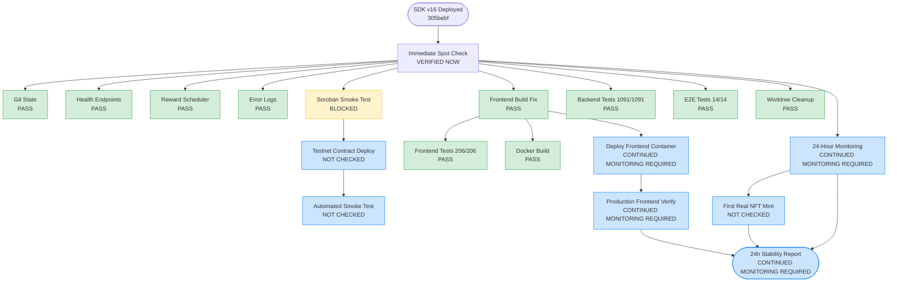

# Post-Release Follow-Up Dependency Graph

## Status Legend

- **Green (PASS/VERIFIED NOW):** Completed and verified during spot check
- **Yellow (BLOCKED):** Cannot proceed without prerequisites
- **Blue (CONTINUED MONITORING REQUIRED):** Requires time or manual action
