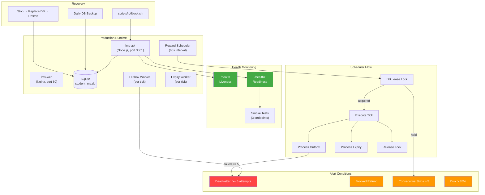

# Post-Release Operations Flow

```mermaid
graph TD
    subgraph "Production Runtime"
        LMS_API["lms-api<br/>(Node.js, port 3001)"]
        LMS_WEB["lms-web<br/>(Nginx, port 80)"]
        DB[(SQLite<br/>student_ms.db)]
        SCHEDULER["Reward Scheduler<br/>(60s interval)"]
        OUTBOX["Outbox Worker<br/>(per tick)"]
        EXPIRY["Expiry Worker<br/>(per tick)"]
    end

    subgraph "Health Monitoring"
        HEALTH["/health<br/>Liveness"]
        HEALTHZ["/healthz<br/>Readiness"]
        SMOKE["Smoke Tests<br/>(3 endpoints)"]
    end

    subgraph "Scheduler Flow"
        LEASE["DB Lease Lock"]
        TICK["Execute Tick"]
        PROCESS["Process Outbox"]
        EXPIRE["Process Expiry"]
        RELEASE["Release Lock"]
    end

    subgraph "Alert Conditions"
        DEAD["Dead-letter: >= 5 attempts"]
        BLOCKED["Blocked Refund"]
        SKIP["Consecutive Skips > 5"]
        DISK["Disk > 85%"]
    end

    subgraph "Recovery"
        ROLLBACK["scripts/rollback.sh"]
        BACKUP["Daily DB Backup"]
        RESTORE["Stop → Replace DB → Restart"]
    end

    LMS_API --> DB
    LMS_API --> HEALTH
    LMS_API --> HEALTHZ
    SCHEDULER --> LEASE
    LEASE -->|acquired| TICK
    LEASE -->|held| SKIP
    TICK --> PROCESS
    TICK --> EXPIRE
    TICK --> RELEASE
    OUTBOX --> DEAD
    PROCESS -->|failed >= 5| DEAD
    HEALTHZ --> SMOKE
    ROLLBACK --> LMS_API
    BACKUP --> DB
    RESTORE --> DB

    style DEAD fill:#f44,color:#fff
    style BLOCKED fill:#f90,color:#fff
    style SKIP fill:#f90,color:#fff
    style DISK fill:#f90,color:#fff
    style HEALTH fill:#4a4,color:#fff
    style HEALTHZ fill:#4a4,color:#fff
```
