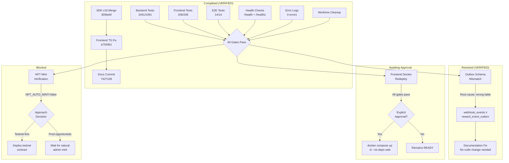

# Post-Release Resumption Context

Date: 2026-08-15 | Stellar SDK v16 Upgrade

```mermaid
graph TD
    subgraph "Completed (VERIFIED)"
        A[SDK v16 Merge<br/>305bebf] --> B[Frontend TS Fix<br/>a7549b1]
        B --> C[Docs Commit<br/>7427228]
        D[Backend Tests<br/>1091/1091] --> E{All Gates Pass}
        F[Frontend Tests<br/>206/206] --> E
        G[E2E Tests<br/>14/14] --> E
        H[Health Checks<br/>/health + /healthz] --> E
        I[Error Logs<br/>0 errors] --> E
        J[Worktree Cleanup] --> E
    end

    subgraph "Resolved (VERIFIED)"
        K[Outbox Schema<br/>Mismatch] -->|Root cause: wrong table| L[webhook_events ≠<br/>reward_event_outbox]
        L --> M[Documentation Fix<br/>No code change needed]
    end

    subgraph "Awaiting Approval"
        N[Frontend Docker<br/>Redeploy] -->|All gates pass| O{Explicit<br/>Approval?}
        O -->|Yes| P[docker compose up<br/>-d --no-deps web]
        O -->|No| Q[Remains READY]
    end

    subgraph "Blocked"
        R[NFT Mint<br/>Verification] -->|NFT_AUTO_MINT=false| S{Approach<br/>Decision}
        S -->|Testnet-first| T[Deploy testnet<br/>contract]
        S -->|Prod opportunistic| U[Wait for natural<br/>admin mint]
    end

    E --> N
    E --> R
    E --> K
```
