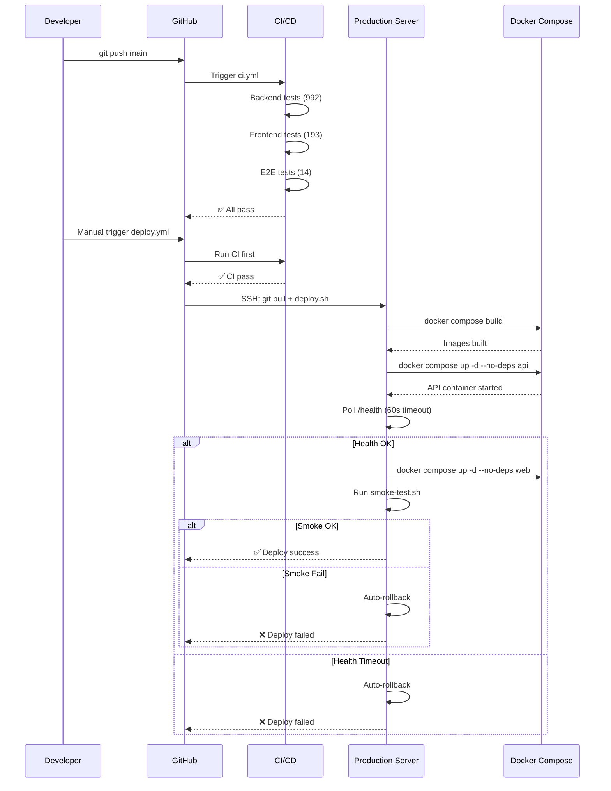

# Production Deployment Flow

```mermaid
sequenceDiagram
    participant Dev as Developer
    participant GH as GitHub
    participant CI as CI/CD
    participant Server as Production Server
    participant Docker as Docker Compose

    Dev->>GH: git push main
    GH->>CI: Trigger ci.yml
    CI->>CI: Backend tests (992)
    CI->>CI: Frontend tests (193)
    CI->>CI: E2E tests (14)
    CI-->>GH: ✅ All pass

    Dev->>GH: Manual trigger deploy.yml
    GH->>CI: Run CI first
    CI-->>GH: ✅ CI pass
    GH->>Server: SSH: git pull + deploy.sh

    Server->>Docker: docker compose build
    Docker-->>Server: Images built

    Server->>Docker: docker compose up -d --no-deps api
    Docker-->>Server: API container started

    Server->>Server: Poll /health (60s timeout)

    alt Health OK
        Server->>Docker: docker compose up -d --no-deps web
        Server->>Server: Run smoke-test.sh
        alt Smoke OK
            Server-->>GH: ✅ Deploy success
        else Smoke Fail
            Server->>Server: Auto-rollback
            Server-->>GH: ❌ Deploy failed
        end
    else Health Timeout
        Server->>Server: Auto-rollback
        Server-->>GH: ❌ Deploy failed
    end
```
