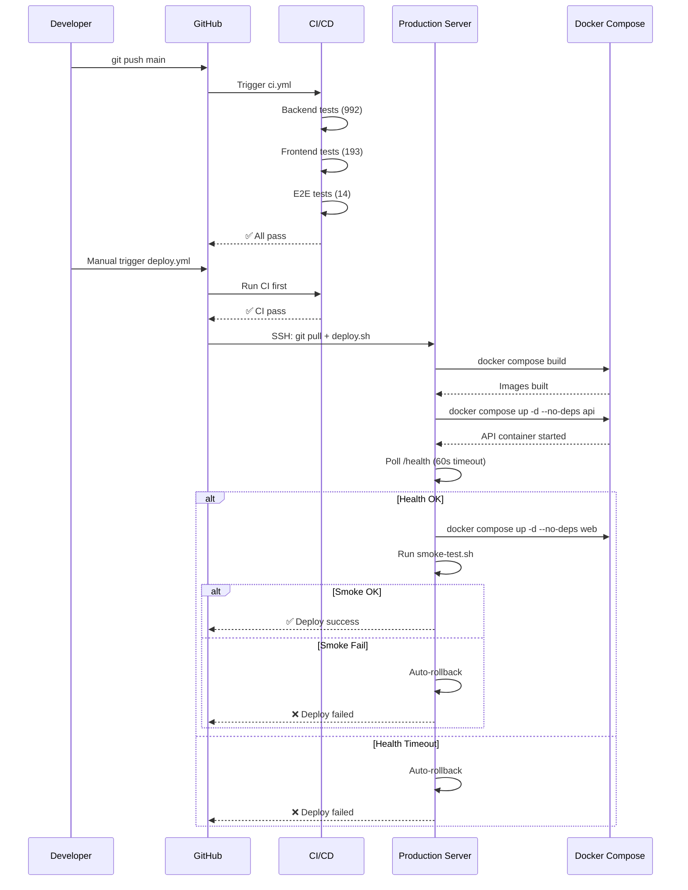
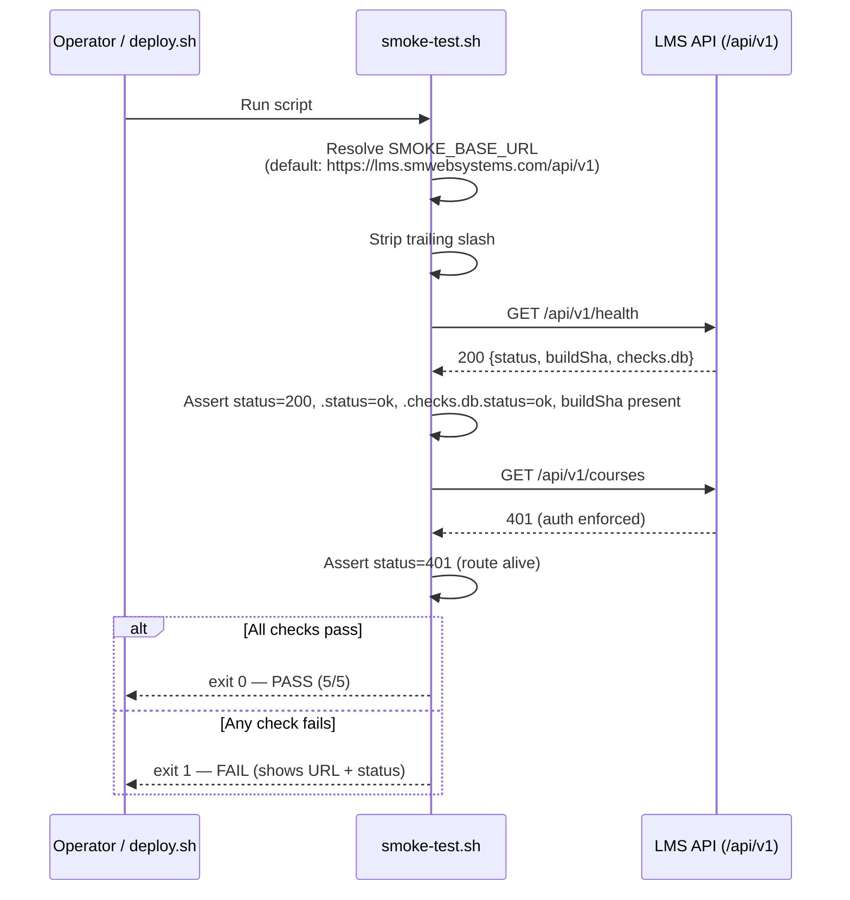

# Production Deployment Flow

```mermaid
sequenceDiagram
    participant Dev as Developer
    participant GH as GitHub
    participant CI as CI/CD
    participant Server as Production Server
    participant Docker as Docker Compose

    Dev->>GH: git push main
    GH->>CI: Trigger ci.yml
    CI->>CI: Backend tests (992)
    CI->>CI: Frontend tests (193)
    CI->>CI: E2E tests (14)
    CI-->>GH: ✅ All pass

    Dev->>GH: Manual trigger deploy.yml
    GH->>CI: Run CI first
    CI-->>GH: ✅ CI pass
    GH->>Server: SSH: git pull + deploy.sh

    Server->>Docker: docker compose build
    Docker-->>Server: Images built

    Server->>Docker: docker compose up -d --no-deps api
    Docker-->>Server: API container started

    Server->>Server: Poll /health (60s timeout)

    alt Health OK
        Server->>Docker: docker compose up -d --no-deps web
        Server->>Server: Run smoke-test.sh
        alt Smoke OK
            Server-->>GH: ✅ Deploy success
        else Smoke Fail
            Server->>Server: Auto-rollback
            Server-->>GH: ❌ Deploy failed
        end
    else Health Timeout
        Server->>Server: Auto-rollback
        Server-->>GH: ❌ Deploy failed
    end
```

## Smoke Test Flow

```mermaid
sequenceDiagram
    participant Op as Operator / deploy.sh
    participant ST as smoke-test.sh
    participant API as LMS API (/api/v1)

    Op->>ST: Run script
    ST->>ST: Resolve SMOKE_BASE_URL<br/>(default: https://lms.smwebsystems.com/api/v1)
    ST->>ST: Strip trailing slash

    ST->>API: GET /api/v1/health
    API-->>ST: 200 {status, buildSha, checks.db}
    ST->>ST: Assert status=200, .status=ok, .checks.db.status=ok, buildSha present

    ST->>API: GET /api/v1/courses
    API-->>ST: 401 (auth enforced)
    ST->>ST: Assert status=401 (route alive)

    alt All checks pass
        ST-->>Op: exit 0 — PASS (5/5)
    else Any check fails
        ST-->>Op: exit 1 — FAIL (shows URL + status)
    end
```
