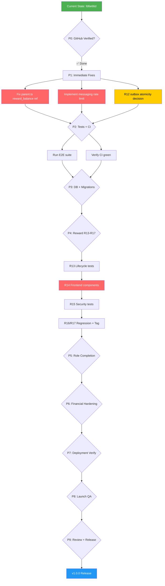

# Release Readiness Flow

```mermaid
flowchart TD
    START[Current State: fd6e66d] --> P0{P0: GitHub Verified?}
    P0 -->|✅ Done| P1[P1: Immediate Fixes]

    P1 --> P1A[Fix parent.ts reward_balance ref]
    P1 --> P1B[Implement messaging rate limit]
    P1 --> P1C[R12 outbox atomicity decision]

    P1A --> P2{P2: Tests + CI}
    P1B --> P2
    P1C --> P2

    P2 --> P2A[Run E2E suite]
    P2 --> P2B[Verify CI green]

    P2A --> P3{P3: DB + Migrations}
    P2B --> P3

    P3 --> P4{P4: Reward R13-R17}

    P4 --> P4A[R13 Lifecycle tests]
    P4A --> P4B[R14 Frontend components]
    P4B --> P4C[R15 Security tests]
    P4C --> P4D[R16/R17 Regression + Tag]

    P4D --> P5{P5: Role Completion}
    P5 --> P6{P6: Financial Hardening}
    P6 --> P7{P7: Deployment Verify}
    P7 --> P8{P8: Launch QA}
    P8 --> P9{P9: Review + Release}
    P9 --> RELEASE[v1.0.0 Release]

    style START fill:#4CAF50,color:#fff
    style RELEASE fill:#2196F3,color:#fff
    style P1A fill:#ff6666,color:#fff
    style P1B fill:#ff6666,color:#fff
    style P1C fill:#ffcc00,color:#000
    style P4B fill:#ff6666,color:#fff
```
