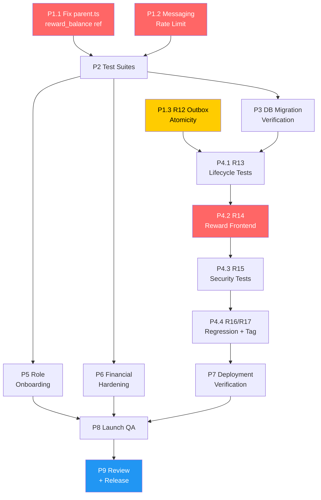

# Remaining Work Dependencies

```mermaid
graph TD
    P1A[P1.1 Fix parent.ts<br/>reward_balance ref] --> P2[P2 Test Suites]
    P1B[P1.2 Messaging<br/>Rate Limit] --> P2
    P1C[P1.3 R12 Outbox<br/>Atomicity] --> P4A

    P2 --> P3[P3 DB Migration<br/>Verification]

    P3 --> P4A[P4.1 R13<br/>Lifecycle Tests]
    P4A --> P4B[P4.2 R14<br/>Reward Frontend]
    P4B --> P4C[P4.3 R15<br/>Security Tests]
    P4C --> P4D[P4.4 R16/R17<br/>Regression + Tag]

    P2 --> P5[P5 Role<br/>Onboarding]
    P2 --> P6[P6 Financial<br/>Hardening]

    P4D --> P7[P7 Deployment<br/>Verification]
    P5 --> P8[P8 Launch QA]
    P6 --> P8
    P7 --> P8

    P8 --> P9[P9 Review<br/>+ Release]

    style P1A fill:#ff6666,color:#fff
    style P1B fill:#ff6666,color:#fff
    style P1C fill:#ffcc00,color:#000
    style P4B fill:#ff6666,color:#fff
    style P9 fill:#2196F3,color:#fff
```
