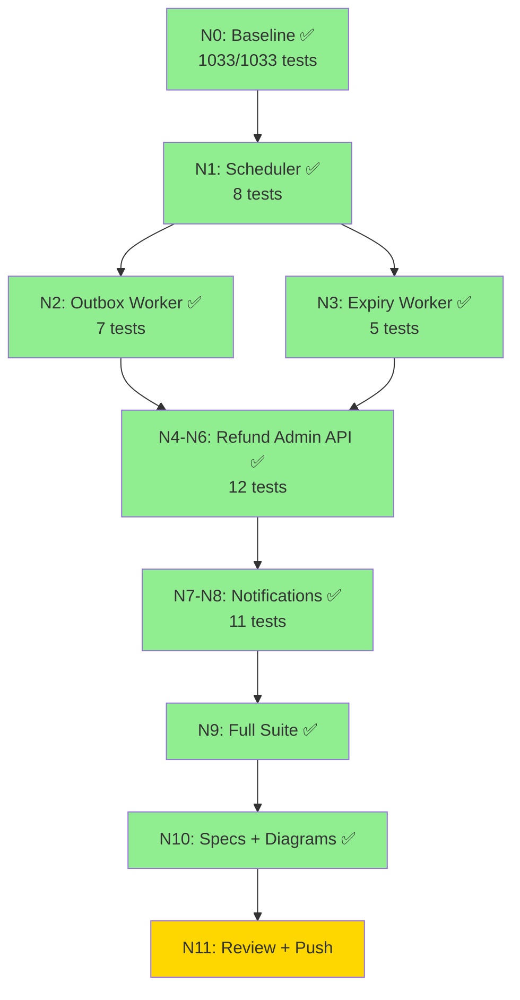

# Remaining Work Dependencies — Reward System N15 (Scheduler + Refund + Notifications)

## New Files (11)
1. `src/services/rewards/rewardScheduler.ts`
2. `src/services/rewards/rewardSchedulerLock.ts`
3. `src/services/rewards/rewardSchedulerMetrics.ts`
4. `src/services/rewards/rewardOutboxWorker.ts`
5. `src/services/rewards/rewardExpiryWorker.ts`
6. `src/services/rewards/rewardNotificationService.ts`
7. `src/routes/adminRewards.ts`
8. `src/__tests__/reward-scheduler.test.ts`
9. `src/__tests__/reward-outbox-worker.test.ts`
10. `src/__tests__/reward-expiry-worker.test.ts`
11. `src/__tests__/reward-refund-admin.test.ts`
12. `src/__tests__/reward-notifications.test.ts`

## Modified Files (6)
1. `src/config/database.ts` — scheduler tables, audit log, RBAC permissions, next_attempt_at
2. `database/schema.sql` — new tables + next_attempt_at column
3. `src/server.ts` — scheduler start/stop integration
4. `src/app.ts` — admin rewards route mount
5. `src/services/rewards/rewardService.ts` — notification hooks
6. `src/services/rewards/rewardEligibilityService.ts` — eligible notification
7. `src/services/notificationService.ts` — 6 new notification types

## New Test Count: 51 (8 + 7 + 5 + 12 + 11 + 8 security)
