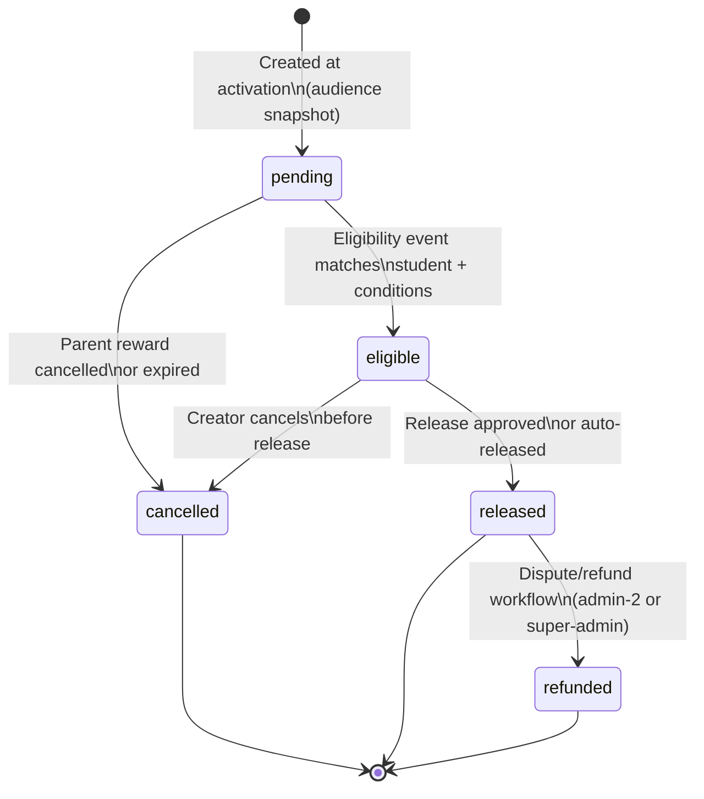
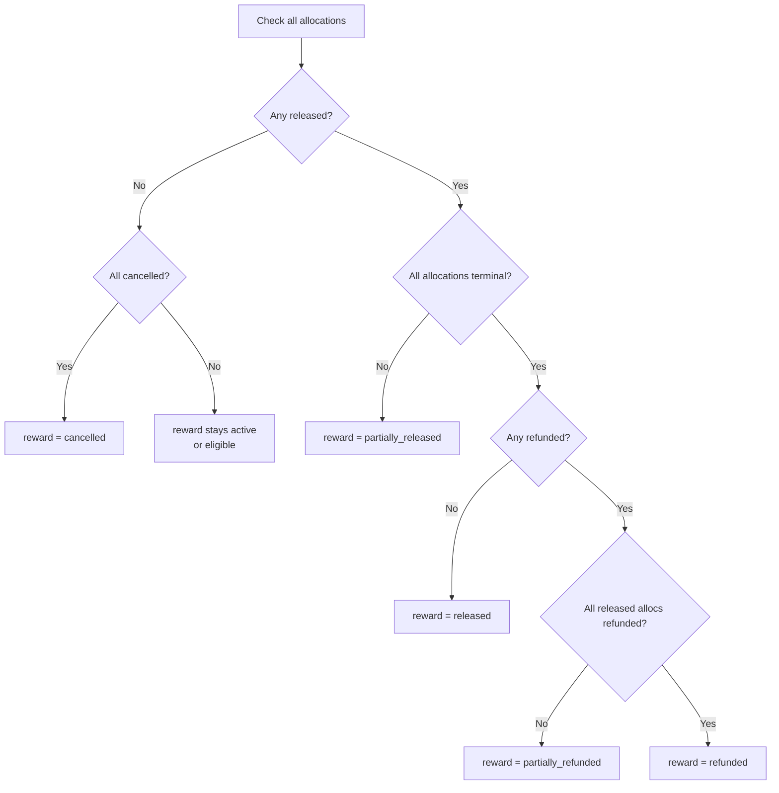

# Reward Allocation State Machine

## Individual Allocation Lifecycle

## Aggregate Reward Status Derivation

## Allocation Status by Reward State

| Reward State | Possible Allocation States |
|-------------|--------------------------|
| draft | (no allocations yet) |
| pending_funding | (no allocations yet) |
| funded | (no allocations yet) |
| active | pending |
| eligible_pending_approval | pending, eligible |
| approved | pending, eligible |
| eligible_auto_release | pending, eligible |
| partially_released | pending, eligible, released, cancelled |
| released | released, cancelled, refunded |
| cancelled | cancelled |
| expired | cancelled |
| partially_refunded | released, refunded, cancelled |
| refunded | refunded, cancelled |
