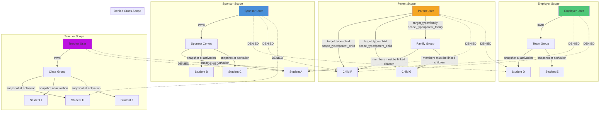
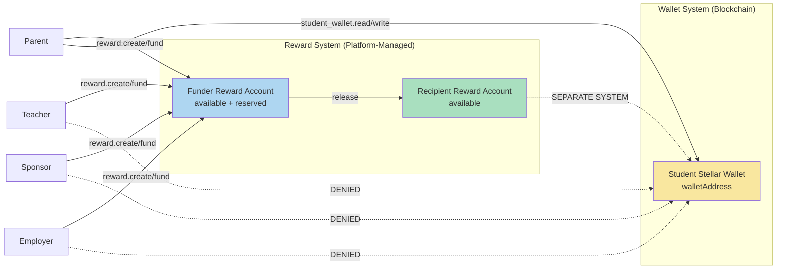
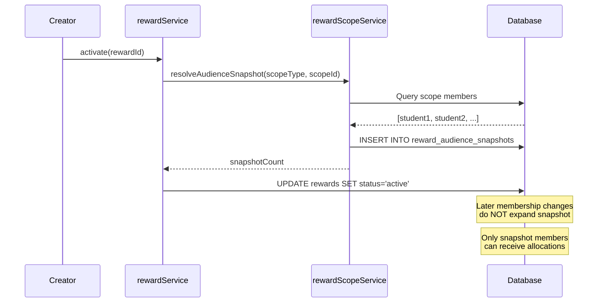

# Reward Authorization Scope

## Relationship Scope Diagram

## Student Wallet Boundary

## Audience Snapshot Policy

## Permission Matrix Summary

| Actor | Reward CRUD | Reward Balance | Student Wallet | Cross-Scope |
|-------|-----------|----------------|---------------|-------------|
| Sponsor | Own cohorts only | Own funder account | DENIED | DENIED |
| Employer | Own teams only | Own funder account | DENIED | DENIED |
| Parent | Linked children | Own funder account | READ + WRITE | DENIED |
| Teacher | Own classes only | Own funder account | DENIED | DENIED |
| Admin | All (manage) | View all | Per existing perms | All scopes |
| Super-admin | All (full) | View + modify all | Full access | All scopes |
| Student | View received | View own recipient | Own wallet | DENIED |
