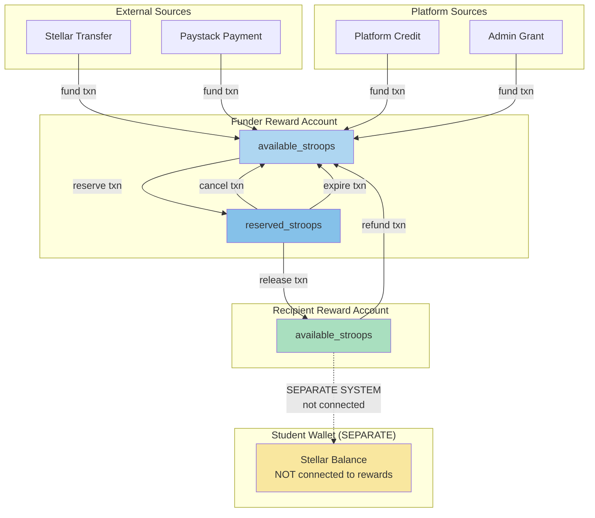
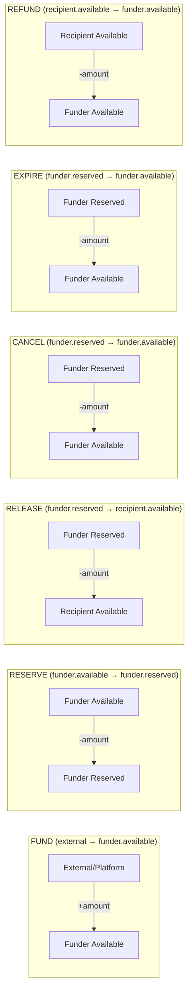
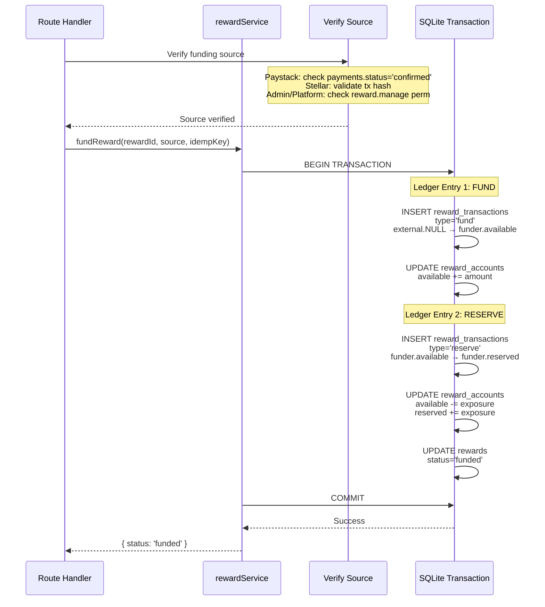
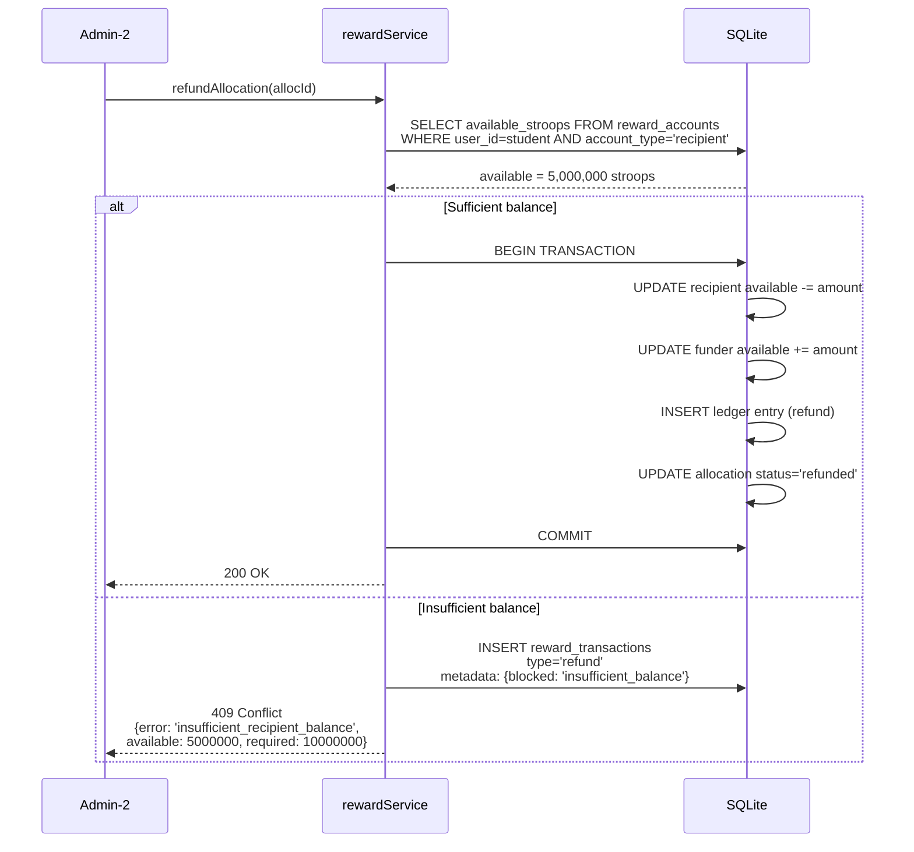
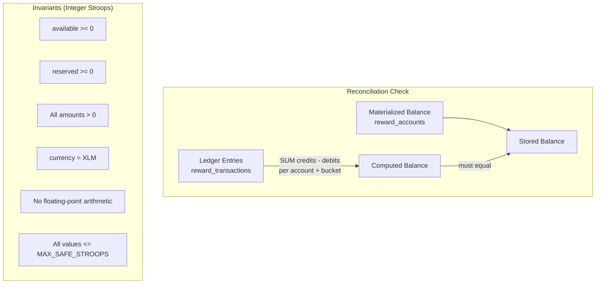

# Reward Funds Flow

## Balance Bucket Model

## Transaction Shapes and Balance Mutations

## Atomic Transaction: Fund + Reserve

## Refund with Insufficient Balance

## Balance Reconciliation

## Ledger Entry Structure

All amounts in integer stroops. 1 XLM = 10,000,000 stroops.

| Field | Type | Description |
|-------|------|-------------|
| source_account_type | external/platform/funder/recipient | Who funds are coming from |
| source_bucket | available/reserved/NULL | Which balance bucket |
| destination_account_type | funder/recipient/platform | Who receives funds |
| destination_bucket | available/reserved | Which balance bucket |
| amount_stroops | INTEGER > 0 | Amount in stroops |
| currency_code | 'XLM' | Only XLM supported |
