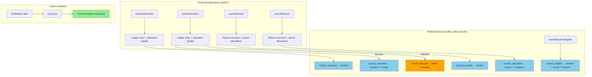

# Reward Notification Flow

## Notification Types
| Type | Recipients | Configurable |
|------|-----------|-------------|
| reward_released | Student | Yes |
| reward_eligible | Student; creator if !auto_release | Yes |
| reward_refunded | Recipient + creator | Yes |
| reward_expired | Creator | Yes |
| reward_cancelled | Creator + affected recipients | Yes |
| refund_blocked | Users with reward.refund_review | Yes |

## Privacy Rules
- No funder balances in any notification body
- No student balance data in refund_blocked
- refund_blocked recipients determined by RBAC query, not hardcoded roles
