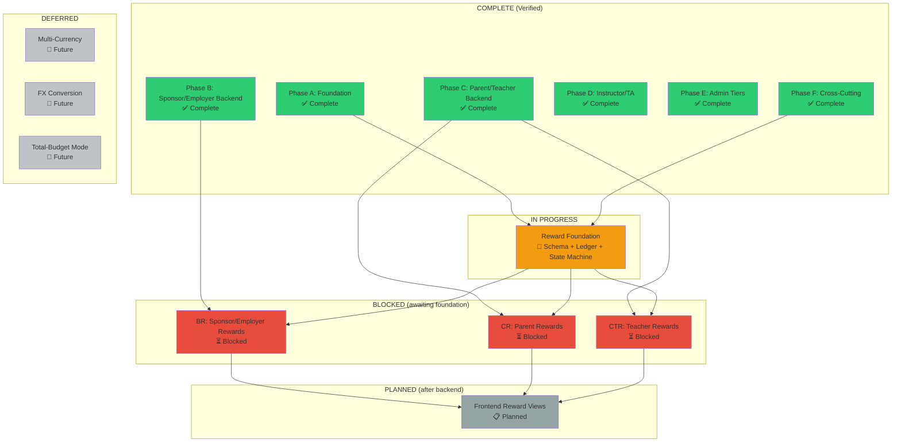
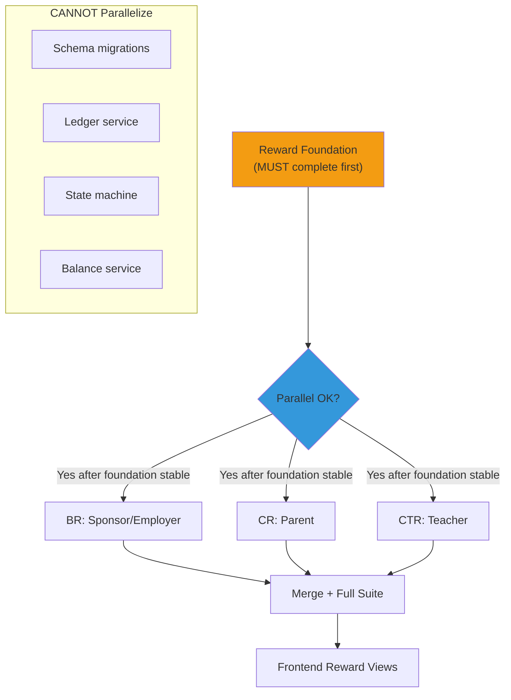

# Reward Phase Dependency

## Phase Dependency Diagram

## Parallel Work Safety

## Implementation Order

| # | Loop | Dependencies | Parallelizable |
|---|------|-------------|---------------|
| R0 | Baseline + inventory | None | No |
| R1 | Schema design finalization | R0 | No |
| R2 | Migration + schema tests | R1 | No |
| R3 | Currency + BigInt | R1 | Yes (with R2) |
| R4 | Reward accounts | R2 | No |
| R5 | Ledger + idempotency | R4 | No |
| R6 | State machine | R5 | No |
| R7 | Audience snapshot + scope | R6 | No |
| R8 | Sponsor/employer routes | R7 | Yes |
| R9 | Parent routes | R7 | Yes (with R8) |
| R10 | Teacher routes | R7 | Yes (with R8, R9) |
| R11 | Eligibility events | R8-R10 | No |
| R12 | Release policies | R11 | No |
| R13 | Cancel/expire/refund | R12 | No |
| R14 | Frontend views | R13 | No |
| R15 | Security verification | R14 | No |
| R16 | Full regression | R15 | No |
| R17 | Code review + release | R16 | No |

## Status Legend

| Symbol | Meaning |
|--------|---------|
| ✅ | Complete and verified |
| 🔨 | In progress |
| ⏳ | Blocked (waiting on dependency) |
| 📋 | Planned (not started) |
| 🔮 | Deferred (future phase) |
