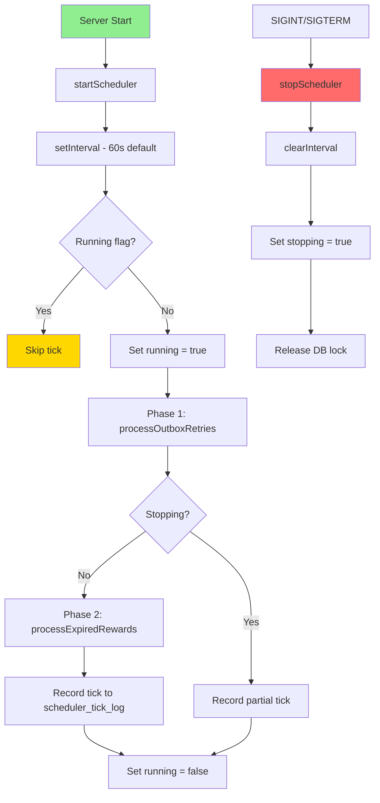

# Reward Scheduler Flow

## Key Properties
- **Non-overlapping**: In-process `running` flag prevents concurrent ticks
- **DB lease**: `scheduler_locks` table for multi-process safety
- **Configurable**: `REWARD_SCHEDULER_INTERVAL_MS` env var (default 60s)
- **Observable**: Every tick recorded in `scheduler_tick_log`
- **Graceful**: Current tick finishes before shutdown completes
