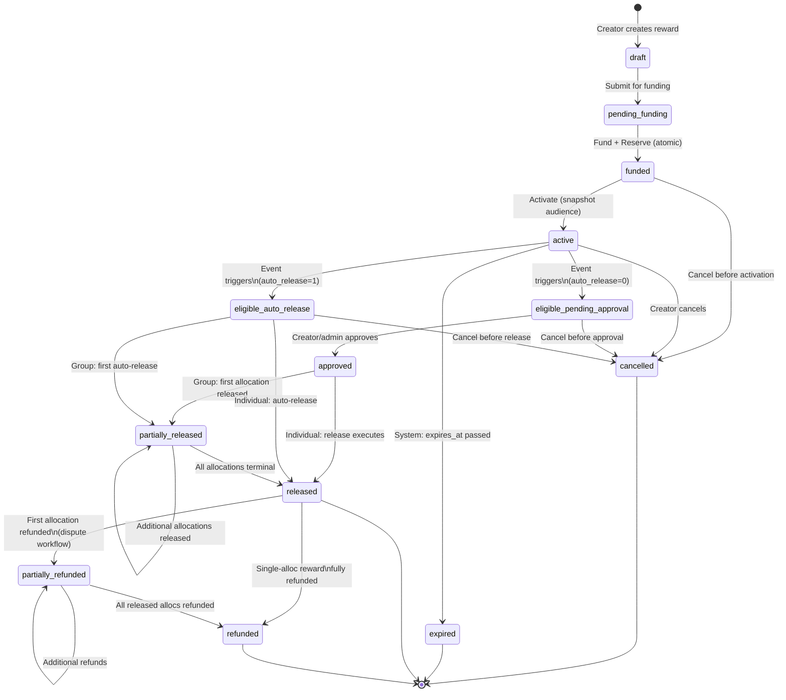
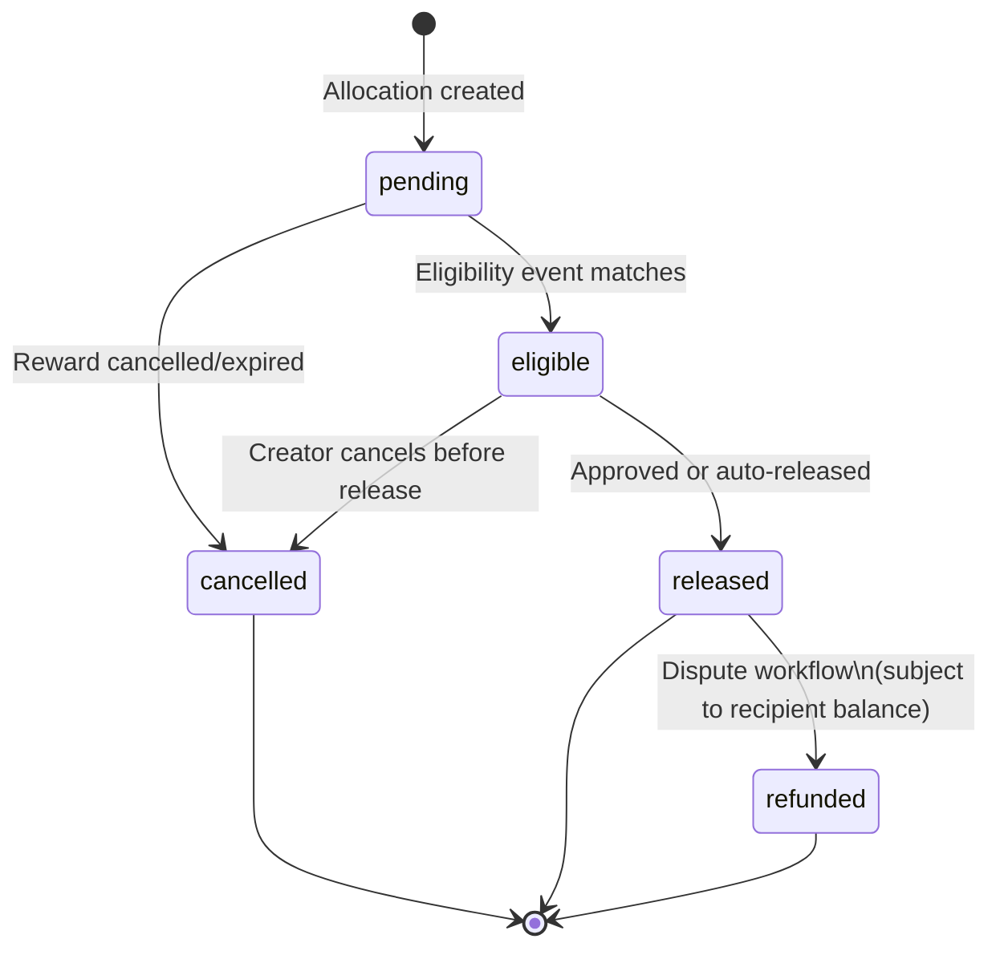

# Reward State Machine

## Reward States (13 total)

## Blocked Transitions

- `partially_released` → `cancelled` (cannot cancel after any release)
- `released` → `cancelled` (must use dispute/refund)
- Any → `eligible_auto_release` when `auto_release=0`
- Any → `approved` when `auto_release=1`
- `eligible_pending_approval` → `eligible_auto_release` (cannot change policy)

## Reward Allocation States

## State Descriptions

| State | Persistent | Description |
|-------|-----------|-------------|
| draft | Yes | Created, not submitted for funding |
| pending_funding | Yes | Awaiting external/platform funding |
| funded | Yes | Funds deposited and reserved |
| active | Yes | Monitoring eligibility events |
| eligible_pending_approval | Yes | Conditions met, awaiting manual approval |
| approved | Yes | Manually approved, release pending execution |
| eligible_auto_release | Yes | Conditions met, auto-release proceeding |
| partially_released | Yes | Group: some allocations released |
| released | Yes | All allocations terminal, ≥1 released |
| cancelled | Yes | Cancelled before release; funds returned |
| expired | Yes | System expired; funds returned |
| partially_refunded | Yes | Some released allocations refunded |
| refunded | Yes | All released allocations refunded |

## Authorized Actors Per Transition

| Transition | Authorized Actors |
|-----------|------------------|
| draft → pending_funding | Creator (sponsor/employer/parent/teacher) |
| pending_funding → funded | Creator + verified funding source |
| funded → active | Creator |
| active → eligible_* | System (event processor) |
| eligible_pending → approved | Creator or admin (reward.approve) |
| approved → released/partially_released | System (release processor) |
| eligible_auto → released/partially_released | System (auto-release) |
| * → cancelled | Creator (before release) |
| active → expired | System (expiry processor) |
| released → partially_refunded/refunded | admin-2 or super-admin (reward.refund) |
