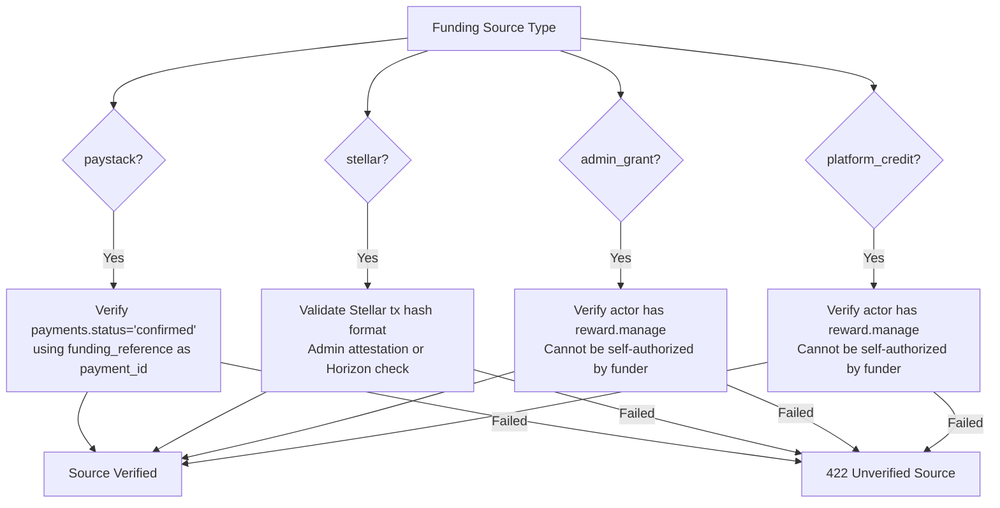

# Reward Transaction Shapes

## Valid Transaction Configurations

```mermaid
flowchart TD
    subgraph "FUND Transaction"
        F_SRC["source: external or platform<br/>bucket: NULL<br/>user: NULL"]
        F_DST["dest: funder<br/>bucket: available<br/>user: funder_id"]
        F_META["funding_source_type: REQUIRED<br/>funding_reference: REQUIRED<br/>allocation_id: NULL"]
        F_SRC --> F_DST
    end

    subgraph "RESERVE Transaction"
        R_SRC["source: funder<br/>bucket: available<br/>user: funder_id"]
        R_DST["dest: funder<br/>bucket: reserved<br/>user: funder_id"]
        R_META["funding_source_type: NULL<br/>allocation_id: NULL"]
        R_SRC --> R_DST
    end

    subgraph "RELEASE Transaction"
        L_SRC["source: funder<br/>bucket: reserved<br/>user: funder_id"]
        L_DST["dest: recipient<br/>bucket: available<br/>user: student_id"]
        L_META["allocation_id: REQUIRED<br/>source_event_id: optional"]
        L_SRC --> L_DST
    end

    subgraph "CANCEL Transaction"
        C_SRC["source: funder<br/>bucket: reserved<br/>user: funder_id"]
        C_DST["dest: funder<br/>bucket: available<br/>user: funder_id"]
        C_META["allocation_id: optional<br/>reason: REQUIRED"]
        C_SRC --> C_DST
    end

    subgraph "EXPIRE Transaction"
        X_SRC["source: funder<br/>bucket: reserved<br/>user: funder_id"]
        X_DST["dest: funder<br/>bucket: available<br/>user: funder_id"]
        X_META["actor_type: system<br/>actor_user_id: NULL"]
        X_SRC --> X_DST
    end

    subgraph "REFUND Transaction"
        RF_SRC["source: recipient<br/>bucket: available<br/>user: student_id"]
        RF_DST["dest: funder<br/>bucket: available<br/>user: funder_id"]
        RF_META["allocation_id: REQUIRED<br/>via dispute workflow"]
        RF_SRC --> RF_DST
    end
```

## Validation Rules

| Transaction Type | source_account_type | source_bucket | source_user_id | dest_account_type | dest_bucket | dest_user_id | funding_source_type | allocation_id | actor_type |
|-----------------|-------------------|---------------|----------------|-------------------|-------------|-------------|-------------------|---------------|-----------|
| fund | external/platform | NULL | NULL | funder | available | funder | REQUIRED | NULL | user |
| reserve | funder | available | funder | funder | reserved | funder | NULL | NULL | user |
| release | funder | reserved | funder | recipient | available | student | NULL | REQUIRED | user/system |
| cancel | funder | reserved | funder | funder | available | funder | NULL | optional | user |
| expire | funder | reserved | funder | funder | available | funder | NULL | NULL | system |
| refund | recipient | available | student | funder | available | funder | NULL | REQUIRED | user |

## Invalid Combinations (Must Be Rejected)

| Invalid Shape | Reason |
|--------------|--------|
| release with source_bucket='available' | Release must debit reserved, not available |
| cancel with dest_account_type='recipient' | Cancel returns to funder, not student |
| refund with source_bucket='reserved' | Refund debits recipient available |
| fund without funding_source_type | Fund requires verified source |
| release without allocation_id | Release must track per-student allocation |
| refund without allocation_id | Refund must track per-student allocation |
| expire with actor_type='user' | Expire is system-only |
| fund with actor_type='system' | Fund requires user authorization |

## Funding Source Verification

