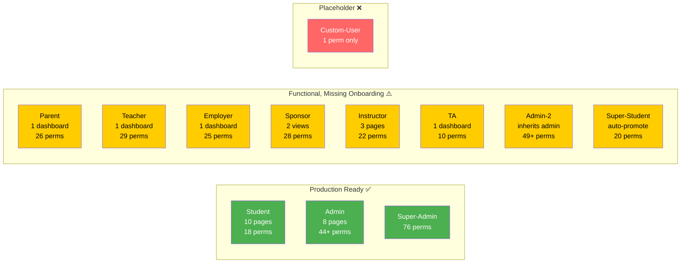

# Role Readiness Matrix

```mermaid
graph LR
    subgraph "Production Ready ✅"
        STUDENT[Student<br/>10 pages<br/>18 perms]
        ADMIN[Admin<br/>8 pages<br/>44+ perms]
        SUPERADMIN[Super-Admin<br/>76 perms]
    end

    subgraph "Functional, Missing Onboarding ⚠️"
        PARENT[Parent<br/>1 dashboard<br/>26 perms]
        TEACHER[Teacher<br/>1 dashboard<br/>29 perms]
        EMPLOYER[Employer<br/>1 dashboard<br/>25 perms]
        SPONSOR[Sponsor<br/>2 views<br/>28 perms]
        INSTRUCTOR[Instructor<br/>3 pages<br/>22 perms]
        TA[TA<br/>1 dashboard<br/>10 perms]
        ADMIN2[Admin-2<br/>inherits admin<br/>49+ perms]
        SUPERSTUD[Super-Student<br/>auto-promote<br/>20 perms]
    end

    subgraph "Placeholder ❌"
        CUSTOM[Custom-User<br/>1 perm only]
    end

    style STUDENT fill:#4CAF50,color:#fff
    style ADMIN fill:#4CAF50,color:#fff
    style SUPERADMIN fill:#4CAF50,color:#fff
    style PARENT fill:#ffcc00,color:#000
    style TEACHER fill:#ffcc00,color:#000
    style EMPLOYER fill:#ffcc00,color:#000
    style SPONSOR fill:#ffcc00,color:#000
    style INSTRUCTOR fill:#ffcc00,color:#000
    style TA fill:#ffcc00,color:#000
    style ADMIN2 fill:#ffcc00,color:#000
    style SUPERSTUD fill:#ffcc00,color:#000
    style CUSTOM fill:#ff6666,color:#fff
```
