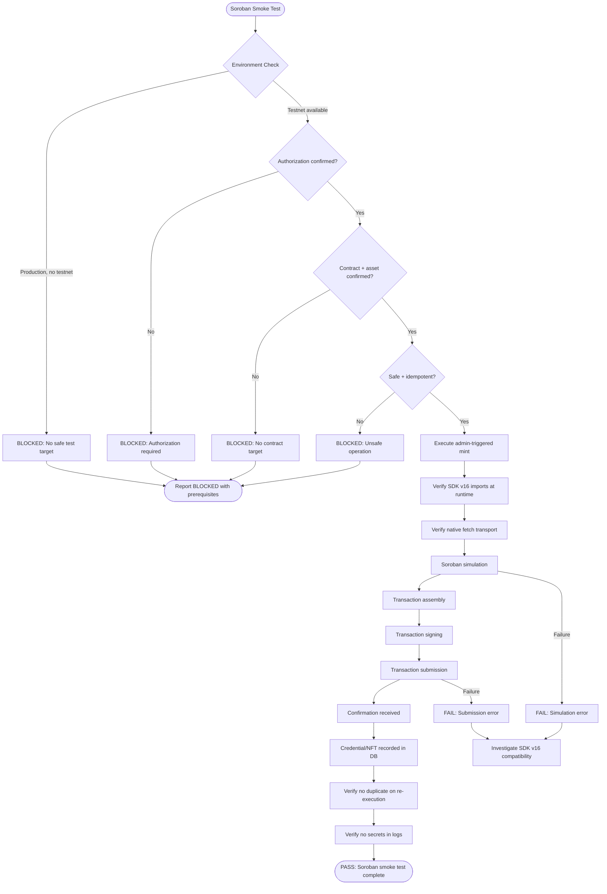

# Soroban Smoke Test Flow

## Current Status: BLOCKED

- Environment: Production (mainnet)
- NFT_AUTO_MINT_ENABLED: false
- No testnet contract available for automated testing
- Manual admin-triggered mint required for verification
