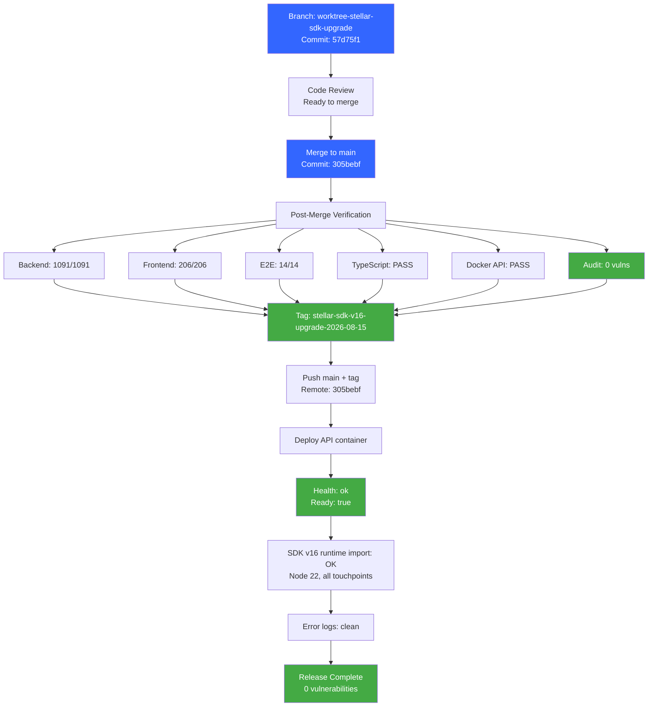

# Stellar SDK v16 Release Flow

```mermaid
graph TD
    BRANCH["Branch: worktree-stellar-sdk-upgrade<br/>Commit: 57d75f1"] --> REVIEW["Code Review<br/>Ready to merge"]
    REVIEW --> MERGE["Merge to main<br/>Commit: 305bebf"]

    MERGE --> POST_CI["Post-Merge Verification"]
    POST_CI --> BE["Backend: 1091/1091"]
    POST_CI --> FE["Frontend: 206/206"]
    POST_CI --> E2E["E2E: 14/14"]
    POST_CI --> TSC["TypeScript: PASS"]
    POST_CI --> DOCKER["Docker API: PASS"]
    POST_CI --> AUDIT["Audit: 0 vulns"]

    BE --> TAG["Tag: stellar-sdk-v16-upgrade-2026-08-15"]
    FE --> TAG
    E2E --> TAG
    TSC --> TAG
    DOCKER --> TAG
    AUDIT --> TAG

    TAG --> PUSH["Push main + tag<br/>Remote: 305bebf"]
    PUSH --> DEPLOY["Deploy API container"]

    DEPLOY --> HEALTH["Health: ok<br/>Ready: true"]
    HEALTH --> SDK_CHECK["SDK v16 runtime import: OK<br/>Node 22, all touchpoints"]
    SDK_CHECK --> LOGS["Error logs: clean"]
    LOGS --> DONE["Release Complete<br/>0 vulnerabilities"]

    style BRANCH fill:#36f,color:#fff
    style MERGE fill:#36f,color:#fff
    style TAG fill:#4a4,color:#fff
    style DONE fill:#4a4,color:#fff
    style AUDIT fill:#4a4,color:#fff
    style HEALTH fill:#4a4,color:#fff
```
