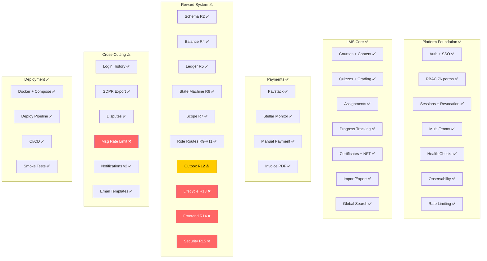

# System Development Status

```mermaid
graph TB
    subgraph "Platform Foundation ✅"
        AUTH[Auth + SSO ✅]
        RBAC[RBAC 76 perms ✅]
        SESSIONS[Sessions + Revocation ✅]
        TENANT[Multi-Tenant ✅]
        HEALTH[Health Checks ✅]
        OBSERVE[Observability ✅]
        RATE[Rate Limiting ✅]
    end

    subgraph "LMS Core ✅"
        COURSE[Courses + Content ✅]
        QUIZ[Quizzes + Grading ✅]
        ASSIGN[Assignments ✅]
        PROGRESS[Progress Tracking ✅]
        CERT[Certificates + NFT ✅]
        IMPORT[Import/Export ✅]
        SEARCH[Global Search ✅]
    end

    subgraph "Payments ✅"
        PAYSTACK[Paystack ✅]
        STELLAR_PAY[Stellar Monitor ✅]
        MANUAL[Manual Payment ✅]
        INVOICE[Invoice PDF ✅]
    end

    subgraph "Reward System ⚠️"
        R_SCHEMA[Schema R2 ✅]
        R_BALANCE[Balance R4 ✅]
        R_LEDGER[Ledger R5 ✅]
        R_SM[State Machine R6 ✅]
        R_SCOPE[Scope R7 ✅]
        R_ROUTES[Role Routes R9-R11 ✅]
        R_OUTBOX[Outbox R12 ⚠️]
        R_LIFECYCLE[Lifecycle R13 ❌]
        R_FRONTEND[Frontend R14 ❌]
        R_SECURITY[Security R15 ❌]
    end

    subgraph "Cross-Cutting ⚠️"
        LOGIN_HIST[Login History ✅]
        GDPR[GDPR Export ✅]
        DISPUTES[Disputes ✅]
        MSG_RATE[Msg Rate Limit ❌]
        NOTIF[Notifications v2 ✅]
        EMAIL[Email Templates ✅]
    end

    subgraph "Deployment ✅"
        DOCKER[Docker + Compose ✅]
        DEPLOY[Deploy Pipeline ✅]
        CI[CI/CD ✅]
        SMOKE[Smoke Tests ✅]
    end

    style R_OUTBOX fill:#ffcc00,color:#000
    style R_LIFECYCLE fill:#ff6666,color:#fff
    style R_FRONTEND fill:#ff6666,color:#fff
    style R_SECURITY fill:#ff6666,color:#fff
    style MSG_RATE fill:#ff6666,color:#fff
```
