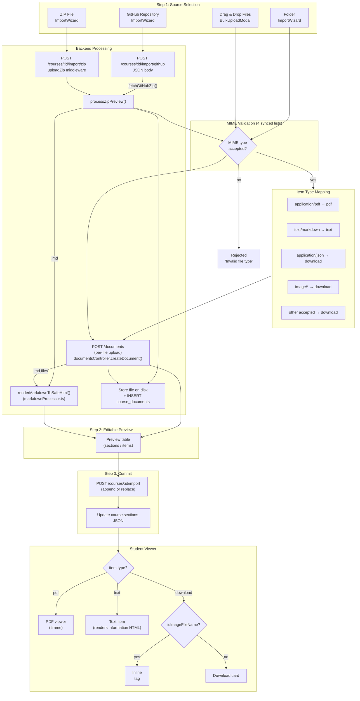

# Upload Extensions — Current File Upload Flow

> Updated 2026-08-12 — reflects post-Phase 27 C1 state with all markdown rendering paths active.

All paths require `course.manage` RBAC permission.

## Path Comparison

| Path | MIME Check | Markdown Render | Preview | Storage |
|------|-----------|-----------------|---------|---------|
| BulkUpload (drag/drop) | Frontend `ACCEPTED_MIME_TYPES` | `createDocument()` returns `renderedHtml` | No preview table | Per-file POST /documents |
| ZIP | Backend `ALLOWED_DOC_MIMES` | `renderMarkdownToSafeHtml()` in `processZipPreview()` | Full preview | Batch in processZipPreview |
| Folder | Frontend `DOC_MIME_TYPES` | `createDocument()` returns `renderedHtml` | Client-side preview | Per-file POST /documents |
| GitHub | Backend `ALLOWED_DOC_MIMES` | `renderMarkdownToSafeHtml()` in `processZipPreview()` | Full preview | Batch in processZipPreview |

All four paths now render markdown to sanitized HTML. The `afterSanitizeAttributes` DOMPurify hook enforces `target="_blank"` + `rel="noopener noreferrer"` on all links.
