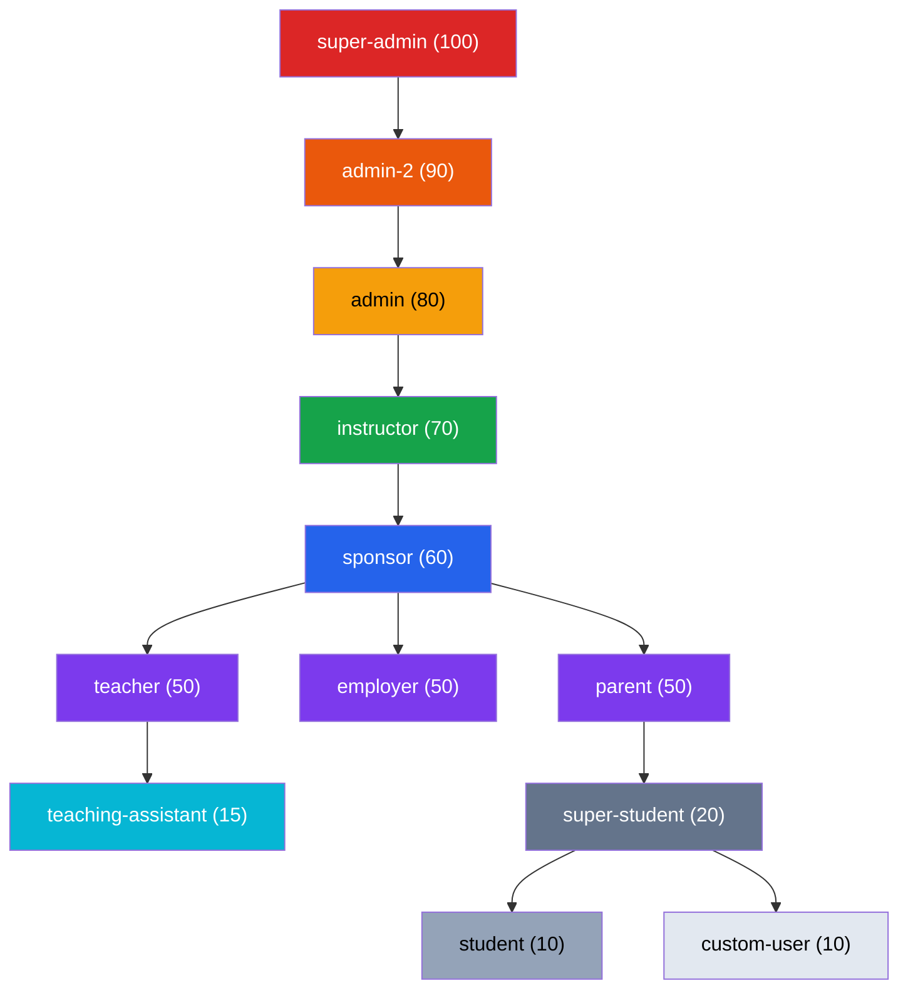
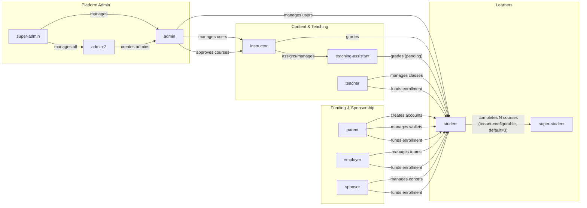
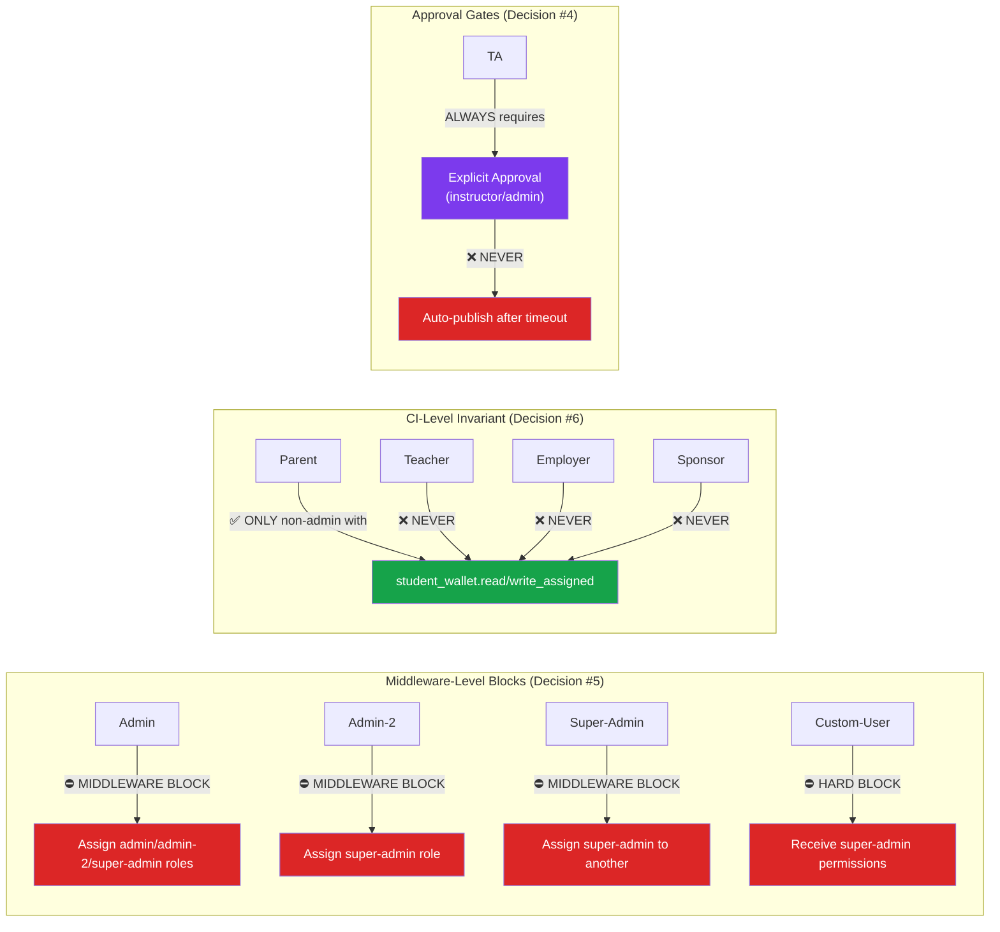
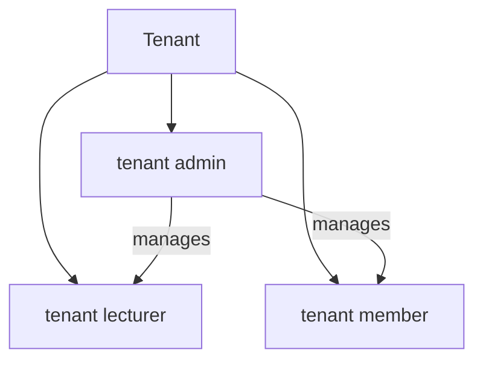

# User Roles — Hierarchy & Relationships

## Role Hierarchy (Privilege Levels)

## Relationship Diagram (Who Manages/Views Whom)

## Enforcement Boundaries (Locked Decisions)

## Tenant-Level Roles (Independent from RBAC)

Note: Tenant roles (`admin`, `lecturer`, `member`) are stored in `tenant_users.tenant_role` and are independent from the RBAC `user_roles` system. A user can be a `student` in RBAC but a `tenant admin` within a specific tenant.
