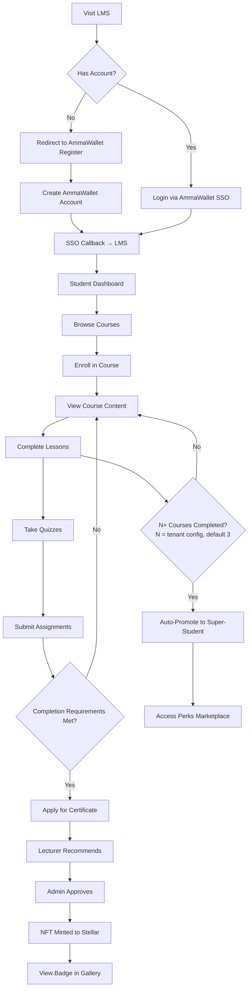
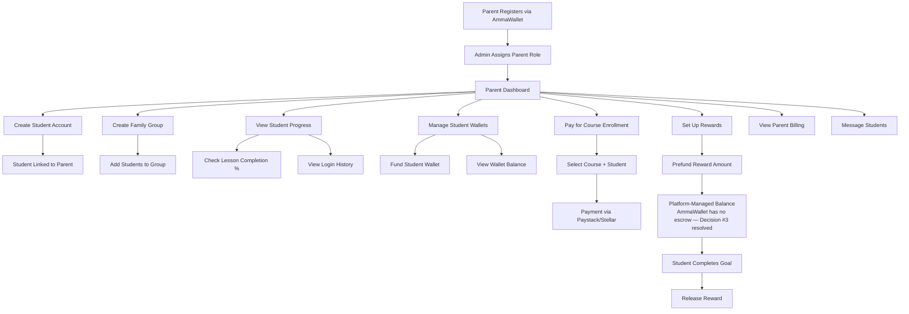
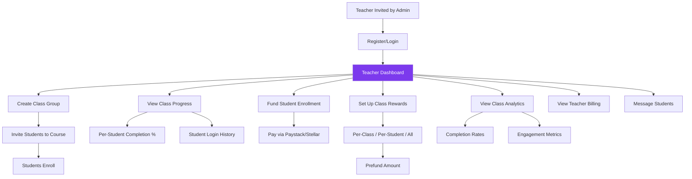
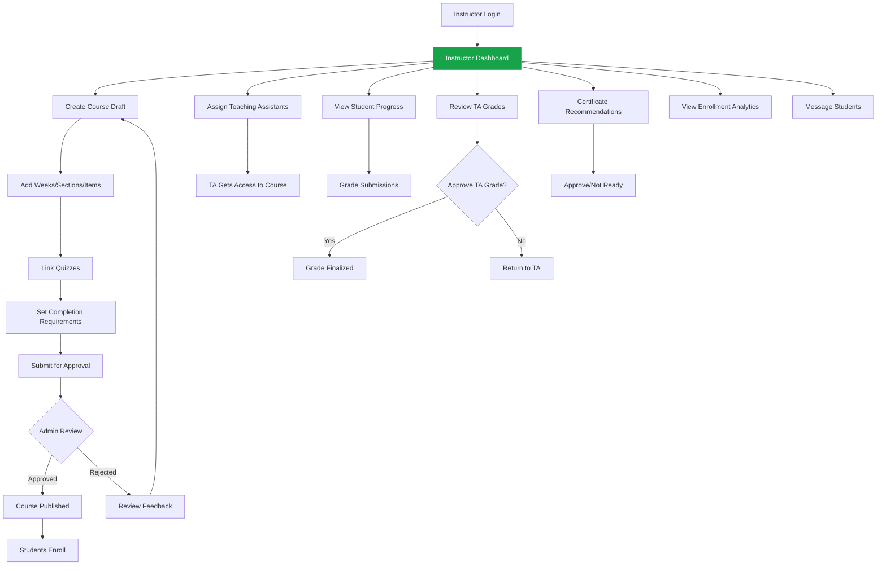
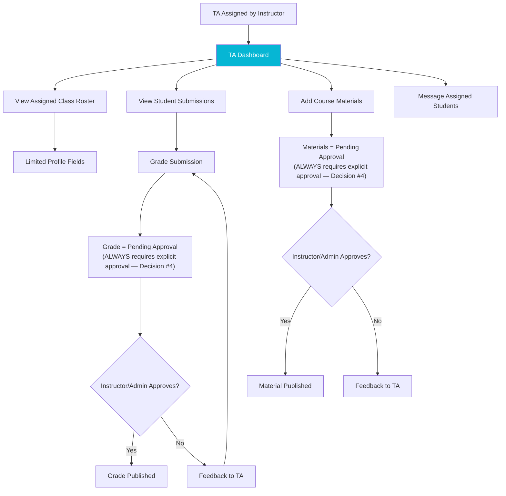
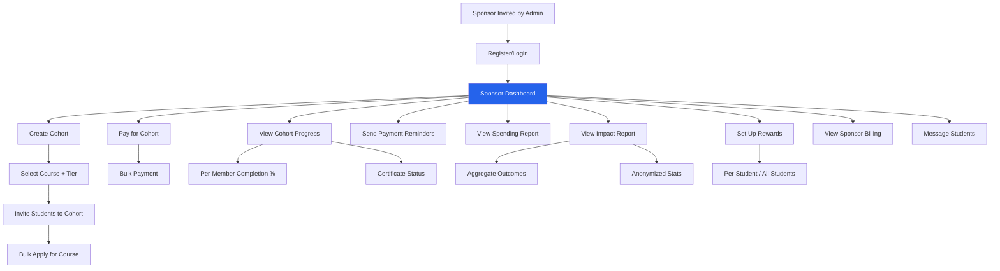
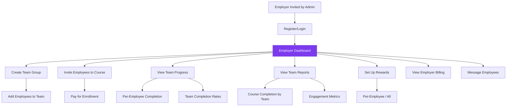
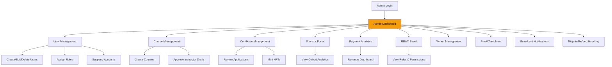
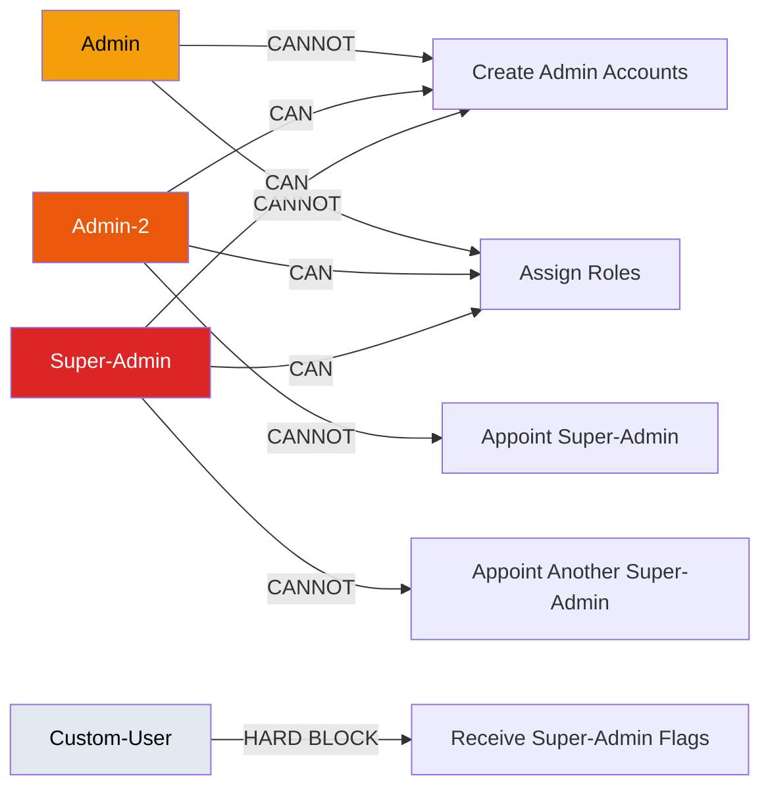

# User Roles — Journey/Flow Diagrams

## Student Journey

## Parent Journey

## Teacher Journey

## Instructor Journey

## Teaching Assistant Journey

## Sponsor Journey

## Employer Journey

## Admin Journey

## Admin Tier Escalation Flow

