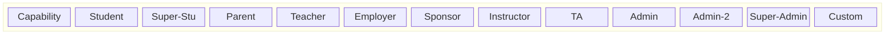

# User Roles — Permissions Matrix

## Legend

- **R** = Read | **W** = Write | **A** = Approve | **D** = Destructive | **-** = No access
- Scoped = only assigned/linked users, not all users

## Core Permissions Matrix

### Course Access

| Capability | Student | Super-Stu | Parent | Teacher | Employer | Sponsor | Instructor | TA | Admin | Admin-2 | Super-Admin | Custom |
|---|---|---|---|---|---|---|---|---|---|---|---|---|
| Course content (enrolled) | R | R | R | R | R | R | R/W | R | R/W | R/W | R/W | flag |
| Course creation | - | - | - | - | - | - | W(draft) | - | W/A | W/A | W/A | flag |
| Course approval | - | - | - | - | - | - | - | - | A | A | A | flag |
| Course materials | - | - | - | - | - | - | W | W(approve) | W | W | W | flag |
| Enroll self | W | W | W | W | W | W | - | - | W | W | W | flag |
| Enroll others | - | - | - | W | W | W | W | - | W | W | W | flag |

### User & Student Management

| Capability | Student | Super-Stu | Parent | Teacher | Employer | Sponsor | Instructor | TA | Admin | Admin-2 | Super-Admin | Custom |
|---|---|---|---|---|---|---|---|---|---|---|---|---|
| Own profile | R/W | R/W | R/W | R/W | R/W | R/W | R/W | R/W | R/W | R/W | R/W | R/W |
| Other profiles (same class) | R | R | R | R | R | R | R | R(limited) | R | R | R | flag |
| Assigned students - progress | - | - | R | R | R | R | R | R | R | R | R | flag |
| Assigned students - login history | - | - | R | R | R | R | R | - | R | R | R | flag |
| Create student accounts | - | - | W | - | - | - | - | - | W | W | W | flag |
| Manage users | - | - | - | - | - | - | - | - | R/W | R/W/D | R/W/D | flag |
| Suspend accounts | - | - | - | - | - | - | - | - | D | D | D | flag |
| Assign roles | - | - | - | - | - | - | - | - | - | W | W | flag |
| Create admin users | - | - | - | - | - | - | - | - | - | W | W | - |

### Billing & Wallet

| Capability | Student | Super-Stu | Parent | Teacher | Employer | Sponsor | Instructor | TA | Admin | Admin-2 | Super-Admin | Custom |
|---|---|---|---|---|---|---|---|---|---|---|---|---|
| Own billing | R | R | R | R | R | R | R | R | R | R | R | R |
| Assigned student billing | - | - | R | R | R | R | - | - | R | R | R | flag |
| All billing | - | - | - | - | - | R | - | - | R | R | R | flag |
| Pay for student enrollment | - | - | W | W | W | W | - | - | W | W | W | flag |
| Own wallet | R | R | R | R | R | R | R | - | R/W | R/W | R/W | flag |
| Student wallets (assigned) | - | - | R/W | **-** | **-** | **-** | - | - | - | - | R/W | flag |
| Fund wallets | - | - | W | W | - | - | - | - | - | - | W | flag |

### Groups & Cohorts

| Capability | Student | Super-Stu | Parent | Teacher | Employer | Sponsor | Instructor | TA | Admin | Admin-2 | Super-Admin | Custom |
|---|---|---|---|---|---|---|---|---|---|---|---|---|
| Family groups | - | - | W | - | - | - | - | - | - | - | W | flag |
| Class groups | - | - | - | W | - | - | - | - | - | - | W | flag |
| Team groups | - | - | - | - | W | - | - | - | - | - | W | flag |
| Cohorts (own) | - | - | - | - | - | R/W | - | - | R/W | R/W | R/W | flag |
| Cohorts (all) | - | - | - | - | - | R | - | - | R/W | R/W | R/W | flag |

### Certificates & Rewards

| Capability | Student | Super-Stu | Parent | Teacher | Employer | Sponsor | Instructor | TA | Admin | Admin-2 | Super-Admin | Custom |
|---|---|---|---|---|---|---|---|---|---|---|---|---|
| Own certificates | R | R | R | R | R | R | R | R | R | R | R | R |
| Apply for certificate | W | W | - | - | - | - | - | - | W | W | W | flag |
| Approve certificates | - | - | - | - | - | - | A | - | A | A | A | flag |
| Mint NFT | - | - | - | - | - | - | - | - | W | W | W | flag |
| Rewards setup | - | - | W/A | W/A | W/A | W/A | - | - | - | - | W | flag |
| Perks marketplace | - | R/W | - | - | - | - | - | - | - | - | W(admin) | flag |

### Communication

| Capability | Student | Super-Stu | Parent | Teacher | Employer | Sponsor | Instructor | TA | Admin | Admin-2 | Super-Admin | Custom |
|---|---|---|---|---|---|---|---|---|---|---|---|---|
| Messaging (same class) | R/W | R/W | R/W | R/W | R/W | R/W | R/W | R/W | R/W | R/W | R/W | flag |
| Forum | R/W | R/W | R | R/W | R | R | R/W | R/W | R/W | R/W | R/W | flag |
| Forum moderation | - | - | - | - | - | - | W | - | W | W | W | flag |
| Broadcast notifications | - | - | - | - | - | - | - | - | W | W | W | flag |

### System & Platform

| Capability | Student | Super-Stu | Parent | Teacher | Employer | Sponsor | Instructor | TA | Admin | Admin-2 | Super-Admin | Custom |
|---|---|---|---|---|---|---|---|---|---|---|---|---|
| Audit log | - | - | - | - | - | - | - | - | R | R | R | flag |
| Manage roles | - | - | - | - | - | - | - | - | - | W | W | - |
| Manage permissions | - | - | - | - | - | - | - | - | - | - | W | - |
| System config | - | - | - | - | - | - | - | - | - | - | W | - |
| Tenant management | - | - | - | - | - | - | - | - | R | R | R/W | flag |
| Session mgmt (own) | W | W | W | W | W | W | W | W | W | W | W | W |
| Session mgmt (any) | - | - | - | - | - | - | - | - | W | W | W | flag |
| GDPR data export | W | W | W | W | W | W | W | W | W | W | W | W |

### Key Differentiators

**Wallet vs Billing (critical distinction):**
- **Parent** = only non-admin role with student wallet read/write
- **Teacher, Employer, Sponsor** = can fund wallets and pay billing, but CANNOT view/manage student wallet ledger
- This is enforced via separate permissions: `student_wallet.read_assigned` vs `billing.pay_for_student`

**Admin tier escalation blocks:**
- Admin: cannot create admin accounts, cannot assign roles
- Admin-2: can create admins, can assign roles, CANNOT appoint super-admin
- Super-admin: cannot appoint another super-admin (hard block)
- Custom-user: CANNOT receive super-admin flags (hard block regardless of assigned permissions)
