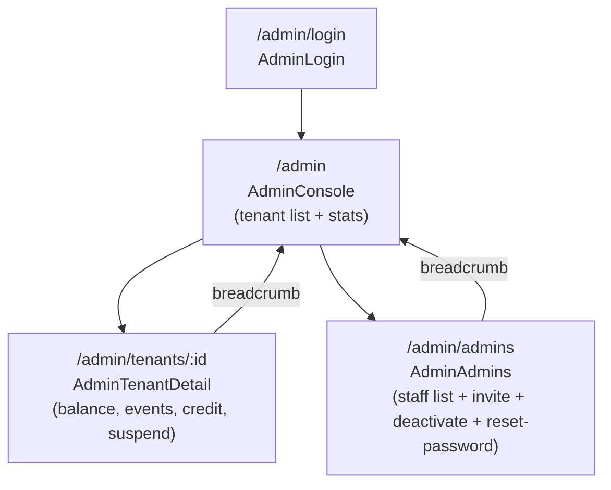
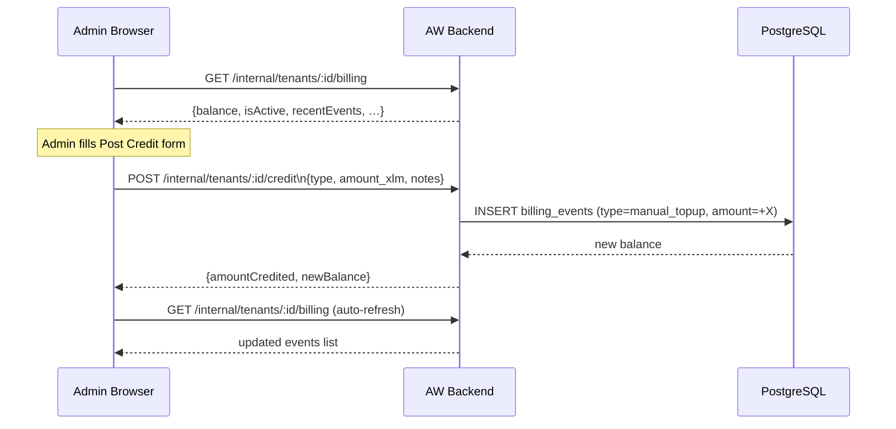

# AmmaWallet Admin Console UX Findings — 2026-07-25 Code Review

## Pages reviewed

- `/admin/login` — AdminLogin.tsx
- `/admin` — AdminConsole.tsx
- `/admin/tenants/:id` — AdminTenantDetail.tsx
- `/admin/admins` — AdminAdmins.tsx

## Fixed — 2026-07-26

| Issue | Files | Fix |
|-------|-------|-----|
| AW-ADMIN-003: Credit success message never auto-cleared | `AdminTenantDetail.tsx:117–126` | `useEffect` watches `creditResult`; `setTimeout(8000)` + `clearTimeout` cleanup |
| AW-ADMIN-004: Billing event `notes` not selected or rendered | `billing.service.ts:656`, `admin.ts:273`, `AdminTenantDetail.tsx:22,379–385` | Added `notes` to DB SELECT + Fastify schema + `BillingEvent` interface + muted subtitle JSX |
| AW-ADMIN-008: Total balance hardcoded violet, no negative warning | `AdminConsole.tsx:125` | Conditional `text-red-600` when `totalBalance < 0`, violet otherwise |
| AW-ADMIN-001: `window.confirm` for suspend/unsuspend | `AdminTenantDetail.tsx:86,161–181` | `SuspendIntent` type + `statusModal` state; `handleSuspend/Unsuspend` → sync openers; `submitStatusAction(action)` runs original fetch logic; inline dual-action modal JSX |
| AW-ADMIN-002: Tenant name absent from breadcrumb | `billing.service.ts:44,84,666`, `admin.ts:254`, `AdminTenantDetail.tsx:25,278` | `name`+`slug` added to `TenantBillingState` + SELECT + summary return; Fastify schema; `TenantBilling` interface; breadcrumb uses `tenantName ?? tenantSlug ?? Tenant #id` |
| AW-ADMIN-007: Soft vs hard suspend not selectable | `AdminTenantDetail.tsx:88–90,163–169,174,209–272` | Discriminated `SuspendIntent` union; `handleSuspend` defaults `hard`; `setSuspendType` helper; `submitStatusAction` captures type before clearing modal; radio group in modal with per-type copy + button colour |
| AW-ADMIN-005: No pagination for billing events | `billing.service.ts:648–690,693–717`, `admin.ts:278,304–367`, `AdminTenantDetail.tsx:36,96,179–200,474,509–530` | `id`-cursor pagination; `/billing` returns `eventsHasMore`+`eventsNextCursor`; new `GET /events?beforeId=` route; `loadOlderEvents` appends to `allEvents`; "Load older" button |
| AW-ADMIN-006: AdminAdmins page read-only | `AdminAdmins.tsx` | Full rewrite: Invite modal (POST /admins), Deactivate/Reactivate confirm modal (PATCH /admins/:id/deactivate|reactivate), Reset password modal (POST /admins/:id/reset-password); role-gated from `sessionStorage['aw_admin_info']` |

## Open issues

### ~~AW-ADMIN-001: `window.confirm` for suspend/unsuspend~~ — FIXED 2026-07-26
- `SuspendIntent` type + `statusModal: SuspendIntent | null` state; handlers refactored to sync openers; `submitStatusAction('suspend'|'unsuspend')` contains original fetch logic; inline `StatusConfirmModal` JSX with red/emerald confirm buttons.
- See diagram: `docs/diagrams/aw-admin-tenant-status-confirm-flow.mmd`

### ~~AW-ADMIN-002: Tenant name absent from breadcrumb~~ — FIXED 2026-07-26
- `name`+`slug` added to `TenantBillingState` interface + `getTenantBillingState()` SELECT + `getTenantBalanceSummary()` return; Fastify schema `tenantName`+`tenantSlug`; `TenantBilling` interface updated; breadcrumb: `tenantName ?? tenantSlug ?? Tenant #id`.
- Live: tenant 1 → "AmmaWallet Internal", tenant 2 → "SM Web Systems LMS".

### ~~AW-ADMIN-003: Credit `creditResult` success message persists indefinitely~~ — FIXED 2026-07-26
- **File:** `AdminTenantDetail.tsx:135`
- **Issue:** After posting a credit, the success message "+X.XXXX XLM posted. New balance: …" stays on screen until the page is navigated away or another submit occurs. Minor but could mislead if admin posts a second credit and then sees stale message.
- **Fix:** Auto-clear `creditResult` after 8–10 seconds via `setTimeout`.
- **Effort:** XS

### ~~AW-ADMIN-004: No billing event notes/description in events list~~ — FIXED 2026-07-26
- **File:** `AdminTenantDetail.tsx:339-377`
- **Issue:** `BillingEvent` has no `notes` field in the displayed interface. The backend billing events table has a `notes` column (set when posting manual_topup/bundle_purchase). This context is not surfaced to the admin.
- **Fix:** Add `notes?: string` to `BillingEvent` interface; show as subtitle in the event row.
- **Effort:** S

### ~~AW-ADMIN-005: No pagination for billing events~~ — FIXED 2026-07-26
- Cursor field: `billing_events.id` (bigserial). `/billing` fetches 21 events, returns `eventsHasMore`/`eventsNextCursor`. New `GET /events?beforeId=<id>` returns `{ events, hasMore, nextCursor }`. Frontend: `allEvents` state accumulates pages; "Load older" button appends without touching existing rows; error path preserves loaded rows.
- 4 new tests in `admin-billing.test.ts` (218/218 total pass).
- See diagram: `docs/diagrams/aw-admin-billing-events-pagination-flow.mmd`

### ~~AW-ADMIN-006: AdminAdmins page — no create/deactivate/reset-password actions~~ — FIXED 2026-07-26
- `AdminAdmins.tsx` fully rewritten. Three inline modals: Invite (POST /admins, name+email+role+password), Confirm deactivate/reactivate (PATCH /admins/:id/deactivate|reactivate), Reset password (POST /admins/:id/reset-password, super_admin only).
- Role gating from `sessionStorage['aw_admin_info']`: super_admin sees all three actions on all non-self rows; platform_admin sees Deactivate/Reactivate on non-super_admin rows only; self rows always read-only.
- 5-second `resetSuccess` chip in row after successful password reset.
- See diagram: `docs/diagrams/aw-admin-admins-lifecycle-flow.mmd`

### ~~AW-ADMIN-007: Soft vs hard suspend not selectable~~ — FIXED 2026-07-26
- `SuspendIntent` widened to discriminated union `{ action:'suspend'; suspendType:'hard'|'soft' } | { action:'unsuspend' }`. `handleSuspend` opens modal with `suspendType:'hard'` default. `setSuspendType` helper updates in-place. `submitStatusAction` captures type before `setStatusModal(null)` and passes it as `{ type: suspendType }` in the request body. Modal shows a labelled radio group (hard=red, soft=amber) with per-type title, body copy, and confirm button colour. Unsuspend flow unchanged.
- See diagram: `docs/diagrams/aw-admin-tenant-suspend-type-flow.mmd`

### ~~AW-ADMIN-008: AdminConsole total balance could be negative — no warning~~ — FIXED 2026-07-26
- **File:** `AdminConsole.tsx:125`
- Conditional `text-red-600` when `totalBalance < 0`; violet otherwise. No amber threshold.
- See spec: `docs/superpowers/specs/2026-07-26-quick-wins-aw-lms-008-005.md`

## Mermaid: Admin console navigation

## Mermaid: Credit & billing flow

