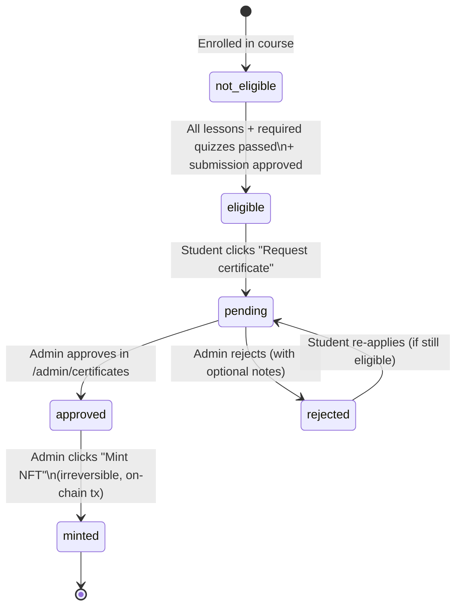
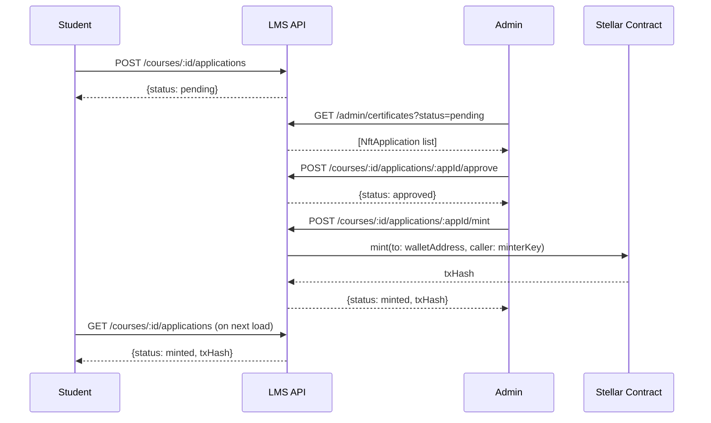

# LMS UX Findings — 2026-07-25 Code Review

## Fixed in this session

| Issue | File | Fix |
|-------|------|-----|
| `console.log('NFT Badges:', nfts)` leaks wallet addresses to browser devtools | `StudentDashboard.tsx:123` | Removed |
| `CERT_STATE_MSGS.approved.next` said "shortly" implying auto-mint | `StudentDashboard.tsx:79` | Reworded to "Your instructor will mint…" |
| `exportApplicationsCSV` toast: "Sponsor export downloaded" (wrong copy) | `AdminCertificates.tsx:57` | "Applications CSV exported" |
| `exportIssuedCSV` toast: "Sponsor export downloaded" (wrong copy) | `AdminCertificates.tsx:82` | "Issued NFTs CSV exported" |
| LMS-UX-001: NFT Badges grid broken (`m:` typo + useless outer wrapper) | `StudentDashboard.tsx:507–518` | Removed outer `
` grid; moved classes to `<ul>`; fixed `m:` → `sm:`; `col-span-full` + hover cleanup on empty-state `<li>` |
| LMS-UX-002: `getMyCredentials()` error silently hid certificates section | `StudentDashboard.tsx:99,156–168,530` | Added `lmsCredentialsError` state; catch sets flag + `null`; render shows amber `AlertCircle` banner instead of hiding section |
| LMS-UX-003: Certificate eligibility section has no loading skeleton | `StudentDashboard.tsx`, `PageSkeletons.tsx` | `coursesLoading` state + `CertEligibilitySkeleton` component; `.finally()` on fetchCourses chain |
| LMS-UX-004: Mint action used `window.confirm` | `AdminCertificates.tsx:143,197,201,235` | Inline `MintConfirmModal` — `mintModal` state + `submitMint` callback; `X` icon added to imports |
| LMS-UX-005: Filter chip counts misleading when status filter active | `AdminCertificates.tsx:264,545` | Guard counts with `statusFilter === 'all'` / `mintStatusFilter === 'all'` — both panels fixed |

## Open issues — lower priority

### ~~LMS-UX-001: NFT Badges section layout~~ — FIXED 2026-07-26
- Outer `
` grid wrapper removed; responsive classes moved to `<ul>`; `m:` → `sm:` typo fixed; empty-state `<li>` gets `col-span-full`, hover classes removed.
- See spec: `docs/superpowers/specs/2026-07-26-lms-ux-001-nft-badges-grid-design.md`

### ~~LMS-UX-002: LMS Certificates section shows nothing on fetch error~~ — FIXED 2026-07-26
- `lmsCredentialsError` boolean state added; fetch catch sets `true` + leaves `lmsCredentials=null`; JSX renders amber banner when flag is set.
- See spec: `docs/superpowers/specs/2026-07-26-lms-ux-002-credentials-error-design.md`
- **File:** `StudentDashboard.tsx:155-163` (original location)
- **Issue:** If `getMyCredentials()` rejects, the catch silently sets `lmsCredentials = []`. The section is only shown when `lmsCredentials !== null && lmsCredentials.length > 0`, so a network error looks identical to "no credentials". Students who actually have credentials might see nothing.
- **Fix:** Track an error state for this fetch; show a small error banner when fetch fails.
- **Effort:** S

### ~~LMS-UX-003: Certificate eligibility section has no loading skeleton~~ — FIXED 2026-07-26
- `coursesLoading` state added; `CertEligibilitySkeleton` exported from `PageSkeletons.tsx`; `.finally()` on `fetchCourses` chain; render branch changed to `coursesLoading ? <CertEligibilitySkeleton /> : courses.length > 0 ? <section> : null`.

### ~~LMS-UX-004: `handleMint` used `window.confirm`~~ — FIXED 2026-07-26
- `mintModal: NftApplication | null` state added; `handleMint` → sync opener; `submitMint` → closes modal + runs existing async mint; inline `MintConfirmModal` JSX (backdrop + panel + footer) added adjacent to rejection modal.
- See diagram: `docs/diagrams/lms-admin-certificates-mint-confirm-flow.mmd`

### ~~LMS-UX-005: Status filter chip counts are per-loaded-set, not global~~ — FIXED 2026-07-26
- **Files:** `AdminCertificates.tsx:264` (`ApplicationsPanel`), `AdminCertificates.tsx:545` (`IssuedPanel`)
- Counts hidden on all chips when `statusFilter` / `mintStatusFilter !== 'all'`. Superseded static badge unchanged.
- See spec: `docs/superpowers/specs/2026-07-26-quick-wins-aw-lms-008-005.md` (in AW repo)

### LMS-UX-006: No way to see full billing history (pagination missing)
- **File:** `AdminTenantDetail.tsx` / backend billing endpoint
- **Issue:** `recentEvents` is capped server-side. There is no pagination or "Load more" for older events.
- **Impact:** Auditing month-old charges is impossible from the UI.
- **Fix:** Add cursor-based pagination to `GET /internal/tenants/:id/billing` and a "Load more" button on the frontend.
- **Effort:** M

### LMS-UX-007: Tenant name missing from AdminTenantDetail breadcrumb
- **File:** `AdminTenantDetail.tsx:219`
- **Issue:** Breadcrumb shows "Tenant #2" but not the tenant's slug or name. The billing API response (`TenantBilling`) doesn't include name/slug.
- **Fix:** Add `tenantName` and `tenantSlug` to the `GET /internal/tenants/:id/billing` response; show name in breadcrumb.
- **Effort:** S

### LMS-UX-008: AdminAdmins page is read-only — no create/deactivate actions
- **File:** `AdminAdmins.tsx`
- **Issue:** Backend supports `POST /admins`, `PATCH /admins/:id/deactivate`, `PATCH /admins/:id/reactivate`, and `POST /admins/:id/reset-password` but the frontend only lists admin accounts.
- **Impact:** Super admins must use curl/Postman to manage staff accounts.
- **Fix:** Add "Invite admin" button (POST), deactivate/reactivate toggle per row, and a reset-password action. Super-admin-only gate client-side by checking `adminInfo.role`.
- **Effort:** L

## Mermaid: Certificate journey (student perspective)

## Mermaid: Admin cert workflow

