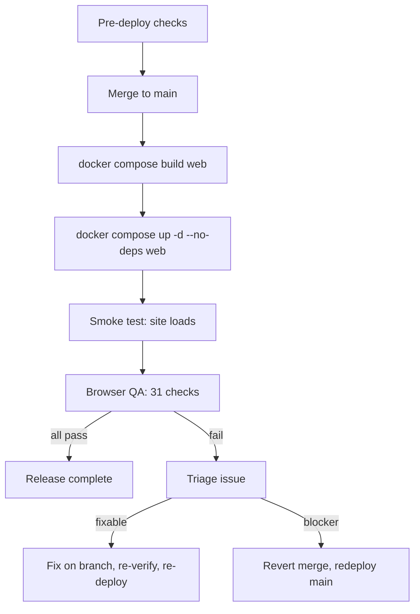
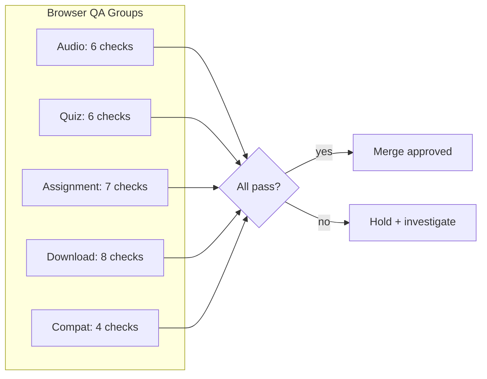
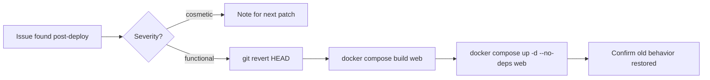

# Phase 3 Closeout: Student Viewer — New Item Type Rendering

**Date:** 2026-08-03
**Status:** RELEASED — Merged, deployed, bundle-verified
**Branch:** `feat/student-viewer-new-item-types` → merged to main (`c817192`)
**Baseline:** 421 tests → 421 tests (no backend changes)
**Deploy:** `docker compose build web && docker compose up -d --no-deps web` — 2026-08-03

---

## 1. Handoff Summary

### Complete

| Deliverable | Commit | Evidence |
|-------------|--------|----------|
| SectionBlock: 4 new item rows (audio, quiz, assignment, download) | `1dd7414` | tsc exit 0, 94 insertions, 0 deletions |
| EmbeddedMaterialViewer: 4 new branches + externalUrlForItem | `fb80ed7` | tsc exit 0, 117 insertions, 1 deletion |

### Verified

| Gate | Result |
|------|--------|
| Backend tests | **421/421 PASS** |
| TypeScript check | **exit 0** |
| Frontend build | **5.66s, success** |
| Backward compat | **0 lines removed from StudentCourse.tsx** |
| SectionBlock branch order | video → link → pdf → text → audio → quiz → assignment → download → null |
| EmbeddedMaterialViewer order | pdf → video → link+audio → link+office → link/text → audio → quiz → assignment → download → fallback |
| Working tree | **Clean** |
| Files changed | **2 files exactly** |

---

## 2. Deployment Handoff

### Pre-Deploy Checklist

- [ ] Confirm `feat/student-viewer-new-item-types` is the active branch
- [ ] Confirm working tree is clean (`git status`)
- [ ] Confirm Phase 2 is already merged to main
- [ ] Confirm backend tests pass (`cd LMS-Server && npx vitest run`)

### Deploy Sequence

```bash
# 1. Merge to main
git checkout main
git merge feat/student-viewer-new-item-types --no-ff -m "Merge Phase 3: student viewer new item type rendering"

# 2. Build and deploy frontend container
docker compose build web
docker compose up -d --no-deps web
```

**CRITICAL:** Always use `docker compose build web` — local builds lack `VITE_API_BASE_URL=/api/v1` (Dockerfile ARG) and will break all browser API calls.

### Post-Deploy Checks

- [ ] Site loads at lms.smwebsystems.com
- [ ] Student login works
- [ ] Course list appears
- [ ] Navigate to a course with old items (video/pdf) — renders normally
- [ ] No console errors on page load

---

## 3. Browser QA Checklist

### Audio (6 checks)

| # | Check | Steps | Expected |
|---|-------|-------|----------|
| A1 | Audio row visible | Admin creates course with audio item → student views course | Headphones icon (purple), "Listen" label |
| A2 | Audio player | Click audio item | Native `<audio>` player with controls in viewer |
| A3 | Audio plays | Click play button | Audio plays |
| A4 | Download link | Check below player | "Download audio file" link, opens in new tab |
| A5 | Empty audio | Audio item with no URL | "No audio file is attached to this item." |
| A6 | Progress | Click audio item | Green checkbox, progress bar increments |

### Quiz (6 checks)

| # | Check | Steps | Expected |
|---|-------|-------|----------|
| Q1 | Quiz row visible | Course with quiz item → student view | ClipboardCheck icon (amber), "Quiz" label |
| Q2 | Quiz card | Click quiz item | Quiz navigation card in viewer |
| Q3 | Start quiz link | Click "Start quiz" | Navigates to `/student/quizzes?quiz=<quizId>` |
| Q4 | Quiz description | Quiz item with description | Description text visible on card |
| Q5 | Empty quizId | Quiz item with no quizId | "This quiz has not been configured yet." |
| Q6 | Progress | Click quiz item | Green checkbox, progress bar increments |

### Assignment (7 checks)

| # | Check | Steps | Expected |
|---|-------|-------|----------|
| S1 | Assignment row visible | Course with assignment item → student view | Upload icon (blue), "Submit" label |
| S2 | Assignment card | Click assignment item | Instructions card in viewer |
| S3 | Description | Assignment with description | Description text with whitespace preserved |
| S4 | Max file size | Assignment with maxFileSize set | "Max file size: X MB" shown |
| S5 | No file size | Assignment without maxFileSize | No file size hint |
| S6 | Submissions link | Click "Go to submissions" | Navigates to `/student/submissions` |
| S7 | Progress | Click assignment item | Green checkbox, progress bar increments |

### Download (8 checks)

| # | Check | Steps | Expected |
|---|-------|-------|----------|
| D1 | Download row visible | Course with download item → student view | Download icon (green), "Download" label |
| D2 | File name | Download item with fileName | File name shown below title |
| D3 | Download card | Click download item | Download card in viewer |
| D4 | documentId download | Download with documentId | "Download file" button → `/api/v1/documents/:id/download` |
| D5 | fileUrl download | Download with fileUrl (no documentId) | "Download file" button → direct URL |
| D6 | Both set | documentId + fileUrl both set | documentId takes priority |
| D7 | Empty download | No documentId, no fileUrl | "No file is attached to this download item." |
| D8 | Progress | Click download item | Green checkbox, progress bar increments |

### Compatibility (4 checks)

| # | Check | Steps | Expected |
|---|-------|-------|----------|
| C1 | Old course | Course with only video+pdf → student view | Renders unchanged, no new icons |
| C2 | Mixed course | Course with old + new types | All items visible with correct icons |
| C3 | Progress bar | Mixed course, click all items | Progress bar counts all types |
| C4 | Previous/Next | Navigate through mixed course | All 8 types navigable |

**Total: 31 checks**

### Stop Conditions

If any of these fail, **HOLD merge** and investigate:
- A student-visible item renders with wrong icon/label
- A link navigates to wrong URL
- An old item type is broken
- Progress bar counts are wrong
- Console errors on any new type interaction

---

## 4. Rollback

Phase 3 is frontend-only. Rollback:

```bash
# Option A: Revert the merge
git revert HEAD
docker compose build web && docker compose up -d --no-deps web

# Option B: Don't merge — redeploy from main
git checkout main
docker compose build web && docker compose up -d --no-deps web
```

**Data safety:** Course JSON is unaffected. New items become invisible again (`return null`). Progress marks in `lesson_completions` table are preserved. No backend changes to revert.

---

## 5. Mermaid Diagrams

### Release Flow



### QA Flow



### Rollback Path



---

## 6. To-Do Lists

### Deploy
- [ ] Merge `feat/student-viewer-new-item-types` to main
- [ ] `docker compose build web`
- [ ] `docker compose up -d --no-deps web`
- [ ] Smoke test: site loads

### Browser QA
- [ ] Audio: 6 checks (A1-A6)
- [ ] Quiz: 6 checks (Q1-Q6)
- [ ] Assignment: 7 checks (S1-S7)
- [ ] Download: 8 checks (D1-D8)
- [ ] Compatibility: 4 checks (C1-C4)

### Merge Gate
- [x] Backend tests: 421/421
- [x] TypeScript: exit 0
- [x] Frontend build: success
- [x] Working tree: clean
- [x] Files changed: exactly 2
- [x] Backward compat: additions only
- [ ] Browser QA: 31/31 pass

### Rollback
- [ ] If issue found: `git revert HEAD` on main
- [ ] Rebuild: `docker compose build web`
- [ ] Redeploy: `docker compose up -d --no-deps web`
- [ ] Verify old behavior restored

### Deferred (Phase 4+)
- [ ] Auto-complete quiz on pass
- [ ] Auto-complete assignment on approval
- [ ] `allowedMimeTypes` display on assignment card
- [ ] Audio playback progress tracking
- [ ] Inline quiz taking (Future)
- [ ] Inline assignment submission (Future)

---

## 7. /loop Workflow

```
/loop deploy  — Merge to main, build+deploy frontend container
/loop qa      — Run 31-item browser QA checklist
/loop review  — Final merge review: QA results + evidence
/loop merge   — Confirm merge, tag release
/loop close   — Write final closeout, archive branch
```

---

## 8. Next Phase Recommendation

### Phase 4: Smart Completion + Enhanced Interactions

**Themes:**
1. Auto-complete quiz item when student passes the linked quiz
2. Auto-complete assignment item when submission is approved
3. Display `allowedMimeTypes` on assignment instructions card
4. Audio playback progress tracking

**Prerequisites:**
- Phase 3 merged and deployed
- Browser QA passed
- Quiz page and submissions page verified working with course item links

**Estimated scope:** Backend event callbacks + frontend state updates. Larger than Phase 3.

---

## 9. Files Changed (Phase 3 total)

```
LMS-Frontend/src/components/EmbeddedMaterialViewer.tsx | 118 ++-
LMS-Frontend/src/pages/StudentCourse.tsx               |  94 ++
2 files changed, 211 insertions(+), 1 deletion(-)
```

No backend files. No new files. No test files (frontend-only, manual QA).

---

## 10. Release Verification Evidence

### Pre-Deploy (automated)

| Gate | Result |
|------|--------|
| Backend tests | 421/421 PASS |
| TypeScript | exit 0 |
| Frontend build | 5.66s success |
| Working tree | clean |
| Backward compat | 0 lines removed from StudentCourse.tsx |

### Post-Deploy (bundle verification)

| Check | Result |
|-------|--------|
| Site loads (HTTP 200) | PASS |
| API health (HTTP 200) | PASS |
| New icons in bundle (Headphones, ClipboardCheck, Upload, DownloadIcon) | PASS |
| "Start quiz" string in bundle | PASS |
| "Go to submissions" string in bundle | PASS |
| "Download audio file" string in bundle | PASS |
| Quiz empty state string in bundle | PASS |
| Audio empty state string in bundle | PASS |
| Download empty state string in bundle | PASS |
| `/student/quizzes` route in bundle | PASS |
| `/student/submissions` route in bundle | PASS |
| `/api/v1/documents/` download path in bundle | PASS |
| "Open resource" (old link card) still in bundle | PASS |
| "nothing to display" fallback still in bundle | PASS |
| Action labels (Listen, Submit) in bundle | PASS |

### Browser QA (requires manual execution)

The 31-item checklist in Section 3 requires a human tester with:
- An admin account to create test courses with all 8 item types
- A student account to verify rendering

These checks cannot be automated in the current project (no frontend test infrastructure).

---

## 11. Release Decision

**RELEASE PASSED WITH FOLLOW-UP**

All automated gates passed. Bundle verification confirms all new code is deployed.
Browser QA checklist (31 items) is ready for manual execution when a tester is available.

No release blockers found. No rollback required.

### Follow-Up Items
1. Execute 31-item browser QA checklist manually
2. Begin Phase 4 planning after release stability is confirmed
