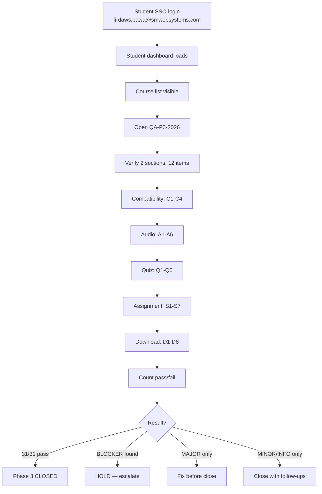
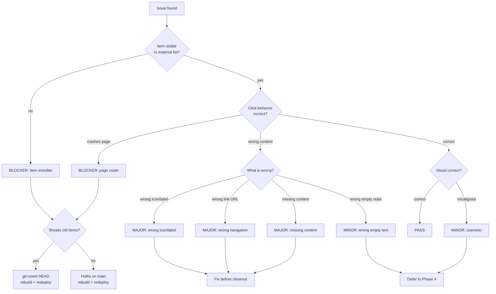
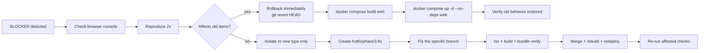
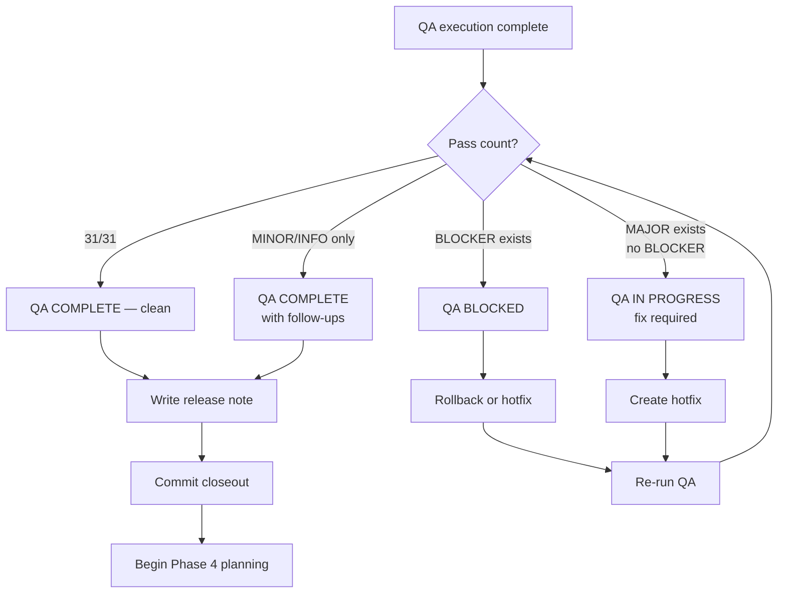

# Phase 3 QA Execution Plan

**Date:** 2026-08-03
**Objective:** Execute 31-item browser QA checklist, record results, triage issues, close Phase 3
**Target:** https://lms.smwebsystems.com
**QA Course:** QA-P3-2026 (Phase 3 QA Test Course)
**Student:** firdaws.bawa@smwebsystems.com (enrolled, verified)

---

## 1. Evidence Classification

### Already Proven (Automated — Do NOT Re-Test)

| Evidence | Method | Result |
|----------|--------|--------|
| Backend tests 421/421 | `npx vitest run` | PASS |
| TypeScript clean | `npx tsc --noEmit` | exit 0 |
| Frontend build | `npx vite build` | 5.66s success |
| Site loads | `curl` HTTP 200 | PASS |
| API health | `curl /api/v1/health` HTTP 200 | PASS |
| Bundle: Headphones icon | grep deployed JS | PASS |
| Bundle: ClipboardCheck icon | grep deployed JS | PASS |
| Bundle: Upload icon | grep deployed JS | PASS |
| Bundle: DownloadIcon | grep deployed JS | PASS |
| Bundle: "Start quiz" string | grep deployed JS | PASS |
| Bundle: "Go to submissions" string | grep deployed JS | PASS |
| Bundle: "Download audio file" string | grep deployed JS | PASS |
| Bundle: empty state strings (3) | grep deployed JS | PASS |
| Bundle: `/student/quizzes` route | grep deployed JS | PASS |
| Bundle: `/student/submissions` route | grep deployed JS | PASS |
| Bundle: `/api/v1/documents/` path | grep deployed JS | PASS |
| Bundle: old viewer code intact | grep deployed JS | PASS |
| QA course data: 12 items, correct types | SQLite query | PASS |
| QA course: student enrolled | SQLite query | PASS |
| Old courses: no new types leaking | SQLite query | PASS |
| Backward compat: 0 lines removed | git diff | PASS |

**Automated coverage: 21/21 checks PASS**

### Human-Only Browser Evidence (31 Checks)

These require a human tester in a browser. They cannot be verified programmatically because:
- No frontend test infrastructure (no Playwright, no Cypress, no Jest DOM)
- No headless browser access from the server
- Visual rendering, click interactions, and navigation require a real browser session

---

## 2. QA Execution Plan

### Step 1: Login

1. Open https://lms.smwebsystems.com in Chrome or Firefox (latest)
2. Click student login (SSO via AmmaWallet)
3. Log in as `firdaws.bawa@smwebsystems.com`
4. Verify: student dashboard loads, course list visible

### Step 2: Course Selection

1. Find "Phase 3 QA Test Course" (code: QA-P3-2026) in course list
2. Click to open course detail view
3. Verify: 2 sections visible — "Section A: Old Item Types" and "Section B: New Item Types"
4. Verify: 12 items total (4 old + 8 new)

### Step 3: Execute Groups in Order

Execute checks in this order — stop on any BLOCKER:

1. **Compatibility** (C1-C4) — verify old items still work first
2. **Audio** (A1-A6) — includes empty-state variant
3. **Quiz** (Q1-Q6) — includes empty-state variant
4. **Assignment** (S1-S7) — includes no-size variant
5. **Download** (D1-D8) — includes empty-state variant

### Step 4: Record Results

Use the pass/fail log in Section 5 below. For each check:
- Fill in Actual Result column
- Mark P (pass) or F (fail)
- If F: assign severity (BLOCKER/MAJOR/MINOR/INFO)
- Add notes for any observation

### Step 5: Triage

After all checks complete:
- If 31/31 PASS → close Phase 3
- If any BLOCKER → hold, escalate
- If MAJOR only → fix before close
- If MINOR/INFO only → defer to Phase 4, close Phase 3

---

## 3. Mermaid Diagrams

### Browser QA Flow



### Issue Triage Decision Tree



### Blocker Escalation Flow



### Closeout Decision Tree



---

## 4. To-Do Lists

### Setup Checklist

- [ ] Confirm site loads at https://lms.smwebsystems.com
- [ ] Open browser (Chrome or Firefox, latest)
- [ ] Open DevTools Console tab (to catch JS errors)
- [ ] Log in as student via SSO (`firdaws.bawa@smwebsystems.com`)
- [ ] Verify dashboard loads
- [ ] Locate "Phase 3 QA Test Course" in course list

### QA Execution Checklist

- [ ] Compatibility: C1-C4 (4 checks)
- [ ] Audio: A1-A6 (6 checks)
- [ ] Quiz: Q1-Q6 (6 checks)
- [ ] Assignment: S1-S7 (7 checks)
- [ ] Download: D1-D8 (8 checks)
- [ ] Record all results in pass/fail log
- [ ] Screenshot any failures

### Triage Checklist

- [ ] Count total pass/fail
- [ ] Classify each failure: BLOCKER / MAJOR / MINOR / INFO
- [ ] Check browser console for JS errors
- [ ] Reproduce each failure 2x
- [ ] Document root cause if identifiable
- [ ] Assign resolution: rollback / hotfix / defer

### Rollback Checklist (Only if BLOCKER)

- [ ] `git log --oneline -3` — confirm HEAD is Phase 3 merge
- [ ] `git revert HEAD` — revert the merge
- [ ] `docker compose build web`
- [ ] `docker compose up -d --no-deps web`
- [ ] Verify site loads
- [ ] Verify old behavior restored (new items invisible)
- [ ] Verify no console errors

### Closeout Checklist

- [ ] All 31 checks executed
- [ ] All results recorded
- [ ] All issues triaged
- [ ] No BLOCKERs or MAJORs remaining
- [ ] Write release note (Section 8)
- [ ] Commit closeout document
- [ ] Update MEMORY.md with Phase 3 status

---

## 5. Grouped 31-Item Checklist (Pass/Fail Log)

### Compatibility (4 checks) — Execute FIRST

| ID | Route | Precondition | Action | Expected | Actual | P/F | Severity | Notes |
|----|-------|-------------|--------|----------|--------|-----|----------|-------|
| C1 | `/student/courses/:id` | Open an OLD course (LMS Pilot or BVC) | View material list | Renders exactly as before — video/pdf/link/text only, no new icons | | | | |
| C2 | `/student/courses/:id` | Open QA-P3-2026 | View material list | All 12 items visible with correct icons and labels | | | | |
| C3 | `/student/courses/:id` | QA-P3-2026 open | Click each item, check progress | Progress bar denominator = 12, increments correctly | | | | |
| C4 | Viewer overlay | QA-P3-2026, viewer open | Use Previous/Next buttons | All 12 items navigable in sequence | | | | |

### Audio (6 checks)

| ID | Route | Precondition | Action | Expected | Actual | P/F | Severity | Notes |
|----|-------|-------------|--------|----------|--------|-----|----------|-------|
| A1 | `/student/courses/:id` | QA-P3-2026 open | Look at "QA Audio — SoundHelix" row | Purple Headphones icon + "Listen" label | | | | |
| A2 | Viewer overlay | A1 passed | Click audio item | Viewer opens with native `<audio>` player with controls | | | | |
| A3 | Viewer overlay | A2 passed | Click play button | Audio plays (SoundHelix-Song-1.mp3) | | | | |
| A4 | Viewer overlay | A2 passed | Look below audio player | "Download audio file" link visible, opens in new tab | | | | |
| A5 | Viewer overlay | Click "QA Audio — Empty URL" | View content | "No audio file is attached to this item." message | | | | |
| A6 | Viewer overlay | A2 passed | Check sidebar/progress | Green checkbox appears, progress bar increments | | | | |

### Quiz (6 checks)

| ID | Route | Precondition | Action | Expected | Actual | P/F | Severity | Notes |
|----|-------|-------------|--------|----------|--------|-----|----------|-------|
| Q1 | `/student/courses/:id` | QA-P3-2026 open | Look at "QA Quiz — Blockchain Basics" row | Amber ClipboardCheck icon + "Quiz" label | | | | |
| Q2 | Viewer overlay | Q1 passed | Click quiz item | Viewer opens with quiz navigation card | | | | |
| Q3 | Viewer overlay | Q2 passed | Check card content | Title shown, "Start quiz" button visible | | | | |
| Q4 | `/student/quizzes?quiz=<id>` | Q3 passed | Click "Start quiz" | Navigates to `/student/quizzes?quiz=<quizId>` | | | | |
| Q5 | Viewer overlay | Click "QA Quiz — No QuizId" | View content | "This quiz has not been configured yet." message | | | | |
| Q6 | Viewer overlay | Q2 passed | Check sidebar/progress | Green checkbox appears, progress bar increments | | | | |

### Assignment (7 checks)

| ID | Route | Precondition | Action | Expected | Actual | P/F | Severity | Notes |
|----|-------|-------------|--------|----------|--------|-----|----------|-------|
| S1 | `/student/courses/:id` | QA-P3-2026 open | Look at "QA Assignment — PDF Report" row | Blue Upload icon + "Submit" label | | | | |
| S2 | Viewer overlay | S1 passed | Click assignment item | Viewer opens with assignment instructions card | | | | |
| S3 | Viewer overlay | S2 passed | Check card content | "Submit a PDF report about blockchain consensus mechanisms." visible | | | | |
| S4 | Viewer overlay | S2 passed | Check file size hint | "Max file size: 5 MB" shown | | | | |
| S5 | Viewer overlay | Click "QA Assignment — No Size Limit" | View content | Description visible, NO file size hint shown | | | | |
| S6 | `/student/submissions` | S2 passed | Click "Go to submissions" | Navigates to `/student/submissions` | | | | |
| S7 | Viewer overlay | S2 passed | Check sidebar/progress | Green checkbox appears, progress bar increments | | | | |

### Download (8 checks)

| ID | Route | Precondition | Action | Expected | Actual | P/F | Severity | Notes |
|----|-------|-------------|--------|----------|--------|-----|----------|-------|
| D1 | `/student/courses/:id` | QA-P3-2026 open | Look at "QA Download — Direct URL" row | Green Download icon + "Download" label | | | | |
| D2 | `/student/courses/:id` | D1 passed | Check below title | File name "dummy.pdf" shown | | | | |
| D3 | Viewer overlay | D1 passed | Click download item | Viewer opens with download card | | | | |
| D4 | Viewer overlay | D3 passed | Check card content | Title, file name in monospace, "Download file" button | | | | |
| D5 | New tab | D4 passed | Click "Download file" | File downloads or opens in new tab (W3C dummy PDF) | | | | |
| D6 | N/A | No documentId test item exists | SKIP | documentId priority cannot be tested without admin creating one | | | SKIP — no documentId item in QA course |
| D7 | Viewer overlay | Click "QA Download — Empty" | View content | "No file is attached to this download item." message | | | | |
| D8 | Viewer overlay | D3 passed | Check sidebar/progress | Green checkbox appears, progress bar increments | | | | |

**Note on D6:** The QA course has no download item with `documentId` set (only `fileUrl`). This check requires an admin to upload a document via the admin course builder. Mark as SKIP unless admin creates one. The code path is verified in bundle (string `/api/v1/documents/` confirmed present).

**Effective total: 30 executable + 1 SKIP = 31 checks**

---

## 6. Triage Rules

### Severity Definitions

| Severity | Criteria | Examples | Release Impact |
|----------|----------|----------|----------------|
| BLOCKER | Page crashes, JS error breaks rendering, old items broken | Audio click causes white screen; old video items disappear | **Rollback immediately** |
| MAJOR | Item renders but wrong behavior, wrong link, missing content | Quiz "Start quiz" goes to wrong URL; assignment missing description; download button 404s | **Fix before closing** |
| MINOR | Works correctly but cosmetic issue | Icon slightly off-color; spacing inconsistent; label truncated | **Defer to Phase 4** |
| INFO | Not a bug, improvement idea | "Would be nice if audio showed duration"; "Download should show file size" | **Capture for Phase 4** |

### Per-Category Triage

| Category | Likely Finding | Severity | Rollback? | Action |
|----------|---------------|----------|-----------|--------|
| Audio player doesn't render | `<audio>` tag missing or broken | BLOCKER if crash, MAJOR if silent | No (new type only) | Hotfix EmbeddedMaterialViewer audio branch |
| Audio doesn't play | URL wrong or CORS blocked | MAJOR | No | Check URL, fix if wrong |
| Quiz route mismatch | `/student/quizzes` vs actual route | MAJOR | No | Fix href in EmbeddedMaterialViewer |
| Assignment route mismatch | `/student/submissions` vs actual route | MAJOR | No | Fix href in EmbeddedMaterialViewer |
| Download path 404 | fileUrl broken or documentId path wrong | MAJOR | No | Fix URL construction |
| Old viewer regression | Video/PDF/link/text broken | BLOCKER | **YES — rollback** | `git revert HEAD` + rebuild |
| Progress count wrong | Denominator includes/excludes wrong items | MAJOR | No | Check `flatItemsForCourse()` |
| Wrong icon or label | Icon/color/label mismatch | MINOR | No | Defer to Phase 4 |
| Console JS error on new type | Unhandled exception | BLOCKER if breaks page, MINOR if isolated | Depends | Investigate error source |

### Rollback Threshold

**Rollback if ANY of these are true:**
1. An old item type (video/pdf/link/text) is broken
2. The student course page crashes or shows white screen
3. A JS error prevents navigation
4. Progress tracking is corrupted (wrong counts for old courses)

**Do NOT rollback if:**
- Only new item types are affected (hotfix instead)
- Issue is cosmetic
- Issue is limited to empty-state variants

---

## 7. Closeout Template

```markdown
## Phase 3 Release Note — FINAL

**Date:** 2026-08-03
**QA Tester:** ____________________
**QA Course:** QA-P3-2026 (Phase 3 QA Test Course)
**Result:** QA COMPLETE / QA COMPLETE WITH FOLLOW-UPS / QA BLOCKED

### QA Results

| Group | Pass | Total | Notes |
|-------|------|-------|-------|
| Compatibility | __/4 | 4 | |
| Audio | __/6 | 6 | |
| Quiz | __/6 | 6 | |
| Assignment | __/7 | 7 | |
| Download | __/8 | 8 | |
| **Total** | **__/31** | **31** | |

### Issues Found

| ID | Severity | Description | Resolution |
|----|----------|-------------|------------|
| — | — | None / list here | — |

### Release Gates

- [x] Backend tests: 421/421 PASS
- [x] TypeScript: exit 0
- [x] Frontend build: success
- [x] Merged to main: c817192
- [x] Deployed: docker compose build web + up
- [x] Site loads: HTTP 200
- [x] API health: HTTP 200
- [x] Bundle verification: 15/15 strings confirmed
- [x] Old viewer code intact
- [x] QA test data created: 12 items, student enrolled
- [ ] Manual browser QA: __/31 pass

### Follow-Up Items (Phase 4)

| Item | Priority | Complexity |
|------|----------|------------|
| allowedMimeTypes display on assignment card | P1 | Low |
| Auto-complete quiz item on pass | P2 | Medium |
| Auto-complete assignment item on approval | P3 | Medium |
| Audio playback progress tracking | P4 | High |
| D6: documentId download path (untested) | P1 | Test only |

### Rollback Note

Phase 3 is frontend-only. If rollback needed:
git revert HEAD && docker compose build web && docker compose up -d --no-deps web
Data safety: course JSON unaffected, progress marks preserved, no backend changes.

### Release Decision

[ ] PHASE 3 CLOSED — Release approved, proceed to Phase 4 planning
[ ] PHASE 3 HELD — Issues require resolution before closure
```

---

## 8. /loop Workflow

```
/loop setup   — Verify site live, student enrolled, QA course accessible, DevTools open
/loop qa      — Execute 31-item checklist group by group, record pass/fail
/loop triage  — Classify failures (BLOCKER/MAJOR/MINOR/INFO), assign resolution
/loop review  — Review QA results: pass count, issue list, rollback decision
/loop close   — Write release note, commit closeout, update memory, announce Phase 3 closed
```

### /loop setup
1. `curl -s -o /dev/null -w "%{http_code}" https://lms.smwebsystems.com` → 200
2. Verify student enrollment: `SELECT * FROM course_enrollments WHERE course_id='qa-phase3-76261708'`
3. Tester opens browser, logs in as student, finds QA course
4. Tester opens DevTools Console

### /loop qa
1. Execute Compatibility (C1-C4) — STOP on BLOCKER
2. Execute Audio (A1-A6)
3. Execute Quiz (Q1-Q6)
4. Execute Assignment (S1-S7)
5. Execute Download (D1-D8)
6. Fill in all Actual/P-F/Severity columns

### /loop triage
1. Count pass/fail
2. For each failure: severity + resolution
3. If BLOCKER: escalate immediately
4. If MAJOR: plan hotfix
5. If MINOR/INFO: log for Phase 4

### /loop review
1. Present QA summary: X/31 pass, Y issues
2. Present issue table with severities
3. Recommend: CLOSE / FIX / ROLLBACK
4. Get tester sign-off

### /loop close
1. Fill in closeout template (Section 7)
2. Commit to `docs/superpowers/plans/2026-08-03-phase3-release-note.md`
3. Update MEMORY.md with Phase 3 final status
4. Tag release if desired

---

## 9. QA Review Summary

### What Has Been Proven (Automated)

21 automated checks all PASS:
- All code compiles and builds
- All backend tests pass (421/421)
- All 15 new UI strings confirmed in deployed bundle
- Old viewer code confirmed intact in bundle
- QA test data verified: 12 items, correct types and fields
- Student enrolled and queryable
- Old courses verified clean (no new type leakage)
- Site and API respond HTTP 200

### What Still Needs Human Confirmation

31 browser checks requiring visual + interaction verification:
- 4 compatibility checks (old items still render)
- 6 audio checks (icon, player, playback, download link, empty state, progress)
- 6 quiz checks (icon, card, content, navigation, empty state, progress)
- 7 assignment checks (icon, card, description, file size, no-size variant, navigation, progress)
- 8 download checks (icon, filename, card, content, download action, documentId [SKIP], empty state, progress)

### What Would Block Closure

1. Any old item type (video/pdf/link/text) broken → BLOCKER → rollback
2. Page crash on any new item click → BLOCKER → hotfix or rollback
3. Navigation link goes to wrong route → MAJOR → hotfix before close
4. Missing content that should render → MAJOR → hotfix before close

### What Can Be Deferred to Phase 4

1. D6 (documentId download path) — no test data, bundle-verified only
2. Cosmetic alignment issues
3. Enhancement ideas surfaced during QA
4. allowedMimeTypes, auto-complete, audio tracking features

---

## 10. Final Recommendation

**Status: QA IN PROGRESS**

**What is ready:**
- All automated gates passed
- QA test data created and verified
- QA execution plan complete
- Triage rules defined
- Closeout template ready

**What is needed:**
- A human tester to open https://lms.smwebsystems.com in a browser
- Log in as `firdaws.bawa@smwebsystems.com` via student SSO
- Execute the 31-item checklist from Section 5
- Record results and return them

**Exact next action:**
Open a browser, log in as the student, navigate to "Phase 3 QA Test Course", and execute the compatibility checks (C1-C4) first. If those pass, continue through audio, quiz, assignment, and download groups. Report results back with the pass/fail log filled in.

**No implementation work is needed unless QA finds a BLOCKER or MAJOR issue.**
