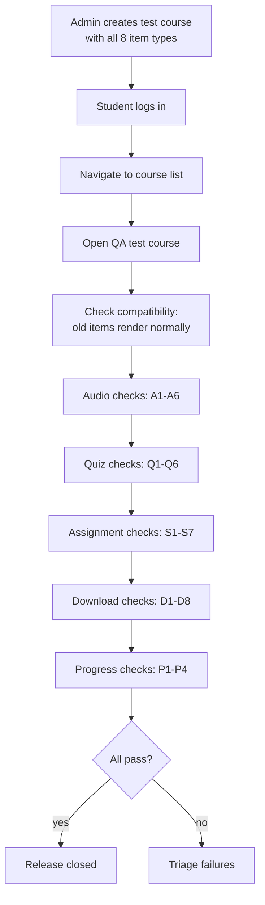
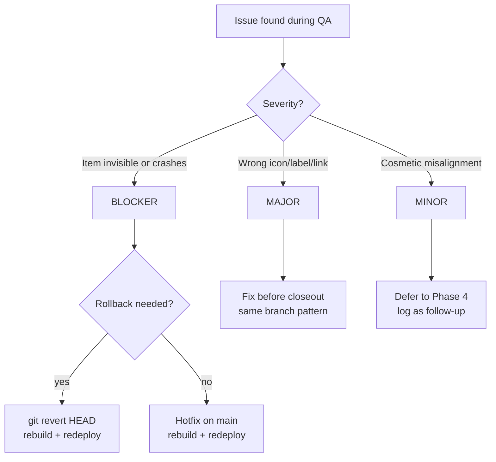

# Phase 3 Manual QA Runbook

**Target:** https://lms.smwebsystems.com
**Date:** 2026-08-03
**Scope:** Student viewer rendering of audio, quiz, assignment, download items
**Pre-requisite:** Phase 3 merged and deployed (commit `c817192`)

---

## 1. Tester Setup

### Roles Required

| Role | Purpose | Login |
|------|---------|-------|
| Admin | Create test courses with all 8 item types | SSO via AmmaWallet (admin account) |
| Student | Verify rendering, clicks, progress | SSO via AmmaWallet (student account) |

### Environment

- URL: https://lms.smwebsystems.com
- Browser: Chrome or Firefox (latest)
- Admin login: via `/admin` SSO
- Student login: via `/student` SSO

---

## 2. Test Data Creation (Admin)

Before QA can run, an admin must create a test course with all new item types. No courses currently have audio, quiz, assignment, or download items.

### Step-by-step: Create QA Test Course

1. Log in as Admin → go to `/admin/courses`
2. Click "Create Course" or edit an existing course
3. Add a section called "Phase 3 QA Items"
4. Add items in this order:

| # | Type | Title | Configuration |
|---|------|-------|---------------|
| 1 | video | QA Video | Any YouTube URL |
| 2 | pdf | QA PDF | Upload or link any PDF |
| 3 | audio | QA Audio | URL: `https://www.soundhelix.com/examples/mp3/SoundHelix-Song-1.mp3` |
| 4 | quiz | QA Quiz | Select "Blockchain Basics Check-In" from picker (course: LMS Pilot) |
| 5 | assignment | QA Assignment | Description: "Submit a PDF report about blockchain consensus mechanisms." Max file size: 5 MB |
| 6 | download | QA Download (URL) | File URL: `https://www.w3.org/WAI/ER/tests/xhtml/testfiles/resources/pdf/dummy.pdf`, File name: `dummy.pdf` |
| 7 | download | QA Download (empty) | Leave both documentId and fileUrl empty |
| 8 | text | QA Text | Any URL |

5. Save the course
6. Ensure a student account is enrolled in this course

### Note on Quiz Item
For the quiz picker to show quizzes, the course must already be saved. If creating a brand new course, save it first, then edit to add the quiz item.

---

## 3. QA Execution Flow



---

## 4. Grouped QA Checklist

### Audio (6 checks)

| ID | Precondition | Action | Expected Result | Actual | P/F | Notes |
|----|-------------|--------|-----------------|--------|-----|-------|
| A1 | Student views QA course | Look at material list | Audio item visible with purple Headphones icon + "Listen" label | | | |
| A2 | A1 passed | Click audio item | EmbeddedMaterialViewer opens with native `<audio>` player | | | |
| A3 | A2 passed | Click play on audio player | Audio plays (SoundHelix file) | | | |
| A4 | A2 passed | Look below audio player | "Download audio file" link visible | | | |
| A5 | Admin creates audio item with empty URL | Student clicks it | "No audio file is attached to this item." message | | | |
| A6 | A2 passed | Check progress checkbox | Green checkbox appears, progress bar increments | | | |

### Quiz (6 checks)

| ID | Precondition | Action | Expected Result | Actual | P/F | Notes |
|----|-------------|--------|-----------------|--------|-----|-------|
| Q1 | Student views QA course | Look at material list | Quiz item visible with amber ClipboardCheck icon + "Quiz" label | | | |
| Q2 | Q1 passed | Click quiz item | Viewer opens with quiz navigation card | | | |
| Q3 | Q2 passed | Check card content | Title shown, description if set, "Start quiz" button visible | | | |
| Q4 | Q2 passed | Click "Start quiz" | Navigates to `/student/quizzes?quiz=<quizId>` | | | |
| Q5 | Admin creates quiz item with no quizId | Student clicks it | "This quiz has not been configured yet." message | | | |
| Q6 | Q2 passed | Check progress checkbox | Green checkbox appears, progress bar increments | | | |

### Assignment (7 checks)

| ID | Precondition | Action | Expected Result | Actual | P/F | Notes |
|----|-------------|--------|-----------------|--------|-----|-------|
| S1 | Student views QA course | Look at material list | Assignment item visible with blue Upload icon + "Submit" label | | | |
| S2 | S1 passed | Click assignment item | Viewer opens with assignment instructions card | | | |
| S3 | S2 passed | Check card content | Description text "Submit a PDF report..." visible | | | |
| S4 | S2 passed | Check file size hint | "Max file size: 5 MB" shown | | | |
| S5 | Admin creates assignment with no maxFileSize | Student clicks it | No file size hint shown (only description + button) | | | |
| S6 | S2 passed | Click "Go to submissions" | Navigates to `/student/submissions` | | | |
| S7 | S2 passed | Check progress checkbox | Green checkbox appears, progress bar increments | | | |

### Download (8 checks)

| ID | Precondition | Action | Expected Result | Actual | P/F | Notes |
|----|-------------|--------|-----------------|--------|-----|-------|
| D1 | Student views QA course | Look at material list | Download item visible with green Download icon + "Download" label | | | |
| D2 | D1 passed | Check below title | File name "dummy.pdf" shown | | | |
| D3 | D1 passed | Click download item | Viewer opens with download card | | | |
| D4 | D3 passed | Check card content | Title, file name in monospace, "Download file" button | | | |
| D5 | D3 passed | Click "Download file" | File downloads or opens in new tab | | | |
| D6 | Admin creates download with documentId | Student clicks it | "Download file" button uses `/api/v1/documents/:id/download` path | | | |
| D7 | "QA Download (empty)" item | Click it | "No file is attached to this download item." message | | | |
| D8 | D3 passed | Check progress checkbox | Green checkbox appears, progress bar increments | | | |

### Compatibility (4 checks)

| ID | Precondition | Action | Expected Result | Actual | P/F | Notes |
|----|-------------|--------|-----------------|--------|-----|-------|
| C1 | Existing course with only video+link | Student views it | Renders exactly as before, no new icons leak | | | |
| C2 | QA course with all 8 types | Student views material list | All 8 items visible with correct icons and labels | | | |
| C3 | QA course | Click all items → check progress | Progress bar counts all items correctly | | | |
| C4 | QA course in viewer | Use Previous/Next buttons | All 8 types navigable in sequence | | | |

**Total: 31 checks**

---

## 5. Issue Triage Decision Tree



### Severity Definitions

| Severity | Definition | Example | Release Impact |
|----------|-----------|---------|----------------|
| BLOCKER | Feature crashes, data corruption, or breaks old items | Audio item causes console error that breaks page | Rollback immediately |
| MAJOR | Feature renders but wrong behavior | Quiz "Start quiz" links to wrong URL | Fix before closing release |
| MINOR | Feature works but cosmetic issue | Icon slightly misaligned | Defer to Phase 4 |
| INFO | Not a bug, but an improvement idea | "Would be nice if download showed file size" | Capture for Phase 4 |

### Rollback Commands

```bash
# If BLOCKER found:
git revert HEAD   # revert the Phase 3 merge
docker compose build web && docker compose up -d --no-deps web
# Verify: old behavior restored, new items invisible again
```

---

## 6. /loop Workflow

```
/loop qa      — Execute the 31-item checklist on lms.smwebsystems.com
/loop triage  — Classify any failures (blocker/major/minor/info)
/loop review  — Review QA results and decide release status
/loop close   — Write final release note, confirm Phase 3 closed
/loop phase4  — Begin Phase 4 planning from captured candidates
```

---

## 7. Phase 4 Candidate Seeds

### Seed 1: Auto-Complete Quiz on Pass
**Trigger:** Student passes a quiz linked to a course item via quizId
**Behavior:** Automatically mark the course lesson as complete (`markItemEngaged`)
**Scope:** Backend callback from quiz completion → course lesson completion
**Complexity:** Medium — requires quiz result event + course item lookup

### Seed 2: Auto-Complete Assignment on Approval
**Trigger:** Admin approves a submission for a course assignment item
**Behavior:** Automatically mark the course lesson as complete
**Scope:** Backend callback from submission approval → course lesson completion
**Complexity:** Medium — requires submission approval event + course item lookup

### Seed 3: allowedMimeTypes Display
**Trigger:** Assignment item has `allowedMimeTypes` array set
**Behavior:** Show accepted file types on assignment instructions card (e.g., "Accepted: PDF, DOCX")
**Scope:** Frontend-only, EmbeddedMaterialViewer assignment branch
**Complexity:** Low — field already stored, just needs UI rendering

### Seed 4: Audio Playback Tracking
**Trigger:** Student plays audio item
**Behavior:** Track playback progress (% listened) for completion criteria
**Scope:** Frontend event listener + backend progress API extension
**Complexity:** High — requires new progress model beyond click-to-complete

### Priority Recommendation
1. allowedMimeTypes display (low effort, immediate value)
2. Auto-complete quiz on pass (medium effort, high value)
3. Auto-complete assignment on approval (medium effort, high value)
4. Audio playback tracking (high effort, defer further)

---

## 8. Release Closeout Template

After QA completes, fill in this summary:

```markdown
## Phase 3 Release Note

**Date:** ____
**QA Tester:** ____
**Result:** RELEASE PASSED / RELEASE PASSED WITH FOLLOW-UP / RELEASE BLOCKED

### QA Results
- Audio: __/6 pass
- Quiz: __/6 pass
- Assignment: __/7 pass
- Download: __/8 pass
- Compatibility: __/4 pass
- **Total: __/31 pass**

### Issues Found
| ID | Severity | Description | Resolution |
|----|----------|-------------|------------|
| | | | |

### Follow-Up Items
| Item | Target |
|------|--------|
| | Phase 4 |

### Release Status
[X] Merged to main
[X] Deployed
[X] Automated verification passed
[ ] Manual QA passed (__/31)
[ ] Release closed
```
