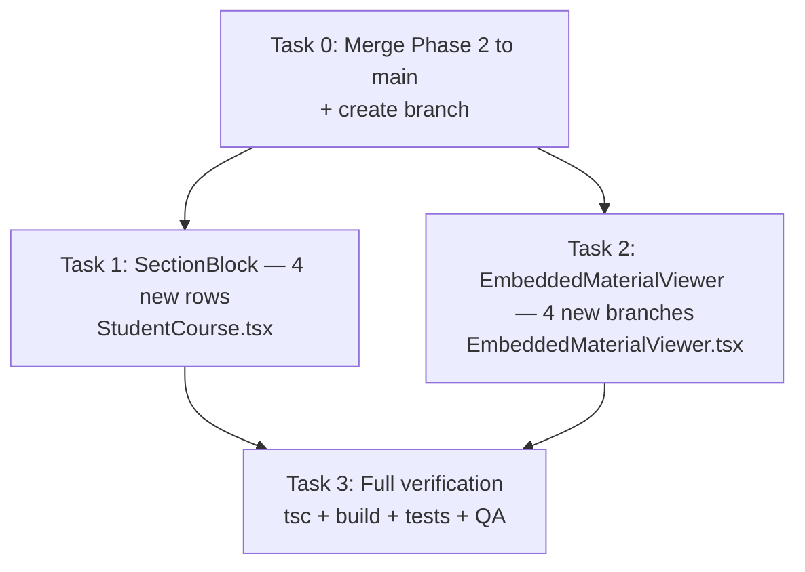
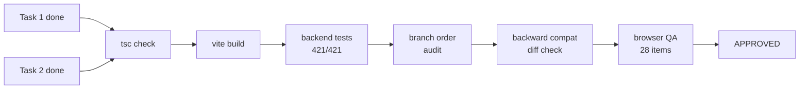
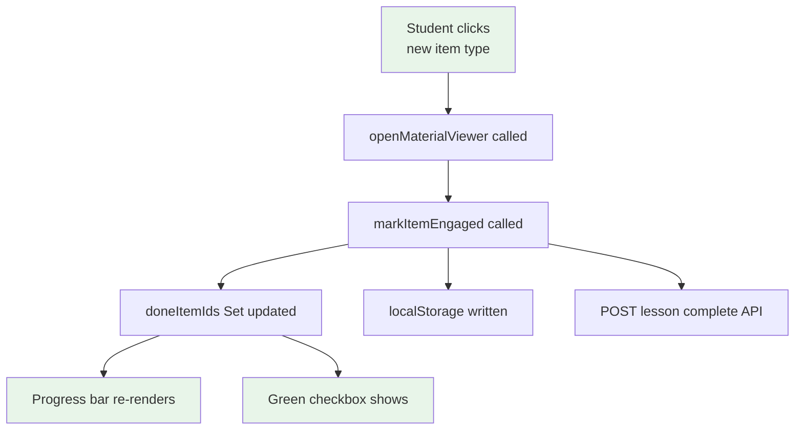
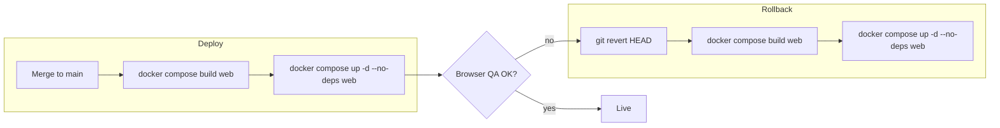

# Phase 3: Student Viewer — New Item Type Rendering — Implementation Plan

> **For agentic workers:** REQUIRED SUB-SKILL: Use superpowers:subagent-driven-development (recommended) or superpowers:executing-plans to implement this plan task-by-task. Steps use checkbox (`- [ ]`) syntax for tracking.

**Goal:** Make audio, quiz, assignment, and download items visible and interactive for students in the course viewer.

**Architecture:** Inline extension of existing conditional rendering in 2 files. Add 4 new branches to SectionBlock (StudentCourse.tsx:986-1087) and 4 new branches to EmbeddedMaterialViewer (lines 182-280). No new files, no backend changes.

**Tech Stack:** React 18, TypeScript, lucide-react icons, existing courseCompletionService

## Global Constraints

- Phase 3 only — no Phase 2 reopening, no Phase 4 scope
- 2 files modified: `StudentCourse.tsx`, `EmbeddedMaterialViewer.tsx`
- 0 backend changes, 0 new files, 0 new dependencies
- Preserve all existing video/link/pdf/text rendering unchanged
- Follow existing code patterns exactly (if-type → return JSX)
- Icons match AdminCoursePreview colors: audio=purple, quiz=amber, assignment=blue, download=green
- Progress: reuse existing `markItemEngaged()` — no new completion logic
- No inline quiz taking, no inline assignment submission, no `allowedMimeTypes` UI
- Verification gates: `tsc --noEmit`, `vite build`, backend tests 421/421, manual QA

---

## Task Dependency Flow



---

### Task 0: Branch Setup

**Files:** None (git operations only)

**Interfaces:**
- Produces: Clean `feat/student-viewer-new-item-types` branch forked from main with Phase 2 merged

- [ ] **Step 1: Merge Phase 2 to main**

```bash
git checkout main
git merge feat/course-builder-new-item-types --no-ff -m "Merge Phase 2: admin course builder new item types"
```

- [ ] **Step 2: Verify main is clean**

Run: `cd LMS-Server && npx vitest run`
Expected: 421/421 pass

Run: `cd LMS-Frontend && npx tsc --noEmit`
Expected: exit 0

- [ ] **Step 3: Create Phase 3 branch**

```bash
git checkout -b feat/student-viewer-new-item-types
```

- [ ] **Step 4: Commit**

No commit needed — branch created from merge commit.

---

### Task 1: SectionBlock — 4 New Item Type Rows

**Files:**
- Modify: `LMS-Frontend/src/pages/StudentCourse.tsx:11-24` (imports)
- Modify: `LMS-Frontend/src/pages/StudentCourse.tsx:1065-1087` (after text branch, before `return null`)

**Interfaces:**
- Consumes: Existing `materialRowA11y(item)`, `materialRowClass(item.id)`, `MaterialDoneToggle`, `ICON_BOX` constant
- Produces: 4 new visible item rows in the student material list (audio, quiz, assignment, download)

- [ ] **Step 1: Add icon imports**

In `StudentCourse.tsx`, add 4 icons to the existing lucide-react import (lines 11-24):

```typescript
import {
  Play,
  ExternalLink,
  FileText,
  BookOpen,
  Target,
  CheckCircle,
  ChevronDown,
  ArrowLeft,
  ChevronLeft,
  ChevronRight,
  Circle,
  AlignLeft,
  Headphones,
  ClipboardCheck,
  Upload,
  Download,
} from 'lucide-react';
```

- [ ] **Step 2: Add audio row after the text branch**

Insert after line 1086 (`}`  closing the text branch), before `return null` (line 1087):

```tsx
if (item.type === 'audio') {
  return (
    <div
      key={item.id}
      id={`course-item-${item.id}`}
      {...materialRowA11y(item)}
      className={materialRowClass(item.id)}
    >
      <MaterialDoneToggle itemId={item.id} />
      <div className={`${ICON_BOX} bg-purple-50 text-purple-600 border border-purple-100`}>
        <Headphones className="h-5 w-5" aria-hidden />
      </div>
      <div className="min-w-0">
        <span className="font-medium text-neutral-800 block leading-snug">{item.title}</span>
        {item.description && (
          <p className="text-sm text-neutral-500 mt-0.5 leading-snug line-clamp-2">{item.description}</p>
        )}
      </div>
      <span className="text-sm text-accent-teal font-semibold shrink-0">Listen</span>
    </div>
  );
}
```

- [ ] **Step 3: Add quiz row**

Insert immediately after the audio branch:

```tsx
if (item.type === 'quiz') {
  return (
    <div
      key={item.id}
      id={`course-item-${item.id}`}
      {...materialRowA11y(item)}
      className={materialRowClass(item.id)}
    >
      <MaterialDoneToggle itemId={item.id} />
      <div className={`${ICON_BOX} bg-amber-50 text-amber-600 border border-amber-100`}>
        <ClipboardCheck className="h-5 w-5" aria-hidden />
      </div>
      <div className="min-w-0">
        <span className="font-medium text-neutral-800 block leading-snug">{item.title}</span>
        {item.description && (
          <p className="text-sm text-neutral-500 mt-0.5 leading-snug line-clamp-2">{item.description}</p>
        )}
      </div>
      <span className="text-sm text-accent-teal font-semibold shrink-0">Quiz</span>
    </div>
  );
}
```

- [ ] **Step 4: Add assignment row**

Insert immediately after the quiz branch:

```tsx
if (item.type === 'assignment') {
  return (
    <div
      key={item.id}
      id={`course-item-${item.id}`}
      {...materialRowA11y(item)}
      className={materialRowClass(item.id)}
    >
      <MaterialDoneToggle itemId={item.id} />
      <div className={`${ICON_BOX} bg-blue-50 text-blue-600 border border-blue-100`}>
        <Upload className="h-5 w-5" aria-hidden />
      </div>
      <div className="min-w-0">
        <span className="font-medium text-neutral-800 block leading-snug">{item.title}</span>
        {item.description && (
          <p className="text-sm text-neutral-500 mt-0.5 leading-snug line-clamp-2">{item.description}</p>
        )}
      </div>
      <span className="text-sm text-accent-teal font-semibold shrink-0">Submit</span>
    </div>
  );
}
```

- [ ] **Step 5: Add download row**

Insert immediately after the assignment branch:

```tsx
if (item.type === 'download') {
  return (
    <div
      key={item.id}
      id={`course-item-${item.id}`}
      {...materialRowA11y(item)}
      className={materialRowClass(item.id)}
    >
      <MaterialDoneToggle itemId={item.id} />
      <div className={`${ICON_BOX} bg-green-50 text-green-600 border border-green-100`}>
        <Download className="h-5 w-5" aria-hidden />
      </div>
      <div className="min-w-0">
        <span className="font-medium text-neutral-800 block leading-snug">{item.title}</span>
        {(item as { fileName?: string }).fileName && (
          <p className="text-sm text-neutral-500 mt-0.5 leading-snug line-clamp-1">
            {(item as { fileName: string }).fileName}
          </p>
        )}
      </div>
      <span className="text-sm text-accent-teal font-semibold shrink-0">Download</span>
    </div>
  );
}
```

- [ ] **Step 6: Verify TypeScript compiles**

Run: `cd LMS-Frontend && npx tsc --noEmit`
Expected: exit 0

- [ ] **Step 7: Commit**

```bash
git add LMS-Frontend/src/pages/StudentCourse.tsx
git commit -m "feat: add audio/quiz/assignment/download rows to student SectionBlock"
```

---

### Task 2: EmbeddedMaterialViewer — 4 New Render Branches

**Files:**
- Modify: `LMS-Frontend/src/components/EmbeddedMaterialViewer.tsx:1-2` (imports)
- Modify: `LMS-Frontend/src/components/EmbeddedMaterialViewer.tsx:15-21` (externalUrlForItem)
- Modify: `LMS-Frontend/src/components/EmbeddedMaterialViewer.tsx:276-280` (before final fallback)

**Interfaces:**
- Consumes: `item: CourseItem`, `section: CourseSection` props
- Produces: 4 new viewer render paths for audio, quiz, assignment, download

- [ ] **Step 1: Add icon imports**

In `EmbeddedMaterialViewer.tsx` line 2, update the lucide-react import:

```typescript
import { ArrowLeft, ChevronLeft, ChevronRight, ExternalLink, Info, Music, ClipboardCheck, Upload, Download as DownloadIcon } from 'lucide-react';
```

Note: `Download` is aliased to `DownloadIcon` to avoid collision with the HTML `download` attribute used on `<a>` tags.

- [ ] **Step 2: Update externalUrlForItem()**

In `externalUrlForItem()` (lines 15-21), add audio and download before the final `return null`:

```typescript
function externalUrlForItem(item: CourseItem): string | null {
  if (item.type === 'video') return item.url.trim();
  if (item.type === 'link') return item.url.trim();
  if (item.type === 'text') return item.url.trim();
  if (item.type === 'pdf') return item.fileUrl?.trim() || null;
  if (item.type === 'audio') return item.url.trim();
  if (item.type === 'download') {
    const dl = item as { fileUrl?: string };
    return dl.fileUrl?.trim() || null;
  }
  return null;
}
```

- [ ] **Step 3: Add 4 new viewer branches**

Insert before the final fallback at line 276. The current code ends with:

```tsx
) : (item.type === 'link' || item.type === 'text') && ext ? (
  <ExternalResourceCard title={item.title} description={item.description} url={ext} />
) : (
  <p className="text-sm text-neutral-600 px-4 py-8 text-center">This material has nothing to display.</p>
)}
```

Insert between the `ExternalResourceCard` branch and the final fallback. The new code goes after the ExternalResourceCard ternary and before the `: (` final fallback:

```tsx
) : item.type === 'audio' ? (
  <div className="flex flex-col items-center gap-5 py-8 px-4">
    <span className="flex h-16 w-16 items-center justify-center rounded-2xl bg-purple-50 text-purple-600">
      <Music className="h-8 w-8" aria-hidden />
    </span>
    <p className="text-base font-semibold text-neutral-800">{item.title}</p>
    {item.url?.trim() ? (
      <>
        <audio controls preload="metadata" className="w-full max-w-lg" src={item.url}>
          Your browser does not support the audio element.
        </audio>
        <a href={item.url} target="_blank" rel="noopener noreferrer"
          className="text-xs text-accent-teal font-medium hover:underline flex items-center gap-1">
          <ExternalLink className="h-3 w-3" aria-hidden />
          Download audio file
        </a>
      </>
    ) : (
      <p className="text-sm text-neutral-500">No audio file is attached to this item.</p>
    )}
  </div>
) : item.type === 'quiz' ? (
  (() => {
    const quizId = (item as { quizId?: string }).quizId?.trim();
    return quizId ? (
      <div className="flex flex-col items-center gap-5 py-8 px-4">
        <span className="flex h-16 w-16 items-center justify-center rounded-2xl bg-amber-50 text-amber-600">
          <ClipboardCheck className="h-8 w-8" aria-hidden />
        </span>
        <p className="text-base font-semibold text-neutral-800">{item.title}</p>
        {item.description?.trim() && (
          <p className="text-sm text-neutral-600 max-w-prose text-center leading-relaxed">{item.description}</p>
        )}
        <a
          href={`/student/quizzes?quiz=${quizId}`}
          className="inline-flex items-center justify-center gap-2 rounded-lg bg-amber-500 px-5 py-3 text-sm font-semibold text-white shadow-sm hover:bg-amber-600 transition-colors min-w-[200px]"
        >
          <ClipboardCheck className="h-4 w-4 shrink-0" aria-hidden />
          Start quiz
        </a>
        <p className="text-xs text-neutral-500">
          The quiz opens on the Quizzes page. Your progress is tracked there.
        </p>
      </div>
    ) : (
      <div className="flex flex-col items-center gap-5 py-8 px-4">
        <span className="flex h-16 w-16 items-center justify-center rounded-2xl bg-amber-50 text-amber-600">
          <ClipboardCheck className="h-8 w-8" aria-hidden />
        </span>
        <p className="text-base font-semibold text-neutral-800">{item.title}</p>
        <p className="text-sm text-neutral-500">This quiz has not been configured yet.</p>
      </div>
    );
  })()
) : item.type === 'assignment' ? (
  <div className="flex flex-col items-center gap-5 py-8 px-4">
    <span className="flex h-16 w-16 items-center justify-center rounded-2xl bg-blue-50 text-blue-600">
      <Upload className="h-8 w-8" aria-hidden />
    </span>
    <p className="text-base font-semibold text-neutral-800">{item.title}</p>
    {item.description?.trim() && (
      <div className="text-sm text-neutral-700 max-w-prose text-center leading-relaxed whitespace-pre-wrap">
        {item.description}
      </div>
    )}
    {(item as { maxFileSize?: number }).maxFileSize ? (
      <p className="text-xs text-neutral-500">
        Max file size: {Math.round(((item as { maxFileSize: number }).maxFileSize) / 1048576)} MB
      </p>
    ) : null}
    <a
      href="/student/submissions"
      className="inline-flex items-center justify-center gap-2 rounded-lg bg-blue-600 px-5 py-3 text-sm font-semibold text-white shadow-sm hover:bg-blue-700 transition-colors min-w-[200px]"
    >
      <Upload className="h-4 w-4 shrink-0" aria-hidden />
      Go to submissions
    </a>
    <p className="text-xs text-neutral-500">
      Submit your work on the Submissions page.
    </p>
  </div>
) : item.type === 'download' ? (
  (() => {
    const dlItem = item as { documentId?: string; fileUrl?: string; fileName?: string };
    const downloadUrl = dlItem.documentId
      ? `/api/v1/documents/${dlItem.documentId}/download`
      : dlItem.fileUrl?.trim() || null;
    const displayName = dlItem.fileName || item.title;
    return (
      <div className="flex flex-col items-center gap-5 py-8 px-4">
        <span className="flex h-16 w-16 items-center justify-center rounded-2xl bg-green-50 text-green-600">
          <DownloadIcon className="h-8 w-8" aria-hidden />
        </span>
        <p className="text-base font-semibold text-neutral-800">{item.title}</p>
        {item.description?.trim() && (
          <p className="text-sm text-neutral-600 max-w-prose text-center leading-relaxed">{item.description}</p>
        )}
        <p className="text-sm text-neutral-500 font-mono">{displayName}</p>
        {downloadUrl ? (
          <a href={downloadUrl} download={displayName}
            target="_blank" rel="noopener noreferrer"
            className="inline-flex items-center justify-center gap-2 rounded-lg bg-green-600 px-5 py-3 text-sm font-semibold text-white shadow-sm hover:bg-green-700 transition-colors min-w-[200px]">
            <DownloadIcon className="h-4 w-4 shrink-0" aria-hidden />
            Download file
          </a>
        ) : (
          <p className="text-sm text-neutral-500">No file is attached to this download item.</p>
        )}
      </div>
    );
  })()
```

- [ ] **Step 4: Verify TypeScript compiles**

Run: `cd LMS-Frontend && npx tsc --noEmit`
Expected: exit 0

- [ ] **Step 5: Commit**

```bash
git add LMS-Frontend/src/components/EmbeddedMaterialViewer.tsx
git commit -m "feat: add audio/quiz/assignment/download branches to EmbeddedMaterialViewer"
```

---

### Task 3: Full Verification

**Files:** None (verification only)

**Interfaces:**
- Consumes: All changes from Tasks 1-2
- Produces: Verification evidence proving all gates pass

- [ ] **Step 1: TypeScript check**

Run: `cd LMS-Frontend && npx tsc --noEmit`
Expected: exit 0

- [ ] **Step 2: Frontend build**

Run: `cd LMS-Frontend && npx vite build`
Expected: `✓ built in` with exit 0

- [ ] **Step 3: Backend tests**

Run: `cd LMS-Server && npx vitest run`
Expected: 421/421 pass (no backend changes, tests must remain green)

- [ ] **Step 4: Verify SectionBlock branch order**

Confirm the item type branches in `StudentCourse.tsx` appear in this order:
1. `video` (existing)
2. `link` (existing)
3. `pdf` (existing)
4. `text` (existing)
5. `audio` (new)
6. `quiz` (new)
7. `assignment` (new)
8. `download` (new)
9. `return null` (existing fallback — unchanged)

Run: `grep -n "item\.type ===" LMS-Frontend/src/pages/StudentCourse.tsx`
Expected: 8 type checks in the SectionBlock area, followed by `return null`

- [ ] **Step 5: Verify EmbeddedMaterialViewer branch order**

Confirm the render branches appear in this order:
1. `pdf` (existing)
2. `video` / `link+video` (existing)
3. `link+audio` (existing)
4. `link+office` (existing)
5. `link/text` generic (existing)
6. `audio` (new)
7. `quiz` (new)
8. `assignment` (new)
9. `download` (new)
10. Final fallback "nothing to display" (existing — unchanged)

Run: `grep -n "item\.type ===" LMS-Frontend/src/components/EmbeddedMaterialViewer.tsx`
Expected: New type checks appear after existing branches, before fallback

- [ ] **Step 6: Verify backward compatibility**

Confirm no existing branches were modified. The video, link, pdf, and text branches must be byte-identical to main.

Run: `git diff main -- LMS-Frontend/src/pages/StudentCourse.tsx | head -80`
Expected: Only additions (no `-` lines in existing branches, only `+` lines for new code)

- [ ] **Step 7: Verify icon imports**

Run: `grep -c 'Headphones\|ClipboardCheck\|Upload\|Download' LMS-Frontend/src/pages/StudentCourse.tsx`
Expected: At least 5 (1 import + 4 uses)

Run: `grep -c 'ClipboardCheck\|Upload\|DownloadIcon' LMS-Frontend/src/components/EmbeddedMaterialViewer.tsx`
Expected: At least 7 (imports + uses)

- [ ] **Step 8: Record evidence and commit verification**

No commit — this is verification only. Record results in closeout document.

---

## Review and Verification Gates



### Gate 1: TypeScript — `tsc --noEmit` exit 0
### Gate 2: Build — `vite build` success
### Gate 3: Backend tests — 421/421 pass
### Gate 4: Branch order — 8 SectionBlock types in correct order
### Gate 5: Backward compat — `git diff` shows additions only, no modifications to existing branches
### Gate 6: Browser QA — 28-item manual checklist from spec §15

---

## Progress Verification Flow



No code changes needed for progress. Verification is manual: click each new type → confirm checkbox turns green → confirm progress bar increments.

---

## Rollout / Rollback Path



**Rollback is safe:** Phase 3 is frontend-only, additive. Revert makes new items invisible again (`return null`). No data loss. Progress marks preserved.

---

## To-Do Lists

### Implementation Tasks
- [ ] Merge Phase 2 to main
- [ ] Create `feat/student-viewer-new-item-types` branch
- [ ] Task 1: SectionBlock — 4 new rows + icon imports
- [ ] Task 2: EmbeddedMaterialViewer — 4 new branches + externalUrlForItem
- [ ] Task 3: Full verification

### Testing Checklist
- [ ] `tsc --noEmit` exit 0
- [ ] `vite build` success
- [ ] Backend tests 421/421
- [ ] SectionBlock branch order verified
- [ ] EmbeddedMaterialViewer branch order verified
- [ ] Backward compat diff check — additions only
- [ ] Icon imports verified

### Manual QA (28 items from spec §15)
**Audio:**
- [ ] Audio item appears in material list
- [ ] Headphones icon (purple) shown
- [ ] Click opens audio player
- [ ] Audio plays when clicked
- [ ] "Download audio file" link works
- [ ] Progress marks on click

**Quiz:**
- [ ] Quiz item appears in material list
- [ ] ClipboardCheck icon (amber) shown
- [ ] Click opens quiz card
- [ ] "Start quiz" button navigates to quiz page
- [ ] Empty quizId shows "not configured" state
- [ ] Progress marks on click

**Assignment:**
- [ ] Assignment item appears in material list
- [ ] Upload icon (blue) shown
- [ ] Click opens assignment instructions
- [ ] Description text displays
- [ ] Max file size hint shows (when set)
- [ ] "Go to submissions" link works
- [ ] Progress marks on click

**Download:**
- [ ] Download item appears in material list
- [ ] Download icon (green) shown
- [ ] Click opens download card
- [ ] File name displayed
- [ ] "Download file" button works (documentId path)
- [ ] "Download file" button works (fileUrl path)
- [ ] No-file state shows message
- [ ] Progress marks on click

**Compatibility:**
- [ ] Old course (video+pdf only) renders unchanged
- [ ] Mixed course (old+new types) renders all items
- [ ] Progress bar counts all items (including new types)
- [ ] Previous/Next navigation includes new types

### Review Gates
- [ ] Spec compliance: all 7 ACs met
- [ ] UI behavior: icons, labels, colors match spec
- [ ] Regression: old items unchanged (diff evidence)
- [ ] Branch review: clean diff, no accidental changes

### Rollout
- [ ] Merge to main
- [ ] `docker compose build web && docker compose up -d --no-deps web`
- [ ] Run browser QA on live
- [ ] Confirm no regressions
- [ ] Write Phase 3 closeout doc

---

## TDD Map

This project has no frontend component test infrastructure (no vitest/testing-library in LMS-Frontend). All verification is through:

1. **TypeScript compiler** — catches type errors, missing imports, invalid JSX
2. **Vite build** — catches bundling/resolution errors
3. **Backend tests** — confirms no backend regressions (421/421)
4. **Manual QA** — 28-item checklist confirms visual and behavioral correctness
5. **Git diff audit** — confirms existing code is unmodified

### Per-AC Verification Method

| AC | Verification | Method |
|----|-------------|--------|
| AC-1: Audio visibility | Headphones icon + "Listen" label + audio player | Manual QA + tsc |
| AC-2: Quiz visibility | ClipboardCheck icon + "Quiz" label + "Start quiz" link | Manual QA + tsc |
| AC-3: Assignment visibility | Upload icon + "Submit" label + instructions + submissions link | Manual QA + tsc |
| AC-4: Download visibility | Download icon + "Download" label + download button | Manual QA + tsc |
| AC-5: Progress | Click → green checkbox + progress bar increment | Manual QA |
| AC-6: Previous/Next | Navigate through all 8 types | Manual QA |
| AC-7: Old items unchanged | `git diff` shows additions only | Git diff audit |

---

## Subagent Ownership Boundaries

If using subagent-driven development:

| Subagent | Owns | Files | Boundary |
|----------|------|-------|----------|
| A | Task 1: SectionBlock rows | `StudentCourse.tsx` only | No EmbeddedMaterialViewer changes |
| B | Task 2: Viewer branches | `EmbeddedMaterialViewer.tsx` only | No StudentCourse changes |
| C | Task 3: Verification | No file changes | Run all verification gates |

Tasks A and B can execute **in parallel** — they modify different files with no shared state. Task C runs after both complete.

---

## Worktree Strategy

**Branch:** `feat/student-viewer-new-item-types`
**Fork point:** Main after Phase 2 merge
**Prerequisite:** Phase 2 branch merged to main first

If using worktree isolation:
```bash
git worktree add .claude/worktrees/phase3 -b feat/student-viewer-new-item-types main
```

Single worktree is sufficient — only 2 files change and they don't overlap.

---

## /loop Workflow

```
/loop assess    — Read spec, confirm branch setup, verify main has Phase 2 merged
/loop plan      — This document (already complete)
/loop implement — Execute Tasks 1-2 (parallel or sequential)
/loop verify    — Execute Task 3 verification gates
/loop review    — Final branch review: diff audit, spec compliance, QA results
/loop close     — Write Phase 3 closeout doc, confirm completion
```

---

## Follow-Up Notes

### EmbeddedMaterialViewer Extension Note
Phase 3 adds 4 inline branches (~80 lines). The file grows from 284 to ~365 lines. This is still manageable but approaching the point where extraction into type-specific components would improve maintainability. Not needed now — flag for future cleanup.

### Student Quiz-in-Course UX Note
Phase 3 links to the quiz page via `<a href>` (full page navigation). The student leaves the course viewer to take the quiz. A smoother UX would embed the quiz inline (Phase 4+ deferred item). For now, the help text "The quiz opens on the Quizzes page" sets expectations.

### Assignment Submission UX Note
Phase 3 links to the general `/student/submissions` page, not a course-scoped submission form. The student must find the correct submission context on that page. Future improvement: pass course context via query param (e.g., `/student/submissions?course=<courseId>`).

### Deferred Future Enhancement Notes
- **Auto-complete on quiz pass:** Requires a callback from quiz page to course viewer. Architectural change deferred to Phase 4.
- **Auto-complete on assignment approval:** Requires backend event → frontend notification. Deferred to Phase 4.
- **`allowedMimeTypes` display:** Field exists in course JSON but not shown on assignment card. Simple addition for Phase 4.
- **Audio playback tracking:** Could track play/pause/seek events for completion percentage. Future enhancement.

---

## Risks and Failure Modes

| Risk | Likelihood | Impact | Mitigation |
|------|-----------|--------|------------|
| Branch added in SectionBlock but not EmbeddedMaterialViewer | Low | Items visible but viewer shows "nothing to display" | Task 3 Step 5 catches this |
| Quiz link routes incorrectly | Low | Student sees wrong page | Manual QA item verifies URL |
| Audio item renders but progress not marked | None | N/A | `openMaterialViewer` calls `markItemEngaged` for ALL types — no new code needed |
| Download fails for documentId | Low | 404 on download | Manual QA verifies both paths |
| `return null` fallback behavior broken | None | N/A | No changes to fallback — it remains the last line |
| Existing item types break | None | N/A | Git diff audit confirms no existing code modified |
| Icon import name collision | Low | Build error | `Download` aliased to `DownloadIcon` in EmbeddedMaterialViewer to avoid `<a download>` collision |

---

## Final Recommendation

**This plan is ready to execute.**

- **3 tasks** (branch setup → 2 parallel implementation tasks → verification)
- **2 files** modified, ~100-120 lines added
- **0 backend changes**, 0 new files, 0 new dependencies
- **Estimated execution time:** 1 subagent-driven session
- **First implementation task:** Task 0 (merge Phase 2 to main), then Tasks 1+2 in parallel

The plan directly maps spec sections 5-8 to code, with exact file locations, insertion points, and verification commands. Every step has expected output. The next session can begin immediately.
