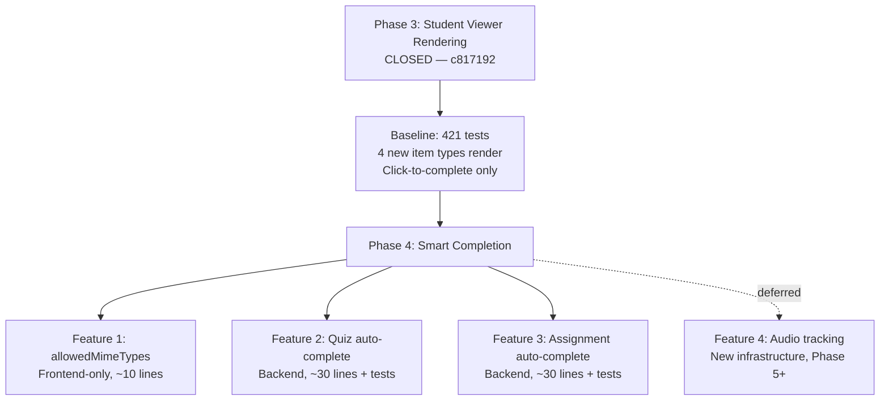
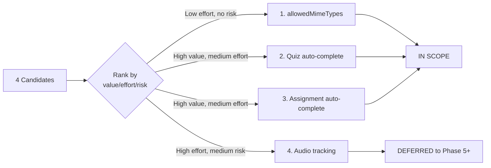
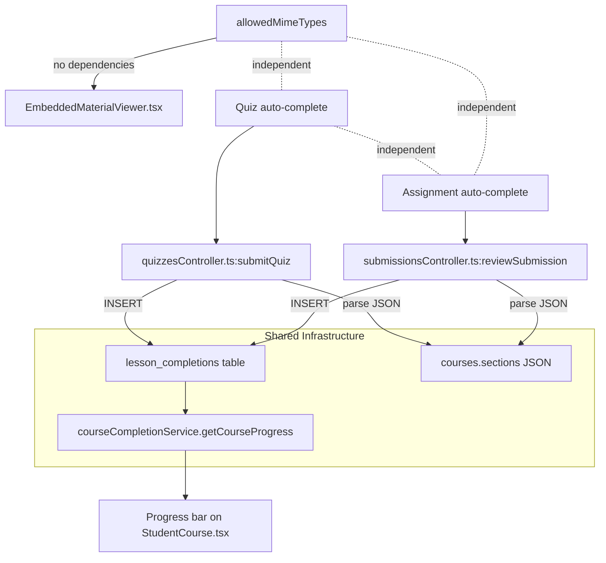
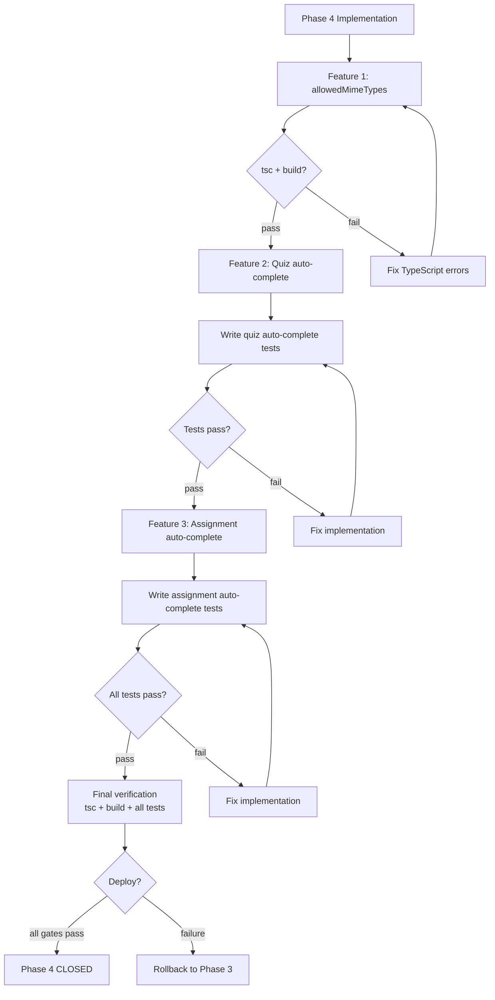

# Phase 4 Planning: Smart Completion + Enhanced Interactions

**Date:** 2026-08-03
**Baseline:** Phase 3 closed (`c817192`), 421/421 backend tests, site live
**Objective:** Rank, scope, and plan Phase 4 candidate features

---

## 1. Context

Phase 3 added student viewer rendering for 4 new item types (audio, quiz, assignment, download). All rendering is click-to-complete — the student clicks an item to mark it done. Phase 4 adds intelligence: items that auto-complete based on actual student activity, plus a minor UI enhancement.

### Non-Goals

- No Phase 3 rework or reopening
- No new item types
- No admin course builder changes
- No inline quiz taking or inline assignment submission (deferred beyond Phase 4)
- No audio playback tracking infrastructure (deferred — high complexity, low immediate value)

---

## 2. Candidate Ranking

| Rank | Feature | Value | Effort | Risk | Rationale |
|------|---------|-------|--------|------|-----------|
| 1 | allowedMimeTypes display | Medium | Low | None | Frontend-only, field already exists in type, ~10 lines |
| 2 | Auto-complete quiz on pass | High | Medium | Low | Backend INSERT after existing `passed=1` check |
| 3 | Auto-complete assignment on approval | High | Medium | Low | Backend INSERT after existing status UPDATE |
| 4 | Audio playback tracking | Low | High | Medium | New table, new API, new event listeners, new completion model |

### Recommendation

**Phase 4 scope: Features 1-3.** Feature 4 (audio tracking) is deferred to Phase 5+ — it requires a fundamentally different completion model (% played vs binary click) and new infrastructure.

---

## 3. Dependency Map

### Feature Dependencies

```
allowedMimeTypes (frontend-only)
  └── No dependencies — can be done first or in parallel

Auto-complete quiz on pass
  ├── Depends on: quiz submission handler (quizzesController.ts:389-450)
  ├── Depends on: lesson_completions table (database.ts:389-406)
  ├── Depends on: course sections JSON lookup (to find item_id from quizId)
  └── Independent of: assignment auto-complete

Auto-complete assignment on approval
  ├── Depends on: submission review handler (submissionsController.ts:474-546)
  ├── Depends on: lesson_completions table (database.ts:389-406)
  ├── Depends on: submissions.item_id field (schema.sql:64)
  └── Independent of: quiz auto-complete
```

### Shared Systems

| System | Used By | Risk |
|--------|---------|------|
| `lesson_completions` table | Quiz auto-complete, Assignment auto-complete | Low — INSERT OR IGNORE, UNIQUE constraint prevents duplicates |
| `courses.sections` JSON | Both auto-completes (to find section_id from item_id) | Low — read-only JSON parse |
| `courseCompletionService.getCourseProgress()` | Both auto-completes (consumed downstream) | None — reads lesson_completions, no changes needed |
| Progress bar on StudentCourse.tsx | Both auto-completes (needs to reflect server-side completions) | Medium — frontend currently reads from localStorage + server; server-side auto-complete must sync |

### Key Integration Point

Both auto-complete features INSERT into `lesson_completions` using the same pattern:

```typescript
execute(
  `INSERT OR IGNORE INTO lesson_completions (id, user_id, course_id, item_id, section_id, marked_by)
   VALUES (?, ?, ?, ?, ?, ?)`,
  [uuidv4(), userId, courseId, itemId, sectionId, null]
);
```

This is the same INSERT the existing `POST /courses/:courseId/lessons/:itemId/complete` endpoint uses. The UNIQUE constraint `(user_id, course_id, item_id)` guarantees idempotency.

---

## 4. Coupling Points from Phase 3

| Phase 3 Component | Phase 4 Touch Point | Risk |
|--------------------|-------------------|------|
| `EmbeddedMaterialViewer.tsx` assignment branch (lines 337-363) | Add allowedMimeTypes display after line 351 | None — additive |
| `quizzesController.ts` submitQuiz() (line 431) | Add lesson_completions INSERT after passed check | Low — new code after existing logic |
| `submissionsController.ts` reviewSubmission() (line 529) | Add lesson_completions INSERT after approval | Low — new code after existing logic |
| `StudentCourse.tsx` markItemEngaged() | No changes needed — already type-agnostic | None |
| `courseCompletionService.ts` getCourseProgress() | No changes needed — already reads lesson_completions | None |
| `lesson_completions` table | Already has correct schema for auto-complete INSERTs | None |

### Assumptions to Validate Before Coding

1. **Quiz-course link exists:** `quizzes` table or quiz item has `course_id`. Need to verify how quiz items link back to courses.
   - **Finding:** Quiz items store `quizId` in the course sections JSON. The quiz itself may not have `course_id`. Need to search `courses.sections` to find which course contains a quiz item with matching `quizId`.
   - **Risk:** Medium — requires JSON scan across courses to find the linking course.

2. **Submission-course link exists:** `submissions.course_id` and `submissions.item_id` fields exist (confirmed in schema.sql:63-64).
   - **Risk:** Low — fields exist but may be NULL for older submissions.

3. **Section ID lookup:** Both auto-completes need `section_id` for the INSERT. Must parse `courses.sections` JSON to find which section contains the item.
   - **Risk:** Low — straightforward JSON parse, but must handle edge cases (item not found, section not found).

4. **Frontend progress sync:** When a quiz or assignment is auto-completed server-side, the student's browser won't know until page refresh. The current `doneItemIds` state is initialized from localStorage + server fetch on mount.
   - **Risk:** Low — acceptable for v1. Student sees updated progress on next page load.

---

## 5. Test Strategy

### Feature 1: allowedMimeTypes Display

**User Story:** As a student viewing an assignment item, I see which file types are accepted so I know what to upload.

**Acceptance Criteria:**
- [ ] Assignment item with `allowedMimeTypes: ["application/pdf", "application/vnd.openxmlformats-officedocument.wordprocessingml.document"]` shows "Accepted: PDF, DOCX"
- [ ] Assignment item with empty `allowedMimeTypes` shows no file type hint
- [ ] Assignment item with no `allowedMimeTypes` field shows no file type hint

**Tests:** Frontend-only, manual QA. No backend tests needed.

**Regression:** Existing assignment rendering unchanged when `allowedMimeTypes` is absent.

---

### Feature 2: Auto-complete Quiz on Pass

**User Story:** As a student who passes a quiz linked to a course item, the course item is automatically marked complete without me having to click it separately.

**Acceptance Criteria:**
- [ ] Student passes quiz → `lesson_completions` row created for the linked course item
- [ ] Student fails quiz → no `lesson_completions` row created
- [ ] Student passes quiz not linked to any course → no error, no completion
- [ ] Student already has completion for item → no duplicate (INSERT OR IGNORE)
- [ ] Progress count reflects auto-completion on next page load

**Tests (Backend):**

```typescript
// test: auto-complete on quiz pass
describe('quiz auto-complete', () => {
  it('creates lesson_completion when student passes quiz linked to course item', async () => {
    // Setup: course with quiz item pointing to quizId
    // Action: submit quiz with passing score
    // Assert: lesson_completions has row for (userId, courseId, quizItemId)
  });

  it('does not create lesson_completion when student fails quiz', async () => {
    // Setup: same course
    // Action: submit quiz with failing score
    // Assert: no lesson_completions row
  });

  it('does not error when quiz has no linked course item', async () => {
    // Setup: quiz not referenced by any course item
    // Action: submit quiz with passing score
    // Assert: no error, no lesson_completions row
  });

  it('is idempotent on re-submission', async () => {
    // Setup: student already has completion
    // Action: submit quiz again with passing score
    // Assert: still exactly 1 lesson_completions row (INSERT OR IGNORE)
  });
});
```

**Regression:** Existing quiz submission flow unchanged (score recorded, `quiz_completions` row created).

---

### Feature 3: Auto-complete Assignment on Approval

**User Story:** As a student whose assignment submission is approved by an admin, the course item is automatically marked complete.

**Acceptance Criteria:**
- [ ] Admin approves submission → `lesson_completions` row created for linked course item
- [ ] Admin rejects submission → no `lesson_completions` row created
- [ ] Submission has no `course_id` or `item_id` → no error, no completion
- [ ] Student already has completion → no duplicate (INSERT OR IGNORE)
- [ ] Progress count reflects auto-completion on next page load

**Tests (Backend):**

```typescript
// test: auto-complete on assignment approval
describe('assignment auto-complete', () => {
  it('creates lesson_completion when submission is approved', async () => {
    // Setup: submission with course_id and item_id set
    // Action: admin reviews with status='approved'
    // Assert: lesson_completions has row for (userId, courseId, itemId)
  });

  it('does not create lesson_completion when submission is rejected', async () => {
    // Setup: same submission
    // Action: admin reviews with status='rejected'
    // Assert: no lesson_completions row
  });

  it('handles submission with no course_id gracefully', async () => {
    // Setup: submission without course_id
    // Action: admin approves
    // Assert: no error, no lesson_completions row
  });

  it('is idempotent on re-approval', async () => {
    // Setup: student already has completion
    // Action: admin approves same submission again
    // Assert: still exactly 1 lesson_completions row
  });
});
```

**Regression:** Existing submission review flow unchanged (status updated, feedback recorded).

---

### Manual QA Expectations

| Feature | Manual Check |
|---------|-------------|
| allowedMimeTypes | Admin creates assignment item with mime types → student sees "Accepted: PDF, DOCX" |
| Quiz auto-complete | Student passes quiz → refreshes course page → item shows as complete |
| Assignment auto-complete | Admin approves submission → student refreshes → item shows as complete |

---

## 6. Mermaid Diagrams

### Phase 3 → Phase 4 Handoff



### Candidate Ranking Flow



### Dependency Map



### Risk / Test Gate Flow



---

## 7. To-Do Lists

### Candidate Analysis Checklist

- [x] Identify all 4 candidate features
- [x] Rank by value/effort/risk
- [x] Scope Phase 4 to features 1-3
- [x] Defer feature 4 (audio tracking) to Phase 5+
- [x] Map coupling points from Phase 3

### Dependency Checklist

- [x] `lesson_completions` table schema confirmed (database.ts:389-406)
- [x] `quizzesController.submitQuiz()` insertion point identified (line 431)
- [x] `submissionsController.reviewSubmission()` insertion point identified (line 529)
- [x] `submissions.item_id` field confirmed (schema.sql:64)
- [x] `allowedMimeTypes` field confirmed in type (course.ts:62)
- [x] Section ID lookup approach confirmed (parse courses.sections JSON)
- [ ] Quiz-to-course linking approach needs validation (quizId in sections JSON → course lookup)

### Risk Checklist

- [x] No schema changes needed (lesson_completions already correct)
- [x] INSERT OR IGNORE prevents duplicates
- [x] No frontend progress sync issue (acceptable on page refresh)
- [ ] Quiz-course linking: must scan all courses to find quiz item — could be slow with many courses
- [ ] Submission course_id/item_id may be NULL for old submissions — must guard

### Test Strategy Checklist

- [ ] Write quiz auto-complete test cases (4 tests)
- [ ] Write assignment auto-complete test cases (4 tests)
- [ ] Verify existing quiz submission tests still pass
- [ ] Verify existing submission review tests still pass
- [ ] Manual QA: allowedMimeTypes rendering
- [ ] Manual QA: quiz pass → auto-complete visible
- [ ] Manual QA: assignment approval → auto-complete visible

### Handoff Checklist

- [x] Phase 3 closeout committed and final
- [x] Phase 4 candidates identified and ranked
- [x] Dependencies mapped
- [x] Test strategy defined
- [x] Risk notes documented
- [ ] Phase 4 spec written (next step)
- [ ] Phase 4 implementation plan written (after spec)

---

## 8. Handoff Note

### What Is Closed

- Phase 3: student viewer rendering of audio, quiz, assignment, download
- Merge `c817192`, deployed, 21/21 automated gates passed
- No reopening, no rework

### What Phase 4 Should Consume

| From Phase 3 | Phase 4 Usage |
|--------------|--------------|
| `EmbeddedMaterialViewer.tsx` assignment branch | Add allowedMimeTypes rendering |
| `quizzesController.ts` submitQuiz() | Add auto-complete INSERT after pass check |
| `submissionsController.ts` reviewSubmission() | Add auto-complete INSERT after approval |
| `lesson_completions` table | Target for auto-complete INSERTs |
| `courseCompletionService.getCourseProgress()` | Already reads lesson_completions — no changes |
| QA test course `QA-P3-2026` | Can be extended with Phase 4 test items |

### What Risks Need Review

1. **Quiz-to-course lookup:** Need efficient way to find which course contains a quiz item with a given quizId. Current approach requires scanning all courses' sections JSON.
2. **Frontend sync:** Auto-completions happen server-side. Student sees them only on page refresh. Acceptable for v1.
3. **NULL guards:** `submissions.course_id` and `submissions.item_id` may be NULL for old submissions.

### What Should Remain Deferred

- Audio playback tracking (Phase 5+)
- Inline quiz taking
- Inline assignment submission
- D6 documentId download testing

---

## 9. /loop Workflow

```
/loop assess  — Review Phase 3 closeout, confirm Phase 4 candidates
/loop plan    — Write Phase 4 spec and implementation plan
/loop review  — Review plan for completeness and risk
/loop defer   — Confirm what stays out of Phase 4 scope
```

---

## 10. Final Recommendation

**Status: PHASE 4 PLANNING READY**

**Scope:** 3 features (allowedMimeTypes display, quiz auto-complete, assignment auto-complete)

**Deferred:** Audio playback tracking (Phase 5+)

**Exact next action:** Write the Phase 4 spec using the brainstorming skill, covering:
1. allowedMimeTypes display — frontend-only, ~10 lines in EmbeddedMaterialViewer.tsx
2. Quiz auto-complete on pass — backend, ~30 lines in quizzesController.ts + 4 tests
3. Assignment auto-complete on approval — backend, ~30 lines in submissionsController.ts + 4 tests

Then produce an implementation plan using the writing-plans skill.
