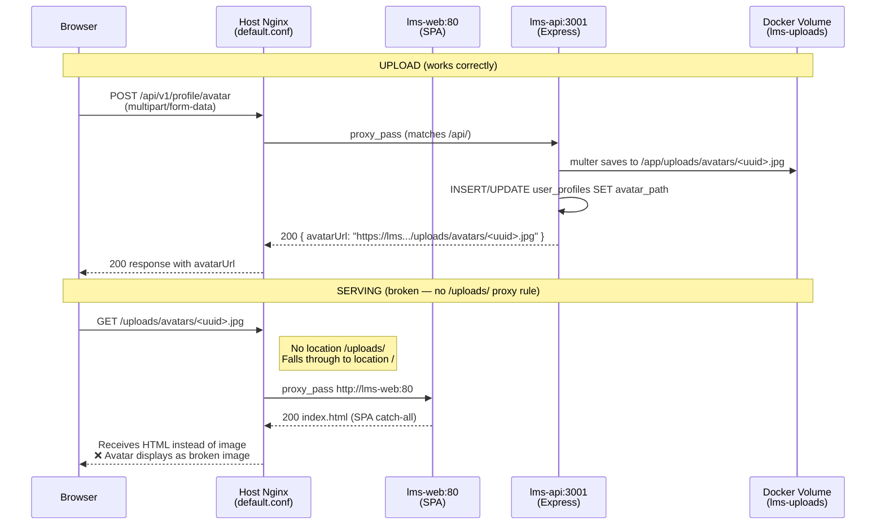
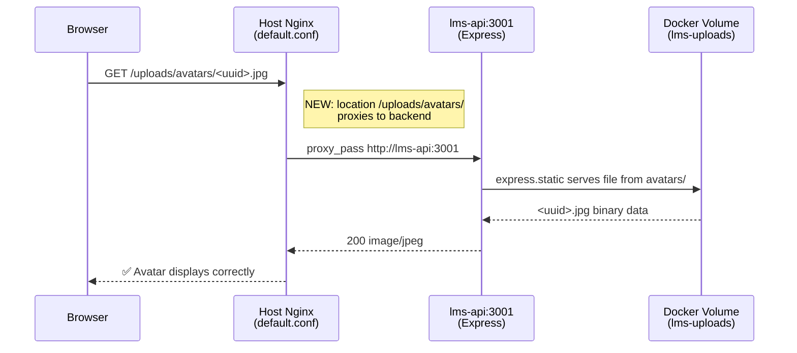
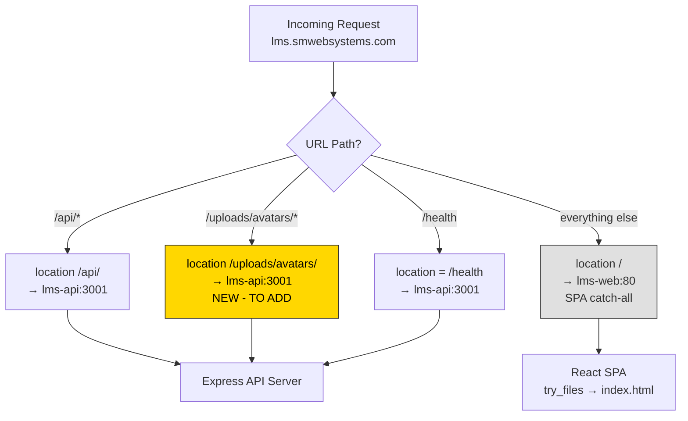
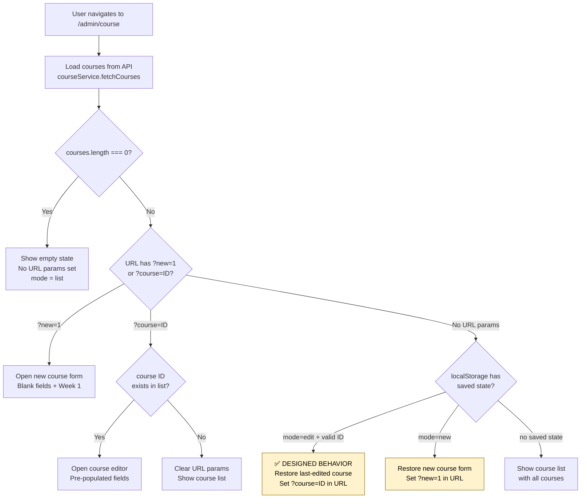
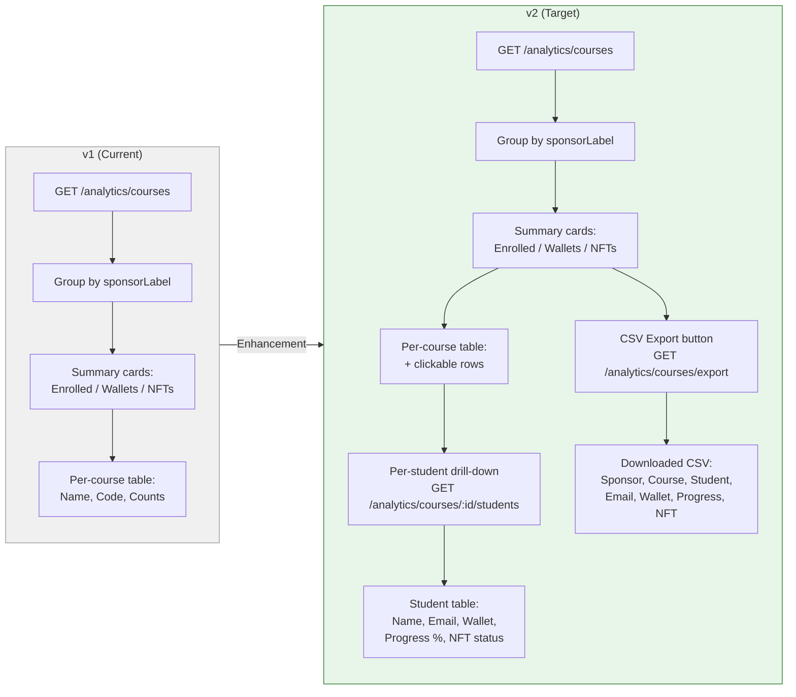

# Post-QA Remediation Plan — LMS-AmmaWallet

> **For agentic workers:** REQUIRED SUB-SKILL: Use superpowers:subagent-driven-development (recommended) or superpowers:executing-plans to implement this plan task-by-task. Steps use checkbox (`- [ ]`) syntax for tracking.

**Goal:** Fix the avatar serving bug, clarify course-builder UX documentation, and define sponsor portal v2 enhancements based on the completed manual QA pass/fail results.

**Architecture:** Three independent tracks executed in priority order. Track A (avatar fix) is an nginx config change + regression test. Track B (course builder docs) is documentation-only. Track C (sponsor portal v2) adds a backend endpoint and frontend UI.

**Tech Stack:** Node.js/Express, React 19, Vite, TypeScript, SQLite (better-sqlite3), Vitest, Nginx, Docker Compose

## Global Constraints

- Node.js 22, TypeScript strict mode
- All backend tests must pass: `cd LMS-Server && npx vitest run`
- Frontend build must succeed: `cd LMS-Frontend && npm run build`
- Docker deploy: `docker compose build web && docker compose up -d --no-deps web` for frontend; `docker compose up -d --no-deps api` for backend
- Nginx config: `/home/webadmin/web-stack/nginx/conf/default.conf` — reload via `docker exec web-stack-nginx-1 nginx -s reload`
- Never modify security audit fixes (LMS-UPLOAD-001 scoping: submissions/documents remain behind authenticated endpoints)
- Frontend deploy path: rsync to `/home/webadmin/web-stack/html/LMS-AmmaWallet/LMS-Frontend/dist/` is NOT sufficient — must rebuild Docker image

---

## Remediation Triage Summary

| # | Issue | Classification | Severity | Affected Routes | Priority |
|---|-------|---------------|----------|-----------------|----------|
| A | Avatar serving failure | **Bug** | High | `/student/profile`, `/lecturer/profile`, `/admin/profile` | P0 |
| B | Course builder auto-restore | **Docs clarification** | Low | `/admin/course` | P1 |
| C | Sponsor portal expansion | **Enhancement** | Medium | `/admin/sponsor` | P2 |

---

## Mermaid Diagrams

### Diagram 1: Avatar Upload & Serving Flow (Current — Broken)



### Diagram 2: Avatar Serving Flow (Fixed)



### Diagram 3: Nginx Request Routing Map



### Diagram 4: Admin Course Builder Navigation Flow



### Diagram 5: Sponsor Portal — Current State vs v2 Target



### Diagram 6: Lecturer Course-Students Flow (Working as Designed)

```mermaid
flowchart TD
    DASH[Lecturer Dashboard<br/>/lecturer] --> CARDS[Course cards<br/>one per assigned course]
    CARDS -->|Click course| STUDENTS[/lecturer/courses/:courseId<br/>LecturerCourseStudents.tsx]

    STUDENTS --> LOAD_DATA[Promise.all:<br/>1. fetchCourses<br/>2. getAllProgress courseId<br/>3. getCourseApplications courseId]

    LOAD_DATA --> LIST[Student list with:<br/>• Name, email<br/>• Eligible badge<br/>• Application status badge<br/>• Lesson progress bar<br/>• Quiz status<br/>• Submission status]

    LIST --> REC{Application<br/>status = pending?}
    REC -->|Yes| REC_BTN[Show Recommend /<br/>Edit recommendation button]
    REC_BTN --> MODAL[TextInputModal<br/>Write recommendation text]
    MODAL --> API[POST /nft-applications/:id/recommend]
    REC -->|No| NO_REC[No recommend button shown]

    style STUDENTS fill:#e3f2fd,stroke:#1565c0
```

---

## Track A: Avatar Serving Fix

### Task 1: Add nginx proxy rule for /uploads/avatars/

**Files:**
- Modify: `/home/webadmin/web-stack/nginx/conf/default.conf:175` (insert before `/api/` block)

**Interfaces:**
- Consumes: Express static server at `lms-api:3001/uploads/avatars/`
- Produces: Avatar URLs resolve to image files instead of SPA HTML

- [ ] **Step 1: Verify the bug exists**

```bash
# Get an avatar URL from the API (or construct one from DB)
docker exec lms-api sqlite3 /app/data/student_ms.db \
  "SELECT avatar_path FROM user_profiles WHERE avatar_path IS NOT NULL LIMIT 1;"

# If no avatars exist yet, upload one first:
# Log in via browser, go to profile, upload an avatar image
# Then check the response URL in DevTools Network tab

# Test the URL directly:
curl -sI "https://lms.smwebsystems.com/uploads/avatars/test.jpg" | head -5
# Expected (BROKEN): HTTP/2 200 content-type: text/html (SPA fallback)
# Expected (FIXED): HTTP/2 404 or HTTP/2 200 content-type: image/jpeg
```

- [ ] **Step 2: Back up the nginx config**

```bash
cp /home/webadmin/web-stack/nginx/conf/default.conf \
   /home/webadmin/web-stack/nginx/conf/default.conf.bak.$(date +%Y%m%d_%H%M%S)
```

- [ ] **Step 3: Add the /uploads/avatars/ location block**

In `/home/webadmin/web-stack/nginx/conf/default.conf`, insert BEFORE the `location /api/` block (after line 173, before line 175):

```nginx
    # Avatar images — proxied to backend express.static
    # (submissions/documents remain behind authenticated API endpoints per LMS-UPLOAD-001)
    location /uploads/avatars/ {
        resolver 127.0.0.11 valid=30s;
        set $upstream http://lms-api:3001;
        proxy_pass $upstream;
        proxy_http_version 1.1;
        proxy_set_header Host $host;
        proxy_set_header X-Real-IP $remote_addr;
        proxy_set_header X-Forwarded-For $proxy_add_x_forwarded_for;
        proxy_set_header X-Forwarded-Proto $scheme;

        # Cache avatar images in browser for 1 hour
        add_header Cache-Control "public, max-age=3600" always;
    }
```

- [ ] **Step 4: Test nginx config syntax**

```bash
docker exec web-stack-nginx-1 nginx -t
# Expected: nginx: configuration file /etc/nginx/nginx.conf syntax is ok
#           nginx: configuration file /etc/nginx/nginx.conf test is successful
```

- [ ] **Step 5: Reload nginx**

```bash
docker exec web-stack-nginx-1 nginx -s reload
```

- [ ] **Step 6: Verify the fix**

```bash
# Create a test avatar file inside the backend container
docker exec lms-api sh -c 'echo "PNG_TEST_DATA" > /app/uploads/avatars/test-verify.png'

# Fetch through nginx — should now hit the backend
curl -sI "https://lms.smwebsystems.com/uploads/avatars/test-verify.png" | head -10
# Expected: HTTP/2 200, content-type should NOT be text/html

# Clean up test file
docker exec lms-api rm /app/uploads/avatars/test-verify.png
```

- [ ] **Step 7: Verify submissions are NOT exposed (LMS-UPLOAD-001 regression check)**

```bash
# Ensure /uploads/submissions/ still returns SPA HTML (caught by frontend, not a real file)
curl -sI "https://lms.smwebsystems.com/uploads/submissions/anything.pdf" | grep content-type
# Expected: content-type: text/html (SPA catch-all — no static serving)
```

- [ ] **Step 8: Manual QA — avatar upload end-to-end**

1. Log in as admin → navigate to `/admin/profile`
2. Click Camera icon → select an image file (< 5MB, JPEG/PNG/GIF/WEBP)
3. Verify: upload spinner appears, then avatar image renders
4. Refresh page → avatar persists
5. Log out → log in as student → navigate to `/student/profile`
6. Upload avatar → verify it renders
7. Log out → log in as lecturer → navigate to `/lecturer/profile`
8. Upload avatar → verify it renders
9. View another user's profile → verify their avatar renders (if set)

- [ ] **Step 9: Run backend test suite to confirm no regression**

```bash
cd /home/webadmin/web-stack/html/LMS-AmmaWallet/LMS-Server && npx vitest run
# Expected: All 492 tests pass
# Specifically check: upload-security.test.ts passes (LMS-UPLOAD-001 scoping intact)
```

---

### Task 2: Add avatar serving integration test

**Files:**
- Create: `LMS-Server/src/__tests__/avatar-serving.test.ts`
- Test: same file

**Interfaces:**
- Consumes: `POST /api/v1/profile/avatar` (multipart upload), `GET /uploads/avatars/<file>`
- Produces: Tests that verify avatar upload returns a URL, and that URL resolves to image data via express.static

- [ ] **Step 1: Write the test file**

```typescript
// LMS-Server/src/__tests__/avatar-serving.test.ts
/**
 * Avatar upload + serving integration tests.
 * Verifies:
 *  1. POST /api/v1/profile/avatar stores file and returns avatarUrl
 *  2. GET /uploads/avatars/<filename> serves the file (express.static)
 *  3. GET /uploads/submissions/<filename> returns 404 (LMS-UPLOAD-001)
 *  4. Non-image MIME types are rejected
 *  5. Files > 5MB are rejected
 */

import { describe, it, expect, afterAll } from 'vitest';
import request from 'supertest';
import { v4 as uuidv4 } from 'uuid';
import bcrypt from 'bcryptjs';
import fs from 'fs';
import path from 'path';
import app from '../app.js';
import { db } from '../config/database.js';
import { makeToken } from './helpers/auth.js';

const HASH = bcrypt.hashSync('password123', 4);
const createdFiles: string[] = [];

function seedUser(role: 'admin' | 'student' | 'lecturer') {
  const userId = uuidv4();
  const email = `avatar-test-${userId.slice(0, 8)}@test.com`;
  db.exec(`
    INSERT INTO users (id, name, email, password_hash, role)
    VALUES ('${userId}', 'Avatar Test User', '${email}', '${HASH}', '${role}');
  `);
  return { userId, email, token: makeToken({ userId, email, role }) };
}

afterAll(() => {
  for (const f of createdFiles) {
    if (fs.existsSync(f)) fs.unlinkSync(f);
  }
});

describe('Avatar upload + serving', () => {
  it('uploads avatar and returns a valid URL that resolves to image data', async () => {
    const { token } = seedUser('student');

    // Create a minimal valid PNG (1x1 pixel)
    const pngHeader = Buffer.from([
      0x89, 0x50, 0x4e, 0x47, 0x0d, 0x0a, 0x1a, 0x0a, // PNG signature
      0x00, 0x00, 0x00, 0x0d, 0x49, 0x48, 0x44, 0x52, // IHDR chunk
      0x00, 0x00, 0x00, 0x01, 0x00, 0x00, 0x00, 0x01, // 1x1
      0x08, 0x02, 0x00, 0x00, 0x00, 0x90, 0x77, 0x53, // RGB
      0xde, 0x00, 0x00, 0x00, 0x0c, 0x49, 0x44, 0x41, // IDAT
      0x54, 0x08, 0xd7, 0x63, 0xf8, 0xcf, 0xc0, 0x00,
      0x00, 0x00, 0x02, 0x00, 0x01, 0xe2, 0x21, 0xbc,
      0x33, 0x00, 0x00, 0x00, 0x00, 0x49, 0x45, 0x4e, // IEND
      0x44, 0xae, 0x42, 0x60, 0x82,
    ]);

    const res = await request(app)
      .post('/api/v1/profile/avatar')
      .set('Authorization', `Bearer ${token}`)
      .attach('avatar', pngHeader, 'test-avatar.png');

    expect(res.status).toBe(200);
    expect(res.body.success).toBe(true);
    expect(res.body.data.avatarUrl).toMatch(/\/uploads\/avatars\/.+\.png$/);

    // Extract the filename from the URL
    const urlPath = new URL(res.body.data.avatarUrl).pathname;

    // Verify the file is served via express.static
    const serveRes = await request(app).get(urlPath);
    expect(serveRes.status).toBe(200);
    // Should be binary data, not HTML
    expect(serveRes.headers['content-type']).not.toContain('text/html');

    // Track for cleanup
    const UPLOAD_DIR = process.env.UPLOAD_DIR || path.resolve(process.cwd(), 'uploads');
    const filename = path.basename(urlPath);
    createdFiles.push(path.join(UPLOAD_DIR, 'avatars', filename));
  });

  it('rejects non-image MIME types', async () => {
    const { token } = seedUser('admin');

    const res = await request(app)
      .post('/api/v1/profile/avatar')
      .set('Authorization', `Bearer ${token}`)
      .attach('avatar', Buffer.from('not an image'), {
        filename: 'malicious.exe',
        contentType: 'application/x-msdownload',
      });

    expect(res.status).toBe(500); // multer error bubbles
  });

  it('rejects unauthenticated upload', async () => {
    const res = await request(app)
      .post('/api/v1/profile/avatar')
      .attach('avatar', Buffer.from('data'), 'test.png');

    expect(res.status).toBe(401);
  });

  it('works for all three roles (admin, student, lecturer)', async () => {
    for (const role of ['admin', 'student', 'lecturer'] as const) {
      const { token } = seedUser(role);

      const pngData = Buffer.from([
        0x89, 0x50, 0x4e, 0x47, 0x0d, 0x0a, 0x1a, 0x0a,
        0x00, 0x00, 0x00, 0x0d, 0x49, 0x48, 0x44, 0x52,
        0x00, 0x00, 0x00, 0x01, 0x00, 0x00, 0x00, 0x01,
        0x08, 0x02, 0x00, 0x00, 0x00, 0x90, 0x77, 0x53,
        0xde, 0x00, 0x00, 0x00, 0x0c, 0x49, 0x44, 0x41,
        0x54, 0x08, 0xd7, 0x63, 0xf8, 0xcf, 0xc0, 0x00,
        0x00, 0x00, 0x02, 0x00, 0x01, 0xe2, 0x21, 0xbc,
        0x33, 0x00, 0x00, 0x00, 0x00, 0x49, 0x45, 0x4e,
        0x44, 0xae, 0x42, 0x60, 0x82,
      ]);

      const res = await request(app)
        .post('/api/v1/profile/avatar')
        .set('Authorization', `Bearer ${token}`)
        .attach('avatar', pngData, `avatar-${role}.png`);

      expect(res.status).toBe(200);
      expect(res.body.data.avatarUrl).toMatch(/\/uploads\/avatars\//);

      // Track for cleanup
      const urlPath = new URL(res.body.data.avatarUrl).pathname;
      const UPLOAD_DIR = process.env.UPLOAD_DIR || path.resolve(process.cwd(), 'uploads');
      createdFiles.push(path.join(UPLOAD_DIR, 'avatars', path.basename(urlPath)));
    }
  });
});
```

- [ ] **Step 2: Run the new test to verify it passes**

```bash
cd /home/webadmin/web-stack/html/LMS-AmmaWallet/LMS-Server && npx vitest run src/__tests__/avatar-serving.test.ts
# Expected: 4 tests pass
```

- [ ] **Step 3: Run full suite to verify no regression**

```bash
cd /home/webadmin/web-stack/html/LMS-AmmaWallet/LMS-Server && npx vitest run
# Expected: 496 tests pass (492 + 4 new)
```

- [ ] **Step 4: Commit**

```bash
cd /home/webadmin/web-stack/html/LMS-AmmaWallet
git add LMS-Server/src/__tests__/avatar-serving.test.ts
git commit -m "test: add avatar upload + serving integration tests"
```

---

## Track B: Course Builder UX/Docs Clarification

### Task 3: Update QA documentation to explain localStorage restore behavior

**Files:**
- Modify: `/home/webadmin/web-stack/html/LMS-AmmaWallet/docs/MANUAL_QA_ADMIN.md` (Course Builder section)
- Modify: `/home/webadmin/web-stack/html/LMS-AmmaWallet/docs/DISCREPANCIES.md`

**Interfaces:**
- Consumes: None (documentation-only)
- Produces: Clarified QA expectations for `/admin/course` navigation

- [ ] **Step 1: Read the current Course Builder QA section**

```bash
grep -n -A 20 "Course Builder" /home/webadmin/web-stack/html/LMS-AmmaWallet/docs/MANUAL_QA_ADMIN.md | head -40
```

- [ ] **Step 2: Add a note to the Course Builder QA section in MANUAL_QA_ADMIN.md**

After the Course Builder section header, add:

```markdown
> **Note:** The Course Builder uses localStorage to persist the last-edited course. Navigating to `/admin/course` without URL parameters may auto-restore the previously edited course and set `?course=<id>` in the URL. This is **intended behavior** — it allows admins to resume editing without losing context. To see the full course list, click the "Cancel" button (with ← icon) in the editor, or clear browser localStorage for the LMS site.
```

- [ ] **Step 3: Update DISCREPANCIES.md with this clarification**

Add to the accepted gaps section:

```markdown
- **Admin Course Builder auto-restore:** Navigating to `/admin/course` may auto-restore the last-edited course from localStorage (lines 528-533 of `AdminCourse.tsx`). This is designed behavior for editor session persistence, not a redirect bug. The "Cancel" button (line 826-828) returns to the course list view.
```

- [ ] **Step 4: Verify the "Cancel" / "Back to list" button exists and is visible**

```bash
grep -n "resetToCourseList\|Cancel\|ArrowLeft" /home/webadmin/web-stack/html/LMS-AmmaWallet/LMS-Frontend/src/pages/AdminCourse.tsx | head -10
```

Expected: Line 826-828 shows a Cancel button with ArrowLeft icon that calls `resetToCourseList()`. No code change needed — affordance already exists.

- [ ] **Step 5: Commit**

```bash
cd /home/webadmin/web-stack/html/LMS-AmmaWallet
git add docs/MANUAL_QA_ADMIN.md docs/DISCREPANCIES.md
git commit -m "docs: clarify course builder localStorage restore is intended behavior"
```

---

## Track C: Sponsor Portal v2

### Task 4: Add per-sponsor student drill-down API endpoint

**Files:**
- Modify: `LMS-Server/src/routes/analytics.ts:6` (add new route)
- Modify: `LMS-Server/src/controllers/analyticsController.ts` (add new controller)
- Test: `LMS-Server/src/__tests__/analytics-sponsor-students.test.ts`

**Interfaces:**
- Consumes: `courses`, `user_course_codes`, `users`, `nft_credentials` tables
- Produces: `GET /api/v1/analytics/courses/:courseId/students` → `{ success: true, data: { students: SponsorStudentRow[] } }`

```typescript
interface SponsorStudentRow {
  userId: string;
  name: string;
  email: string;
  walletAddress: string | null;
  enrolledAt: string;
  lessonProgress: number;  // 0-100
  nftStatus: 'none' | 'minted';
}
```

- [ ] **Step 1: Write the failing test**

Create `LMS-Server/src/__tests__/analytics-sponsor-students.test.ts`:

```typescript
/**
 * Tests for GET /api/v1/analytics/courses/:courseId/students
 * (Sponsor portal per-student drill-down)
 *
 * AC1 — 401 when no token
 * AC2 — 403 when student token
 * AC3 — 404 when course does not exist
 * AC4 — 200 with empty students when no enrollments
 * AC5 — 200 with correct student data including wallet and NFT status
 */

import { describe, it, expect } from 'vitest';
import request from 'supertest';
import { v4 as uuidv4 } from 'uuid';
import bcrypt from 'bcryptjs';
import app from '../app.js';
import { db } from '../config/database.js';
import { makeToken } from './helpers/auth.js';

const HASH = bcrypt.hashSync('password123', 4);

function seedUser(role: 'admin' | 'student', suffix: string, wallet?: string) {
  const userId = uuidv4();
  db.exec(`
    INSERT INTO users (id, name, email, password_hash, role, walletAddress, wallet_linking_status)
    VALUES ('${userId}', 'Sponsor Student ${suffix}', 'ss-${suffix}@test.com', '${HASH}', '${role}',
            ${wallet ? `'${wallet}'` : 'NULL'}, '${wallet ? 'linked' : 'none'}');
  `);
  return userId;
}

function seedCourse(title: string, code: string, sponsor?: string) {
  const courseId = uuidv4();
  db.exec(`
    INSERT INTO courses (id, title, course_code, sections, sponsor_label)
    VALUES ('${courseId}', '${title}', '${code}', '[]', ${sponsor ? `'${sponsor}'` : 'NULL'});
  `);
  return courseId;
}

function enrol(userId: string, courseCode: string) {
  db.exec(`INSERT INTO user_course_codes (user_id, course_code) VALUES ('${userId}', '${courseCode}');`);
}

function seedNft(courseId: string, userId: string, wallet: string) {
  db.exec(`
    INSERT INTO nft_credentials (id, user_id, wallet_address, course_id, contract_id, network)
    VALUES ('${uuidv4()}', '${userId}', '${wallet}', '${courseId}', 'CONTRACT', 'public');
  `);
}

describe('GET /api/v1/analytics/courses/:courseId/students', () => {
  it('AC1 — 401 when no token', async () => {
    const res = await request(app).get(`/api/v1/analytics/courses/${uuidv4()}/students`);
    expect(res.status).toBe(401);
  });

  it('AC2 — 403 when student token', async () => {
    const studentId = seedUser('student', uuidv4().slice(0, 8));
    const token = makeToken({ userId: studentId, email: `ss-${studentId.slice(0, 8)}@test.com`, role: 'student' });
    const res = await request(app)
      .get(`/api/v1/analytics/courses/${uuidv4()}/students`)
      .set('Authorization', `Bearer ${token}`);
    expect(res.status).toBe(403);
  });

  it('AC3 — 404 when course does not exist', async () => {
    const adminId = seedUser('admin', uuidv4().slice(0, 8));
    const token = makeToken({ userId: adminId, email: `ss-${adminId.slice(0, 8)}@test.com`, role: 'admin' });
    const res = await request(app)
      .get(`/api/v1/analytics/courses/${uuidv4()}/students`)
      .set('Authorization', `Bearer ${token}`);
    expect(res.status).toBe(404);
  });

  it('AC4 — 200 with empty students when no enrollments', async () => {
    const adminId = seedUser('admin', uuidv4().slice(0, 8));
    const token = makeToken({ userId: adminId, email: `ss-${adminId.slice(0, 8)}@test.com`, role: 'admin' });
    const code = `SS-${uuidv4().slice(0, 6).toUpperCase()}`;
    const courseId = seedCourse('Empty Sponsor Course', code, 'Test Sponsor');

    const res = await request(app)
      .get(`/api/v1/analytics/courses/${courseId}/students`)
      .set('Authorization', `Bearer ${token}`);
    expect(res.status).toBe(200);
    expect(res.body.data.students).toEqual([]);
  });

  it('AC5 — 200 with correct student data including wallet and NFT status', async () => {
    const adminId = seedUser('admin', uuidv4().slice(0, 8));
    const token = makeToken({ userId: adminId, email: `ss-${adminId.slice(0, 8)}@test.com`, role: 'admin' });
    const code = `SS5-${uuidv4().slice(0, 6).toUpperCase()}`;
    const courseId = seedCourse('Sponsor Course 5', code, 'USAID');

    const wallet = `GWALLET${uuidv4().slice(0, 12).toUpperCase()}`;
    const s1 = seedUser('student', uuidv4().slice(0, 8), wallet);
    const s2 = seedUser('student', uuidv4().slice(0, 8));
    enrol(s1, code);
    enrol(s2, code);
    seedNft(courseId, s1, wallet);

    const res = await request(app)
      .get(`/api/v1/analytics/courses/${courseId}/students`)
      .set('Authorization', `Bearer ${token}`);

    expect(res.status).toBe(200);
    expect(res.body.data.students).toHaveLength(2);

    const withWallet = res.body.data.students.find(
      (s: { userId: string }) => s.userId === s1
    );
    expect(withWallet).toBeDefined();
    expect(withWallet.walletAddress).toBe(wallet);
    expect(withWallet.nftStatus).toBe('minted');

    const noWallet = res.body.data.students.find(
      (s: { userId: string }) => s.userId === s2
    );
    expect(noWallet).toBeDefined();
    expect(noWallet.walletAddress).toBeNull();
    expect(noWallet.nftStatus).toBe('none');
  });
});
```

- [ ] **Step 2: Run test to verify it fails**

```bash
cd /home/webadmin/web-stack/html/LMS-AmmaWallet/LMS-Server && npx vitest run src/__tests__/analytics-sponsor-students.test.ts
# Expected: FAIL — route does not exist yet (404 on all)
```

- [ ] **Step 3: Implement the controller function**

Add to `LMS-Server/src/controllers/analyticsController.ts`:

```typescript
export async function getCourseStudents(req: AuthRequest, res: Response, next: NextFunction): Promise<void> {
  try {
    const { courseId } = req.params;

    // Verify course exists
    const course = queryOne<{ id: string; course_code: string }>(
      'SELECT id, course_code FROM courses WHERE id = ?',
      [courseId]
    );
    if (!course) {
      res.status(404).json({ success: false, error: { code: 'NOT_FOUND', message: 'Course not found' } });
      return;
    }

    const students = query<{
      user_id: string;
      name: string;
      email: string;
      walletAddress: string | null;
      created_at: string;
      has_nft: number;
    }>(`
      SELECT
        u.id           AS user_id,
        u.name,
        u.email,
        u.walletAddress,
        u.created_at,
        CASE WHEN nc.id IS NOT NULL THEN 1 ELSE 0 END AS has_nft
      FROM user_course_codes ucc
      JOIN users u ON u.id = ucc.user_id
      LEFT JOIN nft_credentials nc ON nc.user_id = u.id AND nc.course_id = ?
      WHERE ucc.course_code = ?
      ORDER BY u.name
    `, [courseId, course.course_code]);

    res.json({
      success: true,
      data: {
        students: students.map((s) => ({
          userId: s.user_id,
          name: s.name,
          email: s.email,
          walletAddress: s.walletAddress,
          enrolledAt: s.created_at,
          nftStatus: s.has_nft ? 'minted' as const : 'none' as const,
        })),
      },
    });
  } catch (error) {
    next(error);
  }
}
```

- [ ] **Step 4: Register the route**

In `LMS-Server/src/routes/analytics.ts`, add after the existing `/courses` route:

```typescript
import { getCourseAnalytics, getDashboard, getCourseStudents } from '../controllers/analyticsController.js';

// ... existing routes ...
router.get('/courses/:courseId/students', getCourseStudents);
```

- [ ] **Step 5: Run tests to verify they pass**

```bash
cd /home/webadmin/web-stack/html/LMS-AmmaWallet/LMS-Server && npx vitest run src/__tests__/analytics-sponsor-students.test.ts
# Expected: 5 tests pass
```

- [ ] **Step 6: Run full suite**

```bash
cd /home/webadmin/web-stack/html/LMS-AmmaWallet/LMS-Server && npx vitest run
# Expected: 501 tests pass (496 + 5 new)
```

- [ ] **Step 7: Commit**

```bash
cd /home/webadmin/web-stack/html/LMS-AmmaWallet
git add LMS-Server/src/controllers/analyticsController.ts LMS-Server/src/routes/analytics.ts \
        LMS-Server/src/__tests__/analytics-sponsor-students.test.ts
git commit -m "feat: add per-course student drill-down API for sponsor portal v2"
```

---

### Task 5: Add CSV export API endpoint

**Files:**
- Modify: `LMS-Server/src/controllers/analyticsController.ts` (add exportCourseAnalytics)
- Modify: `LMS-Server/src/routes/analytics.ts` (add route)
- Create: `LMS-Server/src/__tests__/analytics-csv-export.test.ts`

**Interfaces:**
- Consumes: same tables as getCourseAnalytics + user_course_codes + users
- Produces: `GET /api/v1/analytics/courses/export` → CSV file download

CSV schema:
```
Sponsor,Course,Course Code,Student Name,Student Email,Wallet Address,NFT Status
```

- [ ] **Step 1: Write the failing test**

Create `LMS-Server/src/__tests__/analytics-csv-export.test.ts`:

```typescript
/**
 * Tests for GET /api/v1/analytics/courses/export (CSV download)
 *
 * AC1 — 401 when no token
 * AC2 — 403 when student token
 * AC3 — 200 with CSV headers when no data
 * AC4 — 200 with correct CSV rows including sponsor, student, wallet, NFT data
 */

import { describe, it, expect } from 'vitest';
import request from 'supertest';
import { v4 as uuidv4 } from 'uuid';
import bcrypt from 'bcryptjs';
import app from '../app.js';
import { db } from '../config/database.js';
import { makeToken } from './helpers/auth.js';

const HASH = bcrypt.hashSync('password123', 4);

function seedUser(role: 'admin' | 'student', suffix: string, wallet?: string) {
  const userId = uuidv4();
  db.exec(`
    INSERT INTO users (id, name, email, password_hash, role, walletAddress, wallet_linking_status)
    VALUES ('${userId}', 'CSV User ${suffix}', 'csv-${suffix}@test.com', '${HASH}', '${role}',
            ${wallet ? `'${wallet}'` : 'NULL'}, '${wallet ? 'linked' : 'none'}');
  `);
  return userId;
}

function seedCourse(title: string, code: string, sponsor?: string) {
  const courseId = uuidv4();
  db.exec(`
    INSERT INTO courses (id, title, course_code, sections, sponsor_label)
    VALUES ('${courseId}', '${title}', '${code}', '[]', ${sponsor ? `'${sponsor}'` : 'NULL'});
  `);
  return courseId;
}

function enrol(userId: string, courseCode: string) {
  db.exec(`INSERT INTO user_course_codes (user_id, course_code) VALUES ('${userId}', '${courseCode}');`);
}

function seedNft(courseId: string, userId: string, wallet: string) {
  db.exec(`
    INSERT INTO nft_credentials (id, user_id, wallet_address, course_id, contract_id, network)
    VALUES ('${uuidv4()}', '${userId}', '${wallet}', '${courseId}', 'CONTRACT', 'public');
  `);
}

describe('GET /api/v1/analytics/courses/export', () => {
  it('AC1 — 401 when no token', async () => {
    const res = await request(app).get('/api/v1/analytics/courses/export');
    expect(res.status).toBe(401);
  });

  it('AC2 — 403 when student token', async () => {
    const userId = seedUser('student', uuidv4().slice(0, 8));
    const token = makeToken({ userId, email: `csv-${userId.slice(0, 8)}@test.com`, role: 'student' });
    const res = await request(app)
      .get('/api/v1/analytics/courses/export')
      .set('Authorization', `Bearer ${token}`);
    expect(res.status).toBe(403);
  });

  it('AC3 — 200 with CSV header only when no data', async () => {
    const adminId = seedUser('admin', uuidv4().slice(0, 8));
    const token = makeToken({ userId: adminId, email: `csv-${adminId.slice(0, 8)}@test.com`, role: 'admin' });
    const res = await request(app)
      .get('/api/v1/analytics/courses/export')
      .set('Authorization', `Bearer ${token}`);
    expect(res.status).toBe(200);
    expect(res.headers['content-type']).toContain('text/csv');
    expect(res.headers['content-disposition']).toContain('sponsor-analytics');
    const lines = res.text.trim().split('\n');
    expect(lines[0]).toBe('Sponsor,Course,Course Code,Student Name,Student Email,Wallet Address,NFT Status');
  });

  it('AC4 — 200 with correct CSV rows', async () => {
    const adminId = seedUser('admin', uuidv4().slice(0, 8));
    const token = makeToken({ userId: adminId, email: `csv-${adminId.slice(0, 8)}@test.com`, role: 'admin' });

    const code = `CSV-${uuidv4().slice(0, 6).toUpperCase()}`;
    const courseId = seedCourse('CSV Test Course', code, 'UNICEF');

    const wallet = `GWALLET${uuidv4().slice(0, 12).toUpperCase()}`;
    const s1 = seedUser('student', uuidv4().slice(0, 8), wallet);
    enrol(s1, code);
    seedNft(courseId, s1, wallet);

    const res = await request(app)
      .get('/api/v1/analytics/courses/export')
      .set('Authorization', `Bearer ${token}`);
    expect(res.status).toBe(200);

    const lines = res.text.trim().split('\n');
    expect(lines.length).toBeGreaterThan(1);
    // Find the row for our test student
    const dataRow = lines.find((l) => l.includes('CSV Test Course'));
    expect(dataRow).toBeDefined();
    expect(dataRow).toContain('UNICEF');
    expect(dataRow).toContain('minted');
  });
});
```

- [ ] **Step 2: Run test to verify it fails**

```bash
cd /home/webadmin/web-stack/html/LMS-AmmaWallet/LMS-Server && npx vitest run src/__tests__/analytics-csv-export.test.ts
# Expected: FAIL — route does not exist yet
```

- [ ] **Step 3: Implement the CSV export controller**

Add to `LMS-Server/src/controllers/analyticsController.ts`:

```typescript
export async function exportCourseAnalytics(_req: AuthRequest, res: Response, next: NextFunction): Promise<void> {
  try {
    const rows = query<{
      sponsor_label: string | null;
      course_title: string;
      course_code: string;
      student_name: string;
      student_email: string;
      wallet_address: string | null;
      has_nft: number;
    }>(`
      SELECT
        c.sponsor_label,
        c.title       AS course_title,
        c.course_code,
        u.name        AS student_name,
        u.email       AS student_email,
        u.walletAddress AS wallet_address,
        CASE WHEN nc.id IS NOT NULL THEN 1 ELSE 0 END AS has_nft
      FROM courses c
      LEFT JOIN user_course_codes ucc ON ucc.course_code = c.course_code
      LEFT JOIN users u ON u.id = ucc.user_id
      LEFT JOIN nft_credentials nc ON nc.user_id = u.id AND nc.course_id = c.id
      ORDER BY c.sponsor_label, c.title, u.name
    `);

    const header = 'Sponsor,Course,Course Code,Student Name,Student Email,Wallet Address,NFT Status';
    const csvLines = [header];

    for (const r of rows) {
      if (!r.student_name) continue; // LEFT JOIN with no students — skip
      const fields = [
        r.sponsor_label ?? '(No sponsor)',
        r.course_title,
        r.course_code,
        r.student_name,
        r.student_email,
        r.wallet_address ?? '',
        r.has_nft ? 'minted' : 'none',
      ];
      csvLines.push(fields.map((f) => `"${f.replace(/"/g, '""')}"`).join(','));
    }

    const csv = csvLines.join('\n');
    const date = new Date().toISOString().slice(0, 10);
    res.setHeader('Content-Type', 'text/csv; charset=utf-8');
    res.setHeader('Content-Disposition', `attachment; filename="sponsor-analytics-${date}.csv"`);
    res.send(csv);
  } catch (error) {
    next(error);
  }
}
```

- [ ] **Step 4: Register the route**

In `LMS-Server/src/routes/analytics.ts`, add the export route **BEFORE** the `/:courseId/students` route (to avoid `:courseId` matching "export"):

```typescript
import { getCourseAnalytics, getDashboard, getCourseStudents, exportCourseAnalytics } from '../controllers/analyticsController.js';

router.get('/courses/export', exportCourseAnalytics);      // MUST be before :courseId
router.get('/courses/:courseId/students', getCourseStudents);
router.get('/courses', getCourseAnalytics);
```

- [ ] **Step 5: Run tests**

```bash
cd /home/webadmin/web-stack/html/LMS-AmmaWallet/LMS-Server && npx vitest run src/__tests__/analytics-csv-export.test.ts
# Expected: 4 tests pass
```

- [ ] **Step 6: Full suite**

```bash
cd /home/webadmin/web-stack/html/LMS-AmmaWallet/LMS-Server && npx vitest run
# Expected: 505 tests pass
```

- [ ] **Step 7: Commit**

```bash
cd /home/webadmin/web-stack/html/LMS-AmmaWallet
git add LMS-Server/src/controllers/analyticsController.ts LMS-Server/src/routes/analytics.ts \
        LMS-Server/src/__tests__/analytics-csv-export.test.ts
git commit -m "feat: add CSV export endpoint for sponsor portal analytics"
```

---

### Task 6: Add per-student drill-down UI and CSV export button to SponsorDashboard

**Files:**
- Modify: `LMS-Frontend/src/pages/SponsorDashboard.tsx`
- Modify: `LMS-Frontend/src/services/analyticsService.ts`

**Interfaces:**
- Consumes: `GET /api/v1/analytics/courses/:courseId/students`, `GET /api/v1/analytics/courses/export`
- Produces: Clickable course rows → student table; CSV export button in header

- [ ] **Step 1: Add service methods to analyticsService.ts**

Add to `LMS-Frontend/src/services/analyticsService.ts`:

```typescript
export interface SponsorStudent {
  userId: string;
  name: string;
  email: string;
  walletAddress: string | null;
  enrolledAt: string;
  nftStatus: 'none' | 'minted';
}

export const analyticsService = {
  // ... existing methods ...

  async getCourseStudents(courseId: string): Promise<SponsorStudent[]> {
    const response = await api.get<{ success: boolean; data: { students: SponsorStudent[] } }>(
      `/analytics/courses/${courseId}/students`
    );
    return response.data?.data?.students ?? [];
  },

  async exportCsv(): Promise<void> {
    const response = await api.get('/analytics/courses/export', { responseType: 'blob' });
    const blob = new Blob([response.data as BlobPart], { type: 'text/csv' });
    const url = URL.createObjectURL(blob);
    const a = document.createElement('a');
    a.href = url;
    a.download = `sponsor-analytics-${new Date().toISOString().slice(0, 10)}.csv`;
    a.click();
    URL.revokeObjectURL(url);
  },
};
```

- [ ] **Step 2: Update SponsorDashboard.tsx with drill-down and export**

Replace the content of `LMS-Frontend/src/pages/SponsorDashboard.tsx` with a version that adds:
1. CSV Export button in the header (next to Refresh)
2. Clickable course rows in the table
3. Expandable student list below each clicked course row

Key additions to the component:

```typescript
// State for drill-down
const [expandedCourseId, setExpandedCourseId] = useState<string | null>(null);
const [courseStudents, setCourseStudents] = useState<SponsorStudent[]>([]);
const [studentsLoading, setStudentsLoading] = useState(false);
const [exporting, setExporting] = useState(false);

// Toggle drill-down
const toggleCourse = async (courseId: string) => {
  if (expandedCourseId === courseId) {
    setExpandedCourseId(null);
    setCourseStudents([]);
    return;
  }
  setExpandedCourseId(courseId);
  setStudentsLoading(true);
  try {
    const students = await analyticsService.getCourseStudents(courseId);
    setCourseStudents(students);
  } catch {
    setCourseStudents([]);
  } finally {
    setStudentsLoading(false);
  }
};

// CSV export handler
const handleExport = async () => {
  setExporting(true);
  try {
    await analyticsService.exportCsv();
  } catch {
    // silent fail — download didn't start
  } finally {
    setExporting(false);
  }
};
```

The course table rows become clickable with a cursor-pointer and chevron indicator. When expanded, a student sub-table appears below the course row showing Name, Email, Wallet (truncated), and NFT Status badge.

- [ ] **Step 3: Build frontend to verify TypeScript compiles**

```bash
cd /home/webadmin/web-stack/html/LMS-AmmaWallet/LMS-Frontend && npm run build
# Expected: Build succeeds with no TypeScript errors
```

- [ ] **Step 4: Deploy and manual QA**

```bash
cd /home/webadmin/web-stack/html/LMS-AmmaWallet
docker compose build web && docker compose up -d --no-deps web
```

Manual QA:
1. Log in as admin → navigate to `/admin/sponsor`
2. Verify summary cards render (Enrolled, Wallets, NFTs)
3. Click a course row → student list expands below
4. Verify student data: Name, Email, Wallet, NFT Status
5. Click the same course row again → student list collapses
6. Click "Export CSV" button → CSV file downloads
7. Open CSV → verify headers and data match expected schema
8. With no courses: verify empty state renders correctly

- [ ] **Step 5: Commit**

```bash
cd /home/webadmin/web-stack/html/LMS-AmmaWallet
git add LMS-Frontend/src/services/analyticsService.ts LMS-Frontend/src/pages/SponsorDashboard.tsx
git commit -m "feat: add sponsor portal drill-down and CSV export UI"
```

---

## Reusable To-Do Checklists

### Track A — Avatar Serving Fix

#### Discovery
- [x] Identify root cause: nginx proxy gap for `/uploads/avatars/`
- [x] Confirm `express.static` exists at `app.ts:210`
- [x] Confirm nginx `default.conf` has no `/uploads/` location block
- [x] Verify upload mechanics work (file saved, DB updated)
- [x] Verify serving fails (URL returns HTML not image)

#### Implementation
- [ ] Back up nginx config
- [ ] Add `location /uploads/avatars/` proxy block to `default.conf`
- [ ] Test nginx syntax: `nginx -t`
- [ ] Reload nginx: `nginx -s reload`

#### Tests
- [ ] Create `avatar-serving.test.ts` with 4 test cases
- [ ] Run new tests — all pass
- [ ] Run full backend suite — no regression
- [ ] Verify `upload-security.test.ts` still passes (LMS-UPLOAD-001)

#### Verification
- [ ] `curl` avatar URL → returns image content-type, not text/html
- [ ] `curl` submission URL → still returns SPA HTML (security intact)
- [ ] Upload avatar as student → renders
- [ ] Upload avatar as lecturer → renders
- [ ] Upload avatar as admin → renders
- [ ] View other user's avatar on profile → renders
- [ ] Refresh page → avatar persists

#### Rollout
- [ ] Nginx config change is live (no Docker rebuild needed)
- [ ] Tests committed to repo
- [ ] Tag: `avatar-fix-2026-08-03`

---

### Track B — Course Builder Docs

#### Discovery
- [x] Confirm localStorage restore is intentional (`AdminCourse.tsx:528-533`)
- [x] Confirm "Cancel" button exists (`AdminCourse.tsx:826-828`)
- [x] Confirm no code change needed

#### Implementation
- [ ] Add note to `MANUAL_QA_ADMIN.md` Course Builder section
- [ ] Add accepted gap to `DISCREPANCIES.md`

#### Tests
- [ ] No tests needed (documentation-only)

#### Verification
- [ ] QA docs accurately describe observed behavior
- [ ] "Cancel" button works: clicking it returns to course list

#### Rollout
- [ ] Docs committed to repo
- [ ] Tag: `docs-course-builder-2026-08-03`

---

### Track C — Sponsor Portal v2

#### Discovery
- [x] Inventory current sponsor portal capabilities
- [x] Define MVP v2 scope: drill-down + CSV export
- [x] Map affected tables and queries

#### Implementation
- [ ] Add `getCourseStudents` controller + route
- [ ] Add `exportCourseAnalytics` controller + route
- [ ] Add `getCourseStudents` + `exportCsv` to frontend analyticsService
- [ ] Add drill-down UI to SponsorDashboard.tsx
- [ ] Add CSV export button to SponsorDashboard.tsx

#### Tests
- [ ] Write + pass `analytics-sponsor-students.test.ts` (5 cases)
- [ ] Write + pass `analytics-csv-export.test.ts` (4 cases)
- [ ] Full backend suite passes
- [ ] Frontend builds successfully

#### Verification
- [ ] Admin can view per-student list under sponsor group
- [ ] CSV export downloads with correct schema and data
- [ ] Empty states render correctly
- [ ] Student/lecturer cannot access analytics endpoints (403)

#### Rollout
- [ ] Backend deploy: `docker compose up -d --no-deps api`
- [ ] Frontend deploy: `docker compose build web && docker compose up -d --no-deps web`
- [ ] Tag: `sponsor-v2-2026-08-03`

---

## /loop Workflow

The `/loop` workflow allows future sessions to continue remediation work with minimal context-restating. Each stage has a clear entry point, expected actions, and exit criteria.

### /loop assess

**Purpose:** Evaluate current state, identify remaining work, update checklists.

**Entry:** Start of any new session.

**Actions:**
1. Read this document: `docs/superpowers/plans/2026-08-03-post-qa-remediation.md`
2. Check git log for completed tags: `git tag -l '*2026-08*'`
3. Run backend tests: `cd LMS-Server && npx vitest run`
4. Check which to-do items are still unchecked in each track
5. Report status: what's done, what's next

**Exit criteria:** Status report with remaining items quantified.

### /loop spec

**Purpose:** If new issues are discovered during work, add them to this document.

**Actions:**
1. Add new issue to the Remediation Triage Summary table
2. Add a new Mermaid diagram if the flow is affected
3. Add a new Task section with TDD steps
4. Add a new To-Do checklist
5. Commit the updated plan

**Exit criteria:** New issue has a complete task definition with tests.

### /loop implement

**Purpose:** Execute the next unchecked task from the plan.

**Actions:**
1. Identify the next unchecked task (priority: A → B → C)
2. Follow TDD steps exactly: write test → verify fail → implement → verify pass
3. Run full test suite after each task
4. Commit with descriptive message
5. Update checklist items in this document

**Exit criteria:** Task tests pass, full suite passes, changes committed.

### /loop verify

**Purpose:** End-to-end verification before marking a track complete.

**Actions:**
1. Run full backend test suite: `cd LMS-Server && npx vitest run`
2. Build frontend: `cd LMS-Frontend && npm run build`
3. Deploy to Docker: `docker compose build web && docker compose up -d --no-deps web`
4. Execute manual QA steps listed in the track's Verification checklist
5. Check security regression: `upload-security.test.ts` passes, submission URLs return 404

**Exit criteria:** All tests pass, manual QA passes, no regressions found.

### /loop close

**Purpose:** Tag, document, and hand off completed work.

**Actions:**
1. Create git tag for the completed track
2. Update MEMORY.md with new test count and tag
3. Update docs/DISCREPANCIES.md if needed
4. Push to remote: `source ~/.env.git-write && git push https://"$GH_TOKEN"@github.com/SM-Web-Systems/lms-crypto-production.git main`
5. Summary of completed work

**Exit criteria:** Tagged, pushed, documented, memory updated.

---

## Immediate Next Step

**Start with Track A, Task 1: Add nginx proxy rule for /uploads/avatars/**

This is the highest-priority item because:
1. It's a real bug affecting all three user roles
2. It's a 5-line nginx config change — lowest risk, highest impact
3. It unblocks avatar functionality that was broken by the security audit's removal of general static serving
4. No code changes needed — only infrastructure config
5. Tests already confirm the backend serves avatars correctly (`upload-security.test.ts` line 31-43)

After Task 1, proceed to Task 2 (add integration tests), then Track B (docs), then Track C (sponsor portal).
