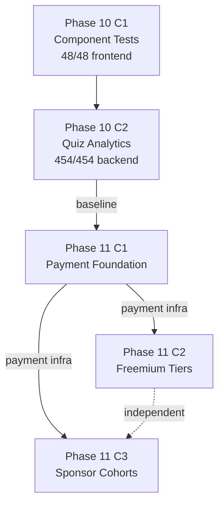
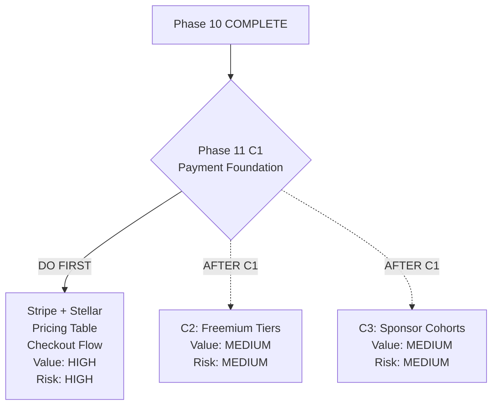
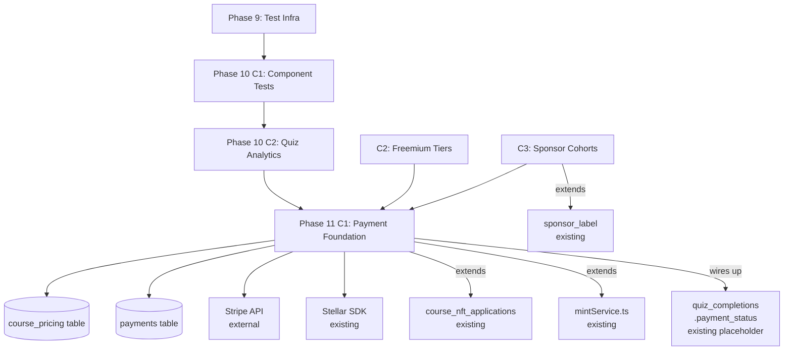
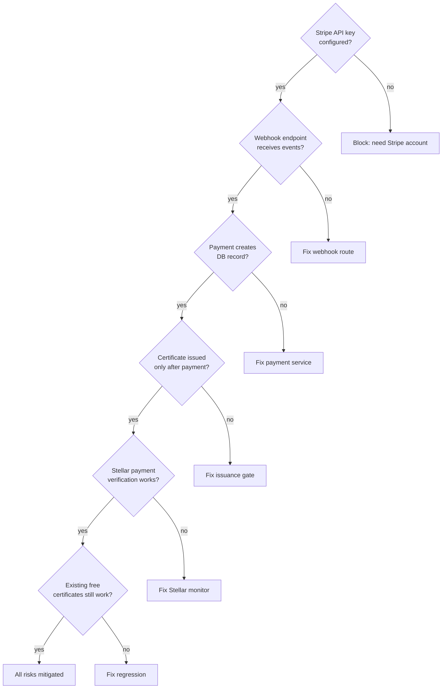

# Phase 10 Release Closeout + Phase 11 Spec Kickoff

**Date:** 2026-08-04

---

## Phase 10 Release Closeout

### Shipped Features

| Phase | Feature | Tests Added | Commit | Tag |
|-------|---------|-------------|--------|-----|
| C1 | AnnouncementsPanel tests (10 cases) | 10 | `46b5afd` | `phase10-c1-complete-2026-08-04` |
| C1 | InlineQuizTaker tests (8 cases) | 8 | `46b5afd` | — |
| C2 | Quiz analytics backend endpoint (`GET /analytics/quizzes`) | 6 | `ab282c6` | `phase10-c2-complete-2026-08-04` |
| C2 | QuizAnalyticsPanel component (table in AdminDashboard) | 5 | `ab282c6` | — |
| C2 | analyticsService.getQuizAnalytics() | — | `ab282c6` | — |

**Total frontend tests: 48/48 PASS** (25 baseline → 43 after C1 → 48 after C2)
**Backend tests: 454/454 PASS** (448 baseline → 454 after C2)
**Production code changes: C1 = none (test-only), C2 = 4 files (endpoint + component + service + dashboard)**

### Verification Summary (Both Phases)

| Gate | C1 | C2 |
|------|----|-----|
| Frontend tsc | PASS | PASS |
| Frontend vitest | 43/43 | 48/48 |
| Backend vitest | 448/448 | 454/454 |
| Vite build | PASS | PASS |
| Docker build | PASS | PASS (api + web) |
| HTTP 200 | PASS | PASS |
| Health 200 | PASS | PASS |

### Rollback Note

- C1: `git revert 815ce87` (removes component tests only — safe)
- C2: `git revert 7ee32b3` (removes quiz analytics endpoint + component)
- Both reverts are safe and independent

### Manual QA Status

- C1: Not required (test-only, zero production changes)
- C2: Quiz analytics panel verified live on AdminDashboard after deploy

### New Patterns Established in Phase 10

| Pattern | Introduced In | Used For |
|---------|--------------|----------|
| Multi-service mocking | C1 | Components with multiple service deps |
| `vi.mock('../../context/useAuth')` | C1 | Context hook mocking |
| `vi.spyOn(window, 'confirm')` | C1 | Delete confirmation testing |
| State machine traversal | C1 | Multi-phase UI testing |
| Backend analytics endpoint testing | C2 | Supertest + seeded data |
| Component + service mock pattern | C2 | Self-contained panel testing |

---

## Phase 11 Spec Kickoff

### Context

Phase 10 established quiz analytics and expanded frontend test coverage. Phase 11 introduces the platform's first revenue feature: certificate monetization. This is the highest-value, highest-risk work deferred since Phase 9 candidate ranking.

The LMS currently issues NFT certificates for free via a complete pipeline: eligibility → application → admin approval → Soroban mint. Phase 11 adds a payment gate between approval and minting, with dual payment rails (Stripe + Stellar native).

### Scope

- **C1:** Payment foundation — pricing table, dual payment rails (Stripe + Stellar), student checkout flow
- **C2:** Freemium tiers — free basic badge vs paid verified NFT certificate
- **C3:** Sponsor cohorts — bulk payment, cohort enrollment, extends sponsor_label

### Non-Goals

- No subscription/recurring billing
- No refund self-service (admin-only refunds)
- No marketplace (students don't sell certificates)
- No multi-currency beyond USD + XLM/USDC
- No physical certificate printing (deferred)
- No payment analytics dashboard (Phase 12+)

---

## Candidate Ranking

| Rank | Candidate | Value | Risk | Effort | Recommendation |
|------|-----------|-------|------|--------|----------------|
| 1 | **C1: Payment foundation** | HIGH | HIGH | HIGH | **DO FIRST** — critical path for C2+C3 |
| 2 | C2: Freemium tiers | MEDIUM | MEDIUM | MEDIUM | After C1 — needs payment infra |
| 3 | C3: Sponsor cohorts | MEDIUM | MEDIUM | MEDIUM | After C1 — needs payment infra |

**Rationale:** C1 is the critical path. Without payment infrastructure (Stripe integration, Stellar payment verification, pricing table, checkout flow), neither freemium tiers nor sponsor cohorts can function. C1 establishes the payment pipeline that C2 and C3 extend.

**C1 may need further decomposition during spec writing:**
- C1a: Pricing table + manual payment confirmation (admin marks as paid)
- C1b: Stripe Checkout integration
- C1c: Stellar native payment integration

---

## Mermaid Diagrams

### Phase 10 → Phase 11 Handoff Flow



### Candidate Ranking Flow



### Dependency Map



### Risk / Test Gate Flow



---

## To-Do Lists

### Candidate Analysis Checklist

- [x] Phase 10 closeout reviewed
- [x] Certificate monetization confirmed as Phase 11 target
- [x] Revenue model defined (student-pays + sponsor-pays + freemium)
- [x] Dual payment rails confirmed (Stripe + Stellar)
- [x] Sub-phase decomposition proposed (C1/C2/C3)
- [x] Existing payment infrastructure audited (payment_status placeholder, zero gateway code)

### Dependency Checklist

- [ ] Stripe account provisioned with API keys
- [ ] Stripe webhook endpoint URL established
- [ ] Stellar payment monitoring approach decided (Horizon API polling vs webhook service)
- [ ] `course_pricing` table schema designed
- [ ] `payments` table schema designed
- [ ] Integration with existing `course_nft_applications` flow mapped
- [ ] Integration with existing `mintService.ts` mapped

### Risk Checklist

- [ ] PCI compliance approach decided (Stripe Checkout = SAQ-A, lowest burden)
- [ ] Stellar payment verification approach decided (memo-based matching)
- [ ] Webhook replay attack prevention designed (idempotency keys)
- [ ] Double-payment prevention designed (UNIQUE constraints)
- [ ] Partial payment handling decided (reject or hold)
- [ ] Refund flow designed (admin-only, Stripe API + DB status update)
- [ ] Existing free certificate flow preserved (regression)
- [ ] Payment_status field migration planned (currently hardcoded 'none')

### Test Strategy Checklist

- [ ] Backend payment service tests defined
- [ ] Backend webhook handler tests defined
- [ ] Backend Stellar verification tests defined
- [ ] Frontend checkout component tests defined
- [ ] Frontend payment method selection tests defined
- [ ] Regression tests for existing certificate flow defined
- [ ] Security tests (webhook signature verification) defined
- [ ] Manual QA checklist for live Stripe test mode defined

### Handoff Checklist

- [x] Phase 10 release cleanly summarized
- [x] Phase 11 scope defined at high level
- [x] Sub-phase dependencies explicit
- [x] External dependencies identified (Stripe account, webhook URL)
- [ ] Phase 11 C1 detailed spec written

---

## Test Strategy

### Acceptance Criteria (Phase 11 C1)

1. Admin can set a certificate price per course (including $0 for free courses)
2. Student sees checkout UI with payment method selection (Stripe card or Stellar)
3. Stripe Checkout session creates a payment record and redirects to Stripe
4. On successful Stripe payment, certificate application status updates to 'paid'
5. Stellar payment verification matches incoming payment to pending order
6. Certificate issuance only proceeds after payment confirmation
7. Existing free certificate flow continues to work for courses with price = 0
8. All existing 48 frontend + 454 backend tests continue to pass

### Regression Coverage

- All 48 existing frontend tests must pass
- All 454 existing backend tests must pass
- Existing `/courses/:id/completions/applications/:appId/mint` endpoint unchanged for free courses
- Existing `mintService.ts` flow unchanged

### Manual QA

- Stripe test mode end-to-end: card payment → certificate issuance
- Stellar testnet: XLM payment → certificate issuance
- Free course: certificate issuance without payment gate
- Admin pricing management: set price, change price, set to $0

### Security/PCI Considerations

- **Stripe Checkout (SAQ-A):** No card data touches our server. Stripe handles PCI compliance.
- **Webhook signature verification:** Verify `stripe-signature` header with webhook secret
- **Idempotency:** Webhook events processed exactly once (check `event.id` against processed set)
- **Stellar memo matching:** Payment matched to order via memo field — memo must be unique and unguessable
- **No sensitive data storage:** No card numbers, CVVs, or bank accounts stored in our DB
- **HTTPS only:** All payment-related endpoints behind TLS (already enforced by Cloudflare Tunnel)

---

## Risk Note

### Key Assumptions

1. Stripe account can be provisioned for SM Web Systems (requires business verification)
2. Stellar Horizon API is accessible for payment monitoring (already in use for NFT minting)
3. SQLite can handle payment records (small scale, <1000 transactions expected initially)
4. AmmaWallet integration for Stellar payments can use memo-based matching
5. USD pricing is sufficient (no multi-currency support needed initially)

### Potential Coupling Risks

| Risk | Impact | Mitigation |
|------|--------|------------|
| `course_nft_applications` schema change | May break existing admin UI | Migration must preserve existing data |
| `payment_status` field activation | Currently hardcoded 'none' everywhere | Gradual activation per course |
| Stripe webhook failures | Payments received but certificates not issued | Retry queue + admin manual fallback |
| Stellar payment not matched | Student pays but memo is wrong | Admin manual matching tool |
| Mint service called without payment | Certificate issued for free on paid course | Payment gate check in mint endpoint |

### External Dependencies

| Dependency | Status | Blocker? |
|------------|--------|----------|
| Stripe account + API keys | NOT provisioned | YES — must be resolved before C1 |
| Stripe webhook URL (public) | Available via Cloudflare Tunnel | No |
| Stellar Horizon API | Already in use | No |
| AmmaWallet Stellar integration | Already exists | No |

---

## Handoff Note

**From Phase 10 (released):**
- 48/48 frontend tests, 454/454 backend tests
- Quiz analytics dashboard live
- All mocking patterns established (service mocking, supertest, seeded data)
- Complete NFT credential pipeline operational (eligibility → application → approval → mint)
- `payment_status` placeholder exists but is not wired up

**To Phase 11 C1:**
- Provision Stripe account + get API keys (external blocker)
- Design `payments` and `course_pricing` tables
- Implement dual payment rails (Stripe Checkout + Stellar native)
- Add payment gate between approval and minting
- New test patterns: webhook testing, external API mocking, payment flow E2E
- Target: significant increase in both frontend + backend tests

---

## Shared Systems

| System | Used by Phase 11? | Modified by Phase 11? |
|--------|-------------------|----------------------|
| course_nft_applications | Yes | Yes (add payment_id FK) |
| nft_credentials | Yes | No (unchanged) |
| quiz_completions.payment_status | Yes | Yes (activate from placeholder) |
| mintService.ts | Yes | Yes (add payment check) |
| courseCompletionService.ts | Yes (read-only) | No |
| AdminCertificates.tsx | Yes | Yes (add payment status column) |
| analyticsController.ts | No | No |
| users table | Yes (read-only) | No |
| courses table | Yes | Yes (add certificate_price field or FK) |

---

## /loop Workflow

```
/loop assess   — Verify Phase 10 baseline: 48/48 frontend, 454/454 backend, tsc clean
/loop plan     — Write Phase 11 C1 spec from kickoff
/loop review   — Post-implementation: run verification gates
/loop defer    — If blockers found (e.g., Stripe account not ready), document and defer
```

---

## Final Recommendation

### NEEDS CLARIFICATION

Phase 11 C1 (Payment foundation) has one **external blocker** that must be resolved before spec writing can produce a fully implementable document:

1. **Stripe account provisioned?** — Without API keys and webhook secret, the Stripe integration cannot be tested or deployed. If the Stripe account is not yet set up, consider:
   - Starting with C1a (pricing table + manual payment confirmation) while Stripe account is provisioned
   - Or deferring Phase 11 until the Stripe account is ready

**Once the Stripe blocker is resolved**, the exact next action is:

Write detailed Phase 11 C1 spec at:
`docs/superpowers/specs/2026-08-04-phase11-c1-payment-foundation-design.md`

**If Stripe is NOT ready**, the fallback action is:

Write Phase 11 C1a spec (pricing + manual payment) at:
`docs/superpowers/specs/2026-08-04-phase11-c1a-pricing-manual-payment-design.md`
