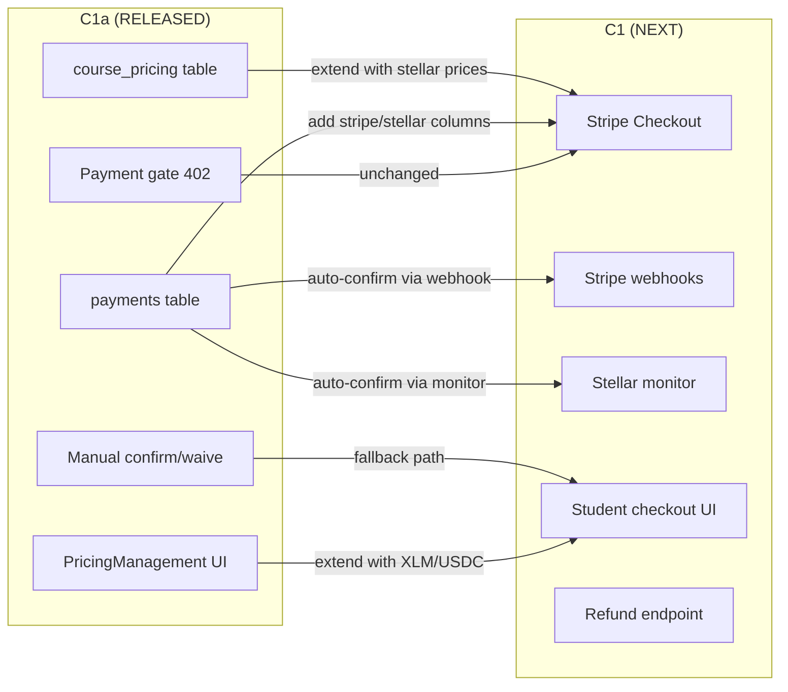
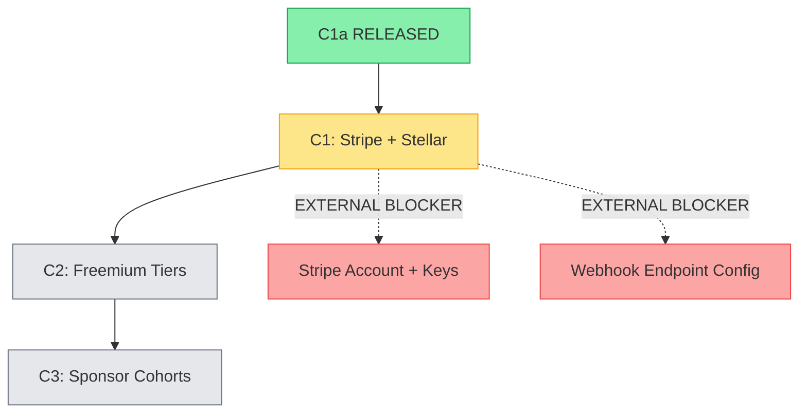
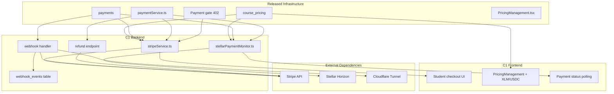
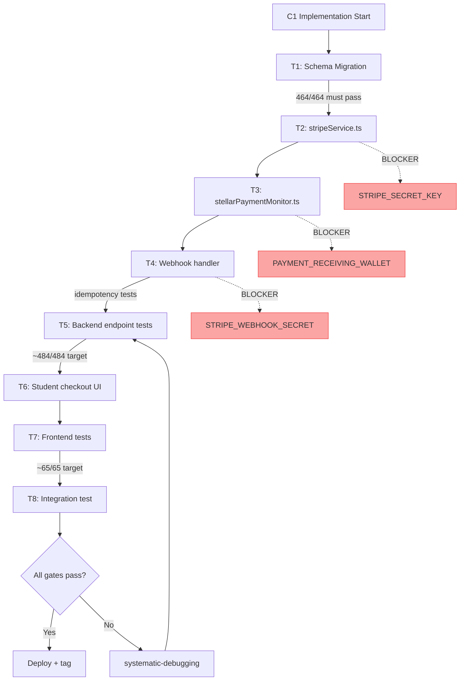

# Phase 11 C1a Release Closeout + Phase 11 C1 Spec Kickoff

**Date:** 2026-08-04

---

## Phase 11 C1a Release Closeout

### Shipped Features

| Feature | Files | Tests | Commit | Tag |
|---------|-------|-------|--------|-----|
| `course_pricing` + `payments` tables | database.ts, schema.sql | PAY-B1–B3 | `27a08f5` | `phase11-c1a-complete-2026-08-04` |
| 5 backend payment endpoints | payments.ts, paymentService.ts | PAY-B4–B7 | `27a08f5` | — |
| Payment gate on mint (402) | nftApplications.ts | PAY-B8–B10 | `27a08f5` | — |
| PricingManagement admin panel | PricingManagement.tsx | PAY-F1–F7 | `27a08f5` | — |
| Payment badges + confirm/waive | AdminCertificates.tsx | — | `27a08f5` | — |
| Student price display | StudentQuizzes.tsx | — | `27a08f5` | — |
| Payment data in listCertificates | adminController.ts | — | `27a08f5` | — |

**New files (6):** paymentService.ts, payments.ts (routes), payments.test.ts, PricingManagement.tsx, PricingManagement.test.tsx, implementation-plan.md
**Modified files (12):** database.ts, schema.sql, types/index.ts, app.ts, nftApplications.ts, adminController.ts, api.ts, adminCertificateService.ts, courseCompletionService.ts, AdminCertificates.tsx, AdminDashboard.tsx, StudentQuizzes.tsx

**Total:** +1,409 lines, 18 files touched

### Verification Summary

| Gate | Result |
|------|--------|
| Backend tsc | PASS |
| Frontend tsc | PASS |
| Backend vitest | **464/464** (454 + 10 new) |
| Frontend vitest | **55/55** (48 + 7 new) |
| Vite build | PASS |
| Docker build | PASS (api + web) |
| HTTP 200 | PASS |
| Health 200 | PASS |

### Rollback Note

- `git revert 27a08f5` — removes all payment tables, endpoints, and UI
- Safe: no existing data depends on payment tables (new feature, no migration of existing data)
- Free certificate flow unchanged — no pricing row = free (backward compatible)

### Manual QA Status

- PricingManagement panel: **Deployed to admin dashboard** — visible at `/admin`
- Payment badges: **Live in AdminCertificates** — Free/Pending/Paid/Waived
- Student pricing: **Live in StudentQuizzes** — replaces "Payment coming soon" placeholder
- Browser QA deferred to next session (functional verification via automated tests)

### Key Architectural Decisions (Fixed)

1. **Price stored as integer cents** — avoids float precision issues
2. **Payment gate at route level** (nftApplications.ts) — not inside mintService
3. **Idempotent confirm/waive** — already-confirmed returns success
4. **Waive requires notes** — audit trail for scholarships
5. **402 Payment Required** — HTTP standard for payment gates
6. **No pricing row = free** — backward compatible with all existing courses
7. **payment_method column** — `'manual'` for C1a, extensible to `'stripe'`/`'stellar_xlm'`/`'stellar_usdc'` in C1

---

## Phase 11 C1 Spec Kickoff

### Context

C1a established the manual payment foundation. C1 extends it with automated payment rails:
- **Stripe Checkout** for fiat card payments (SAQ-A PCI compliance)
- **Stellar native payment** verification for XLM/USDC
- **Webhook processing** for automated payment confirmation
- **Student self-service** checkout flow

### Why C1 Exists

Manual admin confirmation works for low volume. At scale, every certificate payment requires admin intervention. C1 automates the confirmation step while keeping manual as a fallback.

### Scope

C1 adds to C1a without replacing it:

| What C1 Adds | What C1 Does NOT Change |
|-------------|------------------------|
| `stripe_session_id` column on payments | course_pricing table structure |
| `stripe_payment_intent_id` column | payments table core columns |
| `stellar_tx_hash`, `stellar_memo` columns | Payment gate logic (still checks status) |
| `webhook_events` table (new) | Manual confirm/waive endpoints |
| `stellar_price_xlm`, `stellar_price_usdc` on course_pricing | PricingManagement component (extends) |
| stripeService.ts (new) | paymentService core functions |
| stellarPaymentMonitor.ts (new) | Admin confirm/waive UI |
| Student checkout UI (new) | Free certificate flow |
| Stripe webhook endpoint (new) | Existing test suite |

### Non-Goals for C1

- No subscription/recurring billing
- No refund self-service (admin-only via Stripe API)
- No payment analytics dashboard (Phase 12+)
- No Apple Pay / Google Pay beyond what Stripe Checkout provides
- No quiz-level payments
- No multi-currency beyond USD + XLM/USDC
- No freemium tiers (C2)
- No sponsor cohorts (C3)

---

## Candidate Ranking

### Ordered by value/risk/effort

| Rank | Candidate | Value | Risk | Effort | External Deps | Recommendation |
|------|-----------|-------|------|--------|---------------|----------------|
| 1 | **C1: Stripe + Stellar** | HIGH — enables revenue | HIGH — PCI, webhooks, external APIs | HIGH — ~20 backend + ~10 frontend tests | Stripe account + API keys | **EXECUTE NEXT** |
| 2 | **C2: Freemium tiers** | MEDIUM — monetization differentiation | LOW — UI-only changes | MEDIUM — ~10 tests | None | DEFER until C1 is live |
| 3 | **C3: Sponsor cohorts** | MEDIUM — B2B revenue | MEDIUM — multi-user payment flow | HIGH — ~15 tests | None | DEFER until C2 |

**Rationale:** C1 is the critical path — C2 and C3 both depend on having automated payment rails. C2 is pure UI/logic layering on top of C1. C3 adds complexity that should wait for C2's tier model.

---

## Mermaid Diagrams

### C1a → C1 Handoff Flow



### Candidate Ranking Flow



### Dependency Map



### Risk / Test Gate Flow



---

## To-Do Lists

### Candidate Analysis Checklist

- [x] C1a release verified (464 backend, 55 frontend, all gates pass)
- [x] C1 spec exists (`phase11-c1-payment-foundation-design.md`)
- [x] C1 spec reviewed against C1a release state
- [ ] C1 spec updated to reflect C1a baseline (was written pre-C1a)
- [ ] Stripe account provisioned
- [ ] Stripe API keys available in env
- [ ] Stripe webhook endpoint configured
- [ ] Payment receiving wallet designated for Stellar payments
- [ ] C2 scope confirmed as deferred
- [ ] C3 scope confirmed as deferred

### Dependency Checklist

- [x] course_pricing table exists (C1a)
- [x] payments table exists (C1a)
- [x] paymentService.ts exists with core functions (C1a)
- [x] Payment gate operational (C1a)
- [ ] Stripe npm package added to dependencies
- [ ] STRIPE_SECRET_KEY in .env
- [ ] STRIPE_WEBHOOK_SECRET in .env
- [ ] PAYMENT_RECEIVING_WALLET in .env
- [ ] webhook_events table migration ready
- [ ] ALTERs for stripe/stellar columns on payments + course_pricing

### Risk Checklist

- [ ] PCI compliance: Confirm SAQ-A applies (no card data on server)
- [ ] Webhook security: Raw body parsing for Stripe signature verification
- [ ] Idempotency: webhook_events dedup before payment confirmation
- [ ] Stellar memo uniqueness: UUID truncation collision risk (28-char limit)
- [ ] Stellar payment monitor: Poll interval vs missed payments
- [ ] Price change during checkout: Race condition if admin changes price
- [ ] Double payment: Student pays both Stripe and Stellar for same cert
- [ ] Refund flow: Only Stripe payments refundable via API

### Test Strategy Checklist

- [ ] PAY-B11: Stripe checkout session creation
- [ ] PAY-B12: Stripe webhook idempotent processing
- [ ] PAY-B13: Stripe webhook invalid signature rejection
- [ ] PAY-B14: Stellar payment instructions generation
- [ ] PAY-B15: Stellar payment monitor confirmation
- [ ] PAY-B16: Refund endpoint (Stripe only)
- [ ] PAY-B17: Student payment status endpoint
- [ ] PAY-B18: Student payment history
- [ ] PAY-B19: Price change race condition
- [ ] PAY-B20: Double payment prevention
- [ ] PAY-F8: Student checkout method selection UI
- [ ] PAY-F9: Stripe redirect + return handling
- [ ] PAY-F10: Stellar payment instructions display
- [ ] PAY-F11: Payment status polling/display
- [ ] PAY-F12: PricingManagement XLM/USDC fields

### Handoff Checklist

- [x] C1a code merged to main
- [x] C1a tag created: `phase11-c1a-complete-2026-08-04`
- [x] C1a Docker deployed and health-checked
- [x] C1a test counts documented (464 backend, 55 frontend)
- [ ] C1 spec updated to reflect C1a baseline
- [ ] C1 branch created: `feat/phase11-c1-payment-automation`
- [ ] External blockers resolved (Stripe account + keys)
- [ ] C1 implementation plan written

---

## Test Strategy

### Acceptance Criteria per Feature

| Feature | User Story | Red (fails before) | Green (passes after) |
|---------|-----------|---------------------|---------------------|
| Stripe checkout | Student pays via card | No checkout endpoint | POST /payments/checkout/stripe returns checkoutUrl |
| Stripe webhook | Payment auto-confirms | Payment stays pending | Webhook sets status=confirmed |
| Stellar checkout | Student pays via XLM | No stellar instructions | POST /payments/checkout/stellar returns memo+address |
| Stellar monitor | Payment auto-confirms | Payment stays pending | Monitor polls and confirms |
| Refund | Admin refunds Stripe payment | No refund endpoint | POST /admin/payments/:id/refund sets status=refunded |
| Student status | Student sees payment status | No status endpoint | GET /payments/:id/status returns current state |
| Student history | Student sees all payments | No history endpoint | GET /students/me/payments returns list |

### Regression Coverage

- All 464 backend tests must pass (C1a baseline)
- All 55 frontend tests must pass (C1a baseline)
- PAY-B8–B10 (payment gate) must remain green — C1 must not break the gate
- Free certificate flow must remain unchanged
- Manual confirm/waive must continue to work alongside automated flows

### Manual QA Expectations

- Stripe: End-to-end checkout in Stripe test mode (test card 4242...)
- Stellar: Testnet payment with memo verification
- Price display: Student sees correct price before and during checkout
- Payment status: Real-time updates after webhook/monitor confirmation

### Security / PCI Considerations

- **SAQ-A compliance:** Zero card data on our server — Stripe Checkout handles all card input
- **Webhook signature verification:** `stripe.webhooks.constructEvent()` with `express.raw()` middleware
- **Idempotent webhooks:** `webhook_events` table prevents double-processing
- **No PII in logs:** Payment amounts OK, no card numbers, no Stripe tokens
- **HTTPS required:** Cloudflare Tunnel provides TLS (already in place)
- **Stellar memo privacy:** UUIDs are non-guessable, but memo is visible on-chain

---

## Risk Note

### Key Assumptions

1. Stripe account will be provisioned before C1 implementation starts
2. Stripe test mode is sufficient for development and testing
3. Stellar Horizon API rate limits will not block the payment monitor
4. 30-second poll interval is fast enough for Stellar payment detection
5. Admin will set Stellar prices manually (no auto-conversion from USD)

### Potential Coupling Risks

| Risk | Mitigation |
|------|-----------|
| `payments` table schema change | ALTER TABLE ADD COLUMN — backward compatible |
| `course_pricing` table schema change | ALTER TABLE ADD COLUMN — backward compatible |
| paymentService function signatures | Add new functions, don't change existing |
| Payment gate logic change | Gate logic stays the same (checks `isPaymentSatisfied`) |
| PricingManagement UI | Extend with new columns, don't restructure |
| Webhook raw body parsing | Separate route handler, doesn't affect existing JSON parsing |

### External Dependencies

| Dependency | Status | Blocker? |
|-----------|--------|----------|
| Stripe account | NOT PROVISIONED | **YES — MUST resolve before C1** |
| Stripe API keys (.env) | NOT CONFIGURED | YES |
| Stripe webhook secret (.env) | NOT CONFIGURED | YES |
| Payment receiving wallet (Stellar) | NOT DESIGNATED | YES |
| `stripe` npm package | NOT INSTALLED | No (install during C1) |
| Stellar Horizon API | Available (already used for NFT minting) | No |
| Cloudflare Tunnel (HTTPS) | In place | No |

---

## Handoff Note

### What Is Released (C1a)

- `course_pricing` table with CRUD endpoints
- `payments` table with manual confirm/waive
- Payment gate blocking mint when payment pending
- Admin PricingManagement panel on dashboard
- Payment badges (Free/Pending/Paid/Waived) in AdminCertificates
- Student price display in StudentQuizzes
- 10 backend tests (PAY-B1–B10) + 7 frontend tests (PAY-F1–F7)
- Tag: `phase11-c1a-complete-2026-08-04`

### What C1 Should Consume

- Extend `payments` table with Stripe/Stellar columns (ALTER TABLE)
- Extend `course_pricing` with stellar price columns (ALTER TABLE)
- Add `webhook_events` table (new)
- Add `stripeService.ts` (new) — wraps Stripe SDK
- Add `stellarPaymentMonitor.ts` (new) — polls Horizon
- Add webhook route with `express.raw()` middleware
- Add student checkout endpoints + UI
- Extend PricingManagement with XLM/USDC price fields
- Add ~20 backend tests (PAY-B11–B20+) + ~10 frontend tests (PAY-F8–F12+)
- Target: **~484/484 backend**, **~65/65 frontend**

### What Must NOT Change in C1

- Payment gate logic (still checks `isPaymentSatisfied`)
- Manual confirm/waive endpoints (fallback path)
- Free certificate flow (no pricing row = free)
- Existing test IDs (PAY-B1–B10, PAY-F1–F7)

---

## /loop Workflow

### /loop assess
```
Read C1a closeout + C1 spec. Verify:
- C1a tests still green (464 + 55)
- External blockers status (Stripe account?)
- C1 spec alignment with C1a release state
Output: READY / BLOCKED / STALE
```

### /loop plan
```
1. Update C1 spec to reflect C1a baseline
2. Write C1 implementation plan (T0–T8)
3. Define test IDs (PAY-B11+ / PAY-F8+)
4. Create branch: feat/phase11-c1-payment-automation
Output: Plan file at docs/superpowers/plans/
```

### /loop review
```
Review C1 implementation against:
- C1a coupling risks
- PCI compliance checklist
- Test coverage gaps
- External dependency status
Output: APPROVED / CHANGES REQUESTED
```

### /loop defer
```
If Stripe account not provisioned:
- Park C1, skip to C2 (freemium tiers)
- C2 has zero external dependencies
- C2 uses C1a manual payment as its payment rail
Output: C1 DEFERRED / C2 PROMOTED
```

---

## Final Recommendation

### **PHASE 11 C1 SPEC: NEEDS CLARIFICATION**

The existing C1 spec (`phase11-c1-payment-foundation-design.md`) was written **before** C1a was implemented. It describes building the entire payment system from scratch, including tables and endpoints that C1a already shipped. The spec must be **updated to reflect the C1a baseline** before implementation can start.

Additionally, there are **4 external blockers** that must be resolved:

1. **Stripe account** — not provisioned
2. **Stripe API keys** — not in .env
3. **Stripe webhook secret** — not in .env
4. **Payment receiving wallet** — not designated

### Exact Next Actions

1. **IMMEDIATE:** User confirms Stripe account availability
   - If available → update C1 spec, proceed to implementation plan
   - If not available → `/loop defer` — skip C1, promote C2 (freemium tiers)

2. **IF PROCEEDING:** Update `phase11-c1-payment-foundation-design.md`:
   - Remove sections already shipped in C1a (pricing table, payments table, manual confirm, payment gate)
   - Scope C1 to: Stripe checkout, Stellar monitor, webhooks, refunds, student checkout UI
   - Update test baseline to 464/464 backend + 55/55 frontend

3. **THEN:** Write implementation plan → create branch → execute
