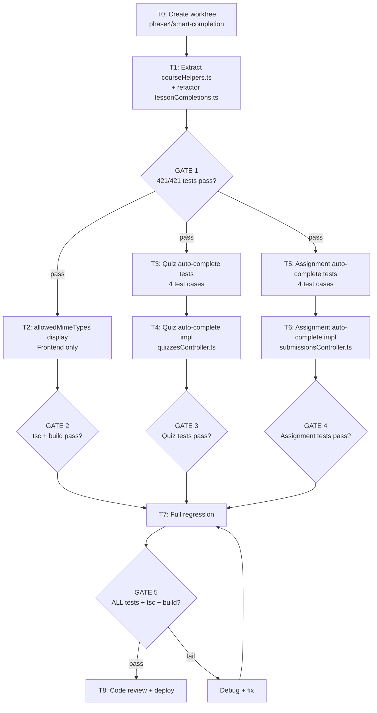
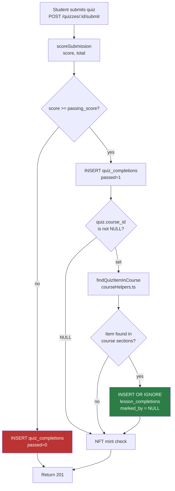
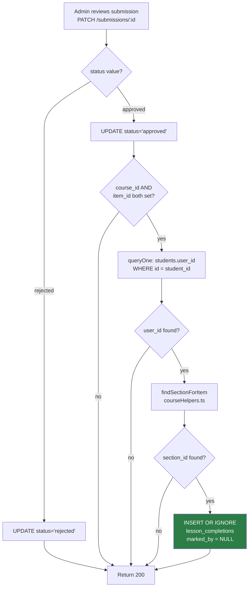
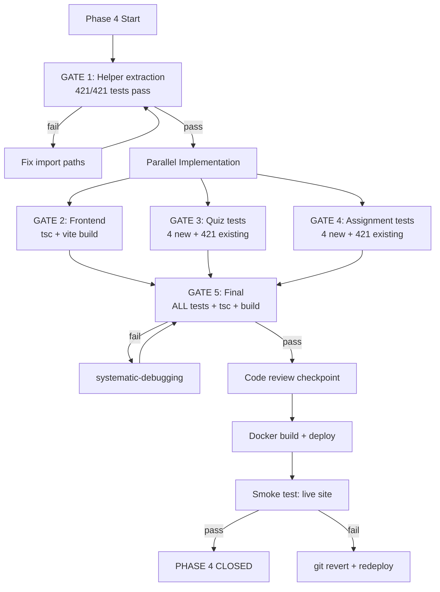

# Phase 4 Implementation Plan: Smart Completion + Enhanced Interactions

**Date:** 2026-08-04
**Status:** IMPLEMENTATION PLAN READY
**Spec:** `docs/superpowers/specs/2026-08-03-phase4-smart-completion-spec.md`
**Baseline:** Phase 3 closed (`c817192`), 421/421 backend tests, 23/23 web-app tests
**Scope:** 3 features — allowedMimeTypes display, quiz auto-complete, assignment auto-complete

---

## Session Kickoff

### Objective

Convert the Phase 4 spec into an execution-ready plan with test-first ordering, parallel/sequential boundaries, verification gates, and review checkpoints. No code changes in this session.

### Required Skills Confirmed

| Skill | Application |
|-------|-------------|
| find-skills | Confirmed skill inventory for planning workflow |
| brainstorming | Decomposed spec into execution units, identified parallelism |
| writing-plans | This document — step-by-step plan with gates |
| executing-plans / subagent-driven-development | Task parallelization strategy defined below |
| test-driven-development | Tests precede implementation for F2 and F3 |
| systematic-debugging | Failure modes documented with explicit checks |
| using-superpowers / using-git-worktrees | Worktree strategy defined for isolation |
| receiving/requesting-code-review | Review gates at 3 checkpoints |
| verification-before-completion | 5-gate final verification sequence |

---

## Execution Board

### Task Table

| # | Goal | Files Touched | Est. Lines | Parallel-Safe | Verification |
|---|------|---------------|-----------|---------------|-------------|
| T0 | Create worktree + branch | (git) | 0 | N/A | Branch exists |
| T1 | Extract `courseHelpers.ts` shared utility | `src/utils/courseHelpers.ts` (new), `src/routes/lessonCompletions.ts` | ~35 | Yes (no deps) | 421/421 tests pass |
| T2 | F1: allowedMimeTypes display | `EmbeddedMaterialViewer.tsx` | ~15 | Yes (frontend, independent of T1) | `tsc` + build |
| T3 | F2: Quiz auto-complete tests | `src/__tests__/quiz-auto-complete.test.ts` (new) | ~80 | Blocked by T1 | Tests fail (no impl) |
| T4 | F2: Quiz auto-complete implementation | `src/controllers/quizzesController.ts` | ~20 | Blocked by T1, T3 | T3 tests pass |
| T5 | F3: Assignment auto-complete tests | `src/__tests__/assignment-auto-complete.test.ts` (new) | ~80 | Blocked by T1 | Tests fail (no impl) |
| T6 | F3: Assignment auto-complete implementation | `src/controllers/submissionsController.ts` | ~20 | Blocked by T1, T5 | T5 tests pass |
| T7 | Full regression + type check + build | All | 0 | Blocked by T1-T6 | All gates pass |
| T8 | Code review + deploy | All | 0 | Blocked by T7 | Live verification |

**Total:** 2 new files, 5 modified files, ~250 lines new code + tests.

### Dependencies

```
T0 (worktree)
 └── T1 (courseHelpers extraction)
      ├── T2 (allowedMimeTypes — independent, can run parallel after T1)
      ├── T3 (quiz tests) → T4 (quiz impl)
      └── T5 (assignment tests) → T6 (assignment impl)
           └── T7 (final verification) → T8 (review + deploy)
```

### Parallelization Notes

- **T2 is fully independent** — frontend-only, no backend deps. Can run in parallel with T3-T6.
- **T3 + T5 can run in parallel** — separate test files, no shared state.
- **T4 depends on T3** (test-first). **T6 depends on T5** (test-first).
- **T4 and T6 are parallel-safe** — different controllers, same INSERT pattern but different files.
- **Recommended parallel groups:**
  - Group A: T2 (frontend)
  - Group B: T3 → T4 (quiz pipeline)
  - Group C: T5 → T6 (assignment pipeline)
  - All groups can run after T1 completes.

---

## Mermaid Diagrams

### Task Dependency Flow



### Quiz Auto-Complete Execution Flow



### Assignment Auto-Complete Execution Flow



### Verification Gate Flow



---

## To-Do Lists

### Planning Checklist

- [x] Read Phase 4 spec
- [x] Read Phase 4 planning doc
- [x] Verify source file insertion points (quizzesController line 441, submissionsController line 537)
- [x] Confirm `courseHelpers.ts` does not exist yet
- [x] Confirm `findSectionForItem` at lessonCompletions.ts:22-34
- [x] Confirm test file patterns in `__tests__/`
- [x] Map task dependencies and parallelism
- [x] Define verification gates
- [x] Define review checkpoints
- [x] Write implementation plan document

### Implementation Checklist

- [ ] T0: Create git worktree `phase4/smart-completion`
- [ ] T1: Create `src/utils/courseHelpers.ts` with `findSectionForItem` + `findQuizItemInCourse`
- [ ] T1: Update `lessonCompletions.ts` to import from `courseHelpers.ts`
- [ ] T1: Run 421 tests — verify zero regressions
- [ ] T2: Add allowedMimeTypes display to `EmbeddedMaterialViewer.tsx` (after line 351)
- [ ] T2: Run `tsc` + `vite build` — verify no type errors
- [ ] T3: Create `quiz-auto-complete.test.ts` (4 tests)
- [ ] T4: Add auto-complete logic to `quizzesController.ts` (after line 441, before NFT check)
- [ ] T4: Run quiz tests — all 4 pass
- [ ] T5: Create `assignment-auto-complete.test.ts` (4 tests)
- [ ] T6: Add auto-complete logic to `submissionsController.ts` (after line 534, before res.json)
- [ ] T6: Run assignment tests — all 4 pass
- [ ] T7: Full regression: `npx vitest run` — all tests pass (421 + 8 new = 429)
- [ ] T7: `npx tsc --noEmit` — no type errors
- [ ] T7: `docker compose build web` — build succeeds
- [ ] T8: Deploy + smoke test

### Test Checklist

- [ ] `quiz-auto-complete.test.ts`: pass → completion created (marked_by=NULL)
- [ ] `quiz-auto-complete.test.ts`: fail → no completion
- [ ] `quiz-auto-complete.test.ts`: no course_id → no error
- [ ] `quiz-auto-complete.test.ts`: idempotent re-submission
- [ ] `assignment-auto-complete.test.ts`: approved → completion created (marked_by=NULL)
- [ ] `assignment-auto-complete.test.ts`: rejected → no completion
- [ ] `assignment-auto-complete.test.ts`: no course_id → no error
- [ ] `assignment-auto-complete.test.ts`: idempotent re-approval
- [ ] Regression: 421 existing tests pass
- [ ] Regression: quiz-security.test.ts (8 tests)
- [ ] Regression: regression-student-submission.test.ts (7 tests)
- [ ] Regression: courseCompletion.test.ts

### QA Checklist

- [ ] Assignment item with `allowedMimeTypes: ["application/pdf", "application/vnd.openxmlformats-officedocument.wordprocessingml.document"]` shows "Accepted formats: PDF, DOCX"
- [ ] Assignment with empty `allowedMimeTypes` → no format hint
- [ ] Assignment with no `allowedMimeTypes` field → no format hint
- [ ] Unknown MIME type shows uppercase suffix
- [ ] Both `maxFileSize` and `allowedMimeTypes` shown together
- [ ] Quiz pass → auto-complete visible on page refresh
- [ ] Quiz fail → no auto-complete
- [ ] Submission approved → auto-complete visible on page refresh
- [ ] Submission rejected → no auto-complete
- [ ] Old courses render unchanged

### Review Checklist

- [ ] Review Gate 1 (post-T1): Helper extraction — correct imports, no regressions
- [ ] Review Gate 2 (post-T4+T6): Spec compliance — all behavioral rules met
- [ ] Review Gate 3 (post-T7): Final branch review — code quality, test coverage, no scope creep
- [ ] Review Gate 4 (post-T8): Post-deploy smoke test

---

## Implementation Plan — Task-by-Task

### T0: Create Worktree + Branch

**Goal:** Isolate Phase 4 work from main.

**Steps:**
1. From `/home/webadmin/web-stack/html/LMS-AmmaWallet/`, create branch `phase4/smart-completion` from HEAD
2. Use git worktree (or work directly on branch — worktree preferred for isolation)
3. Verify clean state: `git status`, `npx vitest run` baseline

**Verification:** Branch exists, 421/421 tests pass on branch.

---

### T1: Extract `courseHelpers.ts` Shared Utility

**Goal:** Create shared helper functions needed by both F2 and F3. Refactor existing code to use shared module.

**Files:**
- CREATE: `LMS-Server/src/utils/courseHelpers.ts` (~25 lines)
- MODIFY: `LMS-Server/src/routes/lessonCompletions.ts` (replace local function with import)

**Test-first:** No new tests — this is a refactor. 421 existing tests must remain green.

**Steps:**
1. Create `src/utils/courseHelpers.ts`:
   - Export `findSectionForItem(sectionsJson: string, itemId: string): string | null`
   - Export `findQuizItemInCourse(sectionsJson: string, quizId: string): { itemId: string; sectionId: string } | null`
   - Import `CourseSection` type from `../types/index.js`
2. Update `lessonCompletions.ts`:
   - Add `import { findSectionForItem } from '../utils/courseHelpers.js';`
   - Remove local `findSectionForItem` function (lines 22-34)
3. Run tests: `cd LMS-Server && npx vitest run`

**GATE 1:** 421/421 tests pass. If not, fix import paths.

**Failure modes:**
- Wrong import path (`.js` extension required for ESM)
- `CourseSection` type not exported from `types/index.ts` — verify first
- Circular import — unlikely, `courseHelpers.ts` has no deps except types

---

### T2: F1 — allowedMimeTypes Display (Frontend)

**Goal:** Show accepted file types on assignment items.

**File:** `LMS-Frontend/src/components/EmbeddedMaterialViewer.tsx`

**Test-first:** Frontend-only, manual QA. No automated tests to write.

**Steps:**
1. Locate the assignment branch (line 337, `item.type === 'assignment'`)
2. After the `maxFileSize` display block (around line 351), insert the MIME type display block
3. Use the exact implementation from the spec (IIFE pattern with MIME_LABELS map)

**Insertion point (verified):** After the `maxFileSize` paragraph, before the "Go to submissions" link at line 353.

**GATE 2:** `cd LMS-Frontend && npx tsc --noEmit` passes. `npm run build` succeeds.

**Failure modes:**
- TypeScript error from casting `item as { allowedMimeTypes?: string[] }` — verify `CourseItem` type includes this field (confirmed at `course.ts:62`)
- Build error from JSX syntax — use the spec's IIFE pattern exactly

---

### T3: F2 — Quiz Auto-Complete Tests (Test-First)

**Goal:** Write failing tests before implementation.

**File:** CREATE `LMS-Server/src/__tests__/quiz-auto-complete.test.ts` (~80 lines)

**Steps:**
1. Study existing test patterns:
   - `quiz-security.test.ts` for quiz submission test setup
   - `phase-d-lessons.test.ts` for lesson completion assertions
   - `helpers/seed.ts` and `helpers/auth.ts` for test infrastructure
2. Write 4 test cases per spec section 9:
   - Test 1: Pass quiz → `lesson_completions` row created with `marked_by = NULL`
   - Test 2: Fail quiz → no `lesson_completions` row
   - Test 3: Quiz with no `course_id` → no error, no completion
   - Test 4: Re-submit passing quiz → exactly 1 row (idempotent)
3. Each test needs setup:
   - Create course with sections JSON containing a quiz item with `quizId`
   - Create quiz with `course_id` pointing to that course
   - Create student user enrolled in course
   - Quiz questions with known answers for pass/fail control

**Verification:** Tests compile. Tests FAIL (no implementation yet). This confirms TDD red phase.

**Failure modes:**
- Test setup complexity — seeding a course with JSON sections + quiz + enrollment
- Wrong quiz submission endpoint or payload format — check existing quiz tests

---

### T4: F2 — Quiz Auto-Complete Implementation

**Goal:** Add auto-complete INSERT to `submitQuiz()`.

**File:** `LMS-Server/src/controllers/quizzesController.ts`

**Steps:**
1. Add import: `import { findQuizItemInCourse } from '../utils/courseHelpers.js';`
2. After line 441 (end of quiz_completions insert + NFT block), before `res.status(201)`:
   - Add the auto-complete block from the spec
   - Use `findQuizItemInCourse` from the shared helper
   - Wrap in try/catch (best-effort)
   - Set `marked_by = NULL`
3. Run quiz tests: `cd LMS-Server && npx vitest run quiz-auto-complete`

**GATE 3:** All 4 quiz auto-complete tests pass. All existing quiz tests pass.

**Failure modes:**
- `quiz.course_id` not available in scope — verify the `quiz` variable includes this field from the SELECT query
- Wrong `quizId` variable name — check existing `submitQuiz()` for the variable holding the quiz ID
- INSERT fails due to missing section_id — `findQuizItemInCourse` returns both itemId and sectionId
- Best-effort catch swallows real bugs during development — temporarily remove catch for debugging, restore before commit

---

### T5: F3 — Assignment Auto-Complete Tests (Test-First)

**Goal:** Write failing tests before implementation.

**File:** CREATE `LMS-Server/src/__tests__/assignment-auto-complete.test.ts` (~80 lines)

**Steps:**
1. Study existing test patterns:
   - `regression-student-submission.test.ts` for submission review test setup
   - `submission-delete-rbac.test.ts` for RBAC patterns
2. Write 4 test cases per spec section 9:
   - Test 1: Approve submission → `lesson_completions` row created with `marked_by = NULL`
   - Test 2: Reject submission → no `lesson_completions` row
   - Test 3: Submission with no `course_id` → no error, no completion
   - Test 4: Re-approve → exactly 1 row (idempotent)
3. Each test needs setup:
   - Create course with sections JSON containing an assignment item
   - Create student with `user_id` linked
   - Create submission with `course_id` and `item_id` set
   - Admin/lecturer auth token

**Verification:** Tests compile. Tests FAIL (no implementation yet).

**Failure modes:**
- Submission review endpoint requires admin auth — verify RBAC setup in tests
- `submissions.course_id` and `item_id` must be set during INSERT, not just UPDATE

---

### T6: F3 — Assignment Auto-Complete Implementation

**Goal:** Add auto-complete INSERT to `reviewSubmission()`.

**File:** `LMS-Server/src/controllers/submissionsController.ts`

**Steps:**
1. Add import: `import { findSectionForItem } from '../utils/courseHelpers.js';`
   - Note: `uuidv4`, `queryOne`, `execute` already imported
2. After line 534 (student name fetch), before `res.json()` at line 539:
   - Add the auto-complete block from the spec
   - Use `findSectionForItem` from the shared helper
   - Look up `user_id` from `students` table via `student_id`
   - Wrap in try/catch (best-effort)
   - Set `marked_by = NULL`
3. Run assignment tests: `cd LMS-Server && npx vitest run assignment-auto-complete`

**GATE 4:** All 4 assignment auto-complete tests pass. All existing submission tests pass.

**Failure modes:**
- `submission.student_id` vs `submission.user_id` confusion — submissions link to `students.id`, not `users.id` directly. Must do the `students.user_id` lookup.
- `submission!.course_id` — the `!` non-null assertion is safe because of the `if` guard, but verify TypeScript accepts it
- Missing `item_id` in section JSON — `findSectionForItem` handles this gracefully (returns null)

---

### T7: Full Regression + Verification

**Goal:** Confirm all changes work together with zero regressions.

**Steps:**
1. `cd LMS-Server && npx vitest run` — expect 429/429 (421 + 8 new)
2. `cd LMS-Server && npx tsc --noEmit` — no type errors
3. `cd LMS-Frontend && npx tsc --noEmit` — no type errors
4. `docker compose build web` — build succeeds
5. Spot-check: `npx vitest run quiz-security` — 8/8 pass
6. Spot-check: `npx vitest run regression-student-submission` — 7/7 pass
7. Spot-check: `npx vitest run courseCompletion` — all pass

**GATE 5:** All checks pass. If any fail, use systematic-debugging skill.

---

### T8: Code Review + Deploy

**Goal:** Final review, merge, deploy.

**Steps:**
1. **Code review** — requesting-code-review skill:
   - Spec compliance: all 23 acceptance criteria addressed
   - Code quality: no scope creep, no unnecessary refactors
   - Test coverage: 8 new tests cover all behavioral rules
2. **Merge:**
   - `git checkout main && git merge phase4/smart-completion`
   - Or squash merge if preferred
3. **Deploy:**
   - Backend: `docker compose build web && docker compose up -d --no-deps web`
   - Frontend: `cd LMS-Frontend && npm run build` (inside Docker — CRITICAL)
4. **Smoke test:**
   - Site loads at lms.smwebsystems.com
   - Student dashboard renders
   - API healthy: `curl -s https://lms.smwebsystems.com/api/v1/health`
5. **Tag:** `git tag phase4-complete-2026-08-04`

---

## Systematic Debugging — Anticipated Failure Modes

| Failure Mode | Detection | Fix |
|-------------|-----------|-----|
| Wrong course linkage (quiz points to wrong course) | Quiz test: check `lesson_completions.course_id` matches expected | Verify `quiz.course_id` SELECT includes the field |
| Duplicate completions | Idempotency tests (T3-test4, T5-test4) | `INSERT OR IGNORE` + UNIQUE constraint |
| Missing completions (auto-complete silently fails) | Pass test expects row but finds none | Check `findQuizItemInCourse` / `findSectionForItem` return values |
| Best-effort catch hiding bugs | Tests pass but with console.error logs | Add `console.error` spy in tests to detect unexpected errors |
| Renderer regression (allowedMimeTypes breaks layout) | Build fails or manual QA | Check JSX syntax, verify IIFE returns null for empty arrays |
| `marked_by` not NULL | Assertion in tests: `expect(row.marked_by).toBeNull()` | Verify INSERT uses `NULL` not `undefined` |
| Import path wrong (.js suffix) | `tsc` fails or runtime import error | Always use `.js` suffix for ESM imports |
| `CourseSection` type not available in courseHelpers | `tsc` error | Verify export from `types/index.ts` |

---

## Branch / Worktree Strategy

**Recommended approach:**

1. Create branch `phase4/smart-completion` from current HEAD on main
2. Use git worktree at `.claude/worktrees/phase4` for full isolation
3. All implementation happens in worktree
4. Run tests inside worktree (SQLite DB is test-only, no shared state)
5. After GATE 5 passes, merge to main
6. Clean up worktree after merge

**Why worktree:** Main stays clean for hotfixes. Phase 4 work is isolated. If Phase 4 needs to be abandoned, just delete the worktree — main is untouched.

**Alternative (simpler):** Work directly on a branch without worktree. Acceptable since Phase 4 is small (~250 lines) and low-risk.

---

## /loop Workflow

### /loop assess

```
Inputs:
  - Phase 4 spec (docs/superpowers/specs/2026-08-03-phase4-smart-completion-spec.md)
  - Phase 4 planning doc (docs/superpowers/plans/2026-08-03-phase4-planning.md)
  - Source files: quizzesController.ts, submissionsController.ts, lessonCompletions.ts, EmbeddedMaterialViewer.tsx

Actions:
  - Verify spec scope: 3 features, no audio tracking
  - Verify insertion points match current code
  - Verify shared infrastructure (findSectionForItem exists, courseHelpers.ts does not)
  - Verify test baseline: 421/421

Output:
  - Spec is accurate (minor line-number drift documented)
  - All dependencies confirmed
  - Ready for planning
```

### /loop plan

```
Inputs:
  - Assessment results
  - Spec feature specifications

Actions:
  - Decompose into 8 tasks (T0-T8)
  - Map dependencies
  - Identify parallel groups (A: frontend, B: quiz, C: assignment)
  - Define 5 verification gates
  - Define 4 review checkpoints
  - Write test-first sequence

Output:
  - This implementation plan document
```

### /loop review

```
Inputs:
  - Implementation plan
  - Spec acceptance criteria (23 total)

Actions:
  - Verify every acceptance criterion has a task and test
  - Verify no scope creep (3 features only)
  - Verify rollback strategy
  - Verify deployment sequence

Checklist:
  - [ ] F1-AC1 through F1-AC6 → T2 (manual QA)
  - [ ] F2-AC1 through F2-AC8 → T3 + T4 (automated)
  - [ ] F3-AC1 through F3-AC9 → T5 + T6 (automated)
  - [ ] Rollback → git revert + redeploy
  - [ ] Deploy sequence → backend first, then frontend
```

### /loop execute

```
Inputs:
  - Approved implementation plan

Actions (in order):
  1. T0: Create worktree
  2. T1: Extract courseHelpers.ts → GATE 1
  3. Parallel: T2 (frontend) | T3→T4 (quiz) | T5→T6 (assignment)
  4. T7: Full regression → GATE 5
  5. T8: Review + deploy

Subagent strategy:
  - Agent A: T2 (frontend, isolated)
  - Agent B: T3 → T4 (quiz pipeline)
  - Agent C: T5 → T6 (assignment pipeline)
  - All agents start after T1 GATE 1 passes
  - Agents B and C touch different files — no conflicts
```

---

## Acceptance Criteria → Task Mapping

| AC ID | Criterion | Task | Verification Method |
|-------|-----------|------|-------------------|
| F1-AC1 | allowedMimeTypes renders known types | T2 | Manual QA |
| F1-AC2 | Empty array → no display | T2 | Manual QA |
| F1-AC3 | Missing field → no display | T2 | Manual QA |
| F1-AC4 | Unknown MIME → uppercase suffix | T2 | Manual QA |
| F1-AC5 | Both maxFileSize and mimeTypes shown | T2 | Manual QA |
| F1-AC6 | Existing assignments unchanged | T2 | Regression |
| F2-AC1 | Pass → completion created | T3/T4 | Automated test |
| F2-AC2 | Fail → no completion | T3/T4 | Automated test |
| F2-AC3 | No course_id → no error | T3/T4 | Automated test |
| F2-AC4 | No matching item → no error | T3/T4 | Automated test |
| F2-AC5 | Idempotent re-submission | T3/T4 | Automated test |
| F2-AC6 | Auto-complete failure → quiz succeeds | T3/T4 | Automated test |
| F2-AC7 | Existing quiz tests pass | T7 | Regression |
| F2-AC8 | marked_by = NULL | T3/T4 | Automated test |
| F3-AC1 | Approved → completion created | T5/T6 | Automated test |
| F3-AC2 | Rejected → no completion | T5/T6 | Automated test |
| F3-AC3 | No course_id → no error | T5/T6 | Automated test |
| F3-AC4 | No item_id → no error | T5/T6 | Automated test |
| F3-AC5 | Idempotent re-approval | T5/T6 | Automated test |
| F3-AC6 | Auto-complete failure → review succeeds | T5/T6 | Automated test |
| F3-AC7 | Existing submission tests pass | T7 | Regression |
| F3-AC8 | marked_by = NULL | T5/T6 | Automated test |
| F3-AC9 | No user_id → no error | T5/T6 | Automated test |

---

## Rollback Strategy

**Pre-deploy checkpoint:** Tag main before merge: `git tag pre-phase4-2026-08-04`

**Rollback procedure:**
```bash
# 1. Revert Phase 4 commits
git revert HEAD~N..HEAD

# 2. Rebuild and redeploy
docker compose build web && docker compose up -d --no-deps web

# 3. Verify clean state
cd LMS-Server && npx vitest run  # 421/421

# 4. Verify site
curl -s https://lms.smwebsystems.com/api/v1/health
```

**Data impact:** Auto-completions already written to `lesson_completions` are valid completion records and harmless to leave in place. No destructive data changes in Phase 4.

---

## Final Recommendation

**Status: IMPLEMENTATION PLAN READY**

**Summary:**
- 8 tasks (T0-T8), 2 new files, 5 modified files, ~250 lines
- 3 parallel work streams after T1 (frontend, quiz, assignment)
- 5 verification gates with clear pass/fail criteria
- 4 review checkpoints
- Test-first for F2 and F3 (8 new tests)
- Expected final test count: 429/429

**Exact next action:**
1. Create worktree `phase4/smart-completion`
2. Execute T1 (courseHelpers extraction)
3. After GATE 1, launch parallel agents for T2, T3→T4, T5→T6
4. Converge at T7 for final verification

**Risk assessment:** LOW. All features are additive, wrapped in best-effort error handling, and protected by INSERT OR IGNORE idempotency. Rollback is trivial.
