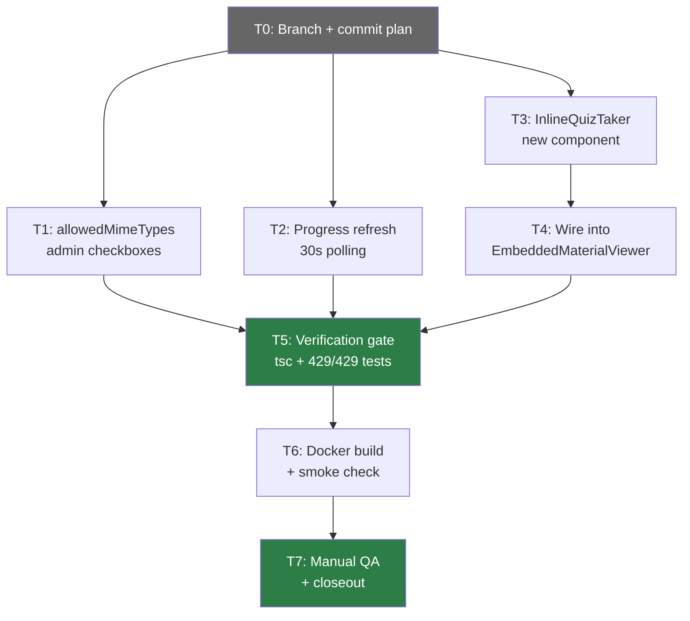
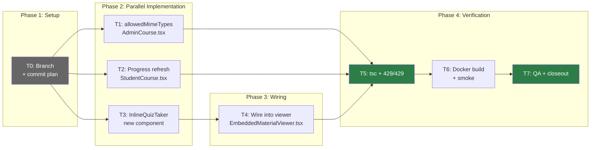

# Phase 5 Implementation Plan: Enhanced Course Interactions

**Date:** 2026-08-04
**Status:** PLAN READY
**Spec:** `docs/superpowers/specs/2026-08-04-phase5-enhanced-interactions-spec.md`
**Baseline:** Phase 4 released (`phase4-complete-2026-08-04`), 429/429 backend tests, site live
**Scope:** 3 frontend-only features — allowedMimeTypes admin UI, progress refresh, inline quiz

---

## 1. Task Table

| ID | Task | File(s) | Est. Lines | Depends On | Parallel? |
|----|------|---------|-----------|------------|-----------|
| T0 | Branch + commit plan | — | 0 | — | — |
| T1 | F1: allowedMimeTypes admin checkboxes | `AdminCourse.tsx` | ~30 | T0 | Yes (independent) |
| T2 | F2: Progress refresh (30s polling) | `StudentCourse.tsx` | ~10 net | T0 | Yes (independent) |
| T3 | F3a: Create InlineQuizTaker component | `InlineQuizTaker.tsx` (new) | ~150 | T0 | Yes (independent) |
| T4 | F3b: Wire InlineQuizTaker into viewer | `EmbeddedMaterialViewer.tsx` | ~10 net | T3 | No (needs T3) |
| T5 | Verification gate: tsc + backend tests | — | 0 | T1, T2, T4 | — |
| T6 | Docker build + smoke check | — | 0 | T5 | — |
| T7 | Manual QA + closeout | — | 0 | T6 | — |

**Total new code:** ~200 lines across 1 new file + 3 modified files.

---

## 2. Dependency Flow



---

## 3. Parallelization Strategy

### Can Run in Parallel (after T0)

| Agent | Task | File | Reason |
|-------|------|------|--------|
| Agent A | T1: allowedMimeTypes | AdminCourse.tsx | No shared files with T2/T3 |
| Agent B | T2: Progress refresh | StudentCourse.tsx | No shared files with T1/T3 |
| Agent C | T3: InlineQuizTaker | InlineQuizTaker.tsx (new) | No shared files with T1/T2 |

### Must Be Sequential

| Task | Reason |
|------|--------|
| T4 after T3 | T4 imports InlineQuizTaker from T3. Cannot add `import` until file exists. |
| T5 after T1+T2+T4 | Verification requires all code changes complete. |
| T6 after T5 | Docker build requires clean tsc. |
| T7 after T6 | QA requires running containers. |

---

## 4. Task Details

### T0: Branch Setup

**Actions:**
1. Verify baseline: `cd LMS-Server && npx vitest run` → 429/429
2. Create branch: `git checkout -b feat/phase5-enhanced-interactions`
3. Commit this plan document

**Exit gate:** Branch created, plan committed, tests pass.

---

### T1: F1 — allowedMimeTypes Admin Checkboxes

**File:** `LMS-Frontend/src/pages/AdminCourse.tsx`
**Insertion point:** After the `maxFileSize` Input (line 1130), before `</>` (line 1131)

**What to insert:**
```tsx
<div className="flex flex-wrap gap-2">
  <span className="text-xs text-neutral-500 w-full">Accepted file types:</span>
  {[
    ['PDF', 'application/pdf'],
    ['DOCX', 'application/vnd.openxmlformats-officedocument.wordprocessingml.document'],
    ['XLSX', 'application/vnd.openxmlformats-officedocument.spreadsheetml.sheet'],
    ['PPTX', 'application/vnd.openxmlformats-officedocument.presentationml.presentation'],
    ['JPEG', 'image/jpeg'],
    ['PNG', 'image/png'],
    ['GIF', 'image/gif'],
    ['TXT', 'text/plain'],
    ['CSV', 'text/csv'],
  ].map(([label, mime]) => (
    <label key={mime} className="inline-flex items-center gap-1 text-xs">
      <input
        type="checkbox"
        checked={it.allowedMimeTypes?.includes(mime) ?? false}
        onChange={(e) => {
          const current = it.allowedMimeTypes ?? [];
          const next = e.target.checked
            ? [...current, mime]
            : current.filter((m) => m !== mime);
          updateItem(week.tempId, sec.tempId, it.tempId, { allowedMimeTypes: next });
        }}
      />
      {label}
    </label>
  ))}
</div>
```

**Verification:** `tsc --noEmit` from `LMS-Frontend/`.

**Scope guard:** DO NOT modify buildCourse, startEdit, or any backend file. The entire pipeline already works.

**Acceptance criteria addressed:** F1-AC1 through F1-AC6.

---

### T2: F2 — Progress Refresh (30s Polling)

**File:** `LMS-Frontend/src/pages/StudentCourse.tsx`
**Action:** Replace the useEffect at lines 322-338 with the polling version.

**Current code (lines 322-338):**
```typescript
useEffect(() => {
  if (!selectedCourseId || !user?.id) return;
  let cancelled = false;
  courseCompletionService.getLessonCompletions(selectedCourseId).then((ids) => {
    if (cancelled || ids.length === 0) return;
    setDoneItemIds((prev) => {
      const merged = new Set(prev);
      for (const id of ids) merged.add(id);
      writeDoneIds(user.id, selectedCourseId, merged);
      return merged;
    });
  });
  return () => { cancelled = true; };
}, [selectedCourseId, user?.id]);
```

**Replacement code:**
```typescript
useEffect(() => {
  if (!selectedCourseId || !user?.id) return;
  let cancelled = false;

  const sync = () => {
    courseCompletionService.getLessonCompletions(selectedCourseId).then((ids) => {
      if (cancelled || ids.length === 0) return;
      setDoneItemIds((prev) => {
        let changed = false;
        const merged = new Set(prev);
        for (const id of ids) {
          if (!merged.has(id)) { merged.add(id); changed = true; }
        }
        if (changed) writeDoneIds(user.id, selectedCourseId, merged);
        return changed ? merged : prev;
      });
    }).catch(() => { /* best-effort polling */ });
  };

  sync();
  const interval = setInterval(sync, 30_000);

  return () => { cancelled = true; clearInterval(interval); };
}, [selectedCourseId, user?.id]);
```

**Key differences from current:**
1. `sync()` extracted as named function (called immediately + on interval)
2. `changed` flag prevents unnecessary re-renders (reference equality)
3. `.catch(() => {})` added for polling error tolerance
4. `clearInterval` in cleanup

**Verification:** `tsc --noEmit` from `LMS-Frontend/`.

**Scope guard:** DO NOT add any new state variables, imports, or service methods. Reuse existing `writeDoneIds` and `courseCompletionService.getLessonCompletions`.

**Acceptance criteria addressed:** F2-AC1 through F2-AC6.

---

### T3: F3a — Create InlineQuizTaker Component

**File:** `LMS-Frontend/src/components/InlineQuizTaker.tsx` (NEW)
**Size:** ~150 lines

**Component interface:**
```typescript
interface InlineQuizTakerProps {
  quizId: string;
}
```

**State machine:** `loading` → `intro` → `taking` → `submitting` → `result` | `error`

**Implementation notes:**

1. **Imports needed:**
   - `quizService` from `../services/quizService`
   - Types: `Quiz`, `QuizCompletion` from `../types/quiz`
   - React: `useState`, `useEffect`

2. **State variables:**
   - `quiz: Quiz | null` — fetched quiz data
   - `step: 'loading' | 'intro' | 'taking' | 'submitting' | 'result' | 'error'`
   - `answers: Record<string, string>` — keyed by question ID
   - `qi: number` — current question index (0-based)
   - `result: QuizCompletion | null` — submission result
   - `errorMsg: string` — error message for error state

3. **Lifecycle:**
   - `useEffect([quizId])` → `quizService.getById(quizId)` → set quiz + step='intro' or step='error'

4. **Question rendering (copy patterns from StudentQuizzes.tsx):**
   - Multiple choice: radio buttons for each option
   - Short answer: text input
   - Navigation: prev/next buttons with counter "Question N of M"
   - Submit button on last question (only when all questions answered)

5. **Submission:**
   - `quizService.submitQuiz(quizId, '', answers)` (userId unused per service signature)
   - On success: set result, step='result'
   - On failure: set errorMsg, step='error'

6. **Result display:**
   - Score percentage: `result.score + '%'`
   - Pass/fail badge: `result.passed ? 'Passed' : 'Not passed'`
   - Retake button → step='intro', clear answers
   - (No "Close" button — student uses the viewer's close/nav buttons)

7. **Error state:**
   - Error message
   - "Try again" button → step='loading', re-fetch
   - Fallback link: `<a href="/student/quizzes?quiz={quizId}">Open in Quizzes page</a>`

8. **Edge cases:**
   - Quiz with 0 questions: show "This quiz has no questions yet" in intro state
   - quizId empty: handled by caller (EmbeddedMaterialViewer shows "not configured")

**Scope guard:** DO NOT use sessionStorage, DO NOT modify URL params, DO NOT import or modify StudentQuizzes.tsx.

**Verification:** `tsc --noEmit` from `LMS-Frontend/`.

**Acceptance criteria addressed:** F3-AC1 through F3-AC4, F3-AC7, F3-AC8.

---

### T4: F3b — Wire InlineQuizTaker into EmbeddedMaterialViewer

**File:** `LMS-Frontend/src/components/EmbeddedMaterialViewer.tsx`
**Action:** Replace the "Start quiz" link block with `<InlineQuizTaker quizId={quizId} />`

**Current code (lines 304-336):**
The quiz branch renders an IIFE that creates a "Start quiz" link navigating to `/student/quizzes?quiz={quizId}`.

**Changes:**
1. Add import at top: `import InlineQuizTaker from './InlineQuizTaker';`
2. Replace the quiz item rendering:

```tsx
// Replace the inner content of the quizId truthy branch:
// FROM: <Link> to /student/quizzes?quiz={quizId} (multi-line block)
// TO:
<InlineQuizTaker quizId={quizId} />
```

3. Keep the falsy branch unchanged: `"Quiz not configured"` message stays.

**Verification:** `tsc --noEmit` from `LMS-Frontend/`.

**Scope guard:** DO NOT change the assignment branch, download branch, or any other item type rendering.

**Acceptance criteria addressed:** F3-AC1, F3-AC9.

---

### T5: Verification Gate

**Commands (sequential):**
1. Frontend type check: `cd LMS-Frontend && npx tsc --noEmit`
2. Backend type check: `cd LMS-Server && npx tsc --noEmit`
3. Backend tests: `cd LMS-Server && npx vitest run` → 429/429

**Pass criteria:**
- Zero tsc errors (frontend + backend)
- 429/429 tests pass
- No new test files needed (all features are frontend-only)

**Fail action:** Fix type errors, re-run gate. Do not proceed to T6 with errors.

---

### T6: Docker Build + Smoke Check

**Commands:**
```bash
docker compose build web
docker compose up -d --no-deps web
# Smoke:
curl -s -o /dev/null -w '%{http_code}' https://lms.smwebsystems.com/   # → 200
curl -s https://lms.smwebsystems.com/api/v1/health                      # → {"status":"ok"}
```

**Note:** API container unchanged (no backend changes). Only `web` needs rebuild.

**Rollback (if smoke fails):**
```bash
git revert HEAD~N..HEAD
docker compose build web && docker compose up -d --no-deps web
```

---

### T7: Manual QA + Closeout

**QA Checklist (13 items):**

#### F1: allowedMimeTypes Admin UI
| ID | Check | Steps | Expected |
|----|-------|-------|----------|
| QA-F1-01 | Checkboxes render | Admin → edit course → edit assignment item | 9 checkboxes visible below maxFileSize |
| QA-F1-02 | Selection works | Check PDF + DOCX → save → reload → edit | PDF and DOCX still checked |
| QA-F1-03 | Student sees types | Student → open course → view assignment item | "Accepted formats: PDF, DOCX" |
| QA-F1-04 | Clear all types | Admin unchecks all → save | Student sees no format hint |

#### F2: Progress Refresh
| ID | Check | Steps | Expected |
|----|-------|-------|----------|
| QA-F2-01 | Auto-update | Student passes quiz → wait 30s → check progress | Progress bar increments without refresh |
| QA-F2-02 | No duplicate marks | Student marks item → wait 30s | Item stays marked, no flicker |
| QA-F2-03 | Polling stops | Student leaves course → check network tab | No more `/completions` requests |

#### F3: Inline Quiz
| ID | Check | Steps | Expected |
|----|-------|-------|----------|
| QA-F3-01 | Inline render | Open quiz item in course viewer | Questions render inline |
| QA-F3-02 | Submit works | Answer all → submit | Score + pass/fail shown inline |
| QA-F3-03 | Pass → complete | Pass quiz → wait 30s | Item shows complete in course |
| QA-F3-04 | Fail → retake | Fail → click Retake | Returns to intro |
| QA-F3-05 | Error fallback | Disconnect network → open quiz item | Error + link to Quizzes page |

#### Regressions
| ID | Check | Steps | Expected |
|----|-------|-------|----------|
| QA-R-01 | Standalone Quizzes page | Navigate to /student/quizzes | Works normally |

**Closeout actions:**
1. Write release closeout doc
2. Tag: `pre-phase5-2026-08-04` (safety) + `phase5-complete-2026-08-04`
3. Merge to main (--no-ff)
4. Push to origin

---

## 5. Execution Workflow

### /loop Workflow

```
/loop baseline  — Verify 429/429 tests, create branch, commit plan (T0)
/loop parallel  — Execute T1, T2, T3 in parallel (3 independent files)
/loop wire      — Execute T4 (wire InlineQuizTaker into viewer)
/loop verify    — Run T5 verification gate (tsc + tests)
/loop deploy    — Run T6 Docker build + smoke check
/loop qa        — Run T7 manual QA checklist
/loop close     — Tag, merge, push, write closeout doc
```

### Review Checkpoints

| After | Review |
|-------|--------|
| T1 | Verify checkboxes use correct MIME strings. Verify `updateItem` call matches existing pattern. |
| T2 | Verify `sync()` is called immediately AND on interval. Verify `changed` flag prevents re-render. Verify `clearInterval` in cleanup. |
| T3 | Verify state machine transitions are complete. Verify all quiz service calls match signatures. Verify no sessionStorage or URL params. |
| T4 | Verify import path is correct. Verify fallback ("not configured") is preserved. Verify no other branches changed. |
| T5 | Verify 429/429 (not fewer). Verify tsc is clean (not "with warnings"). |

---

## 6. Execution Order Diagram



---

## 7. Risk Mitigations

| Risk | Mitigation | Fallback |
|------|-----------|----------|
| T1: `updateItem` signature drift | Verified at `AdminCourse.tsx:673` — `Partial<ItemDraft>` | Read file again before editing |
| T2: `writeDoneIds` not in scope | Verified it's used in existing useEffect | Check if it's a closure var or imported |
| T3: Quiz type missing fields | Verified `Quiz` type has `questions` array | Read `types/quiz.ts` before writing |
| T4: Import path wrong | Standard sibling import: `./InlineQuizTaker` | Check actual file location |
| All: Line numbers shifted | Phase 5 has no other active branches | Re-read files at edit time |

---

## 8. What Is NOT In Scope

| Excluded | Reason |
|----------|--------|
| Backend changes | All features use existing APIs |
| Schema changes | No new tables or columns |
| New npm dependencies | All features use existing React + services |
| Audio tracking | Deferred to Phase 6+ (needs new DB table) |
| Inline assignment submission | Stretch goal, not core scope |
| SessionStorage for inline quiz | Explicitly excluded (ephemeral by design) |
| URL params for inline quiz | Conflicts with course viewer state |
| Modifying StudentQuizzes.tsx | Standalone page preserved as-is |
| New backend tests | Frontend-only changes; 429/429 baseline is the regression gate |

---

## 9. Definition of Done

| Criterion | Evidence |
|-----------|----------|
| F1: Admin can set allowedMimeTypes via checkboxes | Manual QA |
| F2: Progress refreshes every 30s | Manual QA |
| F3: Student can take quiz inline | Manual QA |
| Frontend tsc clean | `npx tsc --noEmit` exit 0 |
| Backend tsc clean | `npx tsc --noEmit` exit 0 |
| 429/429 backend tests pass | `npx vitest run` output |
| Docker web container healthy | `curl` smoke checks |
| No regressions on standalone pages | Manual spot-check |
| Release tagged and merged to main | Git log |
| Closeout doc written | File in `docs/superpowers/plans/` |

---

## 10. Final Recommendation

**Status: PLAN READY**

**Key simplification:** All 3 features are frontend-only. T1, T2, and T3 touch completely different files and can run in parallel. The only dependency is T4 (wiring) which requires T3 (component creation) to complete first. Total estimated new code: ~200 lines.

**Recommended execution approach:** Subagent-driven parallel execution for T1/T2/T3, then sequential T4→T5→T6→T7.

**Exact next action:** Execute `T0` — create branch, commit this plan, verify baseline.
