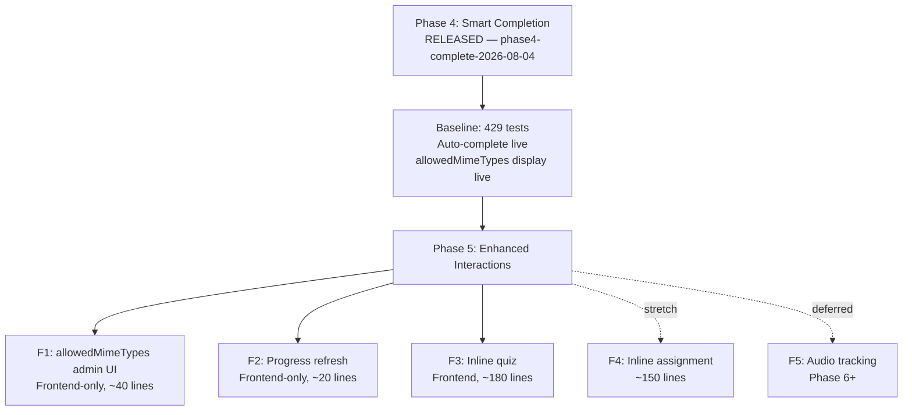
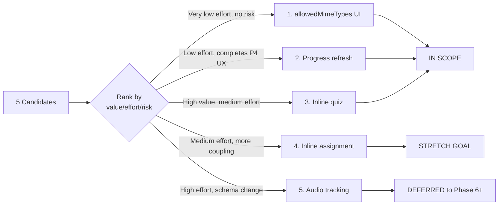
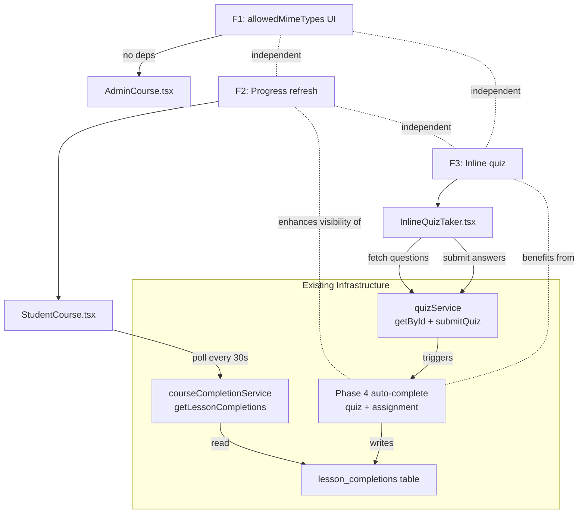
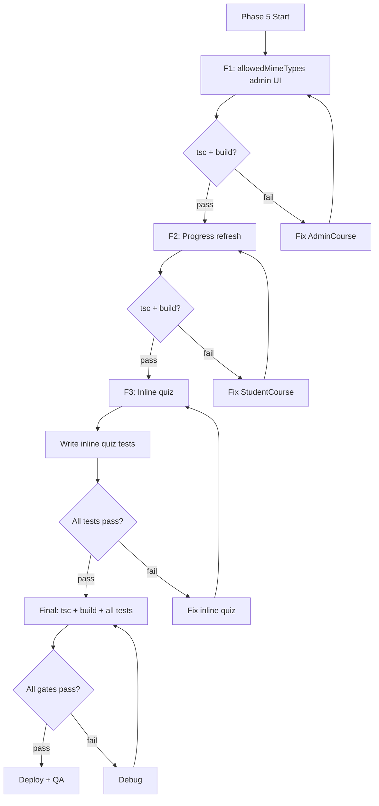

# Phase 5 Planning: Enhanced Course Interactions

**Date:** 2026-08-04
**Status:** PHASE 5 PLANNING READY
**Baseline:** Phase 4 released (`phase4-complete-2026-08-04`), 429/429 tests, site live
**Objective:** Rank, scope, and plan Phase 5 candidate features

---

## 1. Context

Phase 4 added smart completion (auto-complete on quiz pass and assignment approval) and allowedMimeTypes display. Phase 5 builds on this foundation with deeper course interaction features.

### Non-Goals

- No Phase 4 rework or reopening
- No new item types
- No schema redesign of lesson_completions
- No infrastructure that requires Redis, WebSocket libraries, or external message queues

---

## 2. Candidate Ranking

| Rank | Feature | Value | Effort | Risk | Rationale |
|------|---------|-------|--------|------|-----------|
| 1 | Admin UI for allowedMimeTypes | Medium | Very Low | None | 1 file, ~40 lines, zero backend. Full data pipeline already exists — only the admin form widget is missing. |
| 2 | Progress refresh (long-poll) | Medium | Low | None | ~20 lines in StudentCourse.tsx. Wraps existing `getLessonCompletions()` in a `setInterval`. Makes Phase 4 auto-completions visible without page refresh. |
| 3 | Inline quiz in course viewer | High | Medium | Low | Extract quiz-taking from StudentQuizzes.tsx into a shared component. Quiz API and data already accessible. EmbeddedMaterialViewer needs state. |
| 4 | Inline assignment submission | Medium | Medium-High | Medium | Requires threading `courseId` as new prop, file upload UI, MIME validation. More coupling than inline quiz. |
| 5 | Audio playback tracking | Low | High | Medium | New DB table, new API, throttled event listeners, threshold logic. Intentionally deferred from Phase 4. |

### Recommendation

**Phase 5 scope: Features 1-3.** Feature 4 (inline assignment) can be a stretch goal if 1-3 finish quickly. Feature 5 (audio tracking) is deferred to Phase 6+ — it requires schema changes and a fundamentally different completion model.

---

## 3. Feature Specifications

### Feature 1: Admin UI for allowedMimeTypes

**Type:** Frontend-only
**File:** `LMS-Frontend/src/pages/AdminCourse.tsx` (~40 lines)
**Insertion point:** After the `maxFileSize` input in the assignment item editor block (around line 1130)

#### What Already Exists (Complete Data Pipeline)

| Layer | Status | Location |
|-------|--------|----------|
| Type definition | Done | `course.ts:62` — `allowedMimeTypes?: string[]` |
| ItemDraft field | Done | `AdminCourse.tsx:48` — `allowedMimeTypes?: string[]` |
| Serialization (buildCourse) | Done | `AdminCourse.tsx:752-759` — serializes if non-empty |
| Deserialization (startEdit) | Done | `AdminCourse.tsx:484` — reads from course JSON |
| Student display | Done | `EmbeddedMaterialViewer.tsx:354-373` — Phase 4 |
| **Admin edit UI** | **MISSING** | **This feature** |

#### Behavior

Admin edits an assignment item → sees a set of checkboxes or multi-select for common file types → selected types are stored in `allowedMimeTypes[]` → student sees "Accepted formats: PDF, DOCX, ..." on the course item.

#### Implementation Approach

A set of checkboxes for the 9 types already in the `MIME_LABELS` map (PDF, DOCX, XLSX, PPTX, JPEG, PNG, GIF, TXT, CSV), plus an "other" free-text input for custom MIME types.

#### Acceptance Criteria

| ID | Criterion | Verification |
|----|-----------|-------------|
| F1-AC1 | Admin can select file types for an assignment item | Manual QA |
| F1-AC2 | Selected types persist after save and reload | Manual QA |
| F1-AC3 | Student sees "Accepted formats: ..." matching admin selection | Manual QA |
| F1-AC4 | Clearing all types removes the display | Manual QA |
| F1-AC5 | Existing items without allowedMimeTypes unchanged | Regression |

---

### Feature 2: Progress Refresh (Long-Poll)

**Type:** Frontend-only
**File:** `LMS-Frontend/src/pages/StudentCourse.tsx` (~20 lines)
**Insertion point:** Inside the course-load useEffect (around line 322-338)

#### What Already Exists

- `courseCompletionService.getLessonCompletions(courseId)` fetched once on mount
- `doneItemIds` Set updated from server response
- No polling, no real-time infrastructure

#### Behavior

After initial load, poll `getLessonCompletions()` every 30 seconds. Merge new completions into `doneItemIds`. Stop polling on unmount or course change.

#### Implementation Approach

```typescript
// Inside the useEffect that loads completions:
const interval = setInterval(async () => {
  const completions = await courseCompletionService.getLessonCompletions(courseId);
  setDoneItemIds(prev => {
    const next = new Set(prev);
    completions.forEach(c => next.add(c.item_id));
    return next;
  });
}, 30_000);
return () => clearInterval(interval);
```

#### Acceptance Criteria

| ID | Criterion | Verification |
|----|-----------|-------------|
| F2-AC1 | Auto-completions from quiz pass appear within 30s without refresh | Manual QA |
| F2-AC2 | Auto-completions from assignment approval appear within 30s | Manual QA |
| F2-AC3 | Polling stops on course change | Code review |
| F2-AC4 | Polling stops on component unmount | Code review |
| F2-AC5 | No duplicate or lost completions | Manual QA + code review |
| F2-AC6 | Network errors don't crash the UI | Code review |

---

### Feature 3: Inline Quiz in Course Viewer

**Type:** Frontend (primary) + possibly extract shared component
**Files:**
- `LMS-Frontend/src/components/InlineQuizTaker.tsx` (new, ~150 lines)
- `LMS-Frontend/src/components/EmbeddedMaterialViewer.tsx` (modify, ~30 lines)
- `LMS-Frontend/src/pages/StudentQuizzes.tsx` (possible refactor to extract shared logic)

#### What Already Exists

| Component | Location | Status |
|-----------|----------|--------|
| Quiz fetch API | `GET /api/v1/quizzes/:id` | Available, strips answer keys for students |
| Quiz submit API | `POST /api/v1/quizzes/:id/submit` | Available, returns score + passed |
| Quiz-taking UI | `StudentQuizzes.tsx:1-100` | Full implementation with session storage |
| Quiz item rendering | `EmbeddedMaterialViewer.tsx:304-336` | Currently just a "Start quiz" link |
| `quizId` availability | `item.quizId` | Available in the course item prop |
| Auto-complete on pass | `quizzesController.ts` | Phase 4 — creates lesson_completion |

#### Behavior

Student clicks a quiz item in the course viewer → quiz questions load inline → student answers questions → submits → sees score/pass result → item auto-completes (Phase 4) → progress bar updates (Feature 2 polling).

#### Implementation Approach

1. Extract quiz-taking logic from `StudentQuizzes.tsx` into a shared `InlineQuizTaker` component
2. `InlineQuizTaker` accepts `quizId` prop, fetches questions, manages answer state, handles submission
3. `EmbeddedMaterialViewer` renders `InlineQuizTaker` instead of the "Start quiz" link when quiz item is selected
4. On successful pass, call parent's `onItemComplete` callback (or let Phase 4 auto-complete handle it)

#### Key Design Decisions

1. **Shared component vs. duplicate:** Extract shared `InlineQuizTaker` to avoid maintaining two copies of quiz-taking logic
2. **State in EmbeddedMaterialViewer:** The viewer is currently stateless. Adding an `InlineQuizTaker` child is cleaner than making the viewer itself stateful — the child manages its own state
3. **Session persistence:** Use sessionStorage like `StudentQuizzes.tsx` for answer persistence across navigation
4. **Fallback:** Keep the "Start quiz" link as a fallback for edge cases (e.g., quiz data fails to load)

#### Acceptance Criteria

| ID | Criterion | Verification |
|----|-----------|-------------|
| F3-AC1 | Quiz questions render inline in course viewer | Manual QA |
| F3-AC2 | Student can answer and submit quiz without leaving the page | Manual QA |
| F3-AC3 | Passing score triggers auto-complete (Phase 4) | Automated test |
| F3-AC4 | Failing score shows feedback, no auto-complete | Manual QA |
| F3-AC5 | Quiz results display (score, pass/fail) | Manual QA |
| F3-AC6 | Standalone quiz page still works | Regression |
| F3-AC7 | Answer key not visible to students (LMS-QUIZ-001) | Existing test coverage |

---

### Deferred: Feature 4 — Inline Assignment Submission

**Reason for deferral to stretch goal:** Requires threading `courseId` as a new prop through `EmbeddedMaterialViewer`, file upload UI, MIME validation against `allowedMimeTypes`, and submission status display. More coupling than inline quiz.

**If time permits after F1-F3:** Can be added as F4 with ~100-150 lines across 2-3 files.

---

### Deferred: Feature 5 — Audio Playback Tracking

**Reason for deferral to Phase 6+:** Requires new DB table (`audio_progress`), new API endpoint, throttled `onTimeUpdate` event listeners, configurable completion threshold (e.g., 80% played), and a fundamentally different completion model (percentage vs. binary). Estimated 4-6 new files plus schema changes.

---

## 4. Dependency Map

```
Feature 1: allowedMimeTypes admin UI
  └── No dependencies — frontend-only, can be done first or in parallel

Feature 2: Progress refresh (long-poll)
  ├── Depends on: courseCompletionService.getLessonCompletions() (exists)
  ├── Enhances: Phase 4 auto-complete visibility
  └── Independent of: F1 and F3

Feature 3: Inline quiz in course viewer
  ├── Depends on: quizService.getById() (exists)
  ├── Depends on: quizService.submitQuiz() (exists)
  ├── Enhanced by: F2 (progress polling shows completion)
  ├── Benefits from: Phase 4 quiz auto-complete
  └── Independent of: F1
```

### Shared Systems

| System | Used By | Risk |
|--------|---------|------|
| `lesson_completions` table | F2 (read), F3 (via auto-complete) | None — read-only for F2 |
| `courseCompletionService` | F2 (polling) | None — existing service |
| `quizService` | F3 (fetch + submit) | None — existing service |
| `EmbeddedMaterialViewer` | F1 (display), F3 (inline quiz) | Low — F1 is display-only (Phase 4), F3 adds child component |
| `AdminCourse.tsx` | F1 (admin editor) | None — additive form field |
| `StudentCourse.tsx` | F2 (polling) | Low — additive interval |

---

## 5. Files Touched

| File | Change Type | Feature |
|------|------------|---------|
| `AdminCourse.tsx` | Modify (~40 lines) | F1: allowedMimeTypes admin editor |
| `StudentCourse.tsx` | Modify (~20 lines) | F2: progress polling |
| `InlineQuizTaker.tsx` | Create (~150 lines) | F3: shared quiz component |
| `EmbeddedMaterialViewer.tsx` | Modify (~30 lines) | F3: render InlineQuizTaker |
| `StudentQuizzes.tsx` | Possible refactor | F3: extract shared logic |

**Total:** 1 new file, 3-4 modified files. ~240 lines of new code.

---

## 6. Mermaid Diagrams

### Phase 4 → Phase 5 Handoff Flow



### Candidate Ranking Flow



### Dependency Map



### Risk / Test Gate Flow



---

## 7. Test Strategy

### Automated Tests

| Feature | Test File | Tests | What to Test |
|---------|-----------|-------|-------------|
| F1 | None (frontend-only admin UI) | 0 | Manual QA only |
| F2 | None (frontend-only polling) | 0 | Manual QA + code review |
| F3 | `inline-quiz.test.ts` (if API integration) | 2-4 | Quiz fetch + submit via inline path, auto-complete triggers |

### Regression Coverage

| Existing Test | Must Still Pass |
|---------------|----------------|
| quiz-security.test.ts (8) | Yes — answer key stripping |
| quiz-auto-complete.test.ts (4) | Yes — Phase 4 auto-complete |
| assignment-auto-complete.test.ts (4) | Yes — Phase 4 auto-complete |
| All 429 tests | Yes — baseline gate |

### Manual QA

| Feature | Check | Steps |
|---------|-------|-------|
| F1 | Admin sets file types | Admin edits assignment item → selects PDF + DOCX → saves → student sees "Accepted formats: PDF, DOCX" |
| F1 | Types persist | Admin saves → reloads course editor → file types still selected |
| F2 | Auto-completion appears | Student passes quiz → waits 30s → progress bar updates without refresh |
| F2 | Polling stops | Student navigates away → no more API calls in network tab |
| F3 | Inline quiz taking | Student opens quiz item → answers questions → submits → sees score inline |
| F3 | Quiz pass → auto-complete | Student passes → item shows complete without page refresh (via F2 polling) |
| F3 | Standalone quiz page | Student navigates to /student/quizzes → still works normally |

---

## 8. Risk Assessment

### Coupling Points from Phase 4

| Phase 4 Component | Phase 5 Touch | Risk |
|--------------------|--------------|------|
| `EmbeddedMaterialViewer.tsx` allowedMimeTypes display | F3 modifies same file (adds inline quiz) | Low — different branches (assignment vs quiz) |
| Quiz auto-complete (`quizzesController.ts`) | F3 triggers same path (inline submit) | None — same API, no changes needed |
| `lesson_completions` table | F2 reads, F3 triggers writes via auto-complete | None — read-only for F2, existing write path for F3 |
| `courseHelpers.ts` | Not touched by Phase 5 | None |

### Assumptions to Validate

| Assumption | Validation Method |
|------------|-------------------|
| `quizService.getById()` is callable from any component | Check import path |
| `quizService.submitQuiz()` returns pass/fail result | Check response type |
| `EmbeddedMaterialViewer` can render a stateful child | JSX allows it — no blocker |
| `AdminCourse` `updateItem()` accepts `allowedMimeTypes` | Check function signature |
| Polling interval of 30s is acceptable load | Calculate: ~1 GET/30s/student |

### Risk Matrix

| Risk | Severity | Likelihood | Mitigation |
|------|----------|------------|------------|
| F1: updateItem doesn't accept allowedMimeTypes | Low | Very low | Field exists in ItemDraft, updateItem is generic |
| F2: Polling causes excessive API load | Low | Low | 30s interval, single GET request, no DB writes |
| F2: Race condition between local marks and server poll | Medium | Low | Merge-only (add to set, never remove) |
| F3: Quiz data fetch fails inline | Low | Low | Fallback to "Start quiz" link |
| F3: EmbeddedMaterialViewer complexity grows | Medium | Medium | Contain complexity in InlineQuizTaker child |
| F3: Duplicate quiz-taking logic | Medium | Medium | Extract shared component |

---

## 9. To-Do Lists

### Candidate Analysis Checklist

- [x] Identify all 5 candidate features
- [x] Rank by value/effort/risk
- [x] Scope Phase 5 to features 1-3
- [x] Defer feature 5 (audio tracking) to Phase 6+
- [x] Mark feature 4 (inline assignment) as stretch goal
- [x] Verify existing infrastructure for each candidate

### Dependency Checklist

- [x] `courseCompletionService.getLessonCompletions()` exists and returns item_ids
- [x] `quizService.getById()` exists, strips answer keys for students
- [x] `quizService.submitQuiz()` exists, triggers Phase 4 auto-complete
- [x] `AdminCourse.tsx` `ItemDraft` includes `allowedMimeTypes`
- [x] `buildCourse()` serializes `allowedMimeTypes`
- [x] `startEdit()` deserializes `allowedMimeTypes`
- [x] `EmbeddedMaterialViewer` renders allowedMimeTypes (Phase 4)
- [ ] Verify `updateItem()` signature accepts arbitrary ItemDraft fields

### Risk Checklist

- [x] No schema changes needed for Phase 5 scope
- [x] No backend changes for F1 or F2
- [x] F3 uses existing quiz API (no backend changes)
- [x] Polling interval (30s) is reasonable
- [x] Phase 4 auto-complete path unchanged
- [ ] Verify quizService response shape for inline display

### Test Strategy Checklist

- [ ] Define inline quiz test cases (if applicable)
- [ ] Verify 429 baseline tests still anchored
- [ ] Define manual QA matrix for all 3 features
- [ ] Define regression gates

### Handoff Checklist

- [x] Phase 4 released and tagged
- [x] Phase 5 candidates ranked
- [x] Dependencies mapped
- [x] Test strategy outlined
- [x] Risk notes documented
- [ ] Phase 5 spec written (next step)
- [ ] Phase 5 implementation plan written (after spec)

---

## 10. Handoff Note

### What Is Released

- Phase 4: allowedMimeTypes display, quiz auto-complete, assignment auto-complete
- Tag: `phase4-complete-2026-08-04`
- Tests: 429/429
- Rollback tag: `pre-phase4-2026-08-04`

### What Phase 5 Should Consume

| From Phase 4 | Phase 5 Usage |
|--------------|--------------|
| `allowedMimeTypes` display in EmbeddedMaterialViewer | F1 enables admin to set these values |
| Quiz auto-complete in quizzesController | F3 inline quiz triggers same path |
| `courseHelpers.ts` shared utility | Not touched — stable |
| `lesson_completions` table | F2 reads, F3 triggers writes |
| `courseCompletionService` | F2 polls existing endpoint |
| `quizService` | F3 fetches + submits via existing API |

### What Should Remain Deferred

- Audio playback tracking (Phase 6+ — schema changes, new completion model)
- Real-time push via SSE/WebSocket (not needed with 30s polling)
- Admin course builder redesign
- New item types

---

## 11. /loop Workflow

```
/loop assess  — Read Phase 4 closeout, confirm Phase 5 candidates, verify infrastructure
/loop plan    — Write Phase 5 spec and implementation plan
/loop review  — Review plan for completeness, risk, and scope creep
/loop defer   — Confirm what stays out of Phase 5 scope
```

---

## 12. Final Recommendation

**Status: PHASE 5 PLANNING READY**

**Scope:** 3 features (allowedMimeTypes admin UI, progress refresh, inline quiz) + 1 stretch goal (inline assignment)

**Deferred:** Audio playback tracking (Phase 6+)

**Key finding that simplifies implementation:** The entire allowedMimeTypes data pipeline already exists — only the admin form widget is missing. The progress refresh can be implemented with ~20 lines wrapping an existing service call. The inline quiz can leverage existing `quizService` and `StudentQuizzes.tsx` logic.

**Estimated total:** ~240 lines of new code across 4-5 files. No schema changes. No backend changes for F1 or F2. F3 uses existing backend APIs.

**Exact next action:** Write the Phase 5 spec using the brainstorming skill, covering:
1. allowedMimeTypes admin UI — frontend-only, ~40 lines in AdminCourse.tsx
2. Progress refresh — frontend-only, ~20 lines in StudentCourse.tsx
3. Inline quiz — new component ~150 lines + ~30 lines in EmbeddedMaterialViewer.tsx
