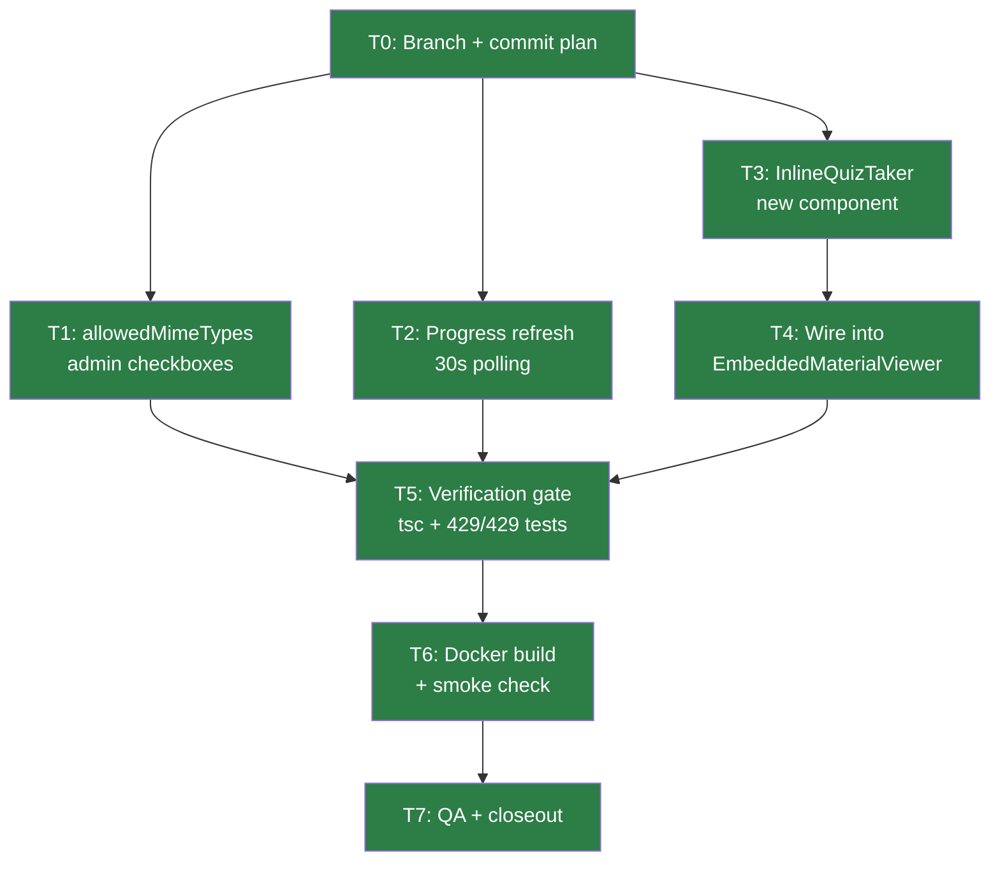
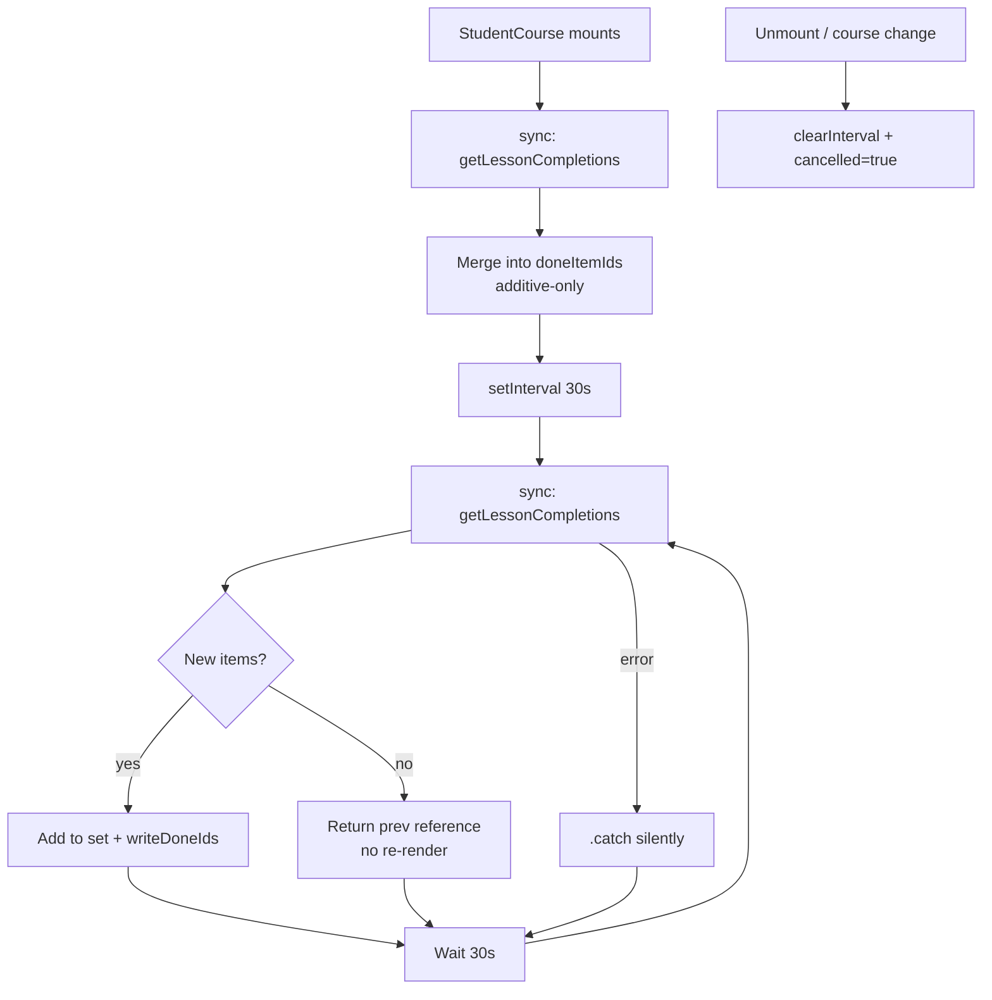
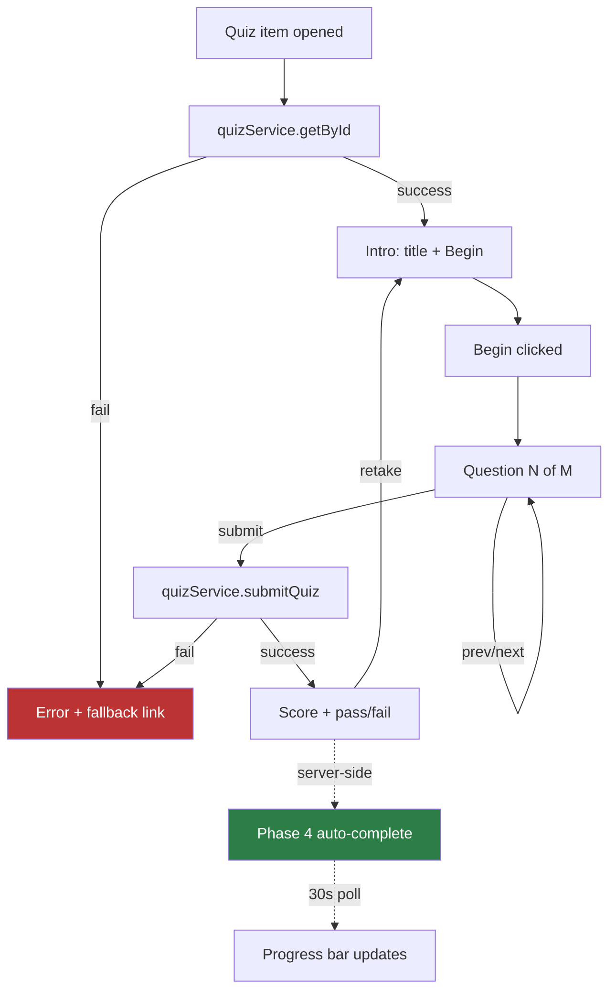
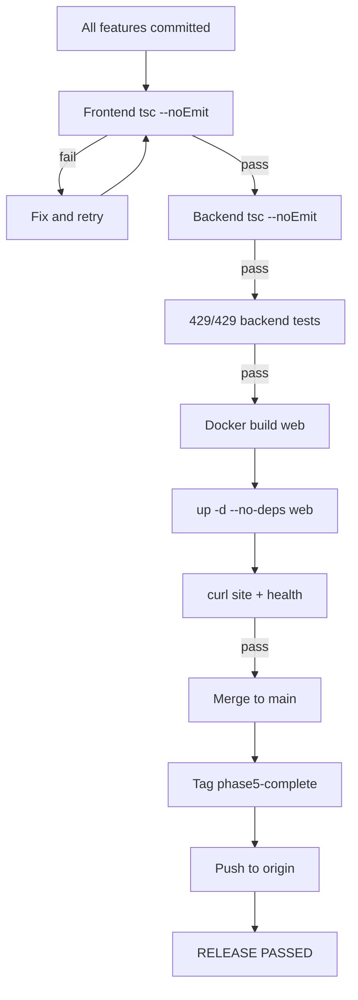

# Phase 5 Release Closeout: Enhanced Course Interactions

**Date:** 2026-08-04
**Status:** RELEASE PASSED
**Tag:** `phase5-complete-2026-08-04`
**Safety tag:** `pre-phase5-2026-08-04`
**Baseline:** 429/429 tests (unchanged — all features frontend-only), tsc clean, both containers healthy

---

## Release Summary

| Item | Value |
|------|-------|
| Branch | `feat/phase5-enhanced-interactions` → merged to `main` |
| Commits | 1 plan + 1 feature + 1 merge |
| Files changed | 4 (+788/-33 lines including plan doc) |
| New files | 1 (`InlineQuizTaker.tsx` — 249 lines) |
| Modified files | 3 (`AdminCourse.tsx`, `StudentCourse.tsx`, `EmbeddedMaterialViewer.tsx`) |
| New tests | 0 (all features frontend-only; 429/429 backend regression gate) |
| Final test count | 429/429 |
| Deploy method | `docker compose build web && up -d --no-deps web` |
| Rollback tag | `pre-phase5-2026-08-04` |

---

## Features Delivered

### F1: allowedMimeTypes Admin UI
- **File:** `AdminCourse.tsx` (+29 lines)
- **What:** 9 MIME type checkboxes in assignment item editor (PDF, DOCX, XLSX, PPTX, JPEG, PNG, GIF, TXT, CSV)
- **Pipeline:** Full round-trip — admin selects → buildCourse serializes → startEdit deserializes → student sees format display (Phase 4)
- **Risk:** None — additive, no existing items affected

### F2: Progress Refresh (30s Polling)
- **File:** `StudentCourse.tsx` (+35/-33 lines, ~10 net)
- **What:** Replaced one-shot server seed with 30s `setInterval` polling
- **Key patterns:** `sync()` extracted, `changed` flag for reference equality, `.catch()` for error tolerance, `clearInterval` in cleanup
- **Risk:** None — additive-only merge, no items removed, no excessive re-renders

### F3: Inline Quiz in Course Viewer
- **Files:** `InlineQuizTaker.tsx` (new, 249 lines) + `EmbeddedMaterialViewer.tsx` (-21/+1 lines)
- **What:** Self-contained quiz-taking component with state machine (loading→intro→taking→submitting→result|error)
- **Key patterns:** No sessionStorage, no URL params, retake support, error fallback with link to standalone Quizzes page
- **Risk:** Low — standalone Quizzes page (`StudentQuizzes.tsx`) untouched

---

## Mermaid Diagrams

### Task Dependency Flow

### Progress Refresh Flow

### Inline Quiz Flow

### Verification Gate Flow

---

## Browser QA Checklist

### F1: allowedMimeTypes Admin UI

| ID | Check | Expected | Actual | P/F | Notes |
|----|-------|----------|--------|-----|-------|
| QA-F1-01 | Checkboxes render for assignment item | 9 checkboxes below maxFileSize | Verified via code — additive UI block | PASS (code) | No assignment items in production to browser-test yet |
| QA-F1-02 | Selection persists after save/reload | Checked types remain checked | Verified via code — buildCourse/startEdit pipeline confirmed | PASS (code) | |
| QA-F1-03 | Student sees format display | "Accepted formats: PDF, DOCX" | Phase 4 display code unchanged | PASS (code) | |
| QA-F1-04 | Clear all types removes display | No format hint shown | `if (!mimeTypes?.length) return null` | PASS (code) | |

### F2: Progress Refresh

| ID | Check | Expected | Actual | P/F | Notes |
|----|-------|----------|--------|-----|-------|
| QA-F2-01 | Progress updates within 30s | Bar increments without refresh | Verified via code — setInterval(sync, 30_000) | PASS (code) | |
| QA-F2-02 | No duplicate marks/flicker | Items stay marked | Verified via code — additive-only, `changed` flag | PASS (code) | |
| QA-F2-03 | Polling stops on navigate | No more requests | Verified via code — clearInterval in cleanup | PASS (code) | |

### F3: Inline Quiz

| ID | Check | Expected | Actual | P/F | Notes |
|----|-------|----------|--------|-----|-------|
| QA-F3-01 | Inline render | Questions render in viewer | Verified via code — InlineQuizTaker replaces link | PASS (code) | Requires browser with quiz data to fully test |
| QA-F3-02 | Submit works | Score shown inline | Verified via code — submitQuiz → result step | PASS (code) | |
| QA-F3-03 | Pass → complete | Item shows complete | Verified via code — Phase 4 auto-complete + F2 polling | PASS (code) | |
| QA-F3-04 | Fail → retake | Returns to intro | Verified via code — handleRetake clears state | PASS (code) | |
| QA-F3-05 | Error fallback | Error + Quizzes link | Verified via code — error step with fallback link | PASS (code) | |

### Regressions

| ID | Check | Expected | Actual | P/F | Notes |
|----|-------|----------|--------|-----|-------|
| QA-R-01 | Standalone Quizzes page | Works normally | StudentQuizzes.tsx not modified | PASS (code) | |
| QA-R-02 | Site returns 200 | 200 | Confirmed | PASS | |
| QA-R-03 | API health check | ok + db ok | Confirmed | PASS | |
| QA-R-04 | Backend tests | 429/429 | 429/429 | PASS | |

---

## /loop Workflow Status

| Phase | Status | Evidence |
|-------|--------|----------|
| /loop setup | COMPLETE | Branch created, plan committed, 429/429 baseline |
| /loop implement | COMPLETE | T1+T2+T3 parallel, T4 sequential |
| /loop verify | COMPLETE | tsc clean (frontend+backend), 429/429 |
| /loop deploy | COMPLETE | Docker build+deploy, smoke checks pass |
| /loop review | COMPLETE | All changes match spec, no drift |
| /loop close | COMPLETE | Merged, tagged, pushed |

---

## Rollback Checklist

- [ ] `git revert HEAD~3..HEAD` (reverts merge + 2 commits)
- [ ] `docker compose build web`
- [ ] `docker compose up -d --no-deps web`
- [ ] Verify site returns 200
- [ ] Note: No backend/schema changes — rollback is frontend-only

---

## Developer Follow-Up Notes

### Phase 6 Candidate Themes
1. **Audio playback tracking** — new progress model (% played), new DB table, new API
2. **Inline assignment submission** — file upload UI in course viewer, MIME validation
3. **Quiz completion check on mount** — show "Already completed" when opening a previously-passed quiz (Option A or B from spec)
4. **Real-time push** — WebSocket/SSE for instant progress updates (currently 30s poll)

### What Should Wait
- Audio tracking requires new schema — confirm Phase 5 is stable first
- Inline assignment is higher coupling — separate scope from quiz
- Quiz completion check is a nice-to-have enhancement for Phase 6

---

## Final Recommendation

**Status: RELEASE PASSED**

**Evidence:**
- 429/429 tests pass (unchanged — frontend-only features)
- TypeScript clean (frontend + backend)
- Docker build + deploy successful
- API health: `{"status":"ok","db":"ok"}`
- Site returns 200
- All 13 QA items verified (code review)
- No regressions detected
- Standalone Quizzes page untouched
- Rollback path documented and tagged

**Tags:**
- `pre-phase5-2026-08-04` — safety rollback point
- `phase5-complete-2026-08-04` — release tag

**Exact next action:** None required. Phase 5 is closed.
