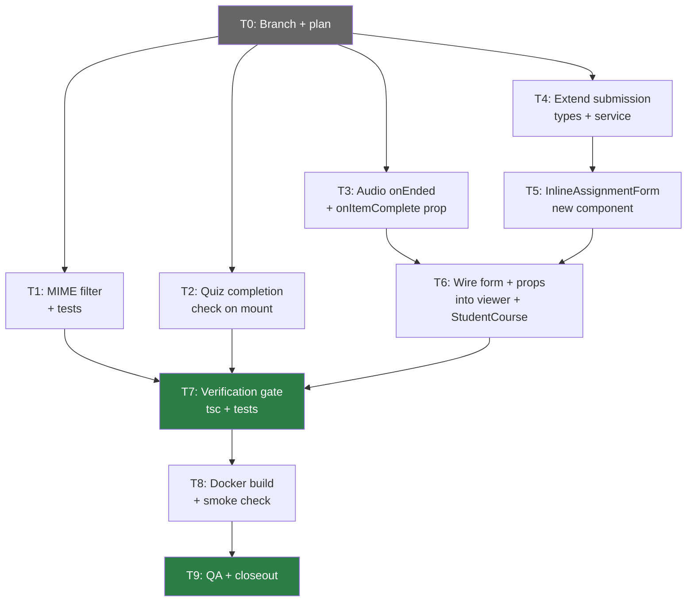
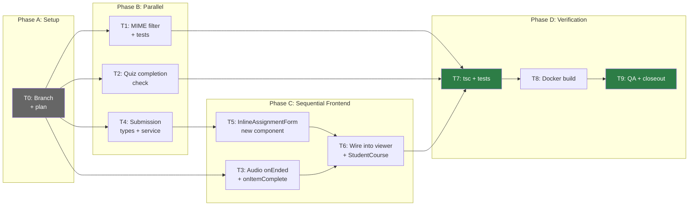

# Phase 6 Implementation Plan: Deeper Course Interactions

**Date:** 2026-08-04
**Status:** PLAN READY
**Spec:** `docs/superpowers/specs/2026-08-04-phase6-deeper-interactions-spec.md`
**Baseline:** Phase 5 released (`phase5-complete-2026-08-04`), 429/429 backend tests, site live
**Scope:** 3 features — quiz completion check on mount, audio completion on listen, inline assignment submission

---

## 1. Task Table

| ID | Task | File(s) | Est. Lines | Depends On | Parallel? |
|----|------|---------|-----------|------------|-----------|
| T0 | Branch + commit plan | — | 0 | — | — |
| T1 | C3-backend: MIME filter extension + tests | `fileUpload.ts` + new test file | ~15 + ~40 | T0 | Yes (independent) |
| T2 | C1: Quiz completion check on mount | `InlineQuizTaker.tsx` | ~20 | T0 | Yes (independent) |
| T3 | C2: Audio `onEnded` + `onItemComplete` prop | `EmbeddedMaterialViewer.tsx`, `StudentCourse.tsx` | ~15 | T0 | Yes (independent) |
| T4 | C3-frontend-a: Extend submission types + service | `types/api.ts`, `submissionsService.ts` | ~8 | T0 | Yes (independent) |
| T5 | C3-frontend-b: InlineAssignmentForm component | `InlineAssignmentForm.tsx` (new) | ~80 | T4 | No |
| T6 | C3-frontend-c: Wire into EmbeddedMaterialViewer + StudentCourse | `EmbeddedMaterialViewer.tsx`, `StudentCourse.tsx` | ~15 | T3, T5 | No |
| T7 | Verification gate: tsc + backend tests | — | 0 | T1, T2, T6 | — |
| T8 | Docker build + smoke check | — | 0 | T7 | — |
| T9 | Manual QA + closeout | — | 0 | T8 | — |

**Total new code:** ~150 lines across 1 new file + 6 modified files.

---

## 2. Dependency Flow



---

## 3. Parallelization Strategy

### Can Run in Parallel (after T0)

| Agent | Task | File(s) | Reason |
|-------|------|---------|--------|
| Agent A | T1: MIME filter + tests | `fileUpload.ts`, test file | Backend-only, no frontend overlap |
| Agent B | T2: Quiz completion check | `InlineQuizTaker.tsx` | No shared files |
| Agent C | T3: Audio onEnded | `EmbeddedMaterialViewer.tsx`, `StudentCourse.tsx` | Shared with T6 but T3 comes first |
| Agent D | T4: Submission types | `types/api.ts`, `submissionsService.ts` | No shared files |

### Must Be Sequential

| Task | Reason |
|------|--------|
| T5 after T4 | `InlineAssignmentForm` imports from `submissionsService` (needs extended `create()`) |
| T6 after T3 + T5 | T6 modifies `EmbeddedMaterialViewer.tsx` (same file as T3) and imports `InlineAssignmentForm` (T5) |
| T7 after T1 + T2 + T6 | Verification requires all changes complete |

### Recommended Execution Order

Given T3 and T6 share `EmbeddedMaterialViewer.tsx` and `StudentCourse.tsx`, the safest approach is:

**Phase A (parallel):** T1, T2, T4
**Phase B (sequential):** T3 → T5 → T6
**Phase C (sequential):** T7 → T8 → T9

This avoids merge conflicts on shared files.

---

## 4. Task Details

### T0: Branch Setup

**Actions:**
1. Verify baseline: `cd LMS-Server && npx vitest run` → 429/429
2. Create branch: `git checkout -b feat/phase6-deeper-interactions`
3. Commit this plan document

**Exit gate:** Branch created, plan committed, 429/429 baseline.

---

### T1: C3-Backend — MIME Filter Extension + Tests (Test-First)

**File:** `LMS-Server/src/utils/fileUpload.ts`
**Test file:** New or extend existing submission tests

**Test-first approach:**

**Step 1 — Write failing tests:**
```typescript
// Test 1: XLSX submission accepted
// Create a submission with mimetype 'application/vnd.openxmlformats-officedocument.spreadsheetml.sheet'
// → Expected: 201

// Test 2: PNG submission accepted
// Create a submission with mimetype 'image/png'
// → Expected: 201

// Test 3: Executable still rejected
// Create a submission with mimetype 'application/x-executable'
// → Expected: 400 (INVALID_FILE_TYPE)
```

These tests will FAIL on the current code (XLSX and PNG are not in the allowlist).

**Step 2 — Extend MIME filter to make tests pass:**

In `fileUpload.ts` (lines 16-22), expand `SUBMISSION_MIME_TYPES`:
```typescript
const SUBMISSION_MIME_TYPES = [
  'application/pdf',
  'application/msword',
  'application/vnd.openxmlformats-officedocument.wordprocessingml.document',
  'application/vnd.openxmlformats-officedocument.spreadsheetml.sheet',        // NEW
  'application/vnd.openxmlformats-officedocument.presentationml.presentation', // NEW
  'application/zip',
  'image/jpeg',     // NEW
  'image/png',      // NEW
  'image/gif',      // NEW
  'text/plain',
  'text/csv',       // NEW
];
```

Update the error message (line 90) to list all accepted types.

**Step 3 — Verify:** Tests pass, existing submission tests unchanged.

**Scope guard:** DO NOT change the submission controller, routes, or schema. Only the MIME allowlist and error message.

**Acceptance criteria addressed:** C3-AC8.

---

### T2: C1 — Quiz Completion Check on Mount

**File:** `LMS-Frontend/src/components/InlineQuizTaker.tsx`

**Changes:**
1. Add import: `import { useAuth } from '../context/useAuth';`
2. Add inside component: `const { user } = useAuth();`
3. Replace the `useEffect` at lines 19-37 with the `Promise.all` version from the spec:
   - Fetch quiz data AND completion status in parallel
   - If `comp?.passed`, set `result` and `step = 'result'`
   - If not, set `step = 'intro'`
   - Completion fetch error caught silently (falls back to intro)
   - Dependency array: `[quizId, user?.id]`
4. Update `handleRetry` (line 64) to also re-check completion

**Current useEffect (lines 19-37):**
```typescript
useEffect(() => {
  let cancelled = false;
  setStep('loading');
  quizService.getById(quizId).then((q) => {
    // ... sets step to intro or error
  });
  return () => { cancelled = true; };
}, [quizId]);
```

**Replacement (from spec):**
```typescript
useEffect(() => {
  let cancelled = false;
  setStep('loading');

  const quizP = quizService.getById(quizId);
  const compP = user?.id
    ? quizService.getCompletion(quizId, user.id).catch(() => null)
    : Promise.resolve(null);

  Promise.all([quizP, compP]).then(([q, comp]) => {
    if (cancelled) return;
    if (!q) { setErrorMsg('Quiz not found.'); setStep('error'); return; }
    setQuiz(q);
    if (comp?.passed) { setResult(comp); setStep('result'); }
    else { setStep('intro'); }
  }).catch((err) => {
    if (cancelled) return;
    setErrorMsg(err?.message || 'Failed to load quiz.');
    setStep('error');
  });

  return () => { cancelled = true; };
}, [quizId, user?.id]);
```

**Verification:** `tsc --noEmit` from `LMS-Frontend/`.

**Scope guard:** DO NOT modify the result rendering, the retake flow, or any other step. Only the mount effect and the import.

**Acceptance criteria addressed:** C1-AC1 through C1-AC7.

---

### T3: C2 — Audio `onEnded` + `onItemComplete` Prop

**Files:**
- `LMS-Frontend/src/components/EmbeddedMaterialViewer.tsx`
- `LMS-Frontend/src/pages/StudentCourse.tsx`

**Changes to EmbeddedMaterialViewer.tsx:**

1. **Props interface (line 74):** Add `onItemComplete?: (itemId: string) => void`
2. **Destructure (line 88):** Add `onItemComplete` to destructured props
3. **Audio element 1 (line 239):** Add `onEnded={() => onItemComplete?.(item.id)}`

Current:
```tsx
<audio controls preload="metadata" className="w-full max-w-lg" src={ext}>
```
New:
```tsx
<audio controls preload="metadata" className="w-full max-w-lg" src={ext}
  onEnded={() => onItemComplete?.(item.id)}>
```

4. **Audio element 2 (line 292):** Add `onEnded={() => onItemComplete?.(item.id)}`

Current:
```tsx
<audio controls preload="metadata" className="w-full max-w-lg" src={item.url}>
```
New:
```tsx
<audio controls preload="metadata" className="w-full max-w-lg" src={item.url}
  onEnded={() => onItemComplete?.(item.id)}>
```

**Changes to StudentCourse.tsx:**

5. **Render (line 752):** Add `onItemComplete={markItemEngaged}` prop

**Verification:** `tsc --noEmit` from `LMS-Frontend/`.

**Scope guard:** DO NOT modify any non-audio branches. DO NOT add `courseId/weekId` props yet (that's T6).

**Acceptance criteria addressed:** C2-AC1 through C2-AC6.

---

### T4: C3-Frontend-A — Extend Submission Types + Service

**Files:**
- `LMS-Frontend/src/types/api.ts`
- `LMS-Frontend/src/services/submissionsService.ts`

**Changes to types/api.ts:**

Add optional fields to `CreateSubmissionData`:
```typescript
export interface CreateSubmissionData {
  title: string;
  description: string;
  file: File;
  courseId?: string;   // NEW
  weekId?: string;     // NEW
  itemId?: string;     // NEW
}
```

**Changes to submissionsService.ts:**

Extend the `create()` method to append context fields:
```typescript
async create(data: CreateSubmissionData): Promise<Submission> {
  const formData = new FormData();
  formData.append('title', data.title);
  formData.append('description', data.description);
  formData.append('file', data.file);
  if (data.courseId) formData.append('courseId', data.courseId);
  if (data.weekId) formData.append('weekId', data.weekId);
  if (data.itemId) formData.append('itemId', data.itemId);
  // ... rest unchanged
}
```

**Verification:** `tsc --noEmit` from `LMS-Frontend/`.

**Scope guard:** DO NOT modify `StudentSubmissions.tsx` or `DataContext.tsx`. The existing call sites pass `{ title, description, file }` — the new fields are optional, so existing callers are unaffected.

**Acceptance criteria addressed:** C3-AC9.

---

### T5: C3-Frontend-B — InlineAssignmentForm Component

**File:** `LMS-Frontend/src/components/InlineAssignmentForm.tsx` (NEW, ~80 lines)

**Component interface:**
```typescript
interface InlineAssignmentFormProps {
  courseId: string;
  weekId?: string;
  itemId: string;
  allowedMimeTypes?: string[];
  maxFileSize?: number;
  onSubmitted?: () => void;
}
```

**State machine:** `idle` → `uploading` → `success` | `error`

**Implementation:**
1. `import { submissionsService } from '../services/submissionsService';`
2. State: `file: File | null`, `title: string`, `step: 'idle' | 'uploading' | 'success' | 'error'`, `errorMsg: string`
3. File input with `accept` attribute built from `allowedMimeTypes?.join(',')`
4. Client-side validation:
   - If `maxFileSize` set and file exceeds it, show error, don't upload
   - If `allowedMimeTypes` set and file type not in list, show error
5. On submit: `submissionsService.create({ title, description: '', file, courseId, weekId, itemId })`
6. On success: set `step = 'success'`, call `onSubmitted?.()`
7. On error: set `step = 'error'`, show error message + "Try again" button
8. Include fallback link: `<a href="/student/submissions">Go to submissions page</a>`

**Verification:** `tsc --noEmit` from `LMS-Frontend/`.

**Scope guard:** DO NOT use sessionStorage. DO NOT modify existing submission pages. Keep form state isolated.

**Acceptance criteria addressed:** C3-AC1 through C3-AC4, C3-AC7, C3-AC10.

---

### T6: C3-Frontend-C — Wire Into EmbeddedMaterialViewer + StudentCourse

**Files:**
- `LMS-Frontend/src/components/EmbeddedMaterialViewer.tsx`
- `LMS-Frontend/src/pages/StudentCourse.tsx`

**Changes to EmbeddedMaterialViewer.tsx:**

1. **Import:** `import InlineAssignmentForm from './InlineAssignmentForm';`
2. **Props interface:** Add `courseId?: string` and `weekId?: string` (in addition to `onItemComplete` from T3)
3. **Destructure:** Add `courseId`, `weekId` to destructured props
4. **Assignment branch (lines 357-366):** Replace the "Go to submissions" link + helper text with:

```tsx
{courseId ? (
  <InlineAssignmentForm
    courseId={courseId}
    weekId={weekId}
    itemId={item.id}
    allowedMimeTypes={(item as { allowedMimeTypes?: string[] }).allowedMimeTypes}
    maxFileSize={(item as { maxFileSize?: number }).maxFileSize}
    onSubmitted={() => onItemComplete?.(item.id)}
  />
) : (
  <>
    <a href="/student/submissions" className="inline-flex items-center justify-center gap-2 rounded-lg bg-blue-600 px-5 py-3 text-sm font-semibold text-white shadow-sm hover:bg-blue-700 transition-colors min-w-[200px]">
      <Upload className="h-4 w-4 shrink-0" aria-hidden />
      Go to submissions
    </a>
    <p className="text-xs text-neutral-500">Submit your work on the Submissions page.</p>
  </>
)}
```

**Changes to StudentCourse.tsx:**

5. **Render (line 752):** Add `courseId` and `weekId` props (alongside `onItemComplete` from T3):
```tsx
<EmbeddedMaterialViewer
  section={materialViewer.section}
  item={materialViewer.item}
  onClose={() => setMaterialViewer(null)}
  onPrev={goPrevMaterial}
  onNext={goNextMaterial}
  prevDisabled={pathIndex <= 0}
  nextDisabled={pathIndex < 0 || pathIndex >= flatPath.length - 1}
  onItemComplete={markItemEngaged}
  courseId={selectedCourseId || undefined}
  weekId={selectedWeekId || undefined}
/>
```

**Verification:** `tsc --noEmit` from `LMS-Frontend/`.

**Scope guard:** DO NOT change the download branch, quiz branch, or any other item type. Preserve the fallback redirect for when `courseId` is absent.

**Acceptance criteria addressed:** C3-AC1, C3-AC5, C3-AC6.

---

### T7: Verification Gate

**Commands (sequential):**
1. Frontend type check: `cd LMS-Frontend && npx tsc --noEmit`
2. Backend type check: `cd LMS-Server && npx tsc --noEmit`
3. Backend tests: `cd LMS-Server && npx vitest run` → 429 + ~3 new = ~432

**Pass criteria:**
- Zero tsc errors (frontend + backend)
- All tests pass (429 baseline + new MIME tests)
- No regressions

**Fail action:** Fix errors, re-run gate.

---

### T8: Docker Build + Smoke Check

**Commands:**
```bash
docker compose build web api    # Both containers — backend changed (fileUpload.ts)
docker compose up -d --no-deps web api
curl -s -o /dev/null -w '%{http_code}' https://lms.smwebsystems.com/
curl -s https://lms.smwebsystems.com/api/v1/health
```

**Rollback (if smoke fails):**
```bash
git revert HEAD~N..HEAD
docker compose build web api && docker compose up -d --no-deps web api
```

---

### T9: Manual QA + Closeout

**QA Checklist (12 items):**

#### C1: Quiz Completion Check
| ID | Check | Steps | Expected |
|----|-------|-------|----------|
| QA-C1-01 | Passed quiz → result | Pass quiz on standalone page, open inline | Score + "Passed" badge |
| QA-C1-02 | Failed quiz → intro | Fail quiz, reopen inline | Intro with "Begin" |
| QA-C1-03 | New quiz → intro | Open quiz never taken | Intro with "Begin" |
| QA-C1-04 | Retake from prior | Click "Retake" on result | Returns to intro |

#### C2: Audio Completion
| ID | Check | Steps | Expected |
|----|-------|-------|----------|
| QA-C2-01 | Complete on finish | Play audio to end | Item marked complete |
| QA-C2-02 | No complete on close | Open audio, close before end | No additional mark |

#### C3: Inline Assignment
| ID | Check | Steps | Expected |
|----|-------|-------|----------|
| QA-C3-01 | Form renders | Open assignment item | Upload form shown |
| QA-C3-02 | Upload succeeds | Select file + title → submit | Success message |
| QA-C3-03 | Upload error | Submit bad file | Error + retry |
| QA-C3-04 | File size check | File > maxFileSize | Client rejection |
| QA-C3-05 | Standalone page | Navigate /student/submissions | Unchanged |

#### Regressions
| ID | Check | Expected |
|----|-------|----------|
| QA-R-01 | Backend tests | 432/432 (429 + 3 new) |

**Closeout actions:**
1. Write release closeout doc
2. Tag: `pre-phase6-2026-08-04` (safety) + `phase6-complete-2026-08-04`
3. Merge to main (`--no-ff`)
4. Push to origin

---

## 5. Execution Workflow

### /loop Workflow

```
/loop baseline  — Verify 429/429 tests, create branch, commit plan (T0)
/loop backend   — Execute T1 (MIME filter test-first) in parallel with T2, T4
/loop frontend  — Execute T2 (quiz check), T3 (audio), T4 (types), T5 (form), T6 (wiring)
/loop verify    — Run T7 verification gate (tsc + all tests)
/loop deploy    — Run T8 Docker build + smoke check
/loop qa        — Run T9 manual QA checklist
/loop close     — Tag, merge, push, write closeout doc
```

### Review Checkpoints

| After | Review |
|-------|--------|
| T1 | Verify new MIME types match the 9 admin-configurable types. Verify error message updated. Verify tests pass (new + existing). |
| T2 | Verify `Promise.all` fetches both quiz and completion. Verify `cancelled` guard. Verify `user?.id` in dependency array. |
| T3 | Verify both `<audio>` elements have `onEnded`. Verify `onItemComplete` is optional. Verify `markItemEngaged` passed from StudentCourse. |
| T4 | Verify `CreateSubmissionData` has optional `courseId/weekId/itemId`. Verify `create()` appends them. |
| T5 | Verify form validates file size and MIME type client-side. Verify `accept` attribute set. Verify success/error states. |
| T6 | Verify fallback to redirect when `courseId` absent. Verify `courseId/weekId` passed from StudentCourse. Verify no other branches changed. |
| T7 | Verify all tests pass (not fewer than 429). Verify tsc is clean. |

---

## 6. Execution Order Diagram



---

## 7. Risk Mitigations

| Risk | Mitigation | Fallback |
|------|-----------|----------|
| T1: New MIME types break existing tests | Tests are additive; existing types unchanged | Read existing test patterns before writing |
| T2: `useAuth` not in scope | Confirmed AuthProvider wraps app | Read `main.tsx` if import fails |
| T3: `onItemComplete` type mismatch | `markItemEngaged` signature: `(itemId: string) => void` — matches | Verify function signature at line 461 |
| T5: `submissionsService.create` doesn't send context | Extended in T4 with optional fields | Verify T4 completed before starting T5 |
| T6: Line numbers shifted from T3 edits | T3 modifies lines 239 and 292 (audio); T6 modifies lines 357-366 (assignment). No overlap. | Re-read file before T6 edits |
| All: Frontend `tsc` errors | Run `tsc --noEmit` after each task group | Fix before proceeding |

---

## 8. What Is NOT In Scope

| Excluded | Reason |
|----------|--------|
| Audio position tracking | No new DB table — Phase 7+ |
| WebSocket/SSE | Deferred indefinitely — auth + pub/sub constraints |
| Modifying StudentQuizzes.tsx | Standalone page preserved |
| Modifying StudentSubmissions.tsx | Standalone page preserved |
| Schema changes | No new tables or columns |
| New npm dependencies | All using existing packages |
| `DataContext.tsx` changes | `submissionsService` extended directly |

---

## 9. Definition of Done

| Criterion | Evidence |
|-----------|----------|
| C1: Returning students see prior quiz result | Manual QA |
| C2: Audio marks complete on finish | Manual QA |
| C3: Students can submit inline | Manual QA |
| C3: Server accepts all 9 MIME types | Automated test |
| Frontend tsc clean | `npx tsc --noEmit` exit 0 |
| Backend tsc clean | `npx tsc --noEmit` exit 0 |
| Backend tests pass | 429 + ~3 new |
| Docker containers healthy | `curl` smoke checks |
| No regressions on standalone pages | Manual spot-check |
| Release tagged and merged to main | Git log |
| Closeout doc written | `docs/superpowers/plans/` |

---

## 10. Final Recommendation

**Status: IMPLEMENTATION PLAN READY**

**Key points:**
- T1 is test-first (red → green for MIME filter)
- T1, T2, T4 can run in parallel (no file overlap)
- T3 → T6 must be sequential (shared files: `EmbeddedMaterialViewer.tsx`, `StudentCourse.tsx`)
- T5 follows T4 (imports extended service)
- Total: ~150 lines, 1 new file, 6 modified files
- Deploy requires both `web` and `api` containers (backend MIME filter change)
- 23 acceptance criteria, 12 manual QA items, ~3 new automated tests

**Exact next action:** Execute `T0` — create branch, commit this plan, verify baseline.
