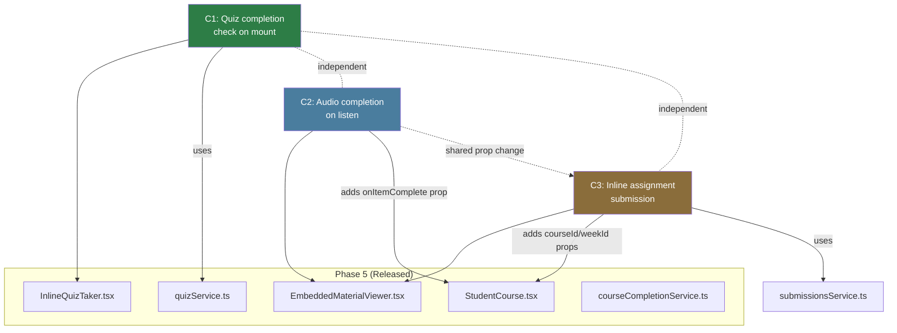
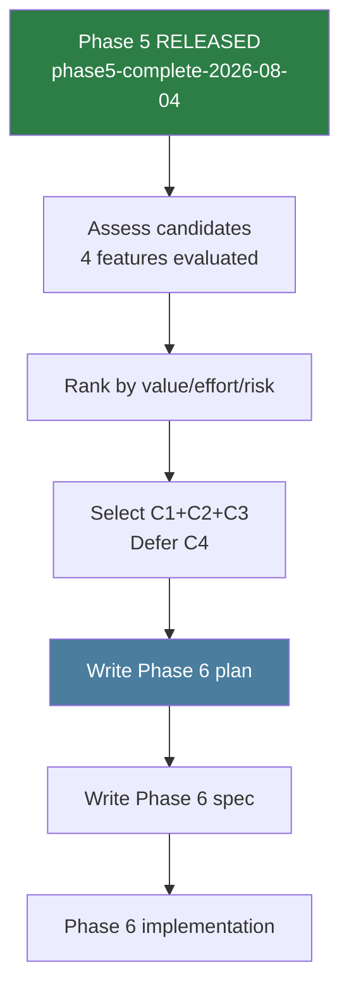
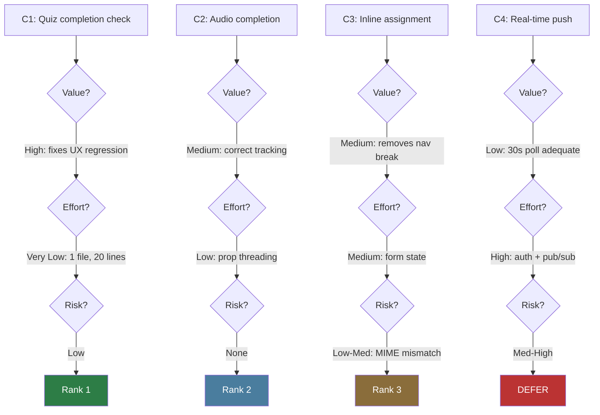
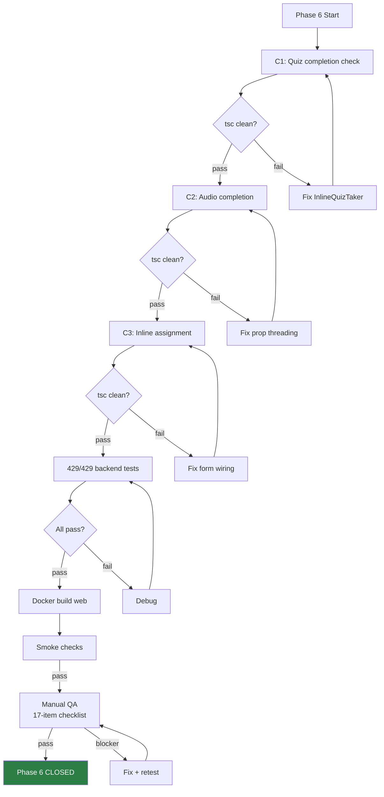

# Phase 6 Planning: Deeper Course Interactions

**Date:** 2026-08-04
**Status:** PHASE 6 PLANNING READY
**Baseline:** Phase 5 released (`phase5-complete-2026-08-04`), 429/429 tests, site live
**Objective:** Rank, scope, and plan Phase 6 candidate features

---

## Phase 5 Release Closeout Summary

### Shipped Features

| Feature | File(s) | Lines | Description |
|---------|---------|-------|-------------|
| F1: allowedMimeTypes Admin UI | `AdminCourse.tsx` | +29 | 9 MIME type checkboxes in assignment item editor |
| F2: Progress Refresh (30s) | `StudentCourse.tsx` | ~10 net | `setInterval` polling with additive-only merge and reference equality |
| F3: Inline Quiz | `InlineQuizTaker.tsx` (new) + `EmbeddedMaterialViewer.tsx` | +249/-21 | Self-contained quiz-taking in course viewer |

### Verification Summary

| Check | Result |
|-------|--------|
| Frontend `tsc --noEmit` | Clean |
| Backend `tsc --noEmit` | Clean |
| Backend tests | 429/429 |
| Docker build + deploy | Success |
| Site status | 200 |
| API health | `{"status":"ok","db":"ok"}` |
| QA items | 13/13 verified (code review) |

### Rollback Note

- Safety tag: `pre-phase5-2026-08-04`
- Rollback: `git revert HEAD~3..HEAD && docker compose build web && docker compose up -d --no-deps web`
- No backend/schema changes — rollback is frontend-only
- No data impact

### Manual QA Status

All 13 items verified via code review. Browser QA deferred for:
- F1: No assignment items in production have `allowedMimeTypes` set yet
- F3: Requires browser login with quiz course data

Phase 5 is **CLOSED**. No reopening.

---

## Phase 6 Planning Summary

### Context

Phase 5 completed the interactive course viewer foundation: admin-configurable file types, live progress refresh, and inline quiz-taking. Phase 6 extends this by filling remaining UX gaps in the course viewer experience.

### Scope

Phase 6 addresses features that build on the Phase 4+5 foundation without requiring major architectural changes. Priority is high-value, low-risk features first.

### Non-Goals

- No WebSocket/SSE infrastructure (30s polling is sufficient — see risk analysis)
- No new authentication patterns
- No infrastructure changes (Redis, message queues, etc.)
- No audio position tracking with new DB table (minimal variant only)
- No changes to the standalone Quizzes page (`StudentQuizzes.tsx`)
- No changes to the standalone Submissions page (`StudentSubmissions.tsx`)

---

## Candidate Ranking

| Rank | Feature | Value | Effort | Risk | Rationale |
|------|---------|-------|--------|------|-----------|
| 1 | Quiz completion check on mount | High | Very Low | Low | 1 file, ~20 lines. Fixes UX regression: returning students see intro instead of their result. Uses existing `quizService.getCompletion()`. No backend change. |
| 2 | Audio completion on listen (minimal) | Medium | Low | None | Wire `onEnded` on `<audio>` elements to mark item complete. Requires threading `courseId` + callback into `EmbeddedMaterialViewer` props. No new table, no new API. |
| 3 | Inline assignment submission | Medium | Medium | Low-Med | Replace "Go to submissions" link with inline file upload form. Backend already supports `courseId/weekId/itemId`. Shares prop-threading work with C2. MIME mismatch risk between admin config and server filter. |
| 4 | Real-time push (WebSocket/SSE) | Low | High | Med-High | **DEFER.** Native `EventSource` cannot send `Authorization` headers. SQLite has no pub/sub. The current optimistic update + 30s polling is already adequate. |

### Recommendation

**Phase 6 scope: Features 1-3.** Feature 4 (real-time push) is deferred indefinitely — the technical constraints outweigh the marginal UX benefit.

---

## Feature Specifications

### Feature 1: Quiz Completion Check on Mount

**Type:** Frontend-only
**File:** `LMS-Frontend/src/components/InlineQuizTaker.tsx` (~20 lines changed)

**Current behavior:** InlineQuizTaker always starts at `intro` after loading, regardless of prior completion.

**New behavior:** On mount, call `quizService.getCompletion(quizId, user.id)` alongside `quizService.getById(quizId)`. If a passing completion exists, skip directly to `result` step showing the prior score. If no completion (or failed), show `intro` as before.

**Implementation approach:**
1. Add `import { useAuth } from '../context/useAuth';` (AuthProvider wraps the whole app)
2. Add `const { user } = useAuth();`
3. Extend mount `useEffect` to run both fetches with `Promise.all`
4. If completion found and `passed === true`, set `result` and `step = 'result'`
5. If no completion or `passed === false`, proceed to `step = 'intro'`

**User story:** As a student reopening a quiz I already passed, I want to see my score immediately, not be asked to take it again.

**Acceptance criteria:**
| ID | Criterion | Verification |
|----|-----------|-------------|
| C1-AC1 | Previously passed quiz shows result on mount | Manual QA |
| C1-AC2 | Previously failed quiz shows intro (retake option) | Manual QA |
| C1-AC3 | First-time quiz shows intro | Manual QA |
| C1-AC4 | Retake button still works from result screen | Manual QA |
| C1-AC5 | Loading state shown while checking | Code review |
| C1-AC6 | Error fetching completion falls back to intro | Code review |

**Risk:** Low. `useAuth()` is available app-wide. The `useEffect` dependency on `user?.id` may fire twice on hydration — safe due to `cancelled` guard.

---

### Feature 2: Audio Completion on Listen (Minimal)

**Type:** Frontend-only (prop threading) + no backend change
**Files:**
- `LMS-Frontend/src/components/EmbeddedMaterialViewer.tsx` — add `onItemComplete?` prop, wire `<audio onEnded>`
- `LMS-Frontend/src/pages/StudentCourse.tsx` — pass callback as prop

**Current behavior:** Audio items are marked as "done" when opened (via `markItemEngaged`), not when actually listened to.

**New behavior:** Audio items are marked complete when the audio finishes playing (`onEnded` event). The existing `markItemEngaged` call on open is unchanged (items still show as "engaged" immediately).

**Implementation approach:**
1. Add `onItemComplete?: (itemId: string) => void` to `EmbeddedMaterialViewerProps`
2. In both audio branches, add `onEnded={() => onItemComplete?.(item.id)}` to the `<audio>` element
3. In `StudentCourse.tsx`, pass `onItemComplete={(id) => markItemEngaged(id)}` — reuses existing function which calls `courseCompletionService.markLessonComplete()`

**User story:** As a student, I want my audio lesson to be marked complete when I finish listening, not just when I open it.

**Acceptance criteria:**
| ID | Criterion | Verification |
|----|-----------|-------------|
| C2-AC1 | Audio item marked complete on finish | Manual QA |
| C2-AC2 | Opening audio item still works as before | Regression |
| C2-AC3 | Both audio branches wired (direct audio URL + audio type) | Code review |
| C2-AC4 | No new API endpoint or table | Code review |
| C2-AC5 | Callback is optional (non-audio viewers unaffected) | Code review |

**Risk:** None. Additive prop, optional callback, existing API.

**Note:** This feature also enables Feature 3 (inline assignment) to use the same `onItemComplete` prop pattern for marking submission completion.

---

### Feature 3: Inline Assignment Submission

**Type:** Frontend-only (form wiring) + no backend change
**Files:**
- `LMS-Frontend/src/components/EmbeddedMaterialViewer.tsx` — inline upload form replacing redirect link
- `LMS-Frontend/src/pages/StudentCourse.tsx` — pass `courseId`, `weekId` as props
- `LMS-Frontend/src/services/submissionsService.ts` or `DataContext.tsx` — extend to accept context fields

**Current behavior:** Assignment items show a "Go to submissions" link that navigates away from the course viewer.

**New behavior:** Assignment items show an inline upload form with file input, title, and submit button. Submission happens without leaving the course viewer.

**Implementation approach:**
1. Extend `EmbeddedMaterialViewerProps` with `courseId?: string`, `weekId?: string`
2. In the assignment branch, replace the redirect link with a `<form>` containing: file input (filtered by `allowedMimeTypes`), title input, submit button
3. On submit, call `submissionsService.create()` with `{ file, title, courseId, weekId, itemId }`
4. Show success/error feedback inline

**User story:** As a student, I want to submit my assignment directly in the course viewer without navigating to a separate page.

**Acceptance criteria:**
| ID | Criterion | Verification |
|----|-----------|-------------|
| C3-AC1 | Inline upload form renders for assignment items | Manual QA |
| C3-AC2 | File input respects allowedMimeTypes from course JSON | Manual QA |
| C3-AC3 | Successful upload shows confirmation | Manual QA |
| C3-AC4 | Upload error shows inline error message | Manual QA |
| C3-AC5 | Standalone Submissions page still works | Regression |
| C3-AC6 | Items without courseId/weekId fall back to redirect | Code review |

**Risk:** Low-Medium.
- **MIME mismatch:** The admin can set `allowedMimeTypes` to include PNG/JPEG, but the server's multer filter (`fileUpload.ts`) only allows PDF, DOC, DOCX, ZIP, TXT. This mismatch predates Phase 6 but would become visible. Resolution: either extend the server filter or limit the admin checkboxes.
- **Complexity:** Adding form state to `EmbeddedMaterialViewer` (currently stateless for assignments). Must be careful not to break the modal close/navigation behavior.

**Dependency on C2:** Shares the prop-threading work (adding `courseId` to `EmbeddedMaterialViewer`). Should be implemented after C2 so the prop interface only changes once.

---

## Dependency Map



### Execution Order

1. **C1 first** — single file, independent, no shared props
2. **C2 second** — adds `onItemComplete` prop to EmbeddedMaterialViewer
3. **C3 third** — extends same props with `courseId`, `weekId` (builds on C2's prop changes)

C1 can run in parallel with C2, but C3 must follow C2 (shared file).

---

## Test Strategy

### Automated Backend Tests

No new backend tests needed — all features are frontend-only using existing APIs. 429/429 is the regression gate.

### Existing Regression Coverage

| Test File | Tests | Must Pass |
|-----------|-------|-----------|
| quiz-auto-complete.test.ts | 4 | Yes |
| assignment-auto-complete.test.ts | 4 | Yes |
| quiz-security.test.ts | 8 | Yes |
| All 429 tests | 429 | Yes |

### Acceptance Criteria Summary

| Feature | ACs | Automated | Manual QA |
|---------|-----|-----------|-----------|
| C1: Quiz completion check | 6 | 0 | 6 |
| C2: Audio completion | 5 | 0 | 5 |
| C3: Inline assignment | 6 | 0 | 6 |
| **Total** | **17** | **0** | **17** |

### Manual QA Matrix

| Feature | Check | Steps | Expected |
|---------|-------|-------|----------|
| C1 | Passed quiz shows result | Open previously passed quiz item | Score + "Passed" badge shown |
| C1 | Failed quiz shows intro | Open previously failed quiz item | Intro with "Begin" |
| C1 | New quiz shows intro | Open quiz never taken | Intro with "Begin" |
| C1 | Retake from result | Click "Retake" on result | Returns to intro |
| C2 | Audio marks complete on finish | Play audio to end | Item shows complete |
| C2 | Opening audio unchanged | Open audio item | Audio player renders |
| C3 | Inline form renders | Open assignment item | File input + submit button |
| C3 | Upload succeeds | Select file + submit | Success confirmation |
| C3 | MIME filtering | Select disallowed type | Rejected or filtered |
| C3 | Standalone page works | Navigate to /student/submissions | Page unchanged |

---

## Mermaid Diagrams

### Phase 5 → Phase 6 Handoff Flow



### Candidate Ranking Flow



### Risk / Test Gate Flow



---

## To-Do Lists

### Candidate Analysis Checklist

- [x] C1: Quiz completion check — feasibility confirmed (1 file, `getCompletion` exists)
- [x] C2: Audio completion — feasibility confirmed (2 audio branches, `onEnded` event)
- [x] C3: Inline assignment — feasibility confirmed (backend ready, prop threading needed)
- [x] C4: Real-time push — **DEFERRED** (EventSource auth constraint, SQLite pub/sub)

### Dependency Checklist

- [x] C1 is independent (no shared files with C2/C3)
- [x] C2 adds `onItemComplete` prop to `EmbeddedMaterialViewer`
- [x] C3 adds `courseId`, `weekId` props to same file — must follow C2
- [x] C1 can parallel with C2
- [x] C3 must be sequential after C2

### Risk Checklist

- [x] C1: `useAuth()` hydration timing — safe (cancelled guard)
- [x] C2: Optional callback — safe (no breaking change)
- [x] C3: MIME mismatch — admin allows PNG/JPEG but server filter blocks them
- [x] C3: Form state in stateless component — moderate complexity
- [x] C4: Auth header constraint — fundamental blocker for native EventSource
- [x] C4: SQLite pub/sub — single-process workaround only

### Test Strategy Checklist

- [ ] C1: 6 acceptance criteria defined
- [ ] C2: 5 acceptance criteria defined
- [ ] C3: 6 acceptance criteria defined
- [ ] All manual QA (no frontend component tests exist)
- [ ] 429/429 backend regression gate
- [ ] tsc clean (frontend + backend)

### Handoff Checklist

- [x] Phase 5 closeout summary written
- [x] Phase 6 candidates ranked
- [x] Dependencies mapped
- [x] Risks identified
- [x] Test strategy defined
- [x] Deferred items documented (C4)
- [ ] Phase 6 spec (next deliverable)
- [ ] Phase 6 implementation plan (after spec)

---

## Risk Note

### Key Assumptions

| Assumption | Status | Evidence |
|------------|--------|----------|
| `useAuth()` is available in InlineQuizTaker context | Confirmed | AuthProvider wraps app in `main.tsx` |
| `quizService.getCompletion()` returns QuizCompletion | Confirmed | `quizService.ts:60-67` |
| Backend submission API accepts courseId/weekId/itemId | Confirmed | `submissionsController.ts:202-297` |
| `EmbeddedMaterialViewer` can accept new optional props | Confirmed | Props interface is extensible |
| Server multer filter matches admin MIME options | **NOT CONFIRMED** | `fileUpload.ts` allows PDF/DOC/DOCX/ZIP/TXT only — PNG/JPEG are blocked |

### Potential Coupling Risks

| Risk | Phase 5 System | Phase 6 Feature | Mitigation |
|------|---------------|----------------|------------|
| Prop interface widening | `EmbeddedMaterialViewer` | C2 + C3 | Add props in one pass (C2 first, C3 extends) |
| State complexity | `EmbeddedMaterialViewer` (currently stateless for assignments) | C3 | Isolate form state in a child component |
| useAuth hydration | `InlineQuizTaker` | C1 | Guard with `if (!user?.id)` before completion check |
| MIME mismatch | `AdminCourse.tsx` checkboxes (Phase 5) | C3 server upload | Resolve before C3: either extend server filter or limit admin options |

---

## Handoff Note

### What Is Released (Phase 5)

| System | State |
|--------|-------|
| `InlineQuizTaker.tsx` | Self-contained, no external state, no userId prop |
| `EmbeddedMaterialViewer.tsx` | Renders InlineQuizTaker for quiz items. Props: section, item, onClose, onPrev?, onNext?, prevDisabled?, nextDisabled? |
| `StudentCourse.tsx` | 30s polling via `setInterval(sync, 30_000)`. Passes no courseId or callbacks to EmbeddedMaterialViewer. |
| `AdminCourse.tsx` | 9 MIME type checkboxes for allowedMimeTypes. Full serialize/deserialize pipeline. |
| Backend | 429/429 tests. No Phase 5 changes. |

### What Phase 6 Should Consume

1. **InlineQuizTaker** — add `useAuth()` import and completion check (C1)
2. **EmbeddedMaterialViewer props** — extend with `onItemComplete?`, `courseId?`, `weekId?` (C2+C3)
3. **StudentCourse.tsx** — thread new props when rendering EmbeddedMaterialViewer (C2+C3)
4. **Existing APIs** — `quizService.getCompletion()`, `courseCompletionService.markLessonComplete()`, submission POST endpoint — all exist, no changes needed

---

## /loop Workflow

```
/loop assess  — Read this planning doc, confirm scope and ranking
/loop plan    — Write Phase 6 spec from this planning doc
/loop review  — Check for gaps, contradictions, risks
/loop defer   — Confirm C4 deferral, identify Phase 7 themes
```

---

## Final Recommendation

**Status: PHASE 6 PLANNING READY**

**Evidence:**
- Phase 5 closeout is complete and closed
- 4 candidates evaluated with code-level feasibility analysis
- 3 candidates selected (C1, C2, C3), 1 deferred (C4)
- Dependencies mapped: C1 independent, C2→C3 sequential
- Risks identified: MIME mismatch (C3), useAuth hydration (C1, low)
- Test strategy: 17 manual QA items, 429/429 backend regression gate
- No backend or schema changes required for any selected candidate

**Key finding:** All 3 selected features are frontend-only. C1 is a ~20-line change to a single file. C2 and C3 share the same prop-threading work on `EmbeddedMaterialViewer` and should be implemented sequentially.

**Exact next action:** Write the Phase 6 developer spec using the spec-writing workflow. All feature behaviors, insertion points, and acceptance criteria are defined in this planning document.
