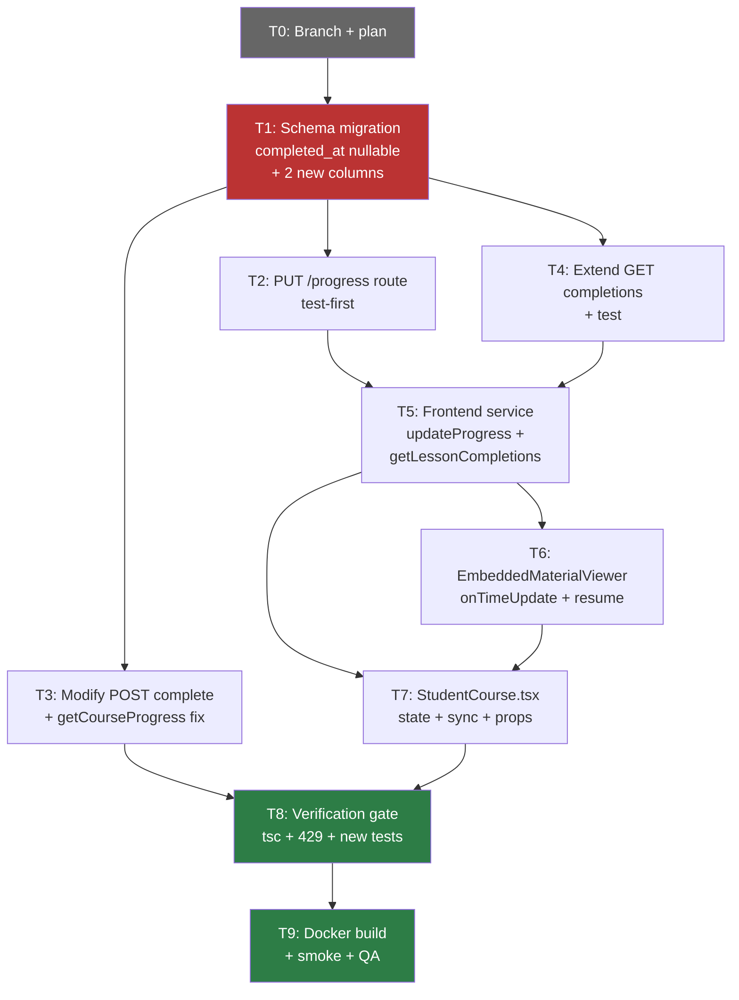
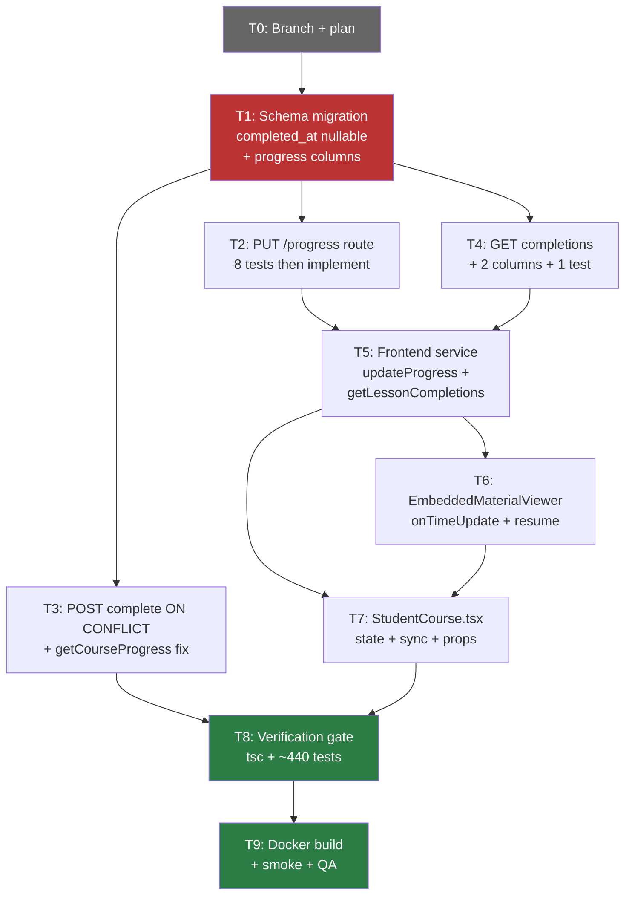
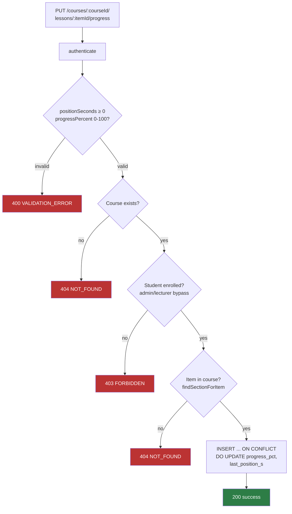
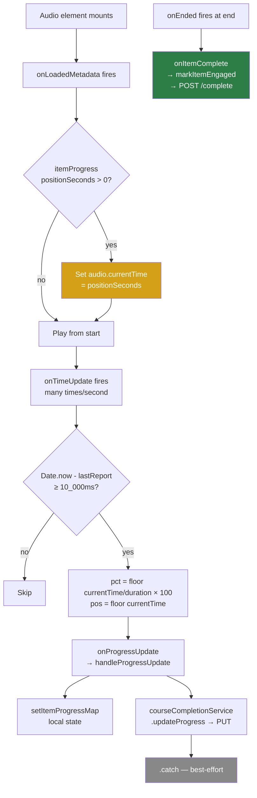
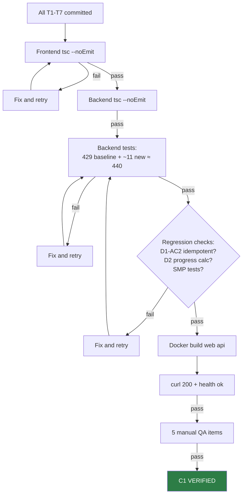

# Phase 7 C1 Implementation Plan: Audio Playback Progress Tracking

**Date:** 2026-08-04
**Status:** PLAN READY
**Spec:** `docs/superpowers/specs/2026-08-04-phase7-c1-audio-progress-spec.md`
**Baseline:** Phase 6 released (`phase6-complete-2026-08-04`), 429/429 backend tests, site live
**Scope:** Audio playback progress tracking — save position, resume, partial progress

---

## Spec Corrections Discovered During Planning

### Critical: `completed_at` is `NOT NULL DEFAULT (datetime('now'))`

The spec proposed leaving `completed_at` as NULL for progress-only rows. However, the actual schema (database.ts:398) defines:
```sql
completed_at TEXT NOT NULL DEFAULT (datetime('now'))
```

This means any `INSERT` automatically sets `completed_at` — we cannot have progress-only rows without `completed_at`. Two options:

**Option A: Migrate `completed_at` to nullable** — requires table rename migration (`PRAGMA foreign_keys=OFF`, `legacy_alter_table=ON`). Invasive, but cleanest data model.

**Option B: Use a sentinel value** — store progress-only rows with `completed_at` set by default (item appears "complete" in legacy queries). Then `getCourseProgress` filters by a different mechanism.

**Decision: Option A** — migrate `completed_at` to nullable. Reasons:
1. Semantic correctness: a progress-only row is NOT a completion
2. The `getCourseProgress` fix (`AND completed_at IS NOT NULL`) is clean and obvious
3. The migration is well-established in this codebase (same pattern as `ensureLecturerRole` at database.ts:30-81)
4. The migration runs once on startup and is idempotent

### Second POST complete route missed

The spec only mentioned modifying the self-mark route (lines 67-71). There's a second admin/lecturer-mark route (lines 120-124) that also uses `INSERT OR IGNORE`. Both must be updated to `INSERT ... ON CONFLICT DO UPDATE`.

### Five SELECT statements need column additions

GET completions has 5 separate SELECT statements (student, lecturer-filtered, lecturer-all, admin-filtered, admin-all) — all need `progress_pct, last_position_s` added.

---

## 1. Task Table

| ID | Task | File(s) | Est. Lines | Depends On | Parallel? | Test-First? |
|----|------|---------|-----------|------------|-----------|-------------|
| T0 | Branch + commit plan | — | 0 | — | — | — |
| T1 | Schema migration: make `completed_at` nullable + add 2 columns | `database.ts` | ~35 | T0 | Yes | No (migration) |
| T2 | Backend: PUT progress route (test-first) | `lessonCompletions.ts`, `phase-d-lessons.test.ts` | ~100 | T1 | Yes | Yes |
| T3 | Backend: Modify POST complete routes + getCourseProgress fix | `lessonCompletions.ts`, `courseCompletionService.ts` | ~20 | T1 | Yes (different sections) | Covered by T2 tests |
| T4 | Backend: Extend GET completions + add test | `lessonCompletions.ts`, `phase-d-lessons.test.ts` | ~15 | T1 | Yes | Yes |
| T5 | Frontend: Service layer (getLessonCompletions + updateProgress) | `courseCompletionService.ts` | ~15 | T2 (API exists) | Yes | No (frontend) |
| T6 | Frontend: EmbeddedMaterialViewer (props + handlers) | `EmbeddedMaterialViewer.tsx` | ~25 | T5 | No | No (frontend) |
| T7 | Frontend: StudentCourse.tsx (state + sync + props) | `StudentCourse.tsx` | ~30 | T5, T6 | No | No (frontend) |
| T8 | Verification gate: tsc + tests | — | 0 | T1-T7 | — | — |
| T9 | Docker build + smoke + QA + closeout | — | 0 | T8 | — | — |

**Total:** ~240 new lines across 6 modified files, 0 new files

---

## 2. Dependency Flow



---

## 3. Parallelization Strategy

### Phase A: Setup
- **T0:** Branch + commit plan

### Phase B: Schema (sequential, must be first)
- **T1:** Schema migration — all subsequent tasks depend on this

### Phase C: Backend (parallel after T1)
- **T2:** PUT progress route + tests — independent file section
- **T3:** POST complete modification + getCourseProgress fix — independent file section + different file
- **T4:** GET completions extension + test — independent file section

**Note:** T2, T3, T4 all modify `lessonCompletions.ts` but different sections (T2 adds new route after line 75, T3 modifies lines 67-71 + 120-124, T4 modifies lines 151-210). In practice, execute sequentially within the same file to avoid merge conflicts: **T2 → T3 → T4**.

### Phase D: Frontend (sequential after Phase C)
- **T5:** Service layer changes (return type + new method)
- **T6:** EmbeddedMaterialViewer (props + handlers) — depends on T5 types
- **T7:** StudentCourse.tsx (state + sync + props) — depends on T5 + T6

### Phase E: Verification (sequential)
- **T8:** tsc + tests
- **T9:** Docker build + smoke + QA

### Recommended Execution Order
```
T0 → T1 → T2 → T3 → T4 → T5 → T6 → T7 → T8 → T9
```
All sequential due to shared files and dependency chain. No subagent parallelization recommended for this feature — it's a tight 6-file change with strong coupling.

---

## 4. Task Details

### T0: Branch Setup

**Actions:**
1. Verify baseline: `cd LMS-Server && npx vitest run` → 429/429
2. Create branch: `git checkout -b feat/phase7-c1-audio-progress`
3. Commit this plan document

**Exit gate:** Branch created, plan committed, 429/429 baseline.

---

### T1: Schema Migration — Make `completed_at` Nullable + Add 2 Columns

**File:** `LMS-Server/src/config/database.ts`

**Why table rename is needed:** `completed_at TEXT NOT NULL DEFAULT (datetime('now'))` cannot be altered to nullable with a simple `ALTER TABLE`. SQLite does not support `ALTER TABLE ... ALTER COLUMN`. Must use the rename pattern.

**Migration function** (place after `ensureLessonCompletionsTable()` at line 406):

```typescript
function ensureLessonCompletionsProgressColumns(): void {
  const cols = db.prepare('PRAGMA table_info(lesson_completions)').all() as { name: string; notnull: number }[];

  // Check if progress columns already exist (idempotent)
  const hasProgressPct = cols.some((c) => c.name === 'progress_pct');
  if (hasProgressPct) return; // already migrated

  // Also need to make completed_at nullable — requires table recreation
  db.pragma('foreign_keys = OFF');
  db.pragma('legacy_alter_table = ON');
  db.exec(`
    BEGIN;
    ALTER TABLE lesson_completions RENAME TO _lesson_completions_p7_old;
    CREATE TABLE lesson_completions (
      id           TEXT PRIMARY KEY,
      user_id      TEXT NOT NULL REFERENCES users(id) ON DELETE CASCADE,
      course_id    TEXT NOT NULL REFERENCES courses(id) ON DELETE CASCADE,
      item_id      TEXT NOT NULL,
      section_id   TEXT NOT NULL,
      completed_at TEXT DEFAULT (datetime('now')),
      marked_by    TEXT REFERENCES users(id) ON DELETE SET NULL,
      progress_pct    INTEGER,
      last_position_s INTEGER,
      UNIQUE (user_id, course_id, item_id)
    );
    INSERT INTO lesson_completions (id, user_id, course_id, item_id, section_id, completed_at, marked_by)
      SELECT id, user_id, course_id, item_id, section_id, completed_at, marked_by
      FROM _lesson_completions_p7_old;
    DROP TABLE _lesson_completions_p7_old;
    CREATE INDEX IF NOT EXISTS idx_lesson_completions_user_course
      ON lesson_completions(user_id, course_id);
    COMMIT;
  `);
  db.pragma('legacy_alter_table = OFF');
  db.pragma('foreign_keys = ON');
}
ensureLessonCompletionsProgressColumns();
```

**Key changes:**
- `completed_at` changes from `TEXT NOT NULL DEFAULT (datetime('now'))` to `TEXT DEFAULT (datetime('now'))` — now nullable
- `progress_pct INTEGER` added (nullable)
- `last_position_s INTEGER` added (nullable)
- Existing data preserved via `INSERT ... SELECT`
- Index recreated

**Scope guard:** DO NOT modify any other table or function.

**Verification:** Run tests immediately after — all 429 must pass (existing INSERT OR IGNORE statements set `completed_at` via default, so all existing rows still have `completed_at`).

---

### T2: PUT /progress Route (Test-First)

**Files:**
- `LMS-Server/src/__tests__/phase-d-lessons.test.ts` (tests first)
- `LMS-Server/src/routes/lessonCompletions.ts` (route implementation)

**Step 1 — Write failing tests:**

Add new test group `D3 — PUT /courses/:courseId/lessons/:itemId/progress` after the existing D1b tests:

```typescript
describe('D3 — PUT /courses/:courseId/lessons/:itemId/progress', () => {
  let ids: ReturnType<typeof seedBase>;
  beforeEach(() => { ids = seedBase(); });

  it('D3-AC1: enrolled student saves progress', async () => {
    const token = makeToken({ userId: ids.studentId, email: 'student-d@test.com', role: 'student' });
    const res = await request(app)
      .put(`/api/v1/courses/${ids.courseId}/lessons/item-d-1/progress`)
      .set('Authorization', `Bearer ${token}`)
      .send({ positionSeconds: 60, progressPercent: 25 });
    expect(res.status).toBe(200);
    expect(res.body.data.progressPercent).toBe(25);
    // Verify row exists with no completed_at
    const row = db.prepare(
      'SELECT completed_at, progress_pct, last_position_s FROM lesson_completions WHERE user_id = ? AND course_id = ? AND item_id = ?'
    ).get(ids.studentId, ids.courseId, 'item-d-1') as any;
    expect(row.completed_at).toBeNull();
    expect(row.progress_pct).toBe(25);
    expect(row.last_position_s).toBe(60);
  });

  it('D3-AC2: second progress update overwrites', async () => { ... });
  it('D3-AC3: progress on completed item preserves completed_at', async () => { ... });
  it('D3-AC4: rejects progressPercent > 100', async () => { ... });
  it('D3-AC5: rejects negative positionSeconds', async () => { ... });
  it('D3-AC6: 403 for non-enrolled student', async () => { ... });
  it('D3-AC7: 404 for nonexistent course', async () => { ... });
  it('D3-AC8: 404 for item not in course', async () => { ... });
});
```

**These tests will FAIL** (route doesn't exist yet).

**Step 2 — Implement route:**

Add PUT route to `lessonCompletions.ts` after the second POST complete route (after line 128):

```typescript
// ─── PUT /courses/:courseId/lessons/:itemId/progress ─────────────────────────
router.put(
  '/courses/:courseId/lessons/:itemId/progress',
  authenticate,
  async (req: AuthRequest, res: Response): Promise<void> => {
    const callerId = req.user!.userId;
    const role = req.user!.role;
    const { courseId, itemId } = req.params;
    const { positionSeconds, progressPercent } = req.body;

    // Validate body
    if (typeof positionSeconds !== 'number' || !Number.isInteger(positionSeconds) || positionSeconds < 0) {
      res.status(400).json({ success: false, error: { code: ErrorCodes.VALIDATION_ERROR, message: 'positionSeconds must be an integer >= 0' } });
      return;
    }
    if (typeof progressPercent !== 'number' || !Number.isInteger(progressPercent) || progressPercent < 0 || progressPercent > 100) {
      res.status(400).json({ success: false, error: { code: ErrorCodes.VALIDATION_ERROR, message: 'progressPercent must be an integer 0-100' } });
      return;
    }

    // Course exists
    const course = queryOne<{ id: string; course_code: string; sections: string }>(
      'SELECT id, course_code, sections FROM courses WHERE id = ?', [courseId]);
    if (!course) { res.status(404).json({ success: false, error: { code: ErrorCodes.NOT_FOUND, message: 'Course not found' } }); return; }

    // Enrollment check (students only)
    if (role === 'student') {
      const enrolled = queryOne<{ user_id: string }>(
        'SELECT user_id FROM user_course_codes WHERE user_id = ? AND course_code = ?', [callerId, course.course_code]);
      if (!enrolled) { res.status(403).json({ success: false, error: { code: ErrorCodes.FORBIDDEN, message: 'Not enrolled in this course' } }); return; }
    }

    // Item exists in course
    const sectionId = findSectionForItem(course.sections, itemId);
    if (!sectionId) { res.status(404).json({ success: false, error: { code: ErrorCodes.NOT_FOUND, message: 'Lesson item not found in course' } }); return; }

    // Upsert: INSERT with no completed_at, ON CONFLICT update progress only
    execute(
      `INSERT INTO lesson_completions (id, user_id, course_id, item_id, section_id, marked_by, completed_at, progress_pct, last_position_s)
       VALUES (?, ?, ?, ?, ?, ?, NULL, ?, ?)
       ON CONFLICT (user_id, course_id, item_id)
       DO UPDATE SET progress_pct = excluded.progress_pct, last_position_s = excluded.last_position_s`,
      [uuidv4(), callerId, courseId, itemId, sectionId, callerId, progressPercent, positionSeconds]
    );

    res.json({ success: true, data: { userId: callerId, courseId, itemId, progressPercent, positionSeconds } });
  }
);
```

**Note:** The INSERT explicitly sets `completed_at = NULL` to override the column default.

**Step 3 — Run tests:** All D3 tests should now pass. Existing 429 tests must still pass.

**Scope guard:** DO NOT modify existing POST or GET routes in this task.

---

### T3: Modify POST Complete Routes + getCourseProgress Fix

**Files:**
- `LMS-Server/src/routes/lessonCompletions.ts` (lines 67-71, 120-124)
- `LMS-Server/src/services/courseCompletionService.ts` (line 82)

**Change 1: Self-mark route (line 67-71)**

From:
```typescript
execute(
  `INSERT OR IGNORE INTO lesson_completions (id, user_id, course_id, item_id, section_id, marked_by)
   VALUES (?, ?, ?, ?, ?, ?)`,
  [uuidv4(), callerId, courseId, itemId, sectionId, callerId]
);
```

To:
```typescript
execute(
  `INSERT INTO lesson_completions (id, user_id, course_id, item_id, section_id, marked_by, progress_pct)
   VALUES (?, ?, ?, ?, ?, ?, 100)
   ON CONFLICT (user_id, course_id, item_id)
   DO UPDATE SET completed_at = datetime('now'), marked_by = excluded.marked_by, progress_pct = 100
   WHERE completed_at IS NULL`,
  [uuidv4(), callerId, courseId, itemId, sectionId, callerId]
);
```

**Change 2: Admin/lecturer-mark route (line 120-124)**

Same pattern — change `INSERT OR IGNORE` to `INSERT ... ON CONFLICT DO UPDATE`:
```typescript
execute(
  `INSERT INTO lesson_completions (id, user_id, course_id, item_id, section_id, marked_by, progress_pct)
   VALUES (?, ?, ?, ?, ?, ?, 100)
   ON CONFLICT (user_id, course_id, item_id)
   DO UPDATE SET completed_at = datetime('now'), marked_by = excluded.marked_by, progress_pct = 100
   WHERE completed_at IS NULL`,
  [uuidv4(), userId, courseId, itemId, sectionId, callerId]
);
```

**Change 3: getCourseProgress query (courseCompletionService.ts:81-84)**

From:
```typescript
const completedRows = query<{ item_id: string }>(
  'SELECT item_id FROM lesson_completions WHERE user_id = ? AND course_id = ?',
  [userId, courseId]
);
```

To:
```typescript
const completedRows = query<{ item_id: string }>(
  'SELECT item_id FROM lesson_completions WHERE user_id = ? AND course_id = ? AND completed_at IS NOT NULL',
  [userId, courseId]
);
```

**Verification:** Run all 429 tests. The D1 idempotency test (D1-AC2) should still pass because `ON CONFLICT ... WHERE completed_at IS NULL` means the second complete call does nothing (row already has completed_at).

**Add 2 tests in T2's test block for cross-interaction:**

```typescript
it('D1-AC8: complete sets completed_at on progress-only row', async () => {
  // First PUT progress (creates row with no completed_at)
  // Then POST complete (sets completed_at via ON CONFLICT)
  // Verify completed_at is now set and progress_pct = 100
});

it('D1-AC9: complete is idempotent on already-completed item', async () => {
  // POST complete twice
  // Verify completed_at from first call is preserved
});
```

---

### T4: Extend GET Completions + Test

**File:** `LMS-Server/src/routes/lessonCompletions.ts` (lines 151-210)

**Change CompletionRow type** (line 151-158):
```typescript
type CompletionRow = {
  user_id: string;
  course_id: string;
  item_id: string;
  section_id: string;
  completed_at: string | null;     // CHANGED: now nullable
  marked_by: string | null;
  progress_pct: number | null;     // NEW
  last_position_s: number | null;  // NEW
};
```

**Add `progress_pct, last_position_s` to all 5 SELECT statements** (lines 164, 184, 190, 200, 206):

Each SELECT changes from:
```sql
SELECT user_id, course_id, item_id, section_id, completed_at, marked_by
```
To:
```sql
SELECT user_id, course_id, item_id, section_id, completed_at, marked_by, progress_pct, last_position_s
```

**Add test:**
```typescript
it('D1b-AC7: GET completions includes progress_pct and last_position_s', async () => {
  // PUT progress for item-d-1
  // GET completions
  // Verify response includes progress_pct and last_position_s fields
});
```

---

### T5: Frontend Service Layer

**File:** `LMS-Frontend/src/services/courseCompletionService.ts`

**Change 1: `getLessonCompletions` return type** (lines 79-85):

From:
```typescript
async getLessonCompletions(courseId: string): Promise<string[]> {
  const res = await api.get<{
    success: boolean;
    data: { completions: { item_id: string }[] };
  }>(`/courses/${courseId}/lessons/completions`);
  return (res.data.data?.completions ?? []).map((c) => c.item_id);
},
```

To:
```typescript
async getLessonCompletions(courseId: string): Promise<{ itemId: string; progressPct: number | null; lastPositionS: number | null }[]> {
  const res = await api.get<{
    success: boolean;
    data: { completions: { item_id: string; progress_pct: number | null; last_position_s: number | null }[] };
  }>(`/courses/${courseId}/lessons/completions`);
  return (res.data.data?.completions ?? []).map((c) => ({
    itemId: c.item_id,
    progressPct: c.progress_pct,
    lastPositionS: c.last_position_s,
  }));
},
```

**Change 2: Add `updateProgress` method** (after `markLessonComplete`):

```typescript
async updateProgress(courseId: string, itemId: string, positionSeconds: number, progressPercent: number): Promise<void> {
  await api.put(`/courses/${courseId}/lessons/${itemId}/progress`, { positionSeconds, progressPercent });
},
```

**Scope guard:** DO NOT modify any other methods.

---

### T6: EmbeddedMaterialViewer — Props + Handlers

**File:** `LMS-Frontend/src/components/EmbeddedMaterialViewer.tsx`

**Change 1: Add imports** (line 1):
Add `useRef` to the React import.

**Change 2: Props interface** (lines 75-86):
Add:
```typescript
onProgressUpdate?: (itemId: string, positionSeconds: number, progressPercent: number) => void;
itemProgress?: { positionSeconds: number; progressPercent: number } | null;
```

**Change 3: Destructure** (lines 92-103):
Add `onProgressUpdate` and `itemProgress`.

**Change 4: Add ref and handler** (inside component body, after line 103):
```typescript
const lastProgressReport = useRef(0);

const handleTimeUpdate = (e: React.SyntheticEvent<HTMLAudioElement>) => {
  const audio = e.currentTarget;
  if (!audio.duration || !isFinite(audio.duration)) return;
  const now = Date.now();
  if (now - lastProgressReport.current < 10_000) return;
  lastProgressReport.current = now;
  const pct = Math.floor((audio.currentTime / audio.duration) * 100);
  onProgressUpdate?.(item.id, Math.floor(audio.currentTime), pct);
};
```

**Change 5: Audio element 1** (lines 246-252):
Add `onTimeUpdate={handleTimeUpdate}` and `onLoadedMetadata`:
```tsx
<audio
  controls
  preload="metadata"
  className="w-full max-w-lg"
  src={ext}
  onEnded={() => onItemComplete?.(item.id)}
  onTimeUpdate={handleTimeUpdate}
  onLoadedMetadata={(e) => {
    if (itemProgress?.positionSeconds) e.currentTarget.currentTime = itemProgress.positionSeconds;
  }}
>
```

**Change 6: Audio element 2** (lines 300-301):
Same additions:
```tsx
<audio controls preload="metadata" className="w-full max-w-lg" src={item.url}
  onEnded={() => onItemComplete?.(item.id)}
  onTimeUpdate={handleTimeUpdate}
  onLoadedMetadata={(e) => {
    if (itemProgress?.positionSeconds) e.currentTarget.currentTime = itemProgress.positionSeconds;
  }}>
```

**Scope guard:** DO NOT modify any non-audio branches (video, PDF, quiz, assignment, download, link).

---

### T7: StudentCourse.tsx — State + Sync + Props

**File:** `LMS-Frontend/src/pages/StudentCourse.tsx`

**Change 1: Add `itemProgressMap` state** (after `doneItemIds` state at line ~311):
```typescript
const [itemProgressMap, setItemProgressMap] = useState<Record<string, { positionSeconds: number; progressPercent: number }>>({});
```

**Change 2: Extend `sync()` function** (lines 326-338):

Replace the `.then((ids)` callback to handle new return type:
```typescript
const sync = () => {
  courseCompletionService.getLessonCompletions(selectedCourseId).then((items) => {
    if (cancelled || items.length === 0) return;

    setDoneItemIds((prev) => {
      let changed = false;
      const merged = new Set(prev);
      for (const item of items) {
        if (!merged.has(item.itemId)) { merged.add(item.itemId); changed = true; }
      }
      if (changed) writeDoneIds(user.id, selectedCourseId, merged);
      return changed ? merged : prev;
    });

    setItemProgressMap((prev) => {
      const next: Record<string, { positionSeconds: number; progressPercent: number }> = { ...prev };
      let changed = false;
      for (const item of items) {
        if (item.progressPct != null && item.lastPositionS != null) {
          const existing = prev[item.itemId];
          if (!existing || existing.positionSeconds !== item.lastPositionS || existing.progressPercent !== item.progressPct) {
            next[item.itemId] = { positionSeconds: item.lastPositionS, progressPercent: item.progressPct };
            changed = true;
          }
        }
      }
      return changed ? next : prev;
    });
  }).catch(() => { /* best-effort polling */ });
};
```

**Change 3: Add `handleProgressUpdate` callback** (after `markItemEngaged` at line ~481):
```typescript
const handleProgressUpdate = useCallback(
  (itemId: string, positionSeconds: number, progressPercent: number) => {
    if (!selectedCourseId) return;
    courseCompletionService.updateProgress(selectedCourseId, itemId, positionSeconds, progressPercent)
      .catch(() => {/* best-effort */});
    setItemProgressMap((prev) => ({
      ...prev,
      [itemId]: { positionSeconds, progressPercent },
    }));
  },
  [selectedCourseId]
);
```

**Change 4: Pass new props to EmbeddedMaterialViewer** (lines 752-763):
Add two props:
```tsx
onProgressUpdate={handleProgressUpdate}
itemProgress={materialViewer ? itemProgressMap[materialViewer.item.id] ?? null : null}
```

**Scope guard:** DO NOT modify `openMaterialViewer`, `readDoneIds`, `writeDoneIds`, or any other existing function.

---

### T8: Verification Gate

**Commands (sequential):**
1. Frontend type check: `cd LMS-Frontend && npx tsc --noEmit`
2. Backend type check: `cd LMS-Server && npx tsc --noEmit`
3. Backend tests: `cd LMS-Server && npx vitest run` → 429 baseline + ~11 new = ~440

**Pass criteria:**
- Zero tsc errors (frontend + backend)
- All tests pass (429 baseline + new progress tests)
- No regressions

**Failure mode checks:**
- [ ] D1-AC2 (idempotent complete) still passes with new ON CONFLICT SQL
- [ ] D2 (progress calculation) still passes with `AND completed_at IS NOT NULL` filter
- [ ] SMP tests (student progress) still pass

---

### T9: Docker Build + Smoke + QA + Closeout

**Build + deploy:**
```bash
docker compose build web api
docker compose up -d --no-deps web api
curl -s -o /dev/null -w '%{http_code}' https://lms.smwebsystems.com/
curl -s https://lms.smwebsystems.com/api/v1/health
```

**Manual QA (5 items from spec):**
| ID | Check | Expected |
|----|-------|----------|
| QA-C1-01 | Progress saves during playback | PUT requests in network tab |
| QA-C1-02 | Resume on reopen | Audio starts near saved position |
| QA-C1-03 | Completion still works | Item marked complete |
| QA-C1-04 | No progress for non-audio items | No PUT /progress requests |
| QA-C1-05 | Standalone pages unaffected | Pages work normally |

**Closeout:**
1. Write release closeout doc
2. Tag: `pre-phase7-c1-2026-08-04` (safety) + `phase7-c1-complete-2026-08-04`
3. Merge to main (`--no-ff`)
4. Push to origin

---

## 5. Mermaid Diagrams

### Task Dependency Flow



### Backend Progress Endpoint Flow



### Frontend Audio Progress Flow



### Verification Gate Flow



---

## 6. To-Do Lists

### Planning Checklist
- [x] Spec read and verified against code
- [x] All insertion points confirmed (line numbers match)
- [x] Critical `completed_at NOT NULL` issue identified and addressed
- [x] Second POST complete route identified
- [x] 5 SELECT statements identified for GET completions
- [x] SQLite version confirmed (3.49.2, supports ON CONFLICT)
- [x] Test patterns reviewed (vitest + supertest)
- [x] Task table with dependencies created
- [x] Parallelization assessed (sequential recommended)

### Implementation Checklist
- [ ] T0: Create branch, commit plan, verify 429/429
- [ ] T1: Schema migration (completed_at nullable + 2 columns)
- [ ] T2: Write 8 failing D3 tests → implement PUT /progress → tests pass
- [ ] T3: Modify both POST complete routes + getCourseProgress fix
- [ ] T4: Extend 5 SELECTs in GET completions + 1 test
- [ ] T5: Frontend service (return type + updateProgress method)
- [ ] T6: EmbeddedMaterialViewer (props + ref + handlers + onLoadedMetadata)
- [ ] T7: StudentCourse.tsx (state + sync + callback + props)
- [ ] T8: tsc clean + ~440 tests pass
- [ ] T9: Docker build + smoke + QA + closeout

### Test Checklist
- [ ] D3-AC1: Enrolled student saves progress (200 + row with NULL completed_at)
- [ ] D3-AC2: Second progress update overwrites
- [ ] D3-AC3: Progress on completed item preserves completed_at
- [ ] D3-AC4: Reject progressPercent > 100 (400)
- [ ] D3-AC5: Reject negative positionSeconds (400)
- [ ] D3-AC6: 403 for non-enrolled student
- [ ] D3-AC7: 404 for nonexistent course
- [ ] D3-AC8: 404 for item not in course
- [ ] D1-AC8: Complete sets completed_at on progress-only row
- [ ] D1-AC9: Complete idempotent on already-completed
- [ ] D1b-AC7: GET completions includes progress columns
- [ ] Regression: 429 baseline tests pass
- [ ] Regression: D1-AC2 (idempotent complete) passes
- [ ] Regression: D2 (progress calculation) passes
- [ ] Regression: SMP tests pass

### QA Checklist
- [ ] QA-C1-01: Progress saves during playback (PUT in network tab)
- [ ] QA-C1-02: Resume on reopen (audio seeks to position)
- [ ] QA-C1-03: Completion still works (onEnded → complete)
- [ ] QA-C1-04: No progress for non-audio items
- [ ] QA-C1-05: Standalone pages unaffected

### Review Checklist
- [ ] Schema migration is idempotent (check for `progress_pct` column before migrating)
- [ ] Both POST complete routes updated (self-mark and admin/lecturer-mark)
- [ ] getCourseProgress filters by `completed_at IS NOT NULL`
- [ ] All 5 GET completions SELECTs include new columns
- [ ] Frontend `getLessonCompletions` return type change coordinated with `sync()` update
- [ ] `lastProgressReport` ref resets correctly (ref persists across renders, not across item changes — acceptable since component remounts on item change)
- [ ] `onLoadedMetadata` gracefully handles `itemProgress` being null
- [ ] No new npm dependencies introduced
- [ ] Rollback is non-destructive (columns remain, `completed_at` stays nullable)

---

## 7. Risk Analysis

| Risk | Likelihood | Impact | Mitigation |
|------|-----------|--------|------------|
| Table rename migration fails mid-transaction | Low | High | Transaction wraps entire migration; rolls back on failure |
| Existing tests fail after `completed_at` becomes nullable | Low | Medium | Existing `INSERT OR IGNORE` always sets `completed_at` via default; only new PUT path creates NULL rows |
| `ON CONFLICT ... WHERE completed_at IS NULL` doesn't match (already complete) | Low | Low | Expected behavior — already-completed items keep their timestamp |
| `onTimeUpdate` fires too frequently | None | Low | 10s throttle via `useRef` + `Date.now()` comparison |
| `onLoadedMetadata` doesn't fire for certain audio formats | Low | Low | Degraded: audio plays from beginning, progress still saves |
| `getLessonCompletions` return type change breaks callers | Medium | High | `sync()` is the only consumer — update in same commit |

---

## 8. /loop Workflow

```
/loop assess   — Verify 429/429 baseline, confirm Phase 6 tags, read spec + plan
/loop plan     — This document — reviewed and ready
/loop review   — After each task group: T1 (schema), T2-T4 (backend), T5-T7 (frontend)
/loop execute  — Execute T0 through T9 sequentially
```

---

## 9. Review Gates

| After | Review Focus |
|-------|-------------|
| T1 | Migration idempotent? `completed_at` now nullable? Existing rows preserved? 429/429 pass? |
| T2 | All 8 D3 tests pass? Upsert correctly creates NULL `completed_at` on new rows? |
| T3 | Both POST complete routes use ON CONFLICT? getCourseProgress filters `completed_at IS NOT NULL`? D1-AC2 still passes? |
| T4 | All 5 SELECTs extended? CompletionRow type updated? D1b-AC7 test passes? |
| T5 | `getLessonCompletions` returns objects? `updateProgress` calls correct API? |
| T6 | Both audio elements have `onTimeUpdate` + `onLoadedMetadata`? Ref declared? Handler throttles? |
| T7 | `sync()` handles new return type? `handleProgressUpdate` defined? Props passed? |
| T8 | tsc clean? ~440 tests pass? No regressions? |

---

## 10. Final Recommendation

**Status: IMPLEMENTATION PLAN READY**

**Key corrections from spec:**
- `completed_at` requires table rename migration (was `NOT NULL`, must become nullable)
- Second POST complete route (admin/lecturer) must also be updated
- Five SELECT statements in GET completions (not just one)

**Execution order:** T0 → T1 → T2 → T3 → T4 → T5 → T6 → T7 → T8 → T9 (all sequential)

**Estimated total:** ~240 new lines across 6 files, ~11 new tests, 5 manual QA items

**Deploy:** Both `web` and `api` containers

**Exact next action:** Execute T0 — create branch `feat/phase7-c1-audio-progress`, commit this plan, verify 429/429 baseline.
