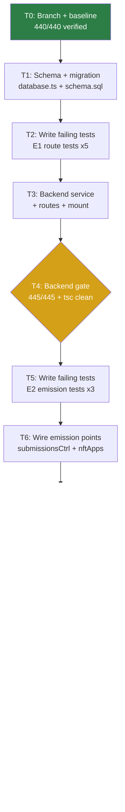
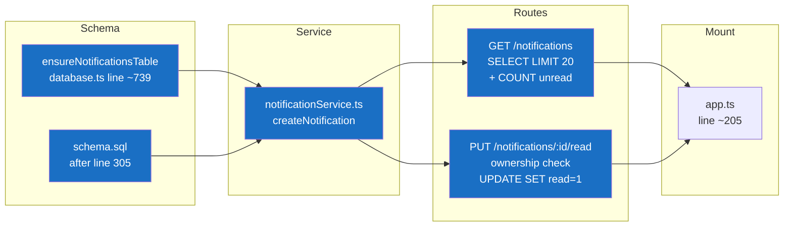
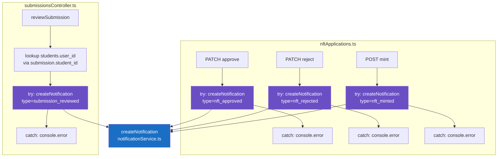
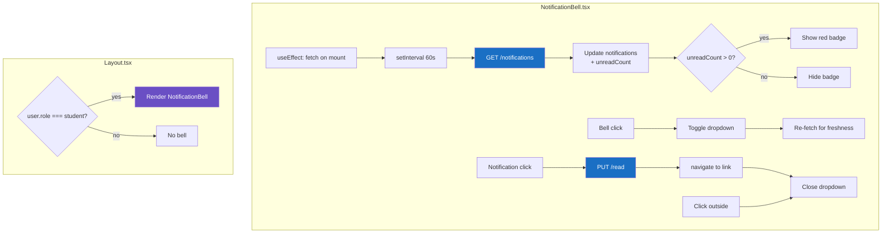
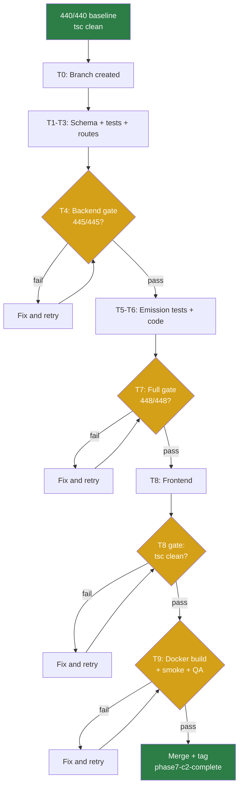

# Phase 7 C2 Implementation Plan: In-App Notification System

**Date:** 2026-08-04
**Status:** IMPLEMENTATION PLAN READY
**Spec:** `docs/superpowers/specs/2026-08-04-phase7-c2-notifications-spec.md`
**Baseline:** 440/440 backend tests, tsc clean, both containers healthy
**Branch:** `feat/phase7-c2-notifications` (from current `main` HEAD `7eecb92`)

---

## Session Kickoff

### Objective
Convert the Phase 7 C2 spec into a step-by-step, test-first implementation plan with explicit task ordering, file ownership, verification gates, and review checkpoints.

### Skills Applied
| Skill | Application |
|-------|-------------|
| writing-plans | Task ordering, dependencies, file ownership |
| test-driven-development | Tests written before implementation in each task |
| executing-plans | Sequential task execution with gates |
| systematic-debugging | Failure mode checks built into each task |
| verification-before-completion | Gates at T4, T7, T8, T9 |
| receiving/requesting-code-review | Review gates at T4, T7, T9 |
| using-superpowers | Branch isolation, safety tags |

---

## Execution Board

### Task Table

| Task | Goal | Files Touched | Est. Lines | Sequential? | Gate? |
|------|------|--------------|------------|-------------|-------|
| T0 | Branch + baseline | — | 0 | Yes (first) | 440/440 |
| T1 | Schema + migration | `database.ts`, `schema.sql` | +27 | Yes (before T2) | tsc |
| T2 | Write failing tests (E1 group) | `phase-e-notifications.test.ts` | +120 | Yes (before T3) | Tests fail |
| T3 | Backend service + routes + mount | `notificationService.ts`, `notifications.ts`, `app.ts` | +75 | Yes (after T2) | E1 tests pass |
| T4 | **Backend gate** | — | 0 | Yes | 440+5 pass, tsc clean |
| T5 | Write failing emission tests (E2 group) | `phase-e-notifications.test.ts` | +80 | Yes (after T4) | Tests fail |
| T6 | Wire emission points | `submissionsController.ts`, `nftApplications.ts` | +55 | Yes (after T5) | E2 tests pass |
| T7 | **Full backend gate** | — | 0 | Yes | 440+8 pass, tsc clean |
| T8 | Frontend implementation | `notificationService.ts` (FE), `NotificationBell.tsx`, `Layout.tsx` | +180 | Yes (after T7) | tsc clean |
| T9 | **Final gate + deploy** | — | 0 | Yes | Docker build, smoke, QA |

### Dependencies

```
T0 → T1 → T2 → T3 → T4 → T5 → T6 → T7 → T8 → T9
```

All tasks are **strictly sequential**. No parallelization — the feature is small enough that sequential test-first flow is simpler and safer than splitting across subagents.

### Parallelization Notes
- T2 and T5 could theoretically be written together (all tests upfront), but splitting them gives cleaner red-green cycles.
- T8 (frontend) is independent of T5-T6 (emission) at the code level, but running it after T7 ensures a stable backend to test against.

---

## Implementation Plan

### T0: Branch + Baseline Verification

**Goal:** Create feature branch, verify 440/440 baseline, create safety tag.

**Steps:**
1. `git checkout -b feat/phase7-c2-notifications`
2. `cd LMS-Server && npx vitest run` → verify 440/440
3. `npx tsc --noEmit` (backend) + `cd ../LMS-Frontend && npx tsc --noEmit` (frontend)
4. `git tag pre-phase7-c2-2026-08-04`

**Verification:** 440/440 pass, tsc clean, tag created.

**Failure mode:** If baseline is broken, STOP — do not proceed until 440/440 is restored.

---

### T1: Schema + Migration

**Goal:** Create the `notifications` table via `ensureNotificationsTable()` in `database.ts` and add the matching DDL to `schema.sql` for test DB initialization.

**Files:**
| File | Change |
|------|--------|
| `LMS-Server/src/config/database.ts` | Add `ensureNotificationsTable()` after `ensureCourseDocumentsWeekId()` call (line ~739), before `query`/`queryOne`/`execute` exports |
| `LMS-Server/database/schema.sql` | Add `CREATE TABLE IF NOT EXISTS notifications` + 2 indexes after audit_log (after line 305) |

**Implementation:**

`database.ts` — add after line 739:
```typescript
/** Phase 7 C2 — notifications table for in-app student notifications. */
function ensureNotificationsTable(): void {
  db.exec(`
    CREATE TABLE IF NOT EXISTS notifications (
      id         TEXT PRIMARY KEY,
      user_id    TEXT NOT NULL REFERENCES users(id) ON DELETE CASCADE,
      type       TEXT NOT NULL,
      title      TEXT NOT NULL,
      body       TEXT NOT NULL,
      read       INTEGER NOT NULL DEFAULT 0,
      link       TEXT,
      created_at TEXT NOT NULL DEFAULT (datetime('now'))
    );
    CREATE INDEX IF NOT EXISTS idx_notifications_user_read
      ON notifications(user_id, read);
    CREATE INDEX IF NOT EXISTS idx_notifications_user_created
      ON notifications(user_id, created_at);
  `);
}
ensureNotificationsTable();
```

`schema.sql` — add after line 305:
```sql
-- Phase 7 C2: In-app notifications
CREATE TABLE IF NOT EXISTS notifications (
  id         TEXT PRIMARY KEY,
  user_id    TEXT NOT NULL REFERENCES users(id) ON DELETE CASCADE,
  type       TEXT NOT NULL,
  title      TEXT NOT NULL,
  body       TEXT NOT NULL,
  read       INTEGER NOT NULL DEFAULT 0,
  link       TEXT,
  created_at TEXT NOT NULL DEFAULT (datetime('now'))
);
CREATE INDEX IF NOT EXISTS idx_notifications_user_read
  ON notifications(user_id, read);
CREATE INDEX IF NOT EXISTS idx_notifications_user_created
  ON notifications(user_id, created_at);
```

**Verification:** `npx tsc --noEmit` clean. Existing 440 tests still pass (migration is additive, `CREATE TABLE IF NOT EXISTS` is idempotent).

**Failure modes:**
- schema.sql syntax error → `_resetForTests()` fails → all tests fail. Fix: check SQL syntax.
- Column name `read` is a SQLite keyword → safe in this context (not reserved in SQLite), but could use backticks if issues arise.

---

### T2: Write Failing Tests (E1 — Route Tests)

**Goal:** Write 5 failing tests for `GET /notifications` and `PUT /notifications/:id/read` before implementing the routes. Tests must fail with 404 (route not mounted yet).

**File:** `LMS-Server/src/__tests__/phase-e-notifications.test.ts` (new)

**Test structure:**
```
describe('E1 — Notification Routes')
  beforeEach → seedBase() (admin, student, student2, course)

  E1-AC1: GET /notifications returns empty array for authenticated user
    → 404 (route doesn't exist yet) → RED

  E1-AC2: GET /notifications returns seeded notifications in desc order
    → Seed 3 notifications with different created_at → GET → verify order
    → 404 → RED

  E1-AC3: GET /notifications returns correct unreadCount
    → Seed 3 unread + 1 read → GET → verify unreadCount = 3
    → 404 → RED

  E1-AC4: PUT /notifications/:id/read marks as read (idempotent)
    → Seed 1 unread notification → PUT → verify read=1 → PUT again → still 200
    → 404 → RED

  E1-AC5: PUT /notifications/:id/read returns 403 for wrong user
    → Seed notification for student1 → student2 PUT → 403
    → 404 → RED
```

**Seed helper pattern:** Follow `phase-d-lessons.test.ts` — import `db` from database, use `db.exec()` for direct inserts, `makeToken()` for auth tokens.

**Seeding notifications:** Direct `INSERT INTO notifications` in beforeEach (no API for creating them — they come from emission points, but for route testing we seed directly).

**Verification:** All 5 tests fail with expected RED state (404 or assertion failure). Existing 440 tests still pass.

---

### T3: Backend Service + Routes + Mount

**Goal:** Implement `notificationService.ts`, `notifications.ts` routes, and mount in `app.ts`. All E1 tests should turn green.

**Files:**
| File | Change |
|------|--------|
| `LMS-Server/src/services/notificationService.ts` | New file — `createNotification()` |
| `LMS-Server/src/routes/notifications.ts` | New file — GET + PUT routes |
| `LMS-Server/src/app.ts` | Import + mount (line ~205) |

**Implementation order:**
1. **`notificationService.ts`** — single `createNotification()` function per spec section 2
2. **`notifications.ts`** — two routes per spec sections 3a and 3b:
   - `GET /notifications` — sync handler, authenticate, SELECT + COUNT, map `read` int→bool, `created_at`→`createdAt`
   - `PUT /notifications/:id/read` — sync handler, authenticate, ownership check, UPDATE, idempotent
3. **`app.ts`** — add import and mount line:
   ```typescript
   app.use('/api/v1', apiLimiter, notificationRoutes);
   ```
   Insert after `walletStatusRoutes` (line ~204), before `publicCredentialsRoutes`.

**Key implementation notes:**
- Both route handlers MUST be **synchronous** (not async) — Express 4 async handler gotcha with better-sqlite3
- GET response maps `read` (0/1) → `read` (false/true) and `created_at` → `createdAt`
- `unreadCount` uses separate `SELECT COUNT(*)` query (correct even when >20 total notifications)
- PUT ownership check: `notification.user_id !== req.user.userId` → 403

**Verification:** Run `npx vitest run` → all 5 E1 tests pass (GREEN). 440 baseline + 5 new = 445.

**Failure modes:**
- Express 4 async handler → tests hang at 10s timeout. Fix: use sync handler signatures.
- Route not mounted → tests still 404. Fix: check import path and mount line.
- `read` column mapping wrong (integer vs boolean) → test assertion fails. Fix: explicit `!!row.read` or `row.read === 1`.

---

### T4: Backend Gate (Route Tests)

**Goal:** Verify 445/445 tests pass, tsc clean.

**Steps:**
1. `cd LMS-Server && npx vitest run` → 445/445
2. `npx tsc --noEmit` → clean
3. Code review checkpoint:
   - [ ] `notificationService.ts` matches spec section 2
   - [ ] `notifications.ts` GET matches spec section 3a (LIMIT 20, DESC, unreadCount)
   - [ ] `notifications.ts` PUT matches spec section 3b (ownership check, idempotent)
   - [ ] Route mount in correct position in app.ts
   - [ ] All handlers are synchronous (not async)

**Verification:** 445/445 pass, tsc clean, code review items checked.

---

### T5: Write Failing Emission Tests (E2 Group)

**Goal:** Write 3 failing tests for notification emission on submission review, NFT approve, and NFT reject. Tests must fail because emission code doesn't exist yet.

**File:** `LMS-Server/src/__tests__/phase-e-notifications.test.ts` (append)

**Test structure:**
```
describe('E2 — Notification Emission')
  beforeEach → seedBase() (admin, student, course)
    + seed student in students table with user_id link
    + seed submission for student
    + seed NFT application for student

  E2-AC1: Review submission → notification created for student
    → Create submission (INSERT INTO submissions)
    → POST /submissions/:id/review { status: 'approved', feedback: 'Good' }
    → SELECT * FROM notifications WHERE user_id = studentUserId
    → Expect 1 row with type='submission_reviewed'
    → Currently: 0 rows → RED

  E2-AC2: Approve NFT application → notification created for student
    → Create NFT application (INSERT INTO course_nft_applications)
    → Set up course_completion_requirements
    → PATCH /courses/:courseId/completions/applications/:appId/approve
    → SELECT * FROM notifications WHERE user_id = studentUserId
    → Expect 1 row with type='nft_approved'
    → Currently: 0 rows → RED

  E2-AC3: Reject NFT application → notification created for student
    → Create NFT application (INSERT INTO course_nft_applications)
    → PATCH /courses/:courseId/completions/applications/:appId/reject { notes: 'reason' }
    → SELECT * FROM notifications WHERE user_id = studentUserId
    → Expect 1 row with type='nft_rejected'
    → Currently: 0 rows → RED
```

**Seed requirements for E2:**
- `students` table row with `user_id` link (submissions use `student_id` FK → `students.id`, and emission looks up `students.user_id`)
- `submissions` row for the review test (needs `student_id`, `title`, `file_name`, `file_size`, `file_path`)
- `course_nft_applications` row for approve/reject tests (needs `user_id`, `course_id`, `wallet_address`, `status='pending'`)
- `course_enrollments` for the student (the review endpoint checks lecturer assignment, admin bypasses)
- `course_completion_requirements` for the course (approve checks eligibility — or use admin who bypasses)
- `lesson_completions` and `quiz_completions` if the approve handler re-checks eligibility at approve time

**Note on E2-AC2 (approve):** The approve handler itself does NOT re-check eligibility (only the mint handler does). So we just need a pending application + admin token.

**Verification:** All 3 E2 tests fail with expected RED state (0 notification rows). 445 baseline still passes.

**Failure modes:**
- Seeding is wrong (missing FK data) → test errors out instead of clean RED. Fix: verify seed completeness.
- Submission review needs specific fields (student_id must exist in students table) → seed students table row.

---

### T6: Wire Emission Points

**Goal:** Add `createNotification()` calls to `submissionsController.ts` (1 point) and `nftApplications.ts` (3 points). All E2 tests should turn green.

**Files:**
| File | Change | Insertion Point |
|------|--------|----------------|
| `LMS-Server/src/controllers/submissionsController.ts` | Import `createNotification` + emission block | After line ~566, before `res.json()` at line ~568 |
| `LMS-Server/src/routes/nftApplications.ts` | Import `createNotification` + 3 emission blocks | After approve UPDATE (~408), after reject UPDATE (~448), after mint persistMint success (~617) |

**Implementation — submissionsController.ts:**
- Import: `import { createNotification } from '../services/notificationService.js';`
- Insert after auto-complete block (line ~566), before `res.json()`:
```typescript
// C2: Notify student of submission review (best-effort)
try {
  const studentRecord = queryOne<{ user_id: string | null }>(
    'SELECT user_id FROM students WHERE id = ?',
    [submission!.student_id]
  );
  if (studentRecord?.user_id) {
    createNotification({
      userId: studentRecord.user_id,
      type: 'submission_reviewed',
      title: `Submission ${status.charAt(0).toUpperCase() + status.slice(1)}`,
      body: `Your submission "${submission!.title}" was ${status}`,
      link: '/student/submissions',
    });
  }
} catch (err) {
  console.error('[notification] submission review emission error:', err);
}
```

**Implementation — nftApplications.ts:**
- Import: `import { createNotification } from '../services/notificationService.js';`
- **Approve** (after line ~408): Fetch `user_id` from the application (the existing SELECT at line 384 only fetches `id, status` — extend it to include `user_id`, or do a separate lookup). **Decision: extend the existing SELECT** to `SELECT id, status, user_id` — this is a minimal change and avoids a redundant query.
```typescript
// After execute() UPDATE, before res.json()
try {
  const courseRow = queryOne<{ title: string }>('SELECT title FROM courses WHERE id = ?', [courseId]);
  createNotification({
    userId: app.user_id,  // now available from extended SELECT
    type: 'nft_approved',
    title: 'Certificate Approved',
    body: `Your certificate application for "${courseRow?.title ?? 'course'}" was approved`,
    link: '/student/course',
  });
} catch (err) {
  console.error('[notification] nft approve emission error:', err);
}
```
- **Reject** (after line ~448): Same pattern, `type: 'nft_rejected'`, `title: 'Certificate Rejected'`. Extend the reject SELECT at line 424 to include `user_id` as well.
- **Mint** (after line ~617): `app.user_id` already available (SELECT at line 465 fetches `user_id`). `courseRow` already fetched at line 613.

**Key decisions:**
1. Extend approve/reject SELECTs to include `user_id` (1-word change each) rather than doing separate lookups. The type annotation changes from `{ id: string; status: string }` to `{ id: string; status: string; user_id: string }`.
2. All emission blocks wrapped in try/catch — parent operation unaffected on failure.

**Verification:** Run `npx vitest run` → all 3 E2 tests pass (GREEN). Total: 448/448.

**Failure modes:**
- Wrong variable name for user_id → notification goes to wrong user. Fix: verify against the `app` variable type.
- Missing import → tsc error. Fix: add import at top of file.
- Emission outside try/catch → uncaught DB error breaks parent. Fix: verify try/catch wrapping.

---

### T7: Full Backend Gate

**Goal:** Verify 448/448 tests pass, tsc clean, review emission code.

**Steps:**
1. `cd LMS-Server && npx vitest run` → 448/448
2. `npx tsc --noEmit` → clean
3. Code review checkpoint:
   - [ ] All 4 emission points match spec exactly
   - [ ] All emission blocks wrapped in try/catch
   - [ ] `students.user_id` lookup handles null (submission emission)
   - [ ] NFT approve/reject SELECTs extended to include `user_id`
   - [ ] Mint emission uses existing `app.user_id` and `courseRow`
   - [ ] Submission review response shape unchanged (regression check)
   - [ ] NFT approve/reject/mint response shapes unchanged
   - [ ] No C1 files modified

**Verification:** 448/448 pass, tsc clean, all review items checked.

---

### T8: Frontend Implementation

**Goal:** Implement `notificationService.ts` (frontend), `NotificationBell.tsx`, and integrate into `Layout.tsx`.

**Files:**
| File | Change |
|------|--------|
| `LMS-Frontend/src/services/notificationService.ts` | New file — API calls + types |
| `LMS-Frontend/src/components/NotificationBell.tsx` | New file — bell + dropdown + polling |
| `LMS-Frontend/src/components/Layout.tsx` | Add `NotificationBell` import + conditional render |

**Implementation order:**

1. **`notificationService.ts`** (frontend) — per spec section 8:
   - `Notification` interface, `NotificationsResponse` interface
   - `getNotifications()` and `markRead()` methods
   - Uses existing `api` import (axios instance)

2. **`NotificationBell.tsx`** — per spec section 9:
   - State: `notifications`, `unreadCount`, `open`
   - `useEffect` for 60s polling (similar to Layout.tsx 30s message polling)
   - `Bell` icon from lucide-react
   - Red badge (same pattern as Layout.tsx unread messages badge, lines 156-159)
   - Dropdown panel: absolute-positioned, 320px wide, max-height with scroll
   - Notification rows: title, body (truncated), relative time, read/unread indicator
   - Click handler: `markRead()` + `navigate(link)` + close dropdown
   - Outside click: close dropdown (useRef + document click listener)
   - Error handling: catch fetch errors silently (polling retries in 60s)

   **Relative time helper:** Inline function, not a new dependency:
   ```typescript
   function timeAgo(dateStr: string): string {
     const diff = Date.now() - new Date(dateStr).getTime();
     const mins = Math.floor(diff / 60000);
     if (mins < 1) return 'just now';
     if (mins < 60) return `${mins}m ago`;
     const hrs = Math.floor(mins / 60);
     if (hrs < 24) return `${hrs}h ago`;
     const days = Math.floor(hrs / 24);
     return `${days}d ago`;
   }
   ```

3. **`Layout.tsx`** — per spec section 10:
   - Import `NotificationBell` at top
   - Add `{user?.role === 'student' && <NotificationBell />}` as first child of the header's right-side `<div>` (line 178)

**Verification:** `cd LMS-Frontend && npx tsc --noEmit` → clean. No frontend tests to run (component is visual).

**Failure modes:**
- Missing `Bell` import from lucide-react → tsc error. Fix: `import { Bell } from 'lucide-react'`
- `useNavigate` hook used outside Router → crash. Fix: NotificationBell is rendered inside Layout which is inside Router.
- Dropdown z-index conflict with sidebar → visually obscured. Fix: use `z-50` or `z-60`.
- Polling continues when user logs out → stale token 401s. Fix: check `user` in useEffect dependency, clear interval on unmount.

---

### T9: Final Gate + Deploy

**Goal:** Docker build, smoke test, manual QA, commit, merge, tag, push.

**Steps:**

1. **Backend verification:**
   ```bash
   cd LMS-Server && npx vitest run        # 448/448
   npx tsc --noEmit                        # clean
   ```

2. **Frontend verification:**
   ```bash
   cd LMS-Frontend && npx tsc --noEmit     # clean
   ```

3. **Docker build:**
   ```bash
   docker compose build web api
   ```

4. **Deploy:**
   ```bash
   docker compose up -d --no-deps web api
   ```

5. **Smoke test:**
   - `curl -s https://lms.smwebsystems.com/api/v1/health` → `{"status":"ok","db":"ok"}`
   - Site returns 200

6. **Manual QA (subset):**
   | ID | Check | Expected |
   |----|-------|----------|
   | QA-C2-01 | Bell icon in student nav | Visible, left of user name |
   | QA-C2-02 | Bell NOT visible for admin | Confirmed |
   | QA-C2-08 | 0 notifications | Dropdown shows "No notifications" |

   Full QA (QA-C2-01 through QA-C2-10) deferred to browser session — emission testing requires real submission review flow.

7. **Commit + merge:**
   ```bash
   git add -A
   git commit -m "feat: in-app notification system for students (Phase 7 C2)"
   git checkout main
   git merge feat/phase7-c2-notifications
   git tag phase7-c2-complete-2026-08-04
   ```

8. **Push:**
   ```bash
   source ~/.env.git-write
   git push https://"$GH_TOKEN"@github.com/SM-Web-Systems/lms-crypto-production.git main --tags
   ```

9. **Closeout doc:** Write `docs/superpowers/plans/2026-08-04-phase7-c2-closeout.md`

**Verification:** All gates pass, both containers healthy, site live, closeout doc committed.

---

## Mermaid Diagrams

### Task Dependency Flow



### Notifications Table + Routes Flow



### Emission Point Flow



### Frontend Bell + Polling Flow



### Verification Gate Flow



---

## To-Do Lists

### Planning Checklist
- [x] Spec read and understood
- [x] Tasks ordered with dependencies
- [x] Test-first sequence defined (T2→T3, T5→T6)
- [x] Verification gates defined (T4, T7, T8, T9)
- [x] File ownership per task defined
- [x] Failure modes documented per task
- [x] Parallelization assessed (not applicable — sequential is simpler)
- [x] Branch/tag strategy defined
- [x] Deploy strategy defined

### Implementation Checklist
- [ ] T0: Branch + baseline
- [ ] T1: Schema + migration
- [ ] T2: E1 failing tests (5)
- [ ] T3: Backend service + routes + mount
- [ ] T4: Backend gate (445/445)
- [ ] T5: E2 failing tests (3)
- [ ] T6: Wire emission points
- [ ] T7: Full backend gate (448/448)
- [ ] T8: Frontend (service + bell + Layout)
- [ ] T9: Final gate + deploy

### Test Checklist
- [ ] E1-AC1: GET returns empty array
- [ ] E1-AC2: GET returns desc order
- [ ] E1-AC3: GET returns correct unreadCount
- [ ] E1-AC4: PUT read — marks read + idempotent
- [ ] E1-AC5: PUT read — 403 for wrong user
- [ ] E2-AC1: Submission review → notification created
- [ ] E2-AC2: NFT approve → notification created
- [ ] E2-AC3: NFT reject → notification created
- [ ] Baseline 440 tests pass throughout
- [ ] tsc clean (backend + frontend) throughout

### QA Checklist
- [ ] QA-C2-01: Bell visible in student nav
- [ ] QA-C2-02: Bell NOT visible for admin
- [ ] QA-C2-03: Bell NOT visible for lecturer
- [ ] QA-C2-04: Submission review → notification appears
- [ ] QA-C2-05: NFT approve → notification appears
- [ ] QA-C2-06: Click notification → navigates + marks read
- [ ] QA-C2-07: All read → badge disappears
- [ ] QA-C2-08: 0 notifications → "No notifications" message
- [ ] QA-C2-09: Multiple → scrollable, newest first
- [ ] QA-C2-10: Mobile layout

### Review Checklist
- [ ] All handlers synchronous (Express 4 async gotcha)
- [ ] schema.sql matches database.ts migration
- [ ] All emission blocks wrapped in try/catch
- [ ] Submission emission resolves students.user_id (not student_id)
- [ ] NFT approve/reject SELECTs extended to include user_id
- [ ] Mint emission uses existing app.user_id
- [ ] No C1 files modified
- [ ] Existing API response shapes unchanged
- [ ] Rollback tag created

---

## /loop Workflow

```
/loop assess   — Verify 440/440 baseline, read spec + plan
/loop plan     — This document — COMPLETE
/loop review   — Review plan for completeness → approve → proceed to execute
/loop execute  — Execute T0 through T9 sequentially with gates
```

---

## Spec Corrections / Deviations

| # | Spec Says | Plan Adjusts | Reason |
|---|-----------|-------------|--------|
| 1 | Approve/reject: separate lookup for user_id | Extend existing SELECT to include user_id | Avoids redundant query, 1-word change |
| 2 | Submission review route is "PATCH" in some diagrams | Actually `POST /submissions/:id/review` | Verified from `submissions.ts` line 38 |
| 3 | ~6 tests | 8 tests (5 route + 3 emission) | Spec said "~6-8" — 8 provides better coverage |
| 4 | Mint emission test | Manual QA only | Mint requires Stellar integration; not testable in vitest |

---

## Final Recommendation

**Status: IMPLEMENTATION PLAN READY**

**Evidence:**
- 10 tasks (T0-T9) with explicit ordering and dependencies
- Test-first workflow: T2 (write failing E1) → T3 (implement) → T4 (gate) → T5 (write failing E2) → T6 (implement) → T7 (gate)
- 4 verification gates (T4, T7, T8, T9)
- 3 review checkpoints (T4, T7, T9)
- Failure modes documented per task
- 5 mermaid diagrams covering all flows
- Spec deviations documented (4 minor adjustments)
- Branch/tag/deploy strategy defined

**Exact next action:** Execute this plan starting at T0. Create branch `feat/phase7-c2-notifications`, verify 440/440 baseline, then proceed through T1-T9 sequentially.

**Expected outcome:** 448/448 tests (440 baseline + 8 new), tsc clean, both containers healthy, tag `phase7-c2-complete-2026-08-04`.
