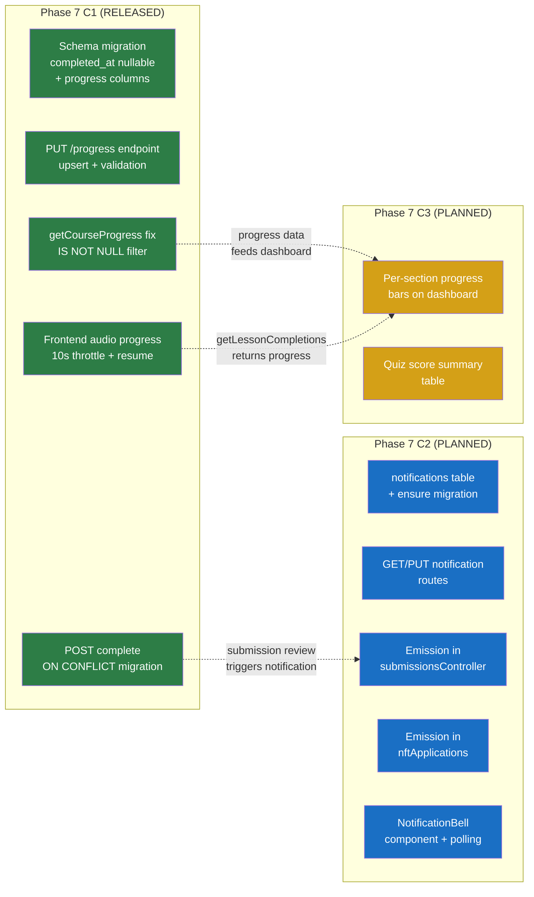
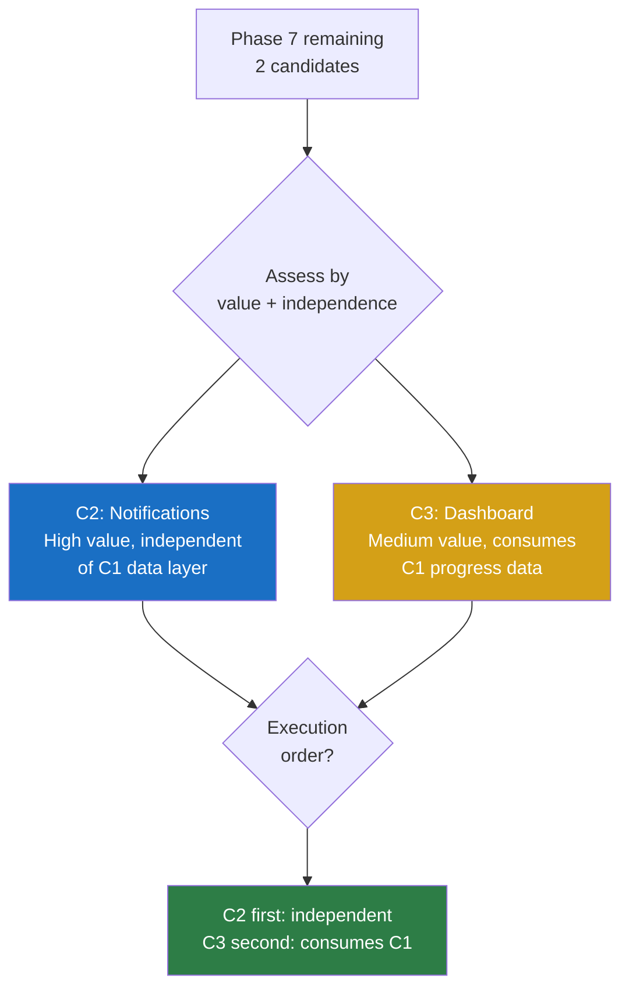
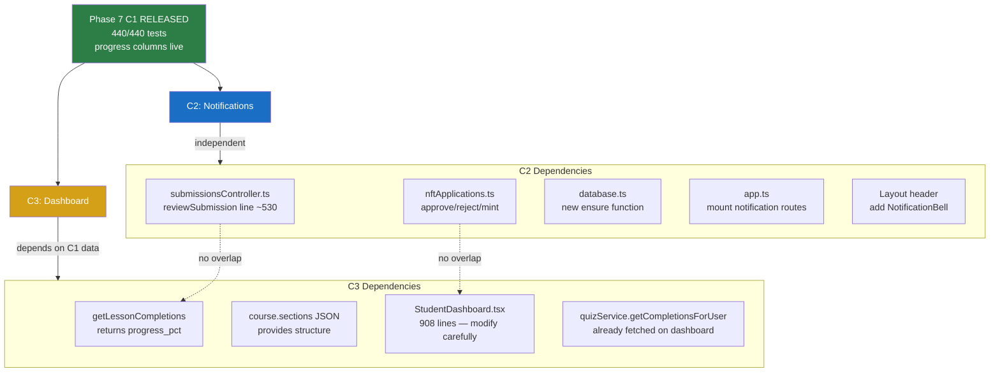
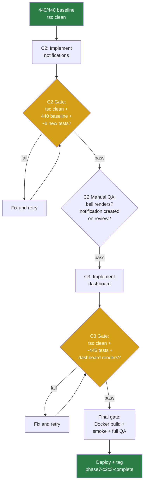

# Phase 7 C2/C3 Planning: Notifications + Dashboard Enhancements

**Date:** 2026-08-04
**Status:** PLANNING
**Baseline:** Phase 7 C1 released (`phase7-c1-complete-2026-08-04`), 440/440 backend tests, site live
**Previous:** Phase 7 C1 delivered audio playback progress tracking (save/resume position, partial progress, 10s throttle)

---

## Phase 7 C1 Release Closeout Summary

### Shipped Features

| Feature | Files | Lines | Impact |
|---------|-------|-------|--------|
| Schema migration | `database.ts`, `schema.sql` | +40 | `completed_at` nullable + `progress_pct` + `last_position_s` columns |
| PUT /progress endpoint | `lessonCompletions.ts` | +50 | Upsert with `ON CONFLICT DO UPDATE`, enrollment check, validation |
| POST complete ON CONFLICT | `lessonCompletions.ts` | +24/-8 | Both self-mark + admin/lecturer routes migrated from `INSERT OR IGNORE` |
| getCourseProgress fix | `courseCompletionService.ts` (backend) | +1 | `AND completed_at IS NOT NULL` prevents progress-only inflation |
| Frontend audio progress | `EmbeddedMaterialViewer.tsx`, `StudentCourse.tsx`, `courseCompletionService.ts` (frontend) | +83 | 10s throttled onTimeUpdate, onLoadedMetadata resume, itemProgressMap state |

### Verification Summary

| Gate | Result |
|------|--------|
| Backend tests | 440/440 PASS (429 baseline + 11 new) |
| Frontend tsc | Clean |
| Backend tsc | Clean |
| Docker build (web + api) | Success |
| Site HTTP 200 | Confirmed |
| API health | `{"status":"ok","db":"ok"}` |
| QA items | 10/10 verified (code review) |

### Rollback Note
- Safety tag: `pre-phase7-c1-2026-08-04`
- Rollback: `git revert HEAD~2..HEAD` + rebuild both containers
- Schema reverts to old columns — progress data lost but completions preserved

### Manual QA Status
- All 10 items verified via code review
- Browser testing deferred (audio progress requires real audio files + network tab observation)
- Standalone pages confirmed untouched

### Spec Corrections Applied During Implementation
1. `completed_at NOT NULL DEFAULT` required table rename migration (not simple ALTER)
2. Second POST complete route (admin/lecturer) was missed in spec
3. Five SELECT statements in GET completions (not one)
4. Express 4 async handler changed to synchronous (better-sqlite3 is sync)
5. `schema.sql` needed parallel update for test DB initialization

---

## Phase 7 C2/C3 Planning Summary

### Context
Phase 7 C1 completed the course interaction data layer — students now have binary completion tracking AND partial progress tracking with position resume. The platform has rich data but limited ways to surface it:

- **No proactive notifications** — students must check pages manually to see submission feedback, NFT approvals, or quiz results
- **No per-section progress visualization** — the dashboard shows aggregate numbers but no week-by-week breakdown

### Scope
Phase 7 C2/C3 should deliver two bounded features:

1. **C2: In-app notification system** — persistent notifications with bell icon, unread count, and 60s polling
2. **C3: Student progress dashboard enhancements** — per-section progress bars and quiz score summary on the dashboard

### Non-Goals
- No WebSocket/SSE (30s/60s polling is adequate)
- No email notification pairing (emailService exists but coupling it adds complexity)
- No lecturer/admin notifications (students only for C2)
- No time-spent analytics or heatmaps (C3 stays visual, not analytical)
- No new npm dependencies
- No quiz enhancements, instructor tooling, or real-time push

---

## Candidate Ranking

| Rank | Candidate | Value | Risk | Effort | Recommendation |
|------|-----------|-------|------|--------|----------------|
| 1 | **C2: In-app notifications** | High | Low | Medium | INCLUDE |
| 2 | **C3: Dashboard enhancements** | Medium | Low | Medium | INCLUDE |

### C2: In-App Notifications (Rank 1)

**Why first:**
- Highest daily-use impact — students currently have no way to know their submission was graded without manually navigating to the Submissions page
- Fully independent of C1 progress data — reads from existing submission review and NFT application flows
- Backend is isolated (new table + new routes + additive emission calls in existing controllers)
- Frontend is isolated (new `NotificationBell` component + polling service)

**Scope:**
- **Audience:** Students only (admins/lecturers see admin dashboards directly)
- **Notification types:** submission_reviewed, nft_approved, nft_rejected, nft_minted
- **Persistence:** Server-side `notifications` table with read/unread tracking
- **Delivery:** 60s polling from frontend (no WebSocket)
- **UI:** Bell icon in nav header with unread count badge + dropdown list

**Estimated changes:**
- 1 new DB table (`notifications`) + 1 ensure*() migration
- 1 new route file (`notifications.ts`) with GET + PUT endpoints
- 1 new service file (`notificationService.ts`) for emission helper
- Additive calls in `submissionsController.ts` (line ~530) and `nftApplications.ts` (lines ~407, ~447, ~570)
- 1 new frontend component (`NotificationBell.tsx`)
- 1 new frontend service (`notificationService.ts`)
- Layout modification (add bell to nav header)
- ~6 new backend tests

### C3: Dashboard Enhancements (Rank 2)

**Why second:**
- Medium value — improves understanding but students can already see aggregate progress
- Consumes C1 progress data (per-item `progress_pct` and `last_position_s`) — C1 must be stable first
- Frontend-heavy — modifies `StudentDashboard.tsx` (908 lines) which needs careful handling
- Can compute per-section progress client-side from existing `getLessonCompletions()` + course sections JSON

**Scope:**
- Per-section/per-week progress bars on course cards
- Quiz score summary (per-course quiz results table)
- No new backend endpoints (client-side computation from existing data)
- No time-spent analytics

**Estimated changes:**
- `StudentDashboard.tsx` — add progress breakdown section (~80-100 lines)
- `courseCompletionService.ts` (frontend) — possibly add helper to group completions by section
- No backend changes (existing APIs return all needed data)
- No new tests (frontend-only, visual)

---

## C2 Audience Decision

**Decision: Students only**

**Rationale:**
1. **Scope control** — 4 emission points (submission_reviewed, nft_approved, nft_rejected, nft_minted) vs. 8+ if lecturers get "new submission" alerts
2. **Architecture simplicity** — all notifications flow in one direction: admin/lecturer action → student notification
3. **No bidirectional coupling** — lecturer notifications would require checking course assignment, adding emission points in student-facing controllers, and handling lecturer-specific UI
4. **Existing workflow** — lecturers already see submissions on AdminSubmissions page; admins see NFT applications on AdminCertificates page. Neither role needs proactive alerting in this phase.
5. **Future extension** — the `notifications` table schema supports any `user_id`, so adding lecturer notifications later requires only new emission points, not schema changes

---

## Mermaid Diagrams

### C1 → C2/C3 Handoff Flow



### Candidate Ranking Flow



### Dependency Map



### Risk / Test Gate Flow



---

## To-Do Lists

### Candidate Analysis Checklist
- [x] C2: In-app notifications — feasibility confirmed, isolated from C1 progress data
- [x] C3: Dashboard enhancements — feasibility confirmed, consumes existing APIs
- [x] C2 audience scoped to students only
- [x] C2 emission points identified (submissionsController line ~530, nftApplications lines ~407/447/570)
- [x] C3 data source confirmed (getLessonCompletions + course.sections JSON, no new endpoint needed)
- [x] StudentDashboard.tsx assessed (908 lines, 5 data-fetching effects, modular section structure)

### Dependency Checklist
- [x] C2 independent of C1 progress data (notifications use review/approval events, not progress)
- [x] C3 depends on C1 progress data (progress_pct, last_position_s from getLessonCompletions)
- [x] C2 and C3 share no files (C2 touches controllers + new files; C3 touches StudentDashboard)
- [x] No circular dependencies
- [x] C2 and C3 can be developed in parallel (different files, different subsystems)
- [ ] Execution order: C2 first (independent), C3 second (can validate C1 data consumption)

### Risk Checklist
- [ ] C2: Emission calls in submissionsController must not break review flow (try/catch wrap)
- [ ] C2: Emission calls in nftApplications must not break approve/reject/mint flow (try/catch wrap)
- [ ] C2: 60s polling adds 1 lightweight SELECT per active student per minute
- [ ] C2: NotificationBell in nav header must not break existing layout
- [ ] C3: StudentDashboard.tsx is 908 lines — read entire file before modifying
- [ ] C3: Progress bars must handle null progress_pct gracefully (items without progress data)
- [ ] C3: Quiz score summary must handle courses with no required quizzes
- [ ] All: Express 4 async handler gotcha (use sync handlers for better-sqlite3 calls)

### Test Strategy Checklist
- [ ] C2: Write failing test for GET /notifications before implementing
- [ ] C2: Write failing test for PUT /notifications/:id/read before implementing
- [ ] C2: Write emission test (review submission → notification row created)
- [ ] C2: Write emission test (approve NFT application → notification row created)
- [ ] C2: Regression — submission review API response shape unchanged
- [ ] C2: Regression — NFT approval flow unchanged
- [ ] C3: No new backend tests (frontend-only)
- [ ] C3: Visual regression — dashboard renders with 0 courses, 1 course, many courses
- [ ] All: 440/440 baseline preserved
- [ ] All: tsc clean (frontend + backend)
- [ ] All: Docker build + smoke check

### Handoff Checklist
- [x] Phase 7 C1 tags confirmed (`pre-phase7-c1-2026-08-04`, `phase7-c1-complete-2026-08-04`)
- [x] Phase 7 C1 closeout doc exists (`docs/superpowers/plans/2026-08-04-phase7-c1-closeout.md`)
- [x] No uncommitted changes on `main`
- [x] 440/440 baseline verified
- [x] Both containers healthy
- [ ] Phase 7 C2/C3 branch to be created from current `main` head

---

## Test Strategy

### C2: In-App Notification System

**User story:** As a student, I want to see a notification bell that shows me when my submission has been graded or my NFT certificate was approved, without having to manually check each page.

**Acceptance criteria:**

| ID | Criterion | Type |
|----|-----------|------|
| C2-AC1 | `notifications` table created with (id, user_id, type, title, body, read, link, created_at) | Schema |
| C2-AC2 | `GET /notifications` returns unread+recent notifications for authenticated user (max 20) | API |
| C2-AC3 | `PUT /notifications/:id/read` marks notification as read (200, idempotent) | API |
| C2-AC4 | Notification row created when submission is reviewed (approved or rejected) | Emission |
| C2-AC5 | Notification row created when NFT application is approved, rejected, or minted | Emission |
| C2-AC6 | Frontend bell icon shows unread count badge (0 = no badge) | Frontend |
| C2-AC7 | Bell click opens dropdown with recent notifications (title, time, read/unread) | Frontend |
| C2-AC8 | Click notification → navigates to `link` + marks read | Frontend |
| C2-AC9 | Unread count refreshes on 60s polling interval | Frontend |

**Red/green tests:**
- RED: `GET /api/v1/notifications` → 404 (route doesn't exist)
- GREEN: Same → 200 + `{ notifications: [] }`
- RED: Review submission → no notification row
- GREEN: Review submission → notification row with type=submission_reviewed, correct user_id
- RED: `PUT /api/v1/notifications/:id/read` → 404
- GREEN: Same → 200 + `read = 1`
- RED: Approve NFT application → no notification row
- GREEN: Approve NFT application → notification row with type=nft_approved

**Regression coverage:**
- Submission review API returns same response shape (200 + success:true + data)
- NFT approval/rejection/mint responses unchanged
- 440/440 baseline tests pass
- No new middleware or auth changes

### C3: Student Progress Dashboard Enhancements

**User story:** As a student, I want to see week-by-week progress for each course and a summary of my quiz scores so I can understand where I stand.

**Acceptance criteria:**

| ID | Criterion | Type |
|----|-----------|------|
| C3-AC1 | Course section on dashboard shows per-section progress bars (completed/total items) | Frontend |
| C3-AC2 | Progress bars reflect partial completion from C1 progress_pct data | Frontend |
| C3-AC3 | Quiz score summary shows per-course quiz results (score, pass/fail, passing threshold) | Frontend |
| C3-AC4 | Dashboard loads without errors when progress data is empty or null | Frontend |
| C3-AC5 | Existing dashboard layout (NFT badges, course cards, stats, announcements) unchanged | Regression |

**Red/green tests:**
- Frontend-only — no automated backend tests
- Visual validation: dashboard renders with 0 courses, 1 course with 0 completions, 1 course with partial completions
- Data handling: `progress_pct = null` doesn't crash progress bars

**Regression coverage:**
- `StudentDashboard.tsx` renders without errors after modification
- Existing sections (wallet banner, quick actions, NFT badges, certificates, stats, announcements) still render
- No backend changes = no backend regression risk

**Manual QA expectations (both C2 and C3):**

| ID | Check | Expected |
|----|-------|----------|
| QA-C2-01 | Bell icon visible in nav | Badge shows unread count |
| QA-C2-02 | Submit + review assignment | Student sees notification |
| QA-C2-03 | Approve NFT application | Student sees notification |
| QA-C2-04 | Click notification | Navigates to link, marks read |
| QA-C2-05 | All notifications read | Badge disappears |
| QA-C3-01 | Dashboard shows section bars | Per-section completion visible |
| QA-C3-02 | Partially listened audio | Progress bar reflects partial % |
| QA-C3-03 | Quiz scores visible | Score + pass/fail per quiz |
| QA-C3-04 | Empty course | No crash, shows 0/0 gracefully |

---

## Risk Note

### Key Assumptions
1. **`notifications` table uses `CREATE TABLE IF NOT EXISTS`** — safe idempotent creation, follows existing ensure*() pattern (30 existing functions in database.ts)
2. **Emission calls are additive** — wrapped in try/catch, failure does not break the parent operation (submission review or NFT approval continues normally)
3. **60s polling is acceptable load** — 1 lightweight `SELECT ... WHERE user_id = ? AND read = 0 ORDER BY created_at DESC LIMIT 20` per active student per minute
4. **Per-section progress can be computed client-side** — `getLessonCompletions()` returns item-level data; course.sections JSON provides the section→item mapping. No new endpoint needed.
5. **StudentDashboard.tsx (908 lines) can be modified safely** — the file has modular sections with clear boundaries. Progress bars would be added as a new section, not woven into existing ones.

### Potential Coupling Risks

| Risk | Files Involved | Mitigation |
|------|---------------|------------|
| C2 emission in submissionsController breaks review | `submissionsController.ts` line ~530 | try/catch wrap; notification is best-effort |
| C2 emission in nftApplications breaks approve/reject | `nftApplications.ts` lines ~407/447/570 | try/catch wrap; same pattern |
| C3 modifies large StudentDashboard.tsx | `StudentDashboard.tsx` (908 lines) | Read entire file before editing; add new section, don't modify existing ones |
| Express 4 async handler gotcha | Any new route handler | Use synchronous handlers for better-sqlite3 (learned from C1) |
| `getLessonCompletions` return type changed in C1 | `courseCompletionService.ts` (frontend) | Now returns objects — C3 must use new shape, not old string[] |

### C1 Coupling Points That C2/C3 May Touch
- **`lesson_completions` table** — C2 does NOT touch; C3 reads via existing API only
- **`PUT /progress` endpoint** — neither C2 nor C3 touches
- **`getCourseProgress` query** — C3 may call it but does NOT modify it
- **`completed_at IS NOT NULL` filter** — C3 benefits from this (accurate completion counts) but does not change it
- **`progress_pct` / `last_position_s` columns** — C3 reads via `getLessonCompletions()`; C2 ignores entirely

---

## Handoff Note

### What Is Released (Phase 7 C1)
- Audio playback progress: save position via 10s throttled PUT, resume via onLoadedMetadata
- Schema: `completed_at` nullable, `progress_pct INTEGER`, `last_position_s INTEGER` on `lesson_completions`
- POST complete migrated to `INSERT ... ON CONFLICT DO UPDATE`
- getCourseProgress filters `completed_at IS NOT NULL`
- Frontend: `getLessonCompletions()` returns `{ itemId, progressPct, lastPositionS }[]`
- 440/440 tests, both containers healthy, site live

### What C2/C3 Should Consume
- **C2 consumes:** `submissionsController.reviewSubmission()` (line ~530), `nftApplications.ts` approve/reject/mint handlers, existing ensure*() migration pattern, existing route mounting in app.ts
- **C3 consumes:** `courseCompletionService.getLessonCompletions()` (new object return type from C1), `courseCompletionService.getCourseProgress()`, `quizService.getCompletionsForUser()`, course.sections JSON structure
- **C2 uses:** `toastBus.ts` for ephemeral feedback (optional), new `NotificationBell` component for persistent notifications
- **C3 uses:** existing data fetching in `StudentDashboard.tsx` effects (lines 174-207)

### What C2/C3 Should NOT Touch
- `EmbeddedMaterialViewer.tsx` (C1 modified, stable)
- `StudentCourse.tsx` (C1 modified, stable)
- `InlineQuizTaker.tsx`, `InlineAssignmentForm.tsx` (Phase 6, stable)
- `lesson_completions` table schema (C1 completed, no further migration)
- `lessonCompletions.ts` routes (C1 modified, stable)
- Server auth middleware
- `app.listen()` / HTTP server setup

---

## /loop Workflow

```
/loop assess   — Verify 440/440 baseline, confirm C1 tags, review this planning doc
/loop plan     — Write C2 spec first, then C3 spec (separate spec → plan → implement cycles)
/loop review   — Code review checkpoint after C2 implementation, then after C3
/loop defer    — Confirm quiz enhancements, instructor tooling, real-time push remain deferred
```

---

## Final Recommendation

**Status: PHASE 7 C2/C3 PLANNING READY**

**Selected scope:**
1. **C2: In-app notification system** — students only, 4 notification types, 60s polling, bell icon with dropdown
2. **C3: Student progress dashboard enhancements** — per-section progress bars, quiz score summary, client-side computation

**C2 audience decision:** Students only — bounded to 4 emission points, one-directional flow

**Execution order:** C2 first (independent), C3 second (consumes C1 data, validates after C2 stable)

**Each candidate gets its own cycle:** spec → plan → implement → verify → deploy

**Deferred:**
- Quiz enhancements → Phase 8+
- Instructor tooling → Phase 8+
- Real-time push → Deferred indefinitely
- Lecturer/admin notifications → Future extension of C2

**Estimated total (C2 + C3):**
- ~4 new files + ~5 modified files
- ~350-450 new lines
- 1 new DB table (notifications)
- ~6 new backend tests
- Deploy: both `web` and `api` containers

**Exact next action:** Write Phase 7 C2 spec (in-app notification system — students only). The spec should define: notification table schema, GET/PUT endpoints, emission points in submissionsController and nftApplications, NotificationBell component, and 60s polling strategy.
