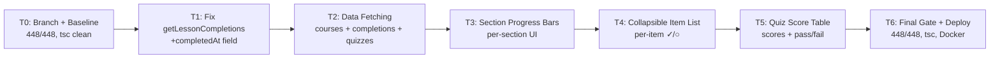
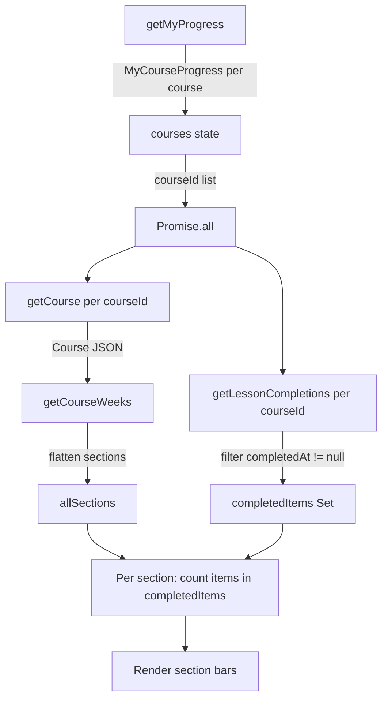
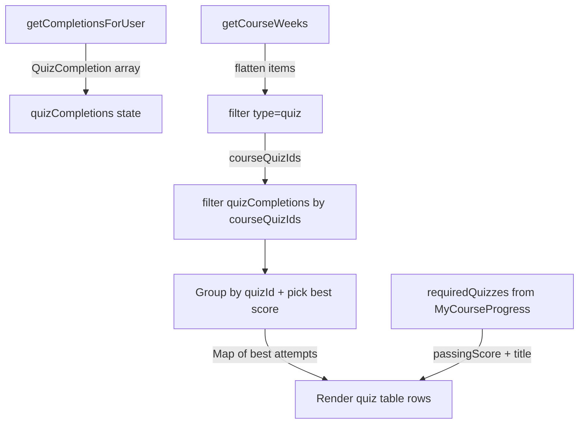
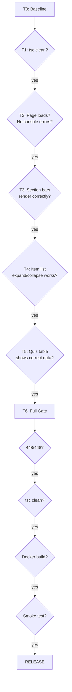

# Phase 7 C3 Implementation Plan: Student Progress Enhancements

**Date:** 2026-08-04
**Spec:** `docs/superpowers/specs/2026-08-04-phase7-c3-progress-enhancements-design.md`
**Baseline:** 448/448 tests, tsc clean, both containers healthy
**Branch:** `feat/phase7-c3-progress`
**Scope:** Frontend-only — modify `StudentProgress.tsx` + minor service fix

---

## Spec Correction Discovered During Planning

**`getLessonCompletions()` omits `completed_at`:** The frontend service at `courseCompletionService.ts:79-88` maps completion rows to `{ itemId, progressPct, lastPositionS }`, stripping `completed_at`. The backend returns ALL rows including progress-only rows (C1) where `completed_at IS NULL`. Without `completed_at`, we cannot distinguish "completed" from "in-progress-only" items.

**Fix:** Extend `getLessonCompletions()` to also return `completedAt: string | null`. This is a 2-line change in the mapping function. No backend changes needed.

**`getCompletionsForUser(userId)` requires userId:** The quiz service method takes a `userId` parameter. The component will get this from `useAuth().user.id`.

---

## Task Table

| # | Task | Files Touched | Est. Lines | Sequential | Gate |
|---|------|---------------|-----------|------------|------|
| T0 | Branch + baseline | — | 0 | Yes (first) | 448/448, tsc clean |
| T1 | Fix `getLessonCompletions` return type | `courseCompletionService.ts` (frontend) | +3/-1 | Yes | tsc clean |
| T2 | Add data fetching to StudentProgress | `StudentProgress.tsx` | +60 | Yes (after T1) | tsc clean, page loads |
| T3 | Add section progress bars UI | `StudentProgress.tsx` | +80 | Yes (after T2) | tsc clean, visual QA |
| T4 | Add collapsible item list | `StudentProgress.tsx` | +40 | Yes (after T3) | tsc clean, visual QA |
| T5 | Add quiz score table | `StudentProgress.tsx` | +60 | Yes (after T4) | tsc clean, visual QA |
| T6 | Final gate + deploy | — | 0 | Yes (last) | Full gate |

**Total estimated new lines:** ~240
**Parallelization:** None — all tasks modify the same file sequentially.

---

## Task Details

### T0: Branch + Baseline

**Goal:** Create feature branch, verify baseline, create safety tag.

**Steps:**
1. `git checkout -b feat/phase7-c3-progress`
2. `cd LMS-Server && npx vitest run` → verify 448/448
3. `cd LMS-Server && npx tsc --noEmit` → verify clean
4. `cd LMS-Frontend && npx tsc --noEmit` → verify clean
5. `git tag pre-phase7-c3-2026-08-04`

**Gate:** 448/448 PASS, both tsc clean, tag created.

---

### T1: Fix `getLessonCompletions` Return Type

**Goal:** Extend the frontend service to return `completedAt` so C3 can distinguish completed items from progress-only items.

**File:** `LMS-Frontend/src/services/courseCompletionService.ts`

**Change:** In the `getLessonCompletions()` method (lines 79-88):

1. Add `completed_at` to the response type extraction:
```typescript
data: { completions: { item_id: string; completed_at: string | null; progress_pct: number | null; last_position_s: number | null }[] };
```

2. Add `completedAt` to the return type:
```typescript
Promise<{ itemId: string; completedAt: string | null; progressPct: number | null; lastPositionS: number | null }[]>
```

3. Add mapping:
```typescript
completedAt: c.completed_at,
```

**Impact check:** Search for all callers of `getLessonCompletions()`:
- `StudentCourse.tsx` — uses `itemId` and `progressPct`/`lastPositionS` for audio resume. Adding a new field to the return object does NOT break existing callers (they simply ignore the extra field).

**Gate:** `npx tsc --noEmit` (frontend) clean. No behavioral change to existing callers.

---

### T2: Add Data Fetching to StudentProgress

**Goal:** Fetch course structure, lesson completions, and quiz completions in parallel after `getMyProgress()` resolves.

**File:** `LMS-Frontend/src/pages/StudentProgress.tsx`

**Changes:**

1. **New imports:**
```typescript
import { courseService } from '../services/courseService';
import { quizService } from '../services/quizService';
import { useAuth } from '../context/useAuth';
import type { Course } from '../types/course';
import { getCourseWeeks } from '../types/course';
import type { QuizCompletion } from '../types/quiz';
import { ChevronRight } from 'lucide-react';
```

2. **New state:**
```typescript
const { user } = useAuth();
const [courseDetails, setCourseDetails] = useState<Record<string, Course>>({});
const [completions, setCompletions] = useState<Record<string, { itemId: string; completedAt: string | null }[]>>({});
const [quizCompletions, setQuizCompletions] = useState<QuizCompletion[]>([]);
const [expandedSections, setExpandedSections] = useState<Set<string>>(new Set());
```

3. **Second-phase fetch** (after `getMyProgress()` resolves):
```typescript
useEffect(() => {
  if (courses.length === 0 || !user) return;

  const fetchDetails = async () => {
    const [courseResults, completionResults, quizResults] = await Promise.all([
      Promise.all(courses.map((c) => courseService.getCourse(c.courseId).catch(() => null))),
      Promise.all(courses.map((c) => courseCompletionService.getLessonCompletions(c.courseId).catch(() => []))),
      quizService.getCompletionsForUser(user.id).catch(() => []),
    ]);

    const detailMap: Record<string, Course> = {};
    courseResults.forEach((course, i) => {
      if (course) detailMap[courses[i].courseId] = course;
    });
    setCourseDetails(detailMap);

    const compMap: Record<string, typeof completionResults[0]> = {};
    completionResults.forEach((comps, i) => {
      compMap[courses[i].courseId] = comps;
    });
    setCompletions(compMap);

    setQuizCompletions(quizResults);
  };

  fetchDetails();
}, [courses, user]);
```

**Key patterns:**
- All fetches wrapped in `.catch(() => ...)` for graceful degradation (spec F5)
- `Promise.all` at both the per-course and global level (spec F6)
- Data stored in `Record<courseId, ...>` maps for O(1) lookup per course card

**Gate:** tsc clean. Page loads without errors. No visual change yet (data fetched but not rendered).

---

### T3: Add Section Progress Bars UI

**Goal:** Below the existing aggregate progress bar, render per-section progress bars for each course.

**File:** `LMS-Frontend/src/pages/StudentProgress.tsx`

**Insert point:** After the existing `{pct}% complete` paragraph (line ~113), before the "Required quizzes" section (line ~117).

**New JSX block:**
```tsx
{/* Per-section progress (C3) */}
{courseDetails[c.courseId] && (() => {
  const weeks = getCourseWeeks(courseDetails[c.courseId]);
  const allSections = weeks.flatMap((w) => w.sections).filter((s) => s.items.length > 0);
  const completedItems = new Set(
    (completions[c.courseId] ?? [])
      .filter((comp) => comp.completedAt !== null)
      .map((comp) => comp.itemId)
  );

  if (allSections.length === 0) return null;

  return (
    <div className="space-y-2 pt-1">
      <p className="text-xs font-semibold text-neutral-600 uppercase tracking-wide">By Section</p>
      {allSections.map((section) => {
        const total = section.items.length;
        const done = section.items.filter((item) => completedItems.has(item.id)).length;
        const sectionPct = total > 0 ? Math.round((done / total) * 100) : 0;
        const isExpanded = expandedSections.has(section.id);
        const allDone = done === total && total > 0;

        return (
          <div key={section.id}>
            <button
              type="button"
              className="w-full flex items-center gap-2 text-left group"
              onClick={() => toggleSection(section.id)}
            >
              <ChevronRight className={`h-3.5 w-3.5 text-neutral-400 transition-transform ${isExpanded ? 'rotate-90' : ''}`} />
              <span className="text-sm text-neutral-700 flex-1 truncate">{section.title}</span>
              {allDone && <CheckCircle className="h-3.5 w-3.5 text-green-600 shrink-0" />}
              <span className="text-xs text-neutral-500 tabular-nums shrink-0">{done}/{total}</span>
            </button>
            <div className="ml-5 mt-1">
              <div className="h-1.5 w-full rounded-full bg-neutral-100 overflow-hidden">
                <div
                  className={`h-full rounded-full transition-all ${allDone ? 'bg-green-500' : 'bg-accent-teal'}`}
                  style={{ width: `${sectionPct}%` }}
                />
              </div>
            </div>
            {/* Item list rendered in T4 */}
          </div>
        );
      })}
    </div>
  );
})()}
```

**Helper function** (add before return statement):
```typescript
const toggleSection = (sectionId: string) => {
  setExpandedSections((prev) => {
    const next = new Set(prev);
    if (next.has(sectionId)) next.delete(sectionId);
    else next.add(sectionId);
    return next;
  });
};
```

**Gate:** tsc clean. Section bars render below aggregate bar. Expand/collapse chevron rotates.

**Failure modes to check:**
- Course with no `courseDetails` entry → IIFE returns nothing (graceful)
- Course with sections but 0 items in all sections → "By Section" hidden
- Section counts correct → `completedItems` set filtered by `completedAt !== null`

---

### T4: Add Collapsible Item List

**Goal:** When a section is expanded, show per-item completion icons.

**File:** `LMS-Frontend/src/pages/StudentProgress.tsx`

**Insert point:** Replace the `{/* Item list rendered in T4 */}` comment from T3.

**New JSX:**
```tsx
{isExpanded && (
  <ul className="ml-5 mt-2 space-y-1">
    {section.items.map((item) => {
      const isDone = completedItems.has(item.id);
      return (
        <li key={item.id} className="flex items-center gap-2 text-sm">
          {isDone ? (
            <CheckCircle className="h-3.5 w-3.5 text-green-600 shrink-0" />
          ) : (
            <span className="h-3.5 w-3.5 rounded-full border-2 border-neutral-300 shrink-0" />
          )}
          <span className={isDone ? 'text-neutral-700' : 'text-neutral-400'}>{item.title}</span>
        </li>
      );
    })}
  </ul>
)}
```

**Design note:** Uses a hollow circle (`border-2 border-neutral-300 rounded-full`) instead of an icon for incomplete items — lighter visual weight, matches the existing design language.

**Gate:** tsc clean. Click section → items appear with correct ✓/○ status.

---

### T5: Add Quiz Score Table

**Goal:** Below the existing "Required Quizzes" section, add a "Quiz Scores" table showing attempt results.

**File:** `LMS-Frontend/src/pages/StudentProgress.tsx`

**Insert point:** After the "Required quizzes" `</div>` (line ~140), before the "Submission requirement" section (line ~143).

**Data transformation** (inside the course card render, after section bars):
```typescript
// Quiz score table data
const courseQuizIds = courseDetails[c.courseId]
  ? getCourseWeeks(courseDetails[c.courseId])
      .flatMap((w) => w.sections)
      .flatMap((s) => s.items)
      .filter((item): item is CourseItemQuiz => item.type === 'quiz')
      .map((item) => item.quizId)
  : [];

const bestAttempts = new Map<string, QuizCompletion>();
for (const qc of quizCompletions) {
  if (!courseQuizIds.includes(qc.quizId)) continue;
  const existing = bestAttempts.get(qc.quizId);
  if (!existing || qc.score > existing.score) {
    bestAttempts.set(qc.quizId, qc);
  }
}
```

**New JSX:**
```tsx
{bestAttempts.size > 0 && (
  <div>
    <p className="text-xs font-semibold text-neutral-600 uppercase tracking-wide mb-2">Quiz Scores</p>
    <div className="overflow-x-auto -mx-1">
      <table className="w-full text-sm">
        <thead>
          <tr className="text-left text-xs text-neutral-500 border-b border-neutral-100">
            <th className="pb-2 pr-3 font-medium">Quiz</th>
            <th className="pb-2 pr-3 font-medium text-right">Score</th>
            <th className="pb-2 pr-3 font-medium text-right">Passing</th>
            <th className="pb-2 pr-3 font-medium">Status</th>
            <th className="pb-2 font-medium text-right">Date</th>
          </tr>
        </thead>
        <tbody>
          {[...bestAttempts.values()].map((qc) => {
            const scorePct = qc.total > 0 ? Math.round((qc.score / qc.total) * 100) : 0;
            const reqQuiz = c.requiredQuizzes.find((rq) => rq.quizId === qc.quizId);
            const passingPct = reqQuiz?.passingScore ?? 70;
            return (
              <tr key={qc.quizId} className="border-b border-neutral-50">
                <td className="py-2 pr-3 text-neutral-700">{reqQuiz?.quizTitle ?? 'Quiz'}</td>
                <td className="py-2 pr-3 text-right tabular-nums">{scorePct}%</td>
                <td className="py-2 pr-3 text-right tabular-nums text-neutral-500">{passingPct}%</td>
                <td className="py-2 pr-3">
                  <span className={`inline-flex items-center text-xs font-medium ${qc.passed ? 'text-green-700' : 'text-red-600'}`}>
                    {qc.passed ? 'Passed' : 'Failed'}
                  </span>
                </td>
                <td className="py-2 text-right text-xs text-neutral-500 tabular-nums">
                  {new Date(qc.completedAt).toLocaleDateString()}
                </td>
              </tr>
            );
          })}
        </tbody>
      </table>
    </div>
  </div>
)}
```

**Import needed:** Add `CourseItemQuiz` to the course types import:
```typescript
import type { Course, CourseItemQuiz } from '../types/course';
```

**Edge cases handled:**
- `bestAttempts.size === 0` → table hidden entirely (spec F5)
- No `courseDetails` for this course → `courseQuizIds` is `[]` → no matches → table hidden
- Quiz title fallback: `reqQuiz?.quizTitle ?? 'Quiz'`
- Passing score fallback: `reqQuiz?.passingScore ?? 70`
- De-duplication: `Map` with highest-score wins (spec F4 edge case)

**Gate:** tsc clean. Quiz table renders with correct data. Hidden when no completions.

---

### T6: Final Gate + Deploy

**Goal:** Full verification, commit, merge, tag, push, deploy.

**Steps:**

1. **Backend regression:**
   ```bash
   cd LMS-Server && npx vitest run
   ```
   Expected: 448/448 PASS

2. **TypeScript checks:**
   ```bash
   cd LMS-Server && npx tsc --noEmit
   cd LMS-Frontend && npx tsc --noEmit
   ```
   Expected: both clean

3. **Docker build + deploy:**
   ```bash
   docker compose build web && docker compose up -d --no-deps web
   ```
   Note: Only `web` container needed (frontend-only changes). Backend unchanged.

4. **Smoke test:**
   ```bash
   curl -s https://lms.smwebsystems.com/api/v1/health | jq .
   curl -sI https://lms.smwebsystems.com/ | head -1
   ```

5. **Commit + merge + tag + push:**
   ```bash
   git add LMS-Frontend/src/pages/StudentProgress.tsx LMS-Frontend/src/services/courseCompletionService.ts
   git commit -m "feat: section progress bars + quiz score table (Phase 7 C3)"
   git checkout main
   git merge feat/phase7-c3-progress
   git tag phase7-c3-complete-2026-08-04
   source ~/.env.git-write
   git push https://"$GH_TOKEN"@github.com/SM-Web-Systems/lms-crypto-production.git main --tags
   ```

6. **Write closeout doc.**

**Gate:** All checks pass, deployed, pushed, tagged.

---

## Mermaid Diagrams

### Task Dependency Flow



### Section Progress Data Flow



### Quiz Score Data Flow



### Verification Gate Flow



---

## To-Do Lists

### Planning Checklist

- [x] Read and understand C3 spec
- [x] Read current `StudentProgress.tsx` (187 lines)
- [x] Verify frontend service method signatures
- [x] Discovered spec correction: `getLessonCompletions()` missing `completedAt`
- [x] Discovered spec correction: `getCompletionsForUser()` needs userId
- [x] Confirm no frontend component test setup (skip automated UI tests)
- [x] Define task sequence (T0-T6)
- [x] Define verification gates per task

### Implementation Checklist

- [ ] T0: Create branch + verify baseline + create safety tag
- [ ] T1: Extend `getLessonCompletions()` to return `completedAt`
- [ ] T2: Add data fetching (courses, completions, quizzes) with `Promise.all`
- [ ] T3: Add section progress bars with collapsible headers
- [ ] T4: Add expandable item list with ✓/○ icons
- [ ] T5: Add quiz score table with de-duplication
- [ ] T6: Full gate → commit → merge → tag → push → deploy

### Test Checklist

- [ ] Backend regression: 448/448 (T0, T6)
- [ ] tsc clean frontend (T0-T6)
- [ ] tsc clean backend (T0, T6)
- [ ] Docker build succeeds (T6)
- [ ] Smoke test: health check + site 200 (T6)

### QA Checklist

- [ ] QA-C3-01: Section bars visible for enrolled course
- [ ] QA-C3-02: Section counts match course viewer
- [ ] QA-C3-03: Expand/collapse works
- [ ] QA-C3-04: Item checkmarks match completion
- [ ] QA-C3-05: Quiz table shows scores
- [ ] QA-C3-06: No quiz table when no attempts
- [ ] QA-C3-07: Empty course shows graceful state
- [ ] QA-C3-08: Mobile layout works
- [ ] QA-C3-09: Page loads fast
- [ ] QA-C3-10: Existing features unbroken (aggregate bar, badges, apply button)

### Review Checklist

- [ ] Scope contained to `StudentProgress.tsx` + `courseCompletionService.ts`
- [ ] No backend files modified
- [ ] No `StudentDashboard.tsx` modified
- [ ] No `NotificationBell.tsx` modified
- [ ] `getCourseWeeks()` handles both weeks + flat sections
- [ ] Quiz de-duplication picks best score
- [ ] Empty states handled (no sections, no completions, no quizzes)
- [ ] Existing aggregate bar unchanged
- [ ] Certificate badges unchanged
- [ ] Apply button unchanged

---

## Failure Modes & Defensive Checks

| Failure Mode | Built-In Defense | Task |
|-------------|-----------------|------|
| Section bars show wrong counts | `completedItems` set filtered by `completedAt !== null` | T3 |
| Quiz table shows wrong scores | `bestAttempts` Map picks max score per quizId | T5 |
| Empty sections break UI | `filter((s) => s.items.length > 0)` skips empty sections | T3 |
| No quizzes breaks table | `bestAttempts.size > 0` guard hides table | T5 |
| API call fails | `.catch(() => null/[])` on all fetches | T2 |
| Aggregate bar regression | No changes to existing aggregate bar JSX | T3 |
| Performance from extra calls | `Promise.all` parallelizes; no polling | T2 |
| `getCourseWeeks` format mismatch | Uses existing helper that handles both formats | T3 |
| Progress-only rows counted as complete | Explicit `completedAt !== null` filter | T3 |

---

## /loop Workflow

```
/loop assess  → Verify baseline (448/448, tsc clean), read current StudentProgress.tsx
/loop plan    → This document — task sequence T0-T6
/loop review  → Review checklist verification after each task
/loop execute → Run T0 through T6 sequentially, gate between each
```

---

## Branch / Worktree Strategy

- **Branch:** `feat/phase7-c3-progress` off current `main` (at `phase7-c2-complete-2026-08-04`)
- **No worktree needed:** Single-file frontend change with no concurrency risk
- **Safety tag:** `pre-phase7-c3-2026-08-04` created in T0
- **Merge:** Fast-forward merge to `main` after T6 passes
- **Release tag:** `phase7-c3-complete-2026-08-04`

---

## Summary

| Metric | Value |
|--------|-------|
| Tasks | 7 (T0-T6) |
| Files modified | 2 (`StudentProgress.tsx`, `courseCompletionService.ts`) |
| Estimated new lines | ~240 |
| Backend changes | 0 |
| New backend tests | 0 |
| Schema changes | 0 |
| Deploy | Frontend only (`docker compose build web`) |
| Spec corrections | 2 (missing `completedAt`, quiz userId param) |
| Risk level | LOW |
