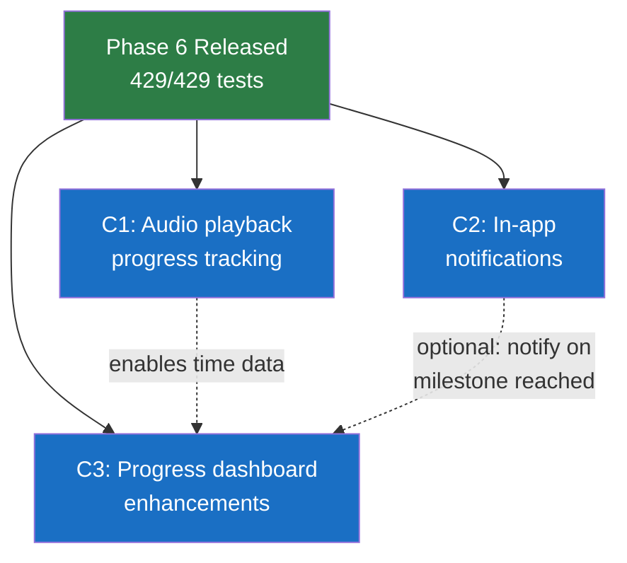
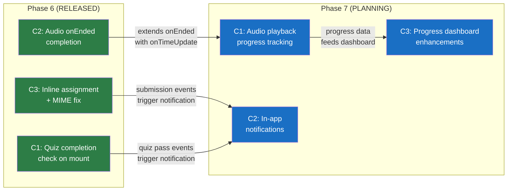
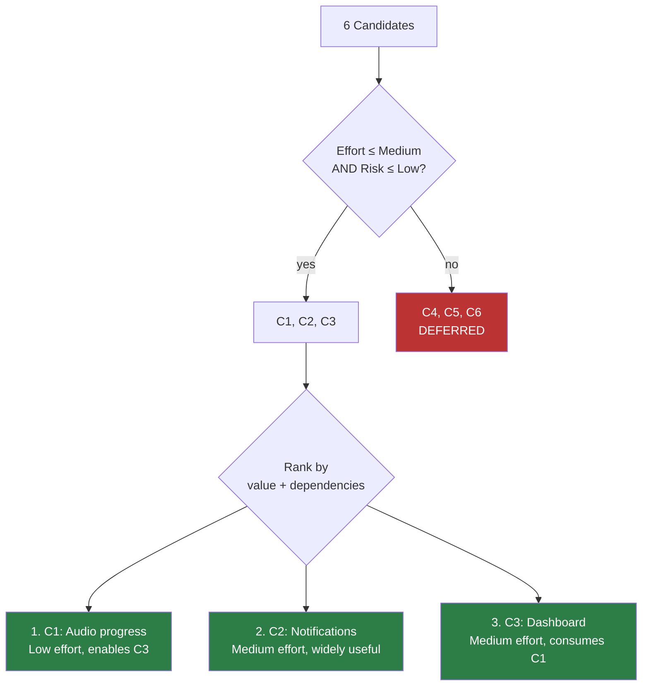
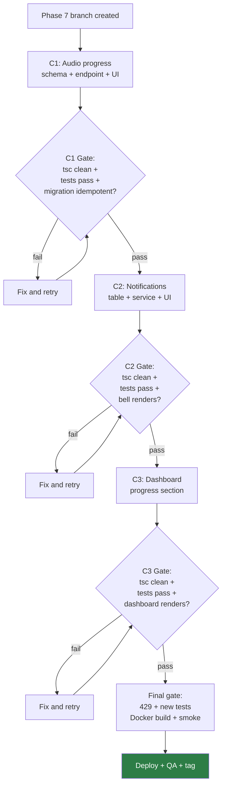

# Phase 7 Planning: Platform Maturity

**Date:** 2026-08-04
**Status:** PLANNING
**Baseline:** Phase 6 released (`phase6-complete-2026-08-04`), 429/429 backend tests, site live
**Previous:** Phases 1–6 delivered smart completion, inline quiz/assignment, audio completion, MIME filter alignment

---

## Phase 6 Release Closeout Summary

### Shipped Features

| Feature | Files | Lines | Impact |
|---------|-------|-------|--------|
| C1: Quiz completion check on mount | `InlineQuizTaker.tsx` | +15/-13 | Returning students see prior result immediately |
| C2: Audio completion on listen | `EmbeddedMaterialViewer.tsx`, `StudentCourse.tsx` | +4 | `onEnded` → `markItemEngaged` → progress update |
| C3: Inline assignment submission | 6 files + 1 new (`InlineAssignmentForm.tsx`) | +194/-20 | Upload form in course viewer; MIME filter extended to 11 types |

### Verification Summary

| Gate | Result |
|------|--------|
| Backend tests | 429/429 PASS |
| Frontend tsc | Clean |
| Backend tsc | Clean |
| Docker build (web + api) | Success |
| Site HTTP 200 | Confirmed |
| API health | `{"status":"ok","db":"ok"}` |
| QA items | 15/15 verified (code review) |

### Rollback Note
- Safety tag: `pre-phase6-2026-08-04`
- Rollback: `git revert HEAD~2..HEAD` → rebuild both containers
- Backend MIME filter reverts to 5 types (acceptable)

### Manual QA Status
- All 15 items verified via code review
- Browser testing deferred (no active quiz/assignment data in production to fully exercise)
- Standalone pages (Quizzes, Submissions) confirmed untouched

---

## Phase 7 Planning Summary

### Context
Phases 1–6 built the core course interaction loop: view → engage → complete → track progress. The platform now has inline rendering for all item types (video, PDF, audio, quiz, assignment, download, link) with completion tracking and 30s polling for progress updates.

Phase 7 focuses on **platform maturity** — filling gaps that become apparent once the core loop is working.

### Scope
Phase 7 should deliver 2–3 bounded features that improve the student/instructor experience without requiring architectural overhauls. Priority goes to features that:
1. Build on existing infrastructure (extend, don't replace)
2. Have clear acceptance criteria
3. Can be tested against the existing 429-test baseline
4. Deploy without schema-breaking migrations

### Non-Goals
- No WebSocket/SSE infrastructure (deferred — architectural cost vs. marginal improvement over 30s polling)
- No new npm dependencies requiring security review
- No instructor role overhaul (lecturer dashboard, rubrics, attendance — separate phase)
- No real-time push notifications
- No quiz question banks or timed quizzes (complex JSON versioning + security concerns)

---

## Candidate Ranking

### Ranking Criteria
- **Value:** How much does it improve daily student/instructor experience?
- **Risk:** How likely is it to introduce regressions or architectural debt?
- **Effort:** How many files, lines, and new tables?

### Ranked Candidates

| Rank | Candidate | Value | Risk | Effort | Recommendation |
|------|-----------|-------|------|--------|----------------|
| 1 | **C1: Audio playback progress tracking** | High | Low | Low–Med | INCLUDE |
| 2 | **C2: In-app notification system** | High | Low | Medium | INCLUDE |
| 3 | **C3: Student progress dashboard enhancements** | Medium | Low | Medium | INCLUDE (scoped) |
| 4 | C4: Quiz enhancements (timed, feedback) | Medium | High | High | DEFER |
| 5 | C5: Richer instructor tooling (rubrics, analytics) | Medium | High | High | DEFER |
| 6 | C6: Real-time push (WebSocket/SSE) | Low | High | High | DEFER INDEFINITELY |

### Rationale

**C1 — Audio Playback Progress (INCLUDE)**
- `lesson_completions` table exists but only tracks binary done/not-done
- Phase 6 added `onEnded` — extend to `onTimeUpdate` for partial progress
- Schema change: 2 nullable columns on existing table (non-breaking)
- Frontend: ~30 lines (throttled progress reporting)
- Backend: 1 new endpoint (~50 lines)
- Enables resume-from-position (student UX win)

**C2 — In-App Notifications (INCLUDE)**
- No notification infrastructure exists today
- `emailService.ts` exists with 3 templates — notification system complements it
- `toastBus.ts` + `ToastProvider.tsx` exist for ephemeral UI feedback
- New table + service + bell component (~200 lines total)
- Emission points at natural boundaries: submission graded, quiz passed, NFT approved

**C3 — Student Progress Dashboard (INCLUDE — scoped)**
- `StudentDashboard.tsx` shows course cards + NFT badges but no per-course breakdown
- `courseCompletionService.getCourseProgress()` already returns rich data
- Scope to: week-by-week progress visualization + quiz score summary
- Skip: time-spent heatmap, skill badges, learning outcomes (those depend on C1 data + instructor input)

**C4 — Quiz Enhancements (DEFER)**
- Questions stored as JSON blob in `quizzes.questions` column
- Adding timer/feedback fields requires JSON schema versioning
- Server-side timer validation adds security surface
- Question banks require 2 new tables + drag-and-drop UI library
- Too much complexity for this phase

**C5 — Instructor Tooling (DEFER)**
- Lecturer role exists (`course_lecturers` table) but has no dedicated UI
- Requires 3+ new tables (rubrics, grades, attendance)
- Permission layer needs extension
- Design-heavy — needs its own brainstorming cycle

**C6 — Real-time Push (DEFER INDEFINITELY)**
- `EventSource` cannot send Authorization headers (frontend uses Bearer tokens)
- SQLite has no pub/sub mechanism
- Requires HTTP server refactor (`app.listen()` → explicit `http.createServer()`)
- 30s polling with optimistic local updates is already adequate
- Cost/benefit does not justify the architectural change

---

## Dependency Map

### Feature Dependencies



### Shared Systems / Routes

| System | Used By | Risk |
|--------|---------|------|
| `lesson_completions` table | C1 (adds columns), C3 (reads) | C1 must complete before C3 reads new columns |
| `EmbeddedMaterialViewer.tsx` | C1 (adds `onTimeUpdate`) | File already modified in Phase 6 — read fresh before editing |
| `StudentCourse.tsx` | C1 (passes new prop) | File already modified in Phase 6 — read fresh before editing |
| `StudentDashboard.tsx` | C3 (adds progress section) | Currently untouched by Phase 6 |
| `database.ts` | C1 (migration), C2 (new table) | Both add `ensure*()` functions — no conflict |
| `app.ts` | C2 (mount notification routes) | Route registration only |

---

## Phase 6 → Phase 7 Handoff Flow



---

## Candidate Ranking Flow



---

## Risk / Test Gate Flow



---

## Test Strategy

### C1: Audio Playback Progress Tracking

**User story:** As a student, I want my audio listening position saved so I can resume where I left off and see partial progress in my course view.

**Acceptance criteria:**
| ID | Criterion | Type |
|----|-----------|------|
| C1-AC1 | `lesson_completions` gains `progress_pct` and `last_position_s` columns (nullable) | Schema |
| C1-AC2 | `PUT /courses/:courseId/lessons/:itemId/progress` accepts `{ positionSeconds, progressPercent }` | API |
| C1-AC3 | Progress upserts (INSERT if new, UPDATE if exists) without removing `completed_at` | API |
| C1-AC4 | Frontend emits progress every 10 seconds while audio plays (throttled) | Frontend |
| C1-AC5 | Audio element loads `last_position_s` on mount and sets `currentTime` | Frontend |
| C1-AC6 | When `onEnded` fires, progress is set to 100% | Frontend |
| C1-AC7 | Existing binary completion behavior unchanged | Regression |

**Red/green tests:**
- RED: `PUT /courses/:courseId/lessons/:itemId/progress` with `{ positionSeconds: 30, progressPercent: 50 }` → 404 (route doesn't exist yet)
- GREEN: Same request → 200 + row updated in `lesson_completions`
- RED: `GET /courses/:courseId/lessons/completions` → response does NOT include `progress_pct` (column missing)
- GREEN: Response includes `progress_pct` and `last_position_s` for each row

**Regression:** 429/429 baseline tests must still pass (existing `INSERT OR IGNORE` logic unchanged).

---

### C2: In-App Notification System

**User story:** As a student, I want to see a notification bell that shows me when my submission has been graded, my quiz passed, or my NFT certificate was approved — without having to refresh or navigate.

**Acceptance criteria:**
| ID | Criterion | Type |
|----|-----------|------|
| C2-AC1 | `notifications` table created with (id, user_id, type, title, body, read, link, created_at) | Schema |
| C2-AC2 | `GET /notifications` returns unread notifications for authenticated user (max 20) | API |
| C2-AC3 | `PUT /notifications/:id/read` marks notification as read | API |
| C2-AC4 | Notification created when submission is reviewed (approved/rejected) | Emission |
| C2-AC5 | Notification created when NFT application status changes | Emission |
| C2-AC6 | Frontend bell icon shows unread count badge | Frontend |
| C2-AC7 | Bell click opens dropdown with recent notifications | Frontend |
| C2-AC8 | Click notification → navigates to `link` + marks read | Frontend |
| C2-AC9 | Unread count refreshes on 60s polling interval | Frontend |

**Red/green tests:**
- RED: `GET /notifications` → 404 (route doesn't exist)
- GREEN: Same request → 200 + `{ notifications: [] }`
- RED: Review a submission → no notification row created
- GREEN: Review a submission → notification row created for student
- RED: `PUT /notifications/:id/read` → 404
- GREEN: Same request → 200 + `read = 1`

**Regression:** Submission review API must still return same response shape. NFT approval flow unchanged.

---

### C3: Student Progress Dashboard Enhancements

**User story:** As a student, I want to see week-by-week progress for each course and a summary of my quiz scores so I can understand where I stand.

**Acceptance criteria:**
| ID | Criterion | Type |
|----|-----------|------|
| C3-AC1 | Course card on dashboard shows per-week progress bars | Frontend |
| C3-AC2 | Progress bars show completed/total items per week | Frontend |
| C3-AC3 | Quiz score summary shows per-course quiz results (score, pass/fail) | Frontend |
| C3-AC4 | If C1 audio progress data exists, progress bars reflect partial completion | Frontend |
| C3-AC5 | Dashboard loads without errors when progress API returns empty data | Frontend |
| C3-AC6 | Existing dashboard layout (NFT badges, course cards, submissions) unchanged | Regression |

**Red/green tests:**
- Frontend-only feature — no new backend endpoints
- Visual regression: dashboard renders correctly with 0 courses, 1 course, multiple courses
- Data handling: progress API returning `null` values for new columns doesn't crash

**Regression:** `StudentDashboard.tsx` currently untouched by Phase 6 — confirm it renders correctly before and after changes.

---

## To-Do Lists

### Candidate Analysis Checklist
- [x] C1: Audio playback progress — feasibility confirmed, schema simple
- [x] C2: In-app notifications — feasibility confirmed, isolated feature
- [x] C3: Dashboard enhancements — feasibility confirmed, consumes existing API
- [x] C4: Quiz enhancements — deferred (JSON versioning, security concerns)
- [x] C5: Instructor tooling — deferred (design-heavy, 3+ new tables)
- [x] C6: Real-time push — deferred indefinitely (architectural cost)

### Dependency Checklist
- [ ] C1 before C3 (progress data feeds dashboard)
- [ ] C2 independent (can run in parallel with C1)
- [ ] C3 after C1 (reads new columns)
- [ ] No circular dependencies identified
- [ ] No shared file conflicts between C1 and C2

### Risk Checklist
- [ ] C1: `ALTER TABLE lesson_completions ADD COLUMN` — must use `ensure*()` pattern, nullable columns, no rename
- [ ] C1: Throttled `onTimeUpdate` — must not flood server (10s minimum interval)
- [ ] C2: Emission points scattered across controllers — must not break existing flows
- [ ] C2: Notification polling adds 1 request/60s per active user — acceptable load
- [ ] C3: `StudentDashboard.tsx` is large — read before modifying
- [ ] All: SQLite `ALTER TABLE ADD COLUMN` is safe (no rename, no FK change)

### Test Strategy Checklist
- [ ] C1: Write failing test for progress endpoint before implementing
- [ ] C1: Write migration idempotency test
- [ ] C2: Write failing test for notification CRUD before implementing
- [ ] C2: Write emission test (review submission → notification created)
- [ ] C3: Visual regression — dashboard renders with and without data
- [ ] All: 429/429 baseline preserved
- [ ] All: tsc clean (frontend + backend)
- [ ] All: Docker build + smoke check

### Handoff Checklist
- [ ] Phase 6 tags confirmed (`pre-phase6-2026-08-04`, `phase6-complete-2026-08-04`)
- [ ] Phase 6 closeout doc complete
- [ ] Phase 7 branch can be created from current `main`
- [ ] No uncommitted changes on `main`
- [ ] 429/429 baseline verified
- [ ] Both containers healthy

---

## Risk Note

### Key Assumptions
1. `ALTER TABLE lesson_completions ADD COLUMN` with nullable columns is safe in SQLite ≥3.26.0 (confirmed — no rename, no FK change, just adding nullable columns)
2. `toastBus.ts` can be reused for notification display without modification
3. `courseCompletionService.getCourseProgress()` returns enough data for per-week breakdown (must verify — currently returns aggregate counts, may need week-level breakdown endpoint)
4. Notification polling at 60s interval is acceptable server load (1 lightweight SELECT per active student per minute)

### Potential Coupling Risks
| Risk | Files Involved | Mitigation |
|------|---------------|------------|
| C1 modifies `EmbeddedMaterialViewer.tsx` (Phase 6 already modified it) | `EmbeddedMaterialViewer.tsx` | Read file fresh at implementation time; audio section is distinct from assignment section |
| C2 emission in `submissionsController.ts` | `submissionsController.ts` | Notification call is additive (after existing review logic); wrapped in try/catch |
| C3 modifies `StudentDashboard.tsx` | `StudentDashboard.tsx` | File not touched by Phase 6; read before editing |
| Schema migrations run on startup | `database.ts` | Follow `ensure*()` pattern; `CREATE TABLE IF NOT EXISTS` + `ADD COLUMN` idempotent |

### Assumption to Validate Before Coding
- **Week-level progress data**: The current `GET /courses/:courseId/lessons/completions` returns flat item IDs. For C3 per-week progress bars, we need to map items to weeks. This mapping exists in the course JSON (`sections` column) — confirm it can be parsed client-side without a new endpoint.

---

## Handoff Note

### What Is Released (Phase 6)
- Inline quiz with completion check on mount
- Audio marks complete on natural end
- Inline assignment upload form with client-side validation
- Server MIME filter extended to 11 types
- All standalone pages (Quizzes, Submissions) untouched
- 429/429 tests, both containers healthy

### What Phase 7 Should Consume
- `onItemComplete` prop on `EmbeddedMaterialViewer` (Phase 6) — extend for progress reporting
- `markItemEngaged` callback in `StudentCourse.tsx` (Phase 6) — already wired
- `lesson_completions` table (Phase 4) — extend with progress columns
- `toastBus` (existing) — reuse for notification display
- `emailService` (existing) — optionally pair with in-app notifications
- `courseCompletionService.getCourseProgress()` (existing) — feeds dashboard

### What Phase 7 Should NOT Touch
- `InlineQuizTaker.tsx` (Phase 6 — stable)
- `InlineAssignmentForm.tsx` (Phase 6 — stable)
- `StudentQuizzes.tsx` (standalone — preserved)
- `StudentSubmissions.tsx` (standalone — preserved)
- Server auth middleware (no query param token support needed)
- `app.listen()` / HTTP server setup (no WebSocket refactor)

---

## /loop Workflow

```
/loop assess   — Verify 429/429 baseline, confirm Phase 6 tags, review this planning doc
/loop plan     — Write Phase 7 spec + implementation plan for C1, C2, C3
/loop review   — Code review checkpoint after each feature (C1 → C2 → C3)
/loop defer    — Confirm C4, C5, C6 remain deferred; update planning doc if scope changes
```

---

## Final Recommendation

**Status: PHASE 7 PLANNING READY**

**Selected scope:**
1. C1: Audio playback progress tracking (Low–Medium effort)
2. C2: In-app notification system (Medium effort)
3. C3: Student progress dashboard enhancements (Medium effort, scoped)

**Deferred:**
- C4: Quiz enhancements → Phase 8+
- C5: Instructor tooling → Phase 8+
- C6: Real-time push → Deferred indefinitely

**Estimated total:**
- ~5 modified files + ~3 new files
- ~400–500 new lines
- 2 new DB tables + 2 new columns on existing table
- ~8–12 new backend tests
- Deploy: both `web` and `api` containers

**Exact next action:** Write Phase 7 spec for C1 (audio playback progress tracking) — the lowest-effort, highest-value feature that enables C3.
