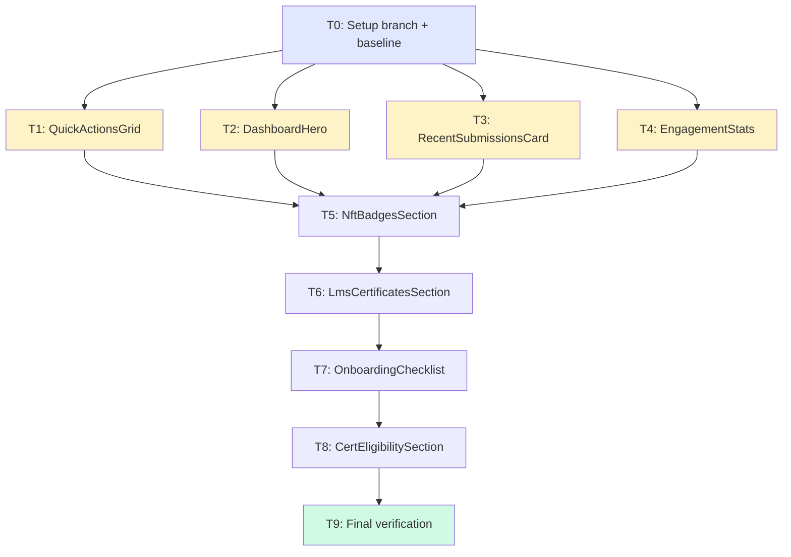
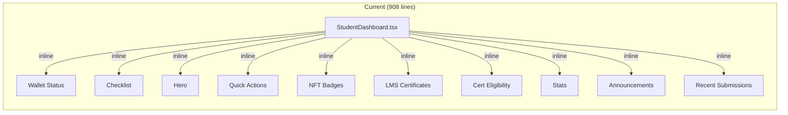
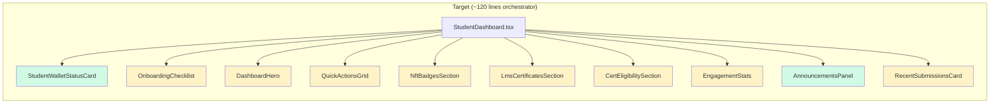
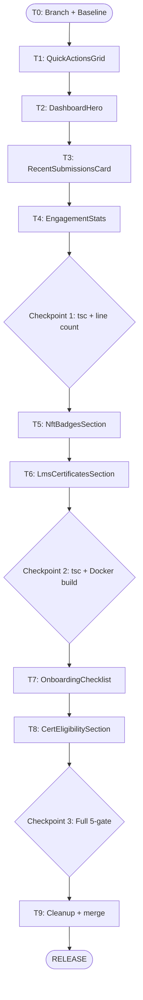
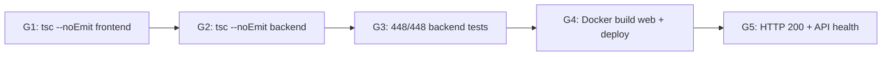

# Phase 8 C1 Implementation Plan: StudentDashboard Refactor

**Date:** 2026-08-04
**Status:** IMPLEMENTATION PLAN READY
**Spec:** `docs/superpowers/specs/2026-08-04-phase8-c1-dashboard-refactor-design.md`
**Baseline:** 448/448 tests, tsc clean, `phase7-c3-complete-2026-08-04`

---

## Session Kickoff

**Objective:** Break `StudentDashboard.tsx` (908 lines) into an ~120-line orchestrator + 8 sub-components in `components/dashboard/`, with zero behavioural changes.

**Skills applied:**
- **writing-plans** — this document
- **using-git-worktrees** — feature branch `feat/phase8-c1-dashboard-refactor`
- **test-driven-development** — regression gates before/after each extraction
- **systematic-debugging** — failure modes enumerated, checks embedded in plan
- **verification-before-completion** — final 5-gate verification
- **requesting-code-review** — review checkpoints at T3, T6, T9

---

## Execution Board

### Task Table

| Task | Goal | Files Touched | Est. Lines | Parallel-Safe | Verification |
|------|------|---------------|-----------|---------------|-------------|
| T0 | Setup: branch, baseline, safety tag | — | 0 | N/A | 448/448, tsc clean |
| T1 | Extract QuickActionsGrid | +QuickActionsGrid.tsx, ~StudentDashboard.tsx | ~80 new | Yes (with T2-T4) | tsc clean |
| T2 | Extract DashboardHero | +DashboardHero.tsx, ~StudentDashboard.tsx | ~70 new | Yes (with T1,T3,T4) | tsc clean |
| T3 | Extract RecentSubmissionsCard | +RecentSubmissionsCard.tsx, ~StudentDashboard.tsx | ~90 new | Yes (with T1,T2,T4) | tsc clean |
| T4 | Extract EngagementStats | +EngagementStats.tsx, ~StudentDashboard.tsx | ~70 new | Yes (with T1-T3) | tsc clean |
| T5 | Extract NftBadgesSection | +NftBadgesSection.tsx, ~StudentDashboard.tsx | ~40 new | Sequential after T1-T4 | tsc clean |
| T6 | Extract LmsCertificatesSection | +LmsCertificatesSection.tsx, ~StudentDashboard.tsx | ~70 new | Sequential after T5 | tsc clean, checkpoint review |
| T7 | Extract OnboardingChecklist | +OnboardingChecklist.tsx, ~StudentDashboard.tsx | ~80 new | Sequential after T6 | tsc clean |
| T8 | Extract CertEligibilitySection | +CertEligibilitySection.tsx, ~StudentDashboard.tsx | ~220 new | Sequential after T7 | tsc clean |
| T9 | Final verification + cleanup | ~StudentDashboard.tsx (cleanup) | ~0 | N/A | Full 5-gate |

### Dependencies



### Parallelization Notes

**T1-T4 are parallel-safe** if executed by separate subagents, each owning only their new file. However, all four modify `StudentDashboard.tsx`, which creates merge conflicts if done simultaneously. Therefore:

**Recommended execution: Sequential within a single agent.** Each extraction is small (5-10 min), and the cumulative edit to StudentDashboard.tsx must be applied in order. The total wall-clock for T1-T4 is ~20 min — parallelization would save little and risk merge conflicts.

**Alternative:** T1-T4 could be done in one commit (batch extraction of the 4 stateless components), since they don't interact with each other. This is acceptable if the implementer is confident in all 4 simultaneously.

---

## Architecture Diagrams

### Current vs Target





Green = already extracted. Yellow = new extractions.

### Extraction Sequence Flow



### Verification Gate Flow



---

## Task-by-Task Details

### T0: Setup Branch + Baseline

**Goal:** Create feature branch, verify baseline, create safety tag.

**Steps:**
1. `git checkout -b feat/phase8-c1-dashboard-refactor`
2. Run backend tests: `cd LMS-Server && npx vitest run` → expect 448/448
3. Run frontend tsc: `cd LMS-Frontend && npx tsc --noEmit` → expect clean
4. Run backend tsc: `cd LMS-Server && npx tsc --noEmit` → expect clean
5. `git tag pre-phase8-c1-2026-08-04`
6. `mkdir -p LMS-Frontend/src/components/dashboard`

**Exit criteria:** 448/448, tsc clean (both), safety tag created, directory exists.

---

### T1: Extract QuickActionsGrid

**Goal:** Move the quick actions grid (lines 487-519 + array definition 316-365) into a self-contained component.

**New file:** `LMS-Frontend/src/components/dashboard/QuickActionsGrid.tsx`

**What moves:**
- `quickActions` array constant (lines 316-365)
- Quick actions `<section>` JSX (lines 487-519)
- Imports: `useNavigate`, `BookOpen`, `ClipboardList`, `Upload`, `Library`, `Mail`, `MessageCircle`, `ArrowRight`

**Props:** None. Component calls `useNavigate()` internally.

**What stays in orchestrator:** Nothing from this section.

**Removal from StudentDashboard.tsx:**
- Delete `quickActions` array
- Replace JSX block with `<QuickActionsGrid />`
- Remove lucide imports that are now only used by QuickActionsGrid (careful: some icons like `ArrowRight` are used elsewhere)

**Risk:** `ArrowRight` is used in both Hero and QuickActionsGrid. Only remove from StudentDashboard imports if no other section uses it. Check: Hero also uses `ArrowRight` — but Hero will be extracted in T2. Keep the import until T2 is done, or leave it (tsc will catch unused imports only with `noUnusedLocals`, which may not be enabled).

**Verification:** `cd LMS-Frontend && npx tsc --noEmit`

---

### T2: Extract DashboardHero

**Goal:** Move the hero section (lines 442-484) + greeting/daily-line helpers (lines 42-62) into a component.

**New file:** `LMS-Frontend/src/components/dashboard/DashboardHero.tsx`

**What moves:**
- `greetingForHour()` function (lines 42-46)
- `DAY_LINES` constant (lines 48-56)
- `pickDailyLine()` function (lines 58-62)
- Hero `<section>` JSX (lines 442-484)
- Imports: `useNavigate`, `Sparkles`, `ArrowRight`, `Button`

**Props:**
```typescript
interface DashboardHeroProps {
  userName: string;
  engagementHint: { text: string; icon: React.ComponentType<{ className?: string }> };
}
```

**Computed internally:** `greeting` (from `greetingForHour`), `dailyLine` (from `pickDailyLine`), `firstName` (from `userName`).

**What stays in orchestrator:** `engagementHint` useMemo (depends on submissions + quizPassed).

**Verification:** `cd LMS-Frontend && npx tsc --noEmit`

---

### T3: Extract RecentSubmissionsCard

**Goal:** Move the recent submissions card (lines 839-903) into a component.

**New file:** `LMS-Frontend/src/components/dashboard/RecentSubmissionsCard.tsx`

**What moves:**
- Recent submissions `<Card>` JSX (lines 839-903)
- Imports: `useNavigate`, `Card`, `CardContent`, `CardTitle`, `Button`, `Upload`, `CheckCircle`, `XCircle`, `Clock`, `ArrowRight`

**Props:**
```typescript
interface RecentSubmissionsCardProps {
  submissions: Submission[];
}
```

**Type import:** `Submission` from `../../types` or `../../types/api` (check which one StudentDashboard currently uses — it uses `useData()` which returns submissions from DataContext; the type is from `../types/index.ts`).

**Verification:** `cd LMS-Frontend && npx tsc --noEmit`

---

### T4: Extract EngagementStats

**Goal:** Move the stats section (lines 803-834 + stats array definition 281-314 + count computations 249-254) into a component.

**New file:** `LMS-Frontend/src/components/dashboard/EngagementStats.tsx`

**What moves:**
- Count computations: `pendingCount`, `approvedCount`, `rejectedCount`, `quizTaken`, `quizPassed` (lines 249-254)
- `stats` array (lines 281-314)
- Stats `<section>` JSX (lines 803-834)
- Imports: `useMemo`, `FileText`, `Clock`, `CheckCircle`, `ClipboardList`, `XCircle`, `Card`, `CardContent`

**Props:**
```typescript
interface EngagementStatsProps {
  submissions: Submission[];
  quizCompletions: QuizCompletion[] | null;
}
```

**Important:** `quizPassed` is also used by the orchestrator for `engagementHint` and `OnboardingChecklist`. Two options:
1. Compute `quizPassed` in both the orchestrator and EngagementStats (trivial computation, no perf concern)
2. Have the orchestrator compute it once and pass it as a prop

**Decision:** Option 1 — duplicating `(quizCompletions ?? []).filter(c => c.passed).length` is simpler than adding a prop, and keeps EngagementStats self-contained for its own display logic. The orchestrator keeps its own `quizPassed` useMemo for the engagement hint and checklist.

**Verification:** `cd LMS-Frontend && npx tsc --noEmit`

**Checkpoint 1:** After T4, verify:
- tsc clean
- `StudentDashboard.tsx` has shrunk by ~300 lines
- All 4 new files exist in `components/dashboard/`

---

### T5: Extract NftBadgesSection

**Goal:** Move the NFT badges section (lines 522-533) + NFT useEffect (lines 113-134) + state (line 97) into a component.

**New file:** `LMS-Frontend/src/components/dashboard/NftBadgesSection.tsx`

**What moves:**
- `nftBadges` useState (line 97)
- NFT loading useEffect (lines 113-134)
- NFT badges `<section>` JSX (lines 522-533)
- `nftTokens` derivation (line 260)
- Imports: `getUserNfts`, `NftCard`, `NFTResponse` type

**Props:**
```typescript
interface NftBadgesSectionProps {
  walletAddress: string | null | undefined;
}
```

**State owned by component:** `nftBadges: NFTResponse | null`

**Why `walletAddress` as prop?** The component needs the wallet address to call `getUserNfts()`. Passing it as a prop avoids importing `useAuth()` and keeps the component testable.

**useEffect dependency note:** Current code has `[user, getUserNfts]` as deps. The component should use `[walletAddress]` since `getUserNfts` is a stable module-level import (not a hook value). This is a correctness improvement that doesn't change behaviour.

**Verification:** `cd LMS-Frontend && npx tsc --noEmit`

---

### T6: Extract LmsCertificatesSection

**Goal:** Move the LMS certificates section (lines 536-595) + credentials useEffect (lines 154-172) + state (lines 98-99) into a component.

**New file:** `LMS-Frontend/src/components/dashboard/LmsCertificatesSection.tsx`

**What moves:**
- `lmsCredentials` + `lmsCredentialsError` useState (lines 98-99)
- Credentials loading useEffect (lines 154-172)
- LMS certificates `<section>` JSX (lines 536-595)
- Imports: `useAuth`, `courseCompletionService`, `MyCredential` type, `AlertCircle`, `Award`, `ExternalLink`

**Props:** None — reads `user` from `useAuth()` internally.

**Conditional render:** Returns `null` if no credentials and no error (preserves existing behaviour where the section is hidden when empty).

**State owned by component:** `lmsCredentials`, `lmsCredentialsError`

**Verification:** `cd LMS-Frontend && npx tsc --noEmit`

**Checkpoint 2:** After T6, run:
- `cd LMS-Frontend && npx tsc --noEmit` (clean)
- `cd LMS-Server && npx tsc --noEmit` (clean)
- `docker compose build web` (success)
- `StudentDashboard.tsx` should be ~400 lines (half done)

---

### T7: Extract OnboardingChecklist

**Goal:** Move the checklist section (lines 389-439) + checklist logic (lines 209-279) + state (line 107) into a component.

**New file:** `LMS-Frontend/src/components/dashboard/OnboardingChecklist.tsx`

**What moves:**
- `checklistDismissed` useState (line 107)
- Checklist localStorage useEffect (lines 209-213)
- `handleDismissChecklist` handler (lines 215-219)
- `checklistSteps` definition (lines 272-278) — **BUT** the step conditions are now computed from props, not from local state
- `checklistAllDone` derivation (line 279)
- Checklist `<section>` JSX (lines 389-439)
- Imports: `Sparkles`, `CheckCircle`, `X`

**Props:**
```typescript
interface OnboardingChecklistProps {
  userId: string;         // needed for localStorage key
  walletConnected: boolean;
  enrolled: boolean;
  hasCompletedLesson: boolean;
  quizPassed: boolean;
  hasApplied: boolean;
}
```

**Note:** Spec had 5 boolean props. Adding `userId` because `localStorage.getItem(\`lms_checklist_dismissed_${user.id}\`)` needs the user ID. The orchestrator passes `user.id`.

**State owned by component:** `checklistDismissed`

**Returns `null`** when dismissed (same as current conditional render).

**Verification:** `cd LMS-Frontend && npx tsc --noEmit`

---

### T8: Extract CertEligibilitySection

**Goal:** Move the certificate eligibility section (lines 598-800) + cert handlers (lines 221-247) + cert state (lines 103-105) + CERT_STATE_MSGS constant (lines 64-90) into a component.

**New file:** `LMS-Frontend/src/components/dashboard/CertEligibilitySection.tsx`

**This is the largest extraction (~220 lines).**

**What moves:**
- `CERT_STATE_MSGS` constant (lines 64-90)
- `certState` + `certErrors` useState (lines 103-105)
- `handleApplyCertificate` handler (lines 221-247) — modified to call `onAppStatusChange` prop
- Cert eligibility `<section>` JSX (lines 598-800) + skeleton guard
- Imports: `courseCompletionService`, `CertEligibilitySkeleton`, `Link`, `Button`, `CheckCircle`, `XCircle`, `Clock`, `Award`, `AlertCircle`, `MessageCircle`, `ExternalLink`, plus types `Course`, `CourseProgress`, `NftApplication`

**Props (per D1 decision):**
```typescript
interface CertEligibilitySectionProps {
  user: { walletAddress: string | null } | null;  // for wallet mismatch check
  courses: Course[];
  coursesLoading: boolean;
  progressMap: Record<string, CourseProgress>;
  appStatusMap: Record<string, NftApplication | null>;
  onAppStatusChange: (courseId: string, app: NftApplication) => void;
}
```

**Note:** Added `user` prop (just the walletAddress subset) because the cert eligibility section checks `user?.walletAddress` for the wallet mismatch warning (lines 699-712). Alternatively, the component could call `useAuth()` directly — but since the orchestrator already has `user`, passing the needed field keeps the component more testable.

**State owned by component:** `certState`, `certErrors` (UI-only button state)

**`handleApplyCertificate` modification:** After a successful apply, call `onAppStatusChange(courseId, newApp)` so the orchestrator can update `appStatusMap` (which feeds into OnboardingChecklist). On 409 conflict, also re-fetch and call `onAppStatusChange`. This preserves the exact same behaviour.

**Returns `null`** when `courses.length === 0` and not loading.

**Verification:** `cd LMS-Frontend && npx tsc --noEmit`

---

### T9: Final Verification + Cleanup

**Goal:** Full 5-gate verification, import cleanup, line count check, commit, merge.

**Steps:**

1. **Import cleanup:** Review `StudentDashboard.tsx` for any unused imports (lucide icons, types, services that are now only used by sub-components)

2. **Line count check:** `wc -l LMS-Frontend/src/pages/StudentDashboard.tsx` → expect ≤150

3. **Component size check:** `wc -l LMS-Frontend/src/components/dashboard/*.tsx` → expect each ≤250

4. **Gate G1:** `cd LMS-Frontend && npx tsc --noEmit` → clean

5. **Gate G2:** `cd LMS-Server && npx tsc --noEmit` → clean

6. **Gate G3:** `cd LMS-Server && npx vitest run` → 448/448

7. **Gate G4:** `docker compose build web && docker compose up -d --no-deps web`

8. **Gate G5:**
   - `curl -s https://lms.smwebsystems.com/ -o /dev/null -w '%{http_code}'` → 200
   - `curl -s https://lms.smwebsystems.com/api/v1/health | jq .` → `{"status":"ok","db":"ok"}`

9. **Git operations:**
   - Commit all changes on feature branch
   - `git checkout main && git merge --ff-only feat/phase8-c1-dashboard-refactor`
   - `git tag phase8-c1-complete-2026-08-04`
   - Push main + tags

---

## Systematic Debugging: Failure Modes

| # | Failure Mode | Symptom | Check Built Into |
|---|-------------|---------|-----------------|
| F1 | Missing import in sub-component | tsc error: "Cannot find name..." | Every task runs tsc |
| F2 | Orphaned import in orchestrator | tsc warning (if noUnusedLocals) or dead code | T9 import cleanup |
| F3 | Wrong relative import path | tsc error: "Cannot find module..." | Every task runs tsc |
| F4 | Lost CSS class during copy | Visual regression | T9 QA checklist |
| F5 | Prop type mismatch | tsc error: "Type X is not assignable..." | Every task runs tsc |
| F6 | Missing `useNavigate` in sub-component | Runtime error on click | T9 QA: click quick actions |
| F7 | Broken cert apply flow | 409 not handled, checklist not updating | T9 QA: cert apply test |
| F8 | Checklist localStorage key wrong | Checklist reappears after dismiss | T9 QA: dismiss + reload |
| F9 | `getUserNfts` dep array issue | NFTs not loading or infinite re-render | T9 QA: check NFT section |
| F10 | Circular import | Runtime crash or tsc error | dashboard/ never imports from pages/ |

---

## To-Do Lists

### Planning Checklist
- [x] Read spec in full
- [x] Verify baseline (448/448, tsc clean)
- [x] Identify all state hooks and their section ownership
- [x] Identify cross-section dependencies (checklist)
- [x] Confirm D1 decision (orchestrator owns course fetch)
- [x] Define prop interfaces for all 8 components
- [x] Determine extraction order (safest first)
- [x] Identify parallel-safe vs sequential tasks
- [x] Write implementation plan

### Implementation Checklist
- [ ] T0: Create branch + safety tag + dashboard/ directory
- [ ] T1: Extract QuickActionsGrid
- [ ] T2: Extract DashboardHero
- [ ] T3: Extract RecentSubmissionsCard
- [ ] T4: Extract EngagementStats
- [ ] Checkpoint 1: tsc + line count
- [ ] T5: Extract NftBadgesSection
- [ ] T6: Extract LmsCertificatesSection
- [ ] Checkpoint 2: tsc + Docker build
- [ ] T7: Extract OnboardingChecklist
- [ ] T8: Extract CertEligibilitySection
- [ ] T9: Final verification + merge

### Test Checklist
- [ ] Backend tests 448/448 (T0 baseline + T9 final)
- [ ] Frontend tsc clean after each extraction (T1-T8)
- [ ] Backend tsc clean (T6 checkpoint + T9 final)
- [ ] Docker build web succeeds (T6 checkpoint + T9 final)

### QA Checklist (T9)
| ID | Check | Expected |
|----|-------|----------|
| QA-01 | Dashboard loads for student | All sections visible in correct order |
| QA-02 | Quick action cards navigate | Each card goes to correct route |
| QA-03 | Hero greeting correct | Time-appropriate greeting + user name |
| QA-04 | Engagement hint displays | Context-appropriate hint text |
| QA-05 | NFT badges load (wallet user) | NFT cards or "No NFT badges yet" |
| QA-06 | LMS certificates show (if any) | Certificate cards with Stellar links |
| QA-07 | Cert eligibility shows progress | Per-course progress bars + status badges |
| QA-08 | Cert apply button works | Eligible → Pending transition |
| QA-09 | Checklist steps reflect real state | Green checks for completed steps |
| QA-10 | Checklist dismiss persists | Dismiss, reload → stays hidden |
| QA-11 | Stats show correct counts | Submissions, pending, approved, quizzes |
| QA-12 | Recent submissions list | Top 5 with status badges |
| QA-13 | Announcements panel renders | AnnouncementsPanel visible |
| QA-14 | Wallet status card renders | StudentWalletStatusCard visible |
| QA-15 | No console errors | DevTools console clean |

### Review Checklist
- [ ] Spec compliance: all 8 components extracted per spec
- [ ] Code review: no behavioural changes, clean imports, correct props
- [ ] Regression review: 448/448 + tsc + Docker + HTTP 200 + API health
- [ ] Line count: orchestrator ≤150, each component ≤250
- [ ] Branch review: clean merge to main

---

## /loop Workflow

### /loop assess
```
Phase 8 C1 assessment:
- Spec: READY (docs/superpowers/specs/2026-08-04-phase8-c1-dashboard-refactor-design.md)
- Plan: READY (this document)
- Baseline: 448/448 tests, tsc clean
- Scope: 1 modified file + 8 new files, zero behaviour change
- Risk: LOW (pure structural refactor, tsc catches all import/type issues)
```

### /loop plan
```
Extraction order: T0 setup → T1-T4 stateless (batch) → T5-T6 stateful simple →
T7-T8 cross-cutting → T9 final gate
Total tasks: 10 (T0-T9)
Checkpoints: 3 (after T4, T6, T9)
```

### /loop review
```
Review gates:
1. After T4 (Checkpoint 1): tsc + line count — lightweight code review
2. After T6 (Checkpoint 2): tsc + Docker build — mid-point review
3. After T8/T9 (Checkpoint 3): Full 5-gate + QA checklist — final review
```

### /loop execute
```
Execute T0-T9 sequentially in a single session.
Each task: create file → copy code → wire props → remove from orchestrator → tsc verify.
Commit strategy: one commit per checkpoint (3 commits total on feature branch).
```

---

## Commit Strategy

| Commit | Tasks | Message |
|--------|-------|---------|
| 1 | T1-T4 | `refactor: extract stateless dashboard components (QuickActionsGrid, DashboardHero, RecentSubmissionsCard, EngagementStats)` |
| 2 | T5-T6 | `refactor: extract stateful dashboard components (NftBadgesSection, LmsCertificatesSection)` |
| 3 | T7-T8 | `refactor: extract cross-cutting dashboard components (OnboardingChecklist, CertEligibilitySection)` |
| 4 | T9 | `refactor: cleanup orchestrator imports + final verification` (may be squashed with commit 3) |

---

## Branch Strategy

- **Branch:** `feat/phase8-c1-dashboard-refactor` from `main`
- **Safety tag:** `pre-phase8-c1-2026-08-04` on `main` before any work
- **Merge:** Fast-forward to `main` after all gates pass
- **Release tag:** `phase8-c1-complete-2026-08-04`
- **Rollback:** `git revert <merge-commit>` + rebuild web container

---

## Spec Corrections Identified During Planning

1. **OnboardingChecklist needs `userId` prop** — the localStorage key is `lms_checklist_dismissed_${user.id}`, so the component needs the user ID. Added to props interface.

2. **CertEligibilitySection needs `user.walletAddress` prop** — the wallet mismatch warning (lines 699-712) checks `user?.walletAddress`. Added to props interface as `{ walletAddress: string | null }`.

3. **`Submission` type import path** — DataContext returns `Submission` from `../types/index.ts` (not `../types/api.ts`). Both define the same interface; sub-components should import from whichever DataContext uses.

---

## Final Recommendation

**Status: IMPLEMENTATION PLAN READY**

**Evidence:**
- Spec fully read and validated
- All 10 tasks defined with file ownership, props, and verification
- Extraction order follows risk gradient (stateless → stateful → cross-cutting)
- 3 checkpoints with escalating verification
- Failure modes enumerated with built-in checks
- Commit and branch strategy defined

**Exact next action:**
Execute T0 (create branch `feat/phase8-c1-dashboard-refactor`, verify baseline, create safety tag, create `components/dashboard/` directory), then proceed through T1-T9 sequentially.
