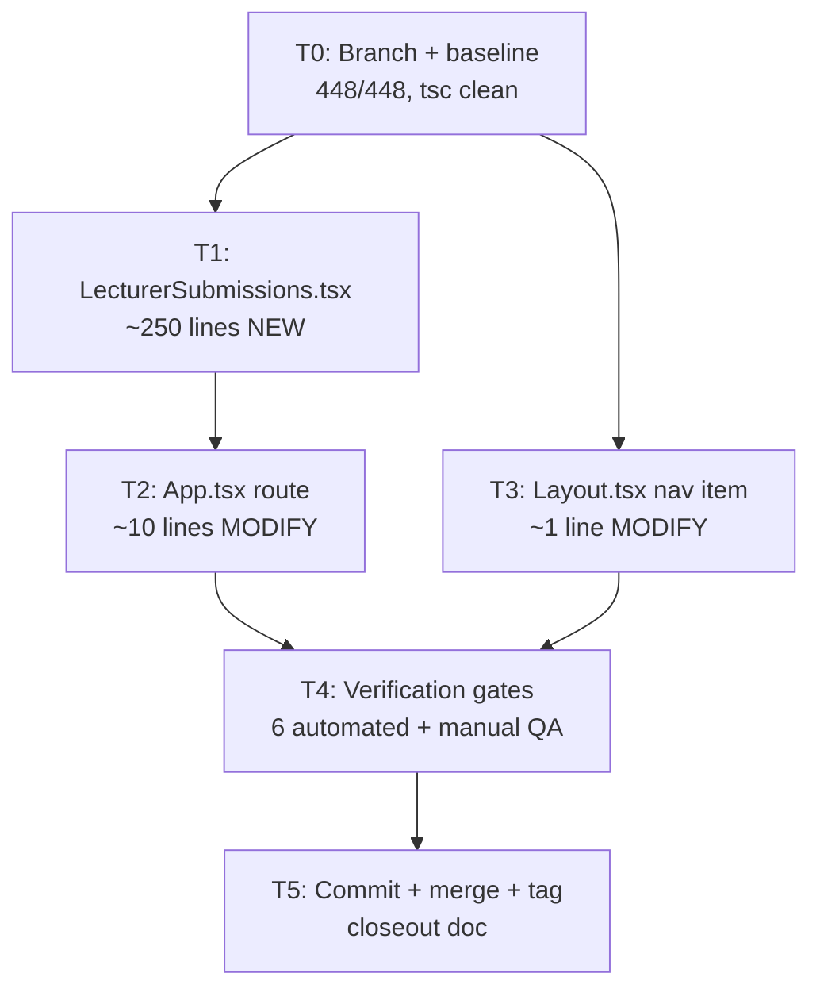
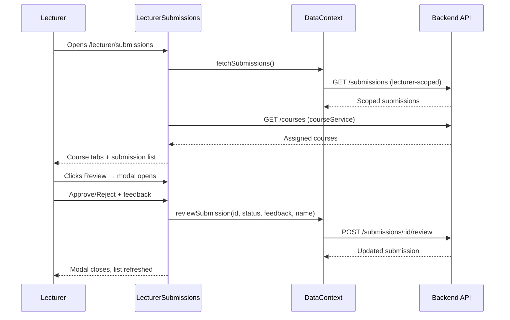
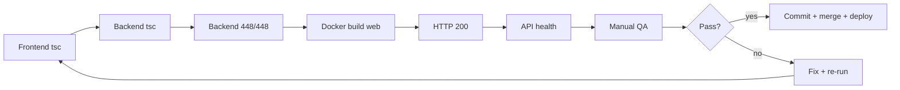

# Phase 8 C2 Implementation Plan: Lecturer Submission Review

**Date:** 2026-08-04
**Status:** PLAN READY
**Spec:** `docs/superpowers/specs/2026-08-04-phase8-c2-lecturer-submission-review-design.md`
**Baseline:** 448/448 tests, tsc clean, Phase 8 C1 complete

---

## Execution Board

### Task Table

| Task | Goal | Files Touched | Est. Lines | Parallel-Safe | Verification |
|------|------|---------------|-----------|---------------|-------------|
| T0 | Branch + baseline | — | 0 | N/A (first) | 448/448, tsc clean |
| T1 | Create LecturerSubmissions.tsx | `pages/LecturerSubmissions.tsx` (NEW) | ~250 | Yes (standalone) | Frontend tsc |
| T2 | Add route in App.tsx | `App.tsx` | ~10 | No (depends on T1) | Frontend tsc |
| T3 | Add nav item in Layout.tsx | `components/Layout.tsx` | ~1 | Yes (independent of T1) | Frontend tsc |
| T4 | Full verification + deploy | — | 0 | No (depends on T1-T3) | All 6 gates |
| T5 | Commit + merge + tag | — | 0 | No (depends on T4) | Push + closeout |

### Dependencies

```
T0 → T1 ──→ T2 ──→ T4 → T5
T0 → T3 ─────────↗
```

T1 and T3 are parallel-safe (different files, no shared state). T2 depends on T1 (imports the component). T4 depends on all code tasks.

### Parallelization Notes

- **T1 + T3 can run in parallel** — T1 creates the page, T3 adds the nav link. No file overlap.
- **T2 must follow T1** — `App.tsx` imports `LecturerSubmissions` which must exist first.
- In practice, all 3 code tasks (T1-T3) are small enough to run sequentially in one pass.

---

## Mermaid Diagrams

### Task Dependency Flow



### Lecturer Review Data Flow



### Verification Gate Flow



---

## Task Details

### T0: Branch Setup + Baseline Verification

**Goal:** Create feature branch, verify baseline is clean.

**Steps:**
1. Create branch `feat/phase8-c2-lecturer-submissions` from `main`
2. Run baseline verification:
   - `cd LMS-Frontend && npx tsc --noEmit` → clean
   - `cd LMS-Server && npx tsc --noEmit` → clean
   - `cd LMS-Server && npx vitest run` → 448/448
3. Create safety tag `pre-phase8-c2-2026-08-04` on main

**Exit criteria:** Branch exists, baseline verified, safety tag created.

---

### T1: Create LecturerSubmissions.tsx (~250 lines)

**Goal:** Build the lecturer submission review page.

**File:** `LMS-Frontend/src/pages/LecturerSubmissions.tsx` (NEW)

**Structure (top to bottom):**

```
Imports
  - React, useState, useEffect, useMemo
  - useAuth from context/useAuth
  - useData from context/DataContext
  - courseService from services/courseService
  - UI components: Card, CardContent, CardTitle, Button, TextArea, Modal
  - Icons: FileText, CheckCircle, XCircle, Clock, Eye, Download, Loader2, BookOpen, AlertCircle
  - Submission type from types/api
  - getErrorMessage from utils/apiError

StatusBadge helper (~8 lines)
  - Rewrite locally (do NOT import from AdminSubmissions — keep files independent)
  - Same pattern: approved=green, rejected=red, pending=amber

fmtSize helper (~4 lines)
  - Same as AdminSubmissions — bytes → human-readable

LecturerSubmissions component (~235 lines)
  State:
    - courses: CourseItem[] (from courseService)
    - coursesLoading: boolean
    - selectedCourseId: string (default: '' → set to first course on load)
    - reviewingSubmission: Submission | null
    - feedback: string
    - reviewing: boolean
    - reviewError: string

  From DataContext:
    - submissions, submissionsLoading, submissionsError
    - fetchSubmissions, reviewSubmission, downloadSubmission

  From useAuth:
    - user (for user.name in review call)

  useEffect: fetch data on mount
    - fetchSubmissions()
    - courseService.fetchCourses() → setCourses, set selectedCourseId to first

  useMemo: filteredSubmissions
    - Filter submissions by selectedCourseId (match submission.courseId)
    - If no courseId selected, show empty

  Handlers:
    - handleReview(sub) → set reviewingSubmission, pre-fill feedback
    - handleApprove() → reviewSubmission(id, 'approved', feedback, user.name)
    - handleReject() → validate feedback non-empty, then reviewSubmission(id, 'rejected', ...)
    - handleDownload(id) → downloadSubmission(id)

  Render:
    1. Header: "Submission Review" h1 + subtitle
    2. Error banner (if submissionsError or coursesError)
    3. Loading state (if either loading)
    4. Empty state: no courses → "No courses assigned yet." (BookOpen icon)
    5. Course filter tabs (pill buttons, matching AdminSubmissions)
    6. Submissions list (Card with table):
       - Empty: "No submissions for this course yet." (FileText icon)
       - Table: Student | Submission | File | Status | Date | Actions
       - Actions: Review button + Download button (NO delete)
    7. Review Modal (adapted from AdminSubmissions lines 413-451):
       - Grid: student name, submitted date, title, status
       - Description
       - File info + download button
       - Feedback TextArea
       - Existing review info (if reviewedBy)
       - Error display
       - Cancel / Reject / Approve buttons
```

**Spec compliance notes:**
- No delete button (spec: "Lecturers should not delete student work")
- No "all submissions" tab (spec: "lecturer scope is always course-bound")
- Client-side filtering by courseId (spec: "Filter submissions client-side")
- Feedback required for rejection (spec EC-5)
- Pre-fill feedback for already-reviewed submissions (spec EC-2)

**Exit criteria:** File created, frontend tsc clean.

---

### T2: Add Route in App.tsx (~10 lines)

**Goal:** Register `/lecturer/submissions` route.

**File:** `LMS-Frontend/src/App.tsx`

**Changes:**
1. Add import at line ~32 (after LecturerCourseStudents import):
   ```tsx
   import LecturerSubmissions from './pages/LecturerSubmissions';
   ```

2. Add route block after `/lecturer/courses/:courseId` route (after line ~400):
   ```tsx
   <Route
     path="/lecturer/submissions"
     element={
       <ProtectedRoute allowedRole="lecturer">
         <Layout>
           <LecturerSubmissions />
         </Layout>
       </ProtectedRoute>
     }
   />
   ```

**Edit locations (exact):**
- Import: after line 32 (`import LecturerCourseStudents`)
- Route: after the `/lecturer/courses/:courseId` route block (line ~399)

**Exit criteria:** Frontend tsc clean, route registered.

---

### T3: Add Nav Item in Layout.tsx (~1 line)

**Goal:** Add "Submissions" link to lecturer sidebar.

**File:** `LMS-Frontend/src/components/Layout.tsx`

**Change:** Insert one line between Dashboard and Messages in the lecturer nav array (line 84-86):

**Before:**
```tsx
? [
    { name: 'Dashboard', path: '/lecturer', icon: LayoutDashboard },
    { name: 'Messages', path: '/lecturer/messages', icon: Mail },
    { name: 'Profile', path: '/lecturer/profile', icon: User },
  ]
```

**After:**
```tsx
? [
    { name: 'Dashboard', path: '/lecturer', icon: LayoutDashboard },
    { name: 'Submissions', path: '/lecturer/submissions', icon: FileText },
    { name: 'Messages', path: '/lecturer/messages', icon: Mail },
    { name: 'Profile', path: '/lecturer/profile', icon: User },
  ]
```

**Note:** `FileText` icon is already imported in Layout.tsx (line 8).

**Exit criteria:** Frontend tsc clean, nav item visible.

---

### T4: Full Verification + Deploy

**Goal:** Run all 6 automated gates, deploy, verify live.

**Steps (sequential):**

1. **Frontend tsc:** `cd LMS-Frontend && npx tsc --noEmit` → clean
2. **Backend tsc:** `cd LMS-Server && npx tsc --noEmit` → clean
3. **Backend tests:** `cd LMS-Server && npx vitest run` → 448/448
4. **Docker build:** `docker compose build web` → exit 0
5. **Deploy:** `docker compose up -d --no-deps web`
6. **HTTP 200:** `curl -s -o /dev/null -w '%{http_code}' http://localhost` → 200
7. **API health:** `curl -s http://localhost/api/v1/health` → `ok` + `db: ok`

**Failure mode checks (from spec FM-1 through FM-5):**
- If tsc fails: fix type errors in LecturerSubmissions.tsx
- If backend tests regress: investigate (should not happen — no backend changes)
- If Docker build fails: check Vite build errors in LecturerSubmissions.tsx
- If HTTP 200 fails: check container logs

**Exit criteria:** All 6 gates pass, site is live.

---

### T5: Commit + Merge + Tag + Closeout

**Goal:** Single commit, merge to main, tag, push, write closeout.

**Steps:**
1. Stage all changed files:
   - `LMS-Frontend/src/pages/LecturerSubmissions.tsx` (new)
   - `LMS-Frontend/src/App.tsx` (modified)
   - `LMS-Frontend/src/components/Layout.tsx` (modified)
2. Commit with descriptive message
3. Switch to main, fast-forward merge
4. Tag `phase8-c2-complete-2026-08-04`
5. Push to remote
6. Write closeout doc: `docs/superpowers/plans/2026-08-04-phase8-c2-closeout.md`
7. Commit and push closeout

**Exit criteria:** Tag exists, main updated, closeout doc committed.

---

## Review Checkpoints

### RC-1: After T1 (LecturerSubmissions.tsx created)
- [ ] File follows spec functional behavior exactly
- [ ] No delete button (spec non-goal)
- [ ] No "all submissions" tab (spec: course-scoped only)
- [ ] StatusBadge is local (not imported from AdminSubmissions)
- [ ] Review modal matches spec AC-3
- [ ] Empty states match spec AC-6
- [ ] Error handling matches spec error states table
- [ ] Frontend tsc clean

### RC-2: After T2+T3 (Route + Nav)
- [ ] `/lecturer/submissions` route is behind ProtectedRoute with `allowedRole="lecturer"`
- [ ] Nav item is between Dashboard and Messages
- [ ] Nav uses `FileText` icon (already imported)
- [ ] Frontend tsc clean

### RC-3: After T4 (Full verification)
- [ ] All 6 automated gates pass
- [ ] No regressions (AdminSubmissions untouched, backend tests unchanged)
- [ ] Site is live and accessible

---

## Implementation Sequence (Single Session)

The plan is small enough to execute in one session, sequentially:

```
1. T0: Branch + baseline (3 min)
2. T1: Write LecturerSubmissions.tsx (main work)
3. T2: Add App.tsx route
4. T3: Add Layout.tsx nav item
5. Run frontend tsc (catch errors early)
6. T4: Full verification (backend tsc, tests, docker, deploy)
7. T5: Commit + merge + tag + closeout
```

No subagent parallelization needed — total is ~261 lines across 3 files. Sequential execution with one tsc check after T1-T3, then full gates.

---

## Failure Mode → Plan Response

| Failure Mode | Detection | Response |
|-------------|-----------|----------|
| FM-1: Wrong submissions visible | Manual QA | Trust backend — if wrong, it's a backend bug (out of scope) |
| FM-2: Wrong modal data | Manual QA | Check `reviewingSubmission` state binding |
| FM-3: 403 on review | Manual QA | Verify lecturer has `course_lecturers` row for the course |
| FM-4: Feedback not persisting | Manual QA | Check `feedback` is passed in review call body |
| FM-5: Admin regression | Manual QA | Verify AdminSubmissions.tsx is unchanged (git diff) |
| tsc error in new file | Automated gate | Fix type errors in LecturerSubmissions.tsx |
| Docker build failure | Automated gate | Check Vite/JSX compile errors |
| Backend test regression | Automated gate | Should not happen — no backend changes. Investigate if it does. |

---

## Rollback Plan

- **Pre-merge:** `git checkout main` (branch is isolated)
- **Post-merge:** `git revert <commit> && docker compose build web && docker compose up -d --no-deps web`
- **Safety tag:** `pre-phase8-c2-2026-08-04` on main before any changes
- **No data impact:** Frontend-only, no DB changes

---

## To-Do Lists

### Planning Checklist
- [x] Read C2 spec
- [x] Identify exact edit locations in App.tsx and Layout.tsx
- [x] Confirm imports available (FileText in Layout.tsx, types in api.ts)
- [x] Confirm DataContext functions available
- [x] Define task order and dependencies
- [x] Define verification gates
- [x] Define review checkpoints
- [x] Define failure mode responses
- [x] Define rollback plan

### Implementation Checklist
- [ ] T0: Create branch + verify baseline + safety tag
- [ ] T1: Create LecturerSubmissions.tsx
- [ ] T2: Add route in App.tsx
- [ ] T3: Add nav item in Layout.tsx
- [ ] T4: Run all 6 verification gates
- [ ] T5: Commit + merge + tag + push + closeout

### Test Checklist
- [ ] Frontend tsc clean (after T1-T3)
- [ ] Backend tsc clean
- [ ] Backend 448/448
- [ ] Docker build web exit 0
- [ ] HTTP 200
- [ ] API health ok + db ok

### QA Checklist
- [ ] Lecturer login → Submissions in sidebar
- [ ] Click Submissions → page loads with course tabs
- [ ] Course tab switching filters submissions
- [ ] Review modal opens with correct data
- [ ] Approve works (status updates)
- [ ] Reject without feedback → inline error
- [ ] Reject with feedback works
- [ ] Download works
- [ ] Empty state (no submissions) displays correctly
- [ ] Admin submissions page unaffected

### Review Checklist
- [ ] Scope: only 1 new file + 2 modifications
- [ ] No backend changes in the diff
- [ ] No AdminSubmissions.tsx changes
- [ ] All acceptance criteria (AC-1 through AC-7) addressable
- [ ] Rollback is single git revert

---

## /loop Workflow

### /loop assess
- Spec is READY at `docs/superpowers/specs/2026-08-04-phase8-c2-lecturer-submission-review-design.md`
- Baseline: 448/448 tests, tsc clean, Phase 8 C1 released
- Edit locations confirmed: App.tsx line ~32 + ~399, Layout.tsx line ~85
- All imports and types pre-exist

### /loop plan
- 6 tasks (T0-T5), sequential execution
- ~261 lines across 3 files (1 new, 2 modified)
- No parallelization needed (small scope)
- 6 automated verification gates + 10 manual QA checks

### /loop review
- Plan matches spec 1:1 (all user stories, acceptance criteria, edge cases addressed)
- No scope creep (no delete, no bulk, no backend, no new types)
- Failure modes have explicit responses
- Rollback plan is clear

### /loop execute
- Next step: invoke executing-plans skill with this plan
- Single session, sequential T0→T5
- Estimated: ~261 lines of code + verification

---

## IMPLEMENTATION PLAN STATUS: READY

**Next action:** Execute this plan in the next session using the executing-plans skill. Start with T0 (branch + baseline), proceed through T1-T3 (code changes), T4 (verification), T5 (commit + merge + tag + closeout).
