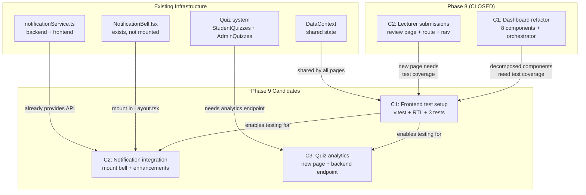
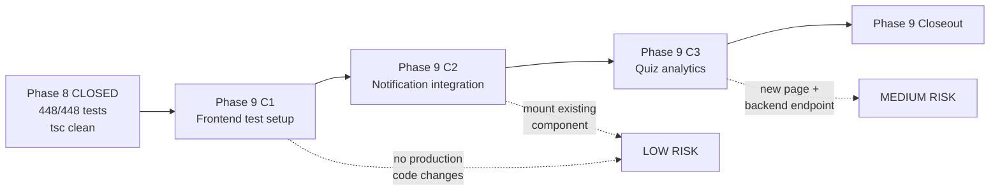
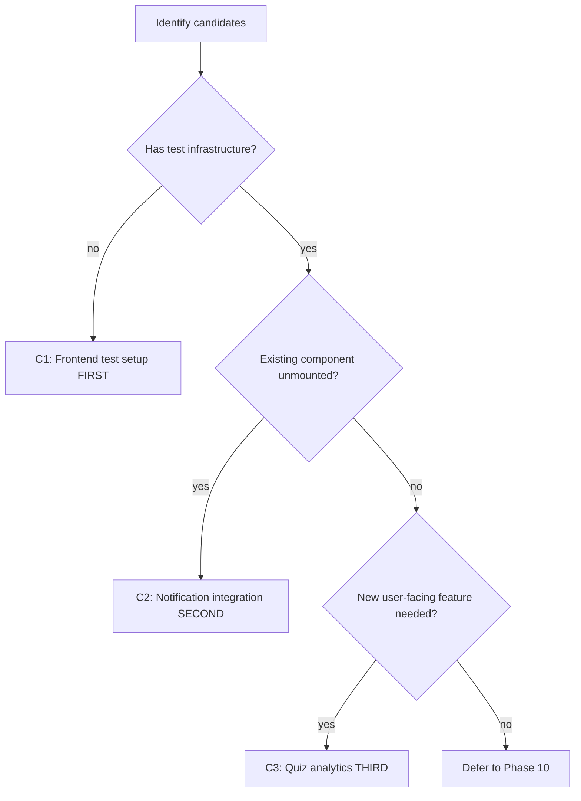
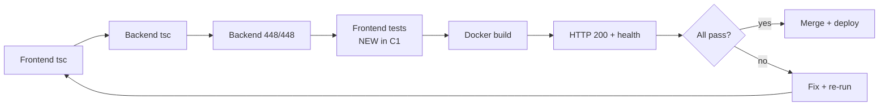

# Phase 8 Release Closeout & Phase 9 Planning Kickoff

**Date:** 2026-08-04
**Status:** PHASE 9 PLANNING READY
**Baseline:** 448/448 tests, tsc clean, all Phase 8 features deployed

---

## Phase 8 Release Closeout

### Shipped Features

| Release | Feature | Files | Lines | Tag |
|---------|---------|-------|-------|-----|
| C1 | StudentDashboard refactor (908→179 lines + 8 sub-components) | 9 (+978/-789) | 179 orchestrator + 918 components | `phase8-c1-complete-2026-08-04` |
| C2 | Lecturer submission review page | 4 (+304/-0) | 289 new page | `phase8-c2-complete-2026-08-04` |
| **Total** | **2 releases** | **13 files** | **+1282/-789 net** | |

### C1: StudentDashboard Refactor
- Decomposed 908-line monolith into orchestrator (179 lines) + 8 focused components
- Components: QuickActionsGrid, DashboardHero, RecentSubmissionsCard, EngagementStats, NftBadgesSection, LmsCertificatesSection, OnboardingChecklist, CertEligibilitySection
- 3 spec corrections applied (userId prop, walletAddress prop, unused pickDailyLine)

### C2: Lecturer Submission Review
- New `LecturerSubmissions.tsx` page (289 lines) with course tabs, submission table, review modal
- Route `/lecturer/submissions` + nav item in lecturer sidebar
- 1 spec correction: added missing `courseId/weekId/itemId` to `Submission` type
- Wires up existing backend `POST /submissions/:id/review` — zero backend changes

### Verification Summary (Both Releases)

| Gate | C1 | C2 |
|------|----|----|
| Frontend tsc | PASS | PASS |
| Backend tsc | PASS | PASS |
| Backend tests | 448/448 | 448/448 |
| Docker build | PASS | PASS |
| HTTP 200 | PASS | PASS |
| API health | PASS | PASS |

### Rollback Notes
- C1: `git revert 8c20ee2` — frontend-only, no data impact
- C2: `git revert 086ea7a` — frontend-only, no data impact
- Safety tags: `pre-phase8-c1-2026-08-04`, `pre-phase8-c2-2026-08-04`

### Manual QA Status
- **Deferred.** Both C1 and C2 are frontend-only changes behind role-based routes. No manual browser QA was performed. Automated gates (tsc, tests, build, HTTP, health) all passed.
- Phase 9 C1 (frontend test setup) will provide the first automated component-level coverage.

### Deferred from Phase 8
1. **C3: Frontend test setup (vitest + RTL)** → promoted to Phase 9 C1
2. Manual browser QA for lecturer flow
3. Line count overages accepted (orchestrator 179/150, CertEligibility 305/250, LecturerSubmissions 289/250)

---

## Phase 9 Planning Summary

### Context
Phase 8 delivered structural improvements (dashboard decomposition) and a new workflow (lecturer review). Phase 9 shifts focus to **infrastructure quality and user-facing gaps** — the frontend has zero test coverage, notifications exist but aren't mounted in the UI, and the quiz system lacks analytics.

### Scope
Phase 9 addresses the highest-value gaps identified in codebase analysis:
- Technical debt: frontend test infrastructure (unblocks safe refactoring)
- User-facing gap: notification system integration (component exists, not mounted)
- Instructor tooling: quiz analytics (no per-question metrics exist)

### Non-Goals
- No backend schema changes in C1 (test setup is frontend-only)
- No WebSocket/SSE infrastructure (polling optimization only)
- No certificate monetization (Stellar payment — separate phase)
- No forum enhancements (functional but low priority)
- No student progress page changes (already complete)

---

## Candidate Ranking

| Rank | Candidate | Value | Risk | Effort | Recommendation |
|------|-----------|-------|------|--------|----------------|
| **1** | **C1: Frontend test setup (vitest + RTL)** | HIGH — unblocks safe refactoring, enables CI testing | LOW — additive, no production code changes | ~150 lines config + 3 example tests | **DO FIRST** |
| **2** | **C2: Notification system integration** | HIGH — component exists but isn't mounted; users can't see notifications | LOW — mount existing component + minor enhancements | ~100 lines modify + ~50 new | **DO SECOND** |
| **3** | **C3: Quiz analytics dashboard** | MEDIUM — instructors need per-question metrics | MEDIUM — new page, new backend endpoint | ~300 lines new page + ~100 backend | **DO THIRD** |
| 4 | Forum real-time + editing | MEDIUM | MEDIUM | ~200 lines | Defer to Phase 10 |
| 5 | Certificate monetization | MEDIUM | HIGH (Stellar payments) | ~400 lines | Defer to Phase 10+ |
| 6 | Quiz randomization + time limits | LOW | LOW | ~150 lines | Defer |
| 7 | Progress page export (PDF) | LOW | LOW | ~100 lines | Defer |

### Rationale

**C1 first:** Zero frontend tests is the single biggest quality gap. Every future frontend change (C2, C3, Phase 10+) benefits from test infrastructure. Setup is additive — no production code changes, no risk.

**C2 second:** The `NotificationBell` component and backend `notificationService` already exist. The bell just isn't mounted in `Layout.tsx`. This is a low-effort, high-visibility fix that makes existing backend notifications (submission_reviewed, etc.) actually visible to users.

**C3 third:** Quiz analytics is the first feature requiring both frontend AND backend work. Instructors currently have no way to see per-question pass rates or identify difficult questions. This is the highest-value new feature after infrastructure catches up.

---

## Dependency Map

### Shared Systems

| System | Used By | Phase 9 Impact |
|--------|---------|----------------|
| `DataContext` | All pages | C1 tests will import it; C2/C3 consume it |
| `Layout.tsx` | All pages | C2 mounts NotificationBell here |
| `App.tsx` | Router | C3 adds quiz analytics route |
| `types/api.ts` | All pages | C3 may add analytics types |
| `courseService` | Dashboard, Lecturer pages | C3 quiz analytics may use it |

---

## Phase 8 → Phase 9 Handoff Flow

### Candidate Ranking Flow

### Risk / Test Gate Flow

---

## Test Strategy

### C1: Frontend Test Setup

| Criteria | Detail |
|----------|--------|
| **Goal** | Install vitest + @testing-library/react, configure, write 3 example component tests |
| **Target components** | EngagementStats (pure props→render), StatusBadge (conditional render), OnboardingChecklist (localStorage interaction) |
| **Acceptance** | `npx vitest run` passes with 3+ tests |
| **Regression** | Backend 448/448 unchanged, frontend tsc clean |
| **Red cases** | Missing prop → error, wrong status → wrong badge color |
| **Green cases** | Correct props → correct render, dismiss checklist → localStorage set |

### C2: Notification Integration

| Criteria | Detail |
|----------|--------|
| **Goal** | Mount NotificationBell in Layout.tsx header, add mark-all-read, add notification page link |
| **Acceptance** | Bell visible in header for all roles, unread count shows, clicking shows dropdown |
| **Regression** | Backend 448/448, frontend tsc clean, frontend tests pass |
| **Red cases** | No notifications → bell shows 0/hidden count, fetch error → graceful fallback |
| **Green cases** | Unread notifications → badge with count, click notification → navigates to link |
| **Manual QA** | Login as student, trigger a submission review, verify notification appears in bell within 60s |

### C3: Quiz Analytics Dashboard

| Criteria | Detail |
|----------|--------|
| **Goal** | New admin/lecturer page showing per-question pass rates and class-wide quiz performance |
| **Acceptance** | Route accessible, shows per-question stats, filterable by quiz |
| **Regression** | Backend 448/448 + new backend tests, frontend tsc clean, frontend tests pass |
| **Red cases** | No quiz attempts → empty state, invalid quizId → 404 |
| **Green cases** | Quiz with attempts → renders pass rate per question, bar chart or table |
| **Backend test** | New endpoint returns correct aggregation for known test data |

---

## Risk Note

### Key Assumptions
1. **vitest + RTL are compatible with current Vite config** — React 18, no SSR, standard Vite setup. Should work without issues.
2. **NotificationBell component is functional** — it exists, has polling, but hasn't been tested in production layout. May need CSS/positioning adjustments.
3. **Quiz analytics requires a new backend endpoint** — `GET /quizzes/:id/analytics` or similar. This is the only Phase 9 candidate that touches the backend.

### Potential Coupling Risks

| Risk | Impact | Mitigation |
|------|--------|------------|
| C1 test setup breaks Vite build | Docker build fails | vitest config is separate from Vite build config; test deps are devDependencies |
| NotificationBell polling conflicts with DataContext | Extra API calls | Bell already polls independently (60s); no DataContext interaction |
| Quiz analytics endpoint slows existing quiz routes | Quiz loading slower | New endpoint is read-only analytics; separate route, no shared query impact |
| Phase 8 dashboard components need test mocking | Tests fail on API calls | Use vitest mocks for useAuth, useData, services |

### Assumptions to Validate Before Coding
1. `NotificationBell.tsx` renders correctly when mounted in Layout.tsx header
2. vitest can import React components with Tailwind classes (may need CSS module handling)
3. Quiz attempt data in SQLite is sufficient for per-question analytics (need to check schema)

---

## To-Do Lists

### Candidate Analysis Checklist
- [x] Identified frontend test gap (zero test infrastructure)
- [x] Identified notification gap (component exists, not mounted)
- [x] Identified quiz analytics gap (no per-question metrics)
- [x] Identified forum gaps (basic but functional — defer)
- [x] Identified certificate monetization stub (defer)
- [x] Ranked candidates by value/risk/effort

### Dependency Checklist
- [x] C1 has no dependencies (additive setup)
- [x] C2 depends on C1 (tests should cover notification component)
- [x] C3 depends on C1 (tests should cover analytics component)
- [x] C3 requires backend endpoint (only candidate touching backend)
- [x] Shared systems identified (DataContext, Layout.tsx, App.tsx, types/api.ts)

### Risk Checklist
- [x] vitest + Vite compatibility — LOW risk (standard setup)
- [x] NotificationBell mounting — LOW risk (component exists)
- [x] Quiz analytics backend — MEDIUM risk (new endpoint)
- [x] No coupling between C1/C2/C3 beyond test infrastructure
- [x] All Phase 9 candidates are rollback-safe (independent features)

### Test Strategy Checklist
- [x] C1: 3 example component tests defined
- [x] C2: acceptance criteria + manual QA defined
- [x] C3: acceptance criteria + backend test defined
- [x] Regression baseline: 448/448 backend + new frontend tests
- [x] Gate sequence: tsc → backend tests → frontend tests → docker → HTTP → health

### Handoff Checklist
- [x] Phase 8 closeout docs committed (C1 + C2)
- [x] Phase 8 tags created and pushed
- [x] Deferred items documented and promoted to Phase 9
- [x] Phase 9 candidates ranked
- [x] Phase 9 dependency map created
- [x] Phase 9 test strategy defined

---

## /loop Workflow

### /loop assess
- Phase 8 is CLOSED (C1 + C2 shipped, tagged, deployed)
- Baseline: 448/448 tests, tsc clean, zero frontend tests
- Codebase explored: identified 7 candidate features
- NotificationBell exists but isn't mounted
- Quiz system works but lacks analytics

### /loop plan
- Phase 9 = 3 releases: C1 (test setup), C2 (notifications), C3 (quiz analytics)
- C1 is additive (no production changes), C2 is low-risk (mount existing), C3 is medium-risk (new endpoint)
- Sequential execution: C1 → C2 → C3
- Each release gets its own branch, verification gates, closeout

### /loop review
- Candidate ranking is defensible: test infra first, then user-facing gaps
- No scope creep: forum, payments, progress export all deferred
- Risk profile is acceptable: C1/C2 are LOW, C3 is MEDIUM
- Test strategy covers all three candidates

### /loop defer
- Forum enhancements → Phase 10
- Certificate monetization → Phase 10+
- Quiz randomization/time limits → Phase 10+
- Progress page export → Phase 10+
- Student wallet retry button → backlog

---

## Handoff Note

### What is Released (Phase 8 Final State)
- `phase8-c2-complete-2026-08-04` tag on main
- StudentDashboard: 179-line orchestrator + 8 focused sub-components
- LecturerSubmissions: 289-line review page with course tabs and review modal
- All backend endpoints unchanged (448/448 tests)
- All features deployed and live at lms.smwebsystems.com

### What Phase 9 Should Consume
- The Phase 8 dashboard components as test targets for C1
- The existing `NotificationBell.tsx` + `notificationService.ts` for C2
- The existing quiz system (`StudentQuizzes.tsx`, `AdminQuizzes.tsx`, quiz controller) for C3
- The established verification gate pattern (tsc → tests → docker → HTTP → health)
- The branch + tag + closeout workflow from Phase 8

---

## PHASE 9 PLANNING STATUS: READY

**Recommended Phase 9 scope:**

| Release | Feature | Risk | Backend Changes |
|---------|---------|------|-----------------|
| C1 | Frontend test setup (vitest + RTL) | LOW | None |
| C2 | Notification system integration | LOW | None |
| C3 | Quiz analytics dashboard | MEDIUM | New endpoint |

**Next action:** Start Phase 9 C1 spec (frontend test setup) using the brainstorming skill. Read `NotificationBell.tsx` to confirm it's ready for C2. Check quiz attempt schema for C3 feasibility.
