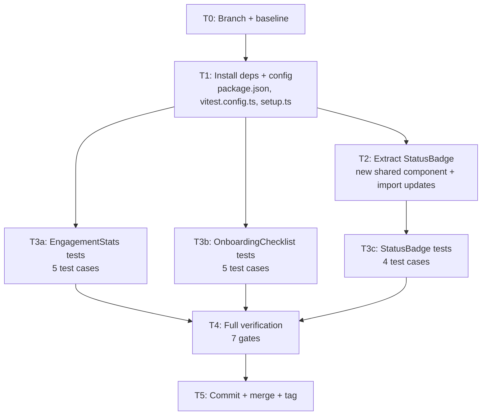
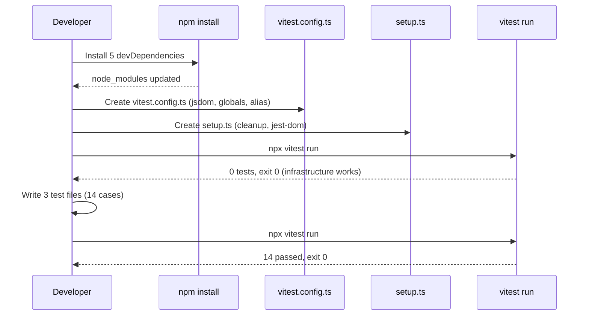
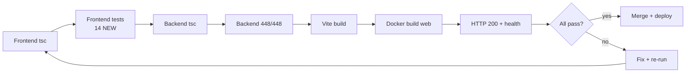

# Phase 9 C1 Implementation Plan: Frontend Test Setup (vitest + RTL)

**Date:** 2026-08-04
**Status:** PLAN READY
**Spec:** `docs/superpowers/specs/2026-08-04-phase9-c1-frontend-test-setup-design.md`
**Baseline:** 448/448 backend tests, tsc clean, zero frontend tests

---

## Execution Board

### Task Table

| Task | Goal | Files Touched | Est. Lines | Parallel-Safe | Verification |
|------|------|---------------|-----------|---------------|-------------|
| T0 | Branch + baseline | — | 0 | N/A (first) | 448/448, tsc clean |
| T1 | Install deps + config | `package.json`, `vitest.config.ts`, `setup.ts` | ~35 | No (foundation) | `npx vitest run` exits 0 (no tests yet) |
| T2 | Extract StatusBadge | `StatusBadge.tsx` (NEW), `AdminSubmissions.tsx`, `LecturerSubmissions.tsx` | ~16 | No (after T1, before T3c) | Frontend tsc clean |
| T3a | EngagementStats tests | `EngagementStats.test.tsx` (NEW) | ~80 | Yes (after T1) | 5 tests pass |
| T3b | OnboardingChecklist tests | `OnboardingChecklist.test.tsx` (NEW) | ~90 | Yes (after T1) | 5 tests pass |
| T3c | StatusBadge tests | `StatusBadge.test.tsx` (NEW) | ~40 | No (after T2) | 4 tests pass |
| T4 | Full verification + deploy | — | 0 | No (after T2-T3) | All 7 gates |
| T5 | Commit + merge + tag | — | 0 | No (after T4) | Push + closeout |

### Dependencies

```
T0 → T1 → T2 → T3c → T4 → T5
           ↓
           T3a ─────→ T4
           ↓
           T3b ─────→ T4
```

- T3a and T3b are parallel-safe (independent test files, no shared state)
- T3c depends on T2 (StatusBadge must be extracted before testing it)
- T2 depends on T1 (tsc needs to resolve imports; config must exist)
- In practice, execute sequentially: T0 → T1 → T2 → T3a → T3b → T3c → T4 → T5

---

## Mermaid Diagrams

### Task Dependency Flow



### Test Infrastructure Setup Flow



### Verification Gate Flow (Phase 9 Updated)



---

## Task Details

### T0: Branch Setup + Baseline Verification

**Goal:** Create feature branch, verify baseline is clean.

**Steps:**
1. Create branch `feat/phase9-c1-frontend-test-setup` from `main`
2. Run baseline verification:
   - `cd LMS-Frontend && npx tsc --noEmit` → clean
   - `cd LMS-Server && npx tsc --noEmit` → clean
   - `cd LMS-Server && npx vitest run` → 448/448
3. Create safety tag `pre-phase9-c1-2026-08-04` on main

**Exit criteria:** Branch exists, baseline verified, safety tag created.

---

### T1: Install Dependencies + Configuration (~35 lines)

**Goal:** Install vitest + RTL, create config and setup files, add test script.

**Files:**
- `LMS-Frontend/package.json` (MODIFY)
- `LMS-Frontend/vitest.config.ts` (NEW)
- `LMS-Frontend/src/__tests__/setup.ts` (NEW)

**Steps:**

1. Install devDependencies:
   ```bash
   cd LMS-Frontend && npm install -D vitest @testing-library/react @testing-library/jest-dom @testing-library/user-event jsdom
   ```

2. Add test script to `package.json`:
   ```json
   "test": "vitest run"
   ```

3. Create `vitest.config.ts`:
   ```typescript
   import { defineConfig } from 'vitest/config';
   import react from '@vitejs/plugin-react';
   import path from 'node:path';
   import { fileURLToPath } from 'node:url';

   const __dirname = path.dirname(fileURLToPath(import.meta.url));

   export default defineConfig({
     plugins: [react()],
     resolve: {
       alias: { '@': path.resolve(__dirname, './src') },
     },
     test: {
       globals: true,
       environment: 'jsdom',
       include: ['src/__tests__/**/*.test.{ts,tsx}'],
       setupFiles: ['src/__tests__/setup.ts'],
     },
   });
   ```

4. Create `src/__tests__/setup.ts`:
   ```typescript
   import '@testing-library/jest-dom/vitest';
   import { cleanup } from '@testing-library/react';
   import { afterEach } from 'vitest';

   afterEach(() => {
     cleanup();
     localStorage.clear();
   });
   ```

5. Create `src/__tests__/components/` directory.

6. Verify: `cd LMS-Frontend && npx vitest run` → exits 0 (no test files yet, but config is valid).

**Failure mode check:** If `npx vitest run` fails at this point, the config is wrong. Debug before proceeding.

**Exit criteria:** `npx vitest run` exits 0, no errors. `npm run build` still works.

---

### T2: Extract StatusBadge (~16 lines changed)

**Goal:** Extract duplicated `StatusBadge` to shared component, update imports.

**Files:**
- `LMS-Frontend/src/components/StatusBadge.tsx` (NEW — ~12 lines)
- `LMS-Frontend/src/pages/AdminSubmissions.tsx` (MODIFY — remove local StatusBadge, add import)
- `LMS-Frontend/src/pages/LecturerSubmissions.tsx` (MODIFY — remove local StatusBadge, add import)

**Steps:**

1. Create `src/components/StatusBadge.tsx`:
   - Export `StatusBadge` function component (named export)
   - Export `fmtSize` helper (also duplicated in both files)
   - Identical code to existing local versions

2. Update `AdminSubmissions.tsx`:
   - Remove local `StatusBadge` function (lines 34-38)
   - Remove local `fmtSize` function (lines 41-44)
   - Add `import { StatusBadge, fmtSize } from '../components/StatusBadge';`

3. Update `LecturerSubmissions.tsx`:
   - Remove local `StatusBadge` function (lines 27-31)
   - Remove local `fmtSize` function (lines 33-36)
   - Add `import { StatusBadge, fmtSize } from '../components/StatusBadge';`

4. Verify: `cd LMS-Frontend && npx tsc --noEmit` → clean.

**Note:** `fmtSize` is also duplicated identically in both files. Extract it alongside StatusBadge — same justification (dedup), same risk (zero behavior change).

**Exit criteria:** Frontend tsc clean, no local StatusBadge or fmtSize in either page file.

---

### T3a: EngagementStats Tests (~80 lines)

**Goal:** Write 5 test cases for the pure props→render component.

**File:** `LMS-Frontend/src/__tests__/components/EngagementStats.test.tsx` (NEW)

**Structure:**
```
import { render, screen } from '@testing-library/react'
import EngagementStats from '../../components/dashboard/EngagementStats'
import type { Submission } from '../../types/api'

// Mock data factory
function makeSubmission(status): Submission { ... }
function makeQuizCompletion(passed): QuizCompletion { ... }

describe('EngagementStats', () => {
  it('renders zeros for empty submissions')
  it('counts mixed submission statuses correctly')
  it('shows quiz prompt when quizCompletions is null')
  it('shows quiz pass count and total attempts')
  it('shows rejection warning only when rejections exist')
})
```

**Test assertions:**
- Use `screen.getByText()` for text content
- Use `screen.queryByText()` for absence checks (rejection warning)
- No mocking needed — pure props component

**Exit criteria:** `npx vitest run` → 5 tests pass in this file.

---

### T3b: OnboardingChecklist Tests (~90 lines)

**Goal:** Write 5 test cases for the localStorage-interacting component.

**File:** `LMS-Frontend/src/__tests__/components/OnboardingChecklist.test.tsx` (NEW)

**Structure:**
```
import { render, screen } from '@testing-library/react'
import userEvent from '@testing-library/user-event'
import OnboardingChecklist from '../../components/dashboard/OnboardingChecklist'

describe('OnboardingChecklist', () => {
  it('renders all steps as incomplete when all props are false')
  it('renders completion message when all props are true')
  it('dismisses and persists to localStorage')
  it('does not render when previously dismissed')
  it('renders for different userId even if another was dismissed')
})
```

**Test assertions:**
- Use `screen.getByText()` for checklist item text
- Use `userEvent.click()` for dismiss button interaction
- Use `localStorage.getItem()` to verify persistence
- Use `render()` return value's `container` to check if component returns null (empty container)

**OnboardingChecklist rendering note:** The component uses `useState(true)` initially (to avoid flash) and then corrects via `useEffect`. Tests need to account for this — RTL's `render()` runs effects synchronously in jsdom, so the initial true state will be corrected before assertions.

**Exit criteria:** `npx vitest run` → 5 tests pass in this file.

---

### T3c: StatusBadge Tests (~40 lines)

**Goal:** Write 4 test cases for the extracted conditional render component.

**File:** `LMS-Frontend/src/__tests__/components/StatusBadge.test.tsx` (NEW)

**Depends on T2** (StatusBadge must be extracted first).

**Structure:**
```
import { render, screen } from '@testing-library/react'
import { StatusBadge } from '../../components/StatusBadge'

describe('StatusBadge', () => {
  it('renders Pending for pending status')
  it('renders Approved for approved status')
  it('renders Rejected for rejected status')
  it('defaults to Pending for unknown status')
})
```

**Test assertions:**
- Use `screen.getByText('Pending')`, `screen.getByText('Approved')`, `screen.getByText('Rejected')`
- Verify CSS class contains expected color token (optional — text content is primary assertion)

**Exit criteria:** `npx vitest run` → 4 tests pass in this file.

---

### T4: Full Verification + Deploy

**Goal:** Run all 7 gates, deploy, verify live.

**Steps (sequential):**

1. **Frontend tsc:** `cd LMS-Frontend && npx tsc --noEmit` → clean
2. **Frontend tests:** `cd LMS-Frontend && npx vitest run` → 14/14 pass
3. **Backend tsc:** `cd LMS-Server && npx tsc --noEmit` → clean
4. **Backend tests:** `cd LMS-Server && npx vitest run` → 448/448
5. **Vite build:** `cd LMS-Frontend && npm run build` → exit 0 (production build still works)
6. **Docker build:** `docker compose build web` → exit 0
7. **Deploy + health:**
   - `docker compose up -d --no-deps web`
   - `curl -s -o /dev/null -w '%{http_code}' https://lms.smwebsystems.com` → 200
   - `curl -s https://lms.smwebsystems.com/api/v1/health` → `ok` + `db: ok`

**Exit criteria:** All 7 gates pass.

---

### T5: Commit + Merge + Tag + Closeout

**Goal:** Single commit, merge to main, tag, push, write closeout.

**Steps:**
1. Stage all changed files:
   - `LMS-Frontend/package.json`, `LMS-Frontend/package-lock.json` (modified)
   - `LMS-Frontend/vitest.config.ts` (new)
   - `LMS-Frontend/src/__tests__/setup.ts` (new)
   - `LMS-Frontend/src/__tests__/components/EngagementStats.test.tsx` (new)
   - `LMS-Frontend/src/__tests__/components/OnboardingChecklist.test.tsx` (new)
   - `LMS-Frontend/src/__tests__/components/StatusBadge.test.tsx` (new)
   - `LMS-Frontend/src/components/StatusBadge.tsx` (new)
   - `LMS-Frontend/src/pages/AdminSubmissions.tsx` (modified)
   - `LMS-Frontend/src/pages/LecturerSubmissions.tsx` (modified)
2. Commit with descriptive message
3. Switch to main, fast-forward merge
4. Tag `phase9-c1-complete-2026-08-04`
5. Push to remote
6. Write closeout doc: `docs/superpowers/plans/2026-08-04-phase9-c1-closeout.md`
7. Commit and push closeout

**Exit criteria:** Tag exists, main updated, closeout committed.

---

## Review Checkpoints

### RC-1: After T1 (Config + deps installed)
- [ ] `npx vitest run` exits 0 (even with no tests)
- [ ] `npm run build` still works
- [ ] No production deps added (all devDependencies)
- [ ] `vitest.config.ts` has `@` alias matching vite.config.ts

### RC-2: After T2 (StatusBadge extracted)
- [ ] `src/components/StatusBadge.tsx` exports `StatusBadge` and `fmtSize`
- [ ] AdminSubmissions.tsx imports from shared component (no local copy)
- [ ] LecturerSubmissions.tsx imports from shared component (no local copy)
- [ ] Frontend tsc clean

### RC-3: After T3a-T3c (All tests written)
- [ ] `npx vitest run` → 14/14 pass
- [ ] EngagementStats: 5 tests, OnboardingChecklist: 5 tests, StatusBadge: 4 tests
- [ ] No context mocking used (all components are props-driven or self-contained)
- [ ] Mock data factories used (not inline objects)

### RC-4: After T4 (Full verification)
- [ ] All 7 gates pass (tsc ×2, tests ×2, Vite build, Docker build, HTTP + health)
- [ ] No regressions

---

## Failure Mode → Plan Response

| Failure Mode | Detection | Response |
|-------------|-----------|----------|
| FM-1: vitest config conflicts with build | `npm run build` fails after T1 | Verify separate `vitest.config.ts` doesn't interfere; check for shared plugin conflicts |
| FM-2: jsdom missing APIs | Tests throw `ReferenceError` | Check which API is missing; add polyfill in setup.ts if needed |
| FM-3: Import alias `@` not resolving | Tests fail to import components | Verify `resolve.alias` in vitest.config.ts matches vite.config.ts |
| FM-4: StatusBadge extraction breaks pages | tsc error or render regression | Verify import paths are correct; diff local vs extracted code |
| FM-5: OnboardingChecklist useEffect timing | Tests pass but assertions race | Use `waitFor()` from RTL if useEffect doesn't fire synchronously |
| FM-6: `npm install` version conflicts | Install fails | Pin exact versions instead of `^` ranges |

---

## Rollback Plan

- **Pre-merge:** `git checkout main` (branch is isolated)
- **Post-merge:** `git revert <commit> && docker compose build web && docker compose up -d --no-deps web`
- **Safety tag:** `pre-phase9-c1-2026-08-04` on main before any changes
- **StatusBadge extraction rollback:** Revert restores local copies in both pages (git revert handles this)

---

## To-Do Lists

### Planning Checklist
- [x] Read C1 spec
- [x] Identified task order and dependencies
- [x] Confirmed package versions and configs
- [x] Defined verification gates (7 gates, up from 6)
- [x] Defined review checkpoints (4 checkpoints)
- [x] Defined failure mode responses (6 modes)
- [x] Defined rollback plan

### Implementation Checklist
- [ ] T0: Create branch + verify baseline + safety tag
- [ ] T1: Install deps + create vitest.config.ts + setup.ts + test script
- [ ] T2: Extract StatusBadge + fmtSize to shared component
- [ ] T3a: Write EngagementStats tests (5 cases)
- [ ] T3b: Write OnboardingChecklist tests (5 cases)
- [ ] T3c: Write StatusBadge tests (4 cases)
- [ ] T4: Run all 7 verification gates
- [ ] T5: Commit + merge + tag + push + closeout

### Test Checklist
- [ ] vitest.config.ts valid (npx vitest run exits 0 with no tests)
- [ ] EngagementStats: 5/5 pass
- [ ] OnboardingChecklist: 5/5 pass
- [ ] StatusBadge: 4/4 pass
- [ ] Total: 14/14 frontend tests pass
- [ ] Backend: 448/448 unchanged

### QA Checklist
- [ ] Frontend tsc clean
- [ ] Frontend 14/14 tests pass
- [ ] Backend tsc clean
- [ ] Backend 448/448 tests pass
- [ ] Vite production build succeeds
- [ ] Docker build web succeeds
- [ ] HTTP 200 + API health ok

### Review Checklist
- [ ] Scope: config + 3 test files + StatusBadge extraction only
- [ ] No production behavior changes (except StatusBadge dedup)
- [ ] All test packages are devDependencies
- [ ] AdminSubmissions and LecturerSubmissions work identically
- [ ] Rollback is single git revert

---

## /loop Workflow

### /loop assess
- Spec is READY at `docs/superpowers/specs/2026-08-04-phase9-c1-frontend-test-setup-design.md`
- Baseline: 448/448 backend tests, tsc clean, zero frontend tests
- Package versions confirmed: React 18.2, Vite 5.0, TypeScript 5.2
- StatusBadge duplication confirmed in AdminSubmissions + LecturerSubmissions

### /loop plan
- 8 tasks (T0-T5, with T3 split into T3a/T3b/T3c)
- Sequential execution (small scope, ~261 lines)
- 7 verification gates (added Vite build + frontend tests to existing 5)
- 4 review checkpoints

### /loop review
- Plan matches spec 1:1 (all acceptance criteria addressed)
- No scope creep (no E2E, no page tests, no coverage thresholds)
- Failure modes have explicit responses
- Rollback plan is clear

### /loop execute
- Next step: execute this plan
- Single session, sequential T0→T5
- Key risk: npm install version compatibility (mitigated by pinning if needed)

---

## IMPLEMENTATION PLAN STATUS: READY

**Next action:** Execute this plan. Start with T0 (branch + baseline), proceed through T1 (deps + config), T2 (StatusBadge extraction), T3a-T3c (3 test files), T4 (verification), T5 (commit + merge + tag + closeout).
