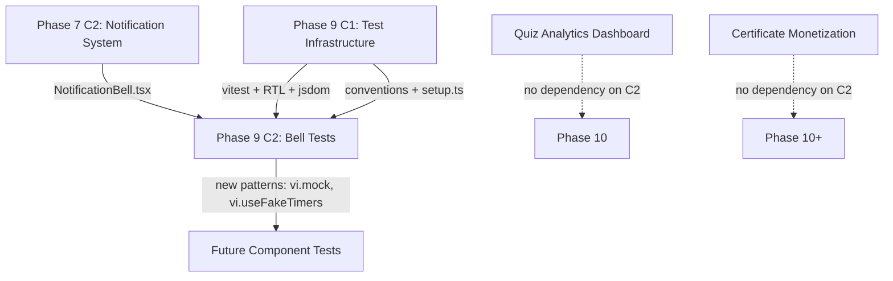
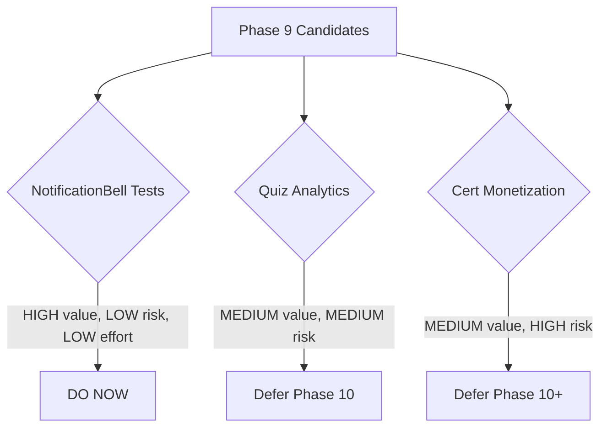
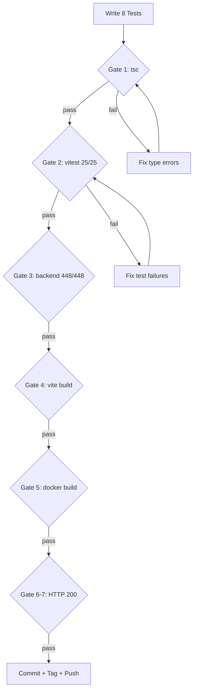

# Phase 9 C1 Release Closeout + C2 Spec Kickoff

**Date:** 2026-08-04

---

## Phase 9 C1 Release Closeout

### Shipped Features

| Feature | Detail |
|---------|--------|
| vitest + RTL + jsdom | devDependencies installed, `vitest.config.ts` configured |
| Test setup file | `src/__tests__/setup.ts` — cleanup, jest-dom matchers, localStorage.clear |
| npm test script | `"test": "vitest run"` in package.json |
| StatusBadge extraction | Shared component deduped from AdminSubmissions + LecturerSubmissions |
| EngagementStats tests | 5 cases — pure props-to-render pattern |
| OnboardingChecklist tests | 5 cases — localStorage interaction + dismiss |
| StatusBadge + fmtSize tests | 7 cases — conditional rendering + utility |

**Total frontend tests: 17/17 PASS**

### Verification Summary

| Gate | Result |
|------|--------|
| Frontend `tsc --noEmit` | PASS |
| Frontend `vitest run` (17/17) | PASS |
| Backend `vitest run` (448/448) | PASS |
| Vite production build | PASS |
| Docker build web | PASS |
| HTTP 200 (site) | PASS |
| HTTP 200 (health) | PASS |

### Release Artifacts

- **Commit:** `b6d0058`
- **Tag:** `phase9-c1-complete-2026-08-04`
- **Safety tag:** `pre-phase9-c1-2026-08-04`
- **Branch:** `feat/phase9-c1-frontend-test-setup` (merged to main)
- **Files changed:** 10 (6 new, 4 modified)

### Rollback Note

To rollback C1: `git revert b6d0058`. This removes test infrastructure and StatusBadge extraction. The revert is safe because:
- Test files are devDependencies only (not in production bundle)
- StatusBadge extraction is a pure refactor (behavior unchanged)
- No backend changes

### Manual QA Status

- **Automated:** All 7 gates pass
- **Manual:** Not performed (test-only change, zero production risk)
- **Browser QA:** Not required (no UI changes — StatusBadge extraction is behavior-identical)

---

## Phase 9 C2 Spec Kickoff

### Context

Phase 9 C1 established frontend test infrastructure. C2 extends coverage to NotificationBell — the most complex untested frontend component (136 lines, polling, dropdown, navigation, API calls).

**Critical finding:** The original C2 candidate ("mount NotificationBell in Layout.tsx") was already shipped in Phase 7 C2 (commit `727ea55`). The bell is live and functional. The real gap is test coverage.

### Scope

- **In scope:** 8 new vitest+RTL tests for NotificationBell.tsx
- **Not in scope:** Backend changes, feature additions, other component tests

### Non-Goals

- No mark-all-read feature
- No notification preferences UI
- No admin/lecturer notification support
- No changes to NotificationBell.tsx source
- No integration or E2E tests

### Spec Location

`docs/superpowers/specs/2026-08-04-phase9-c2-notification-bell-tests-design.md`

---

## Candidate Ranking

| Rank | Candidate | Value | Risk | Effort | Recommendation |
|------|-----------|-------|------|--------|----------------|
| 1 | **NotificationBell frontend tests** | HIGH — covers most complex untested component | LOW — test-only, no prod changes | LOW — ~120 lines, 1 file | **DO NOW (C2)** |
| 2 | Quiz analytics dashboard | MEDIUM — new admin insight page | MEDIUM — new backend endpoint + frontend page | MEDIUM — ~400 lines | Defer to Phase 10 |
| 3 | Certificate monetization | MEDIUM — revenue feature | HIGH — payment integration, regulatory | HIGH — multi-system | Defer to Phase 10+ |

**Rationale:** NotificationBell tests are the natural continuation of C1's test infrastructure. They introduce mocking and timer patterns that will be reused in future test work. Zero production risk.

---

## Dependency Map



### Shared Systems

| System | Used By C2? | Risk |
|--------|-------------|------|
| vitest.config.ts | Yes (read-only) | None |
| setup.ts | Yes (read-only) | None |
| notificationService.ts | Yes (mocked, not modified) | None |
| Layout.tsx | No | None |
| Backend notification routes | No | None |

---

## Test Strategy

### Automated Tests (C2)

| Test Case | Pattern | New? |
|-----------|---------|------|
| TC1: Fetch on mount | vi.mock + waitFor | YES |
| TC2: Unread badge | vi.mock + screen.getByText | YES |
| TC3: Badge cap 99+ | vi.mock + screen.getByText | YES |
| TC4: Dropdown open | userEvent.click + screen | YES |
| TC5: Empty state | vi.mock + screen.getByText | YES |
| TC6: Mark read + navigate | vi.mock + vi.fn assertions | YES |
| TC7: Outside click | fireEvent.mouseDown | YES |
| TC8: 60s polling | vi.useFakeTimers | YES |

### Regression Coverage

| Suite | Expected | Gate |
|-------|----------|------|
| Frontend (existing 17) | 17/17 pass | Gate 2 |
| Backend (448) | 448/448 pass | Gate 3 |
| tsc | Clean | Gate 1 |
| Vite build | Success | Gate 4 |

### Manual QA

- **Not required.** C2 is test-only with zero production code changes.
- **Optional:** Open the bell in a browser to confirm it still works (smoke test).

### Component Isolation

- NotificationBell is fully isolated via `vi.mock` — no real API calls, no real navigation
- Mock cleanup in `beforeEach` prevents test cross-contamination
- Fake timer cleanup in `afterEach` prevents interference with other test files

---

## Mermaid Diagrams

### C1 to C2 Handoff Flow

```mermaid
flowchart LR
    C1Release[C1 Released: 17 tests, infra live] --> Closeout[C1 Closeout Summary]
    Closeout --> Finding[Finding: Bell already mounted]
    Finding --> Reframe[Reframe C2: Tests not mounting]
    Reframe --> C2Spec[C2 Spec: 8 NotificationBell tests]
    C2Spec --> C2Plan[C2 Implementation Plan]
    C2Plan --> C2Impl[C2 Implementation]
    C2Impl --> C2Verify[7 Verification Gates]
    C2Verify --> C2Release[C2 Release: 25 total tests]
```



### Candidate Ranking Flow



### Risk / Test Gate Flow



---

## To-Do Lists

### Candidate Analysis Checklist
- [x] NotificationBell component analyzed (136 lines, 8 testable behaviors)
- [x] NotificationService analyzed (thin API wrapper, mock target)
- [x] Existing test patterns reviewed (3 C1 suites)
- [x] Backend notification tests confirmed (8/8 pass)
- [x] Bell mounting confirmed (Layout.tsx:181, live)

### Dependency Checklist
- [x] C1 test infrastructure confirmed live
- [x] vitest.config.ts compatible with new mocking patterns
- [x] setup.ts cleanup sufficient (no additional setup needed)
- [x] No new devDependencies required
- [x] No backend changes required

### Risk Checklist
- [x] vi.mock('react-router-dom') partial mock — isolated per test file
- [x] vi.useFakeTimers cleanup — afterEach restores real timers
- [x] jsdom mousedown support — confirmed in jsdom spec
- [x] No production code changes — zero deploy risk
- [x] Rollback plan — delete test file

### Test Strategy Checklist
- [x] 8 test cases defined with setup/action/assert
- [x] Mocking strategy documented (notificationService, useNavigate)
- [x] Timer strategy documented (vi.useFakeTimers)
- [x] Edge cases enumerated
- [x] Failure modes identified
- [x] Acceptance criteria explicit (25/25 tests)

### Handoff Checklist
- [x] C1 release confirmed and tagged
- [x] C2 spec written and committed
- [x] Candidate ranking documented
- [x] Dependencies mapped
- [x] Verification gates defined
- [x] Next action explicit

---

## /loop Workflow

```
/loop assess   — Verify C1 baseline: 17/17 frontend, 448/448 backend, tsc clean
/loop plan     — Write C2 implementation plan from spec
/loop review   — Post-implementation: run 7 verification gates, confirm 25/25
/loop defer    — If vi.mock or timer issues block progress, document and defer
```

---

## Final Recommendation

### PHASE 9 C2 SPEC READY

**Exact next action:** Write Phase 9 C2 implementation plan from:
`docs/superpowers/specs/2026-08-04-phase9-c2-notification-bell-tests-design.md`

The plan should cover:
- T0: Create branch `feat/phase9-c2-notification-bell-tests`
- T1: Write `src/__tests__/components/NotificationBell.test.tsx` (8 test cases)
- T2: Run verification gates (7 gates)
- T3: Commit, merge, tag `phase9-c2-complete-2026-08-04`, push
